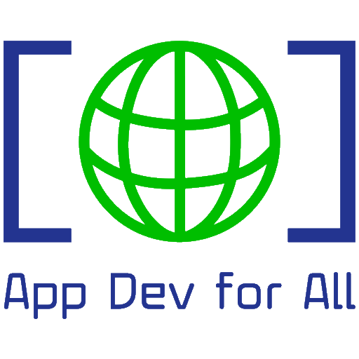

 <p align="center">
  
</p>

<h2 align="center"><b>Code On The Go</b></h2>
<p align="center">
 Code on the Go is an IDE that lets you build Android apps on Android phones, without needing a traditional computer or Internet access.
<p><br>

<p align="center">
</p>
<br>

<p align="center">
  <a href="https://github.com/appdevforall/CodeOnTheGo/issues">Report a bug or request a feature</a> &nbsp; &#8226; &nbsp
  <a href="https://t.me/CodeOnTheGoOfficial">Telegram channel</a>&nbsp; &#8226; &nbsp
  <a href="https://t.me/CodeOnTheGoDiscussions">Telegram discussions</a>
</p>

## Features

- [x] Gradle support.
- [x] `JDK 21` available for use.
- [x] Terminal with necessary packages.
- [x] Custom environment variables (for Build & Terminal).
- [x] API information for classes and their members (since, removed, deprecated).
- [x] Log reader (shows your app's logs in real-time)
- [ ] Language servers
    - [x] Java
    - [x] XML
    - [ ] Kotlin
- [ ] UI Designer
    - [x] Layout inflater
    - [x] Resolve resource references
    - [x] Auto-complete resource values when user edits attributes using the attribute editor
    - [x] Drag & Drop
    - [x] Visual attribute editor
    - [x] Android Widgets
- [ ] String Translator
- [ ] Asset Studio (Drawable & Icon Maker)
- [x] Git

## Installation

 <a href="https://www.appdevforall.org/codeonthego">Download the Code On The Go APK from the App Dev for All website.</a>

## Limitations

- For working with projects in Code On The Go, your project must use Android Gradle Plugin v7.2.0 or
  newer. Projects with older AGP must be migrated to newer versions.
- SDK Manager is already included in Android SDK and is accessible in Code On The Go via its Terminal.
  But, you cannot use it to install some tools (like NDK) because those tools are not built for
  Android.
- No official NDK support because we haven't built the NDK for Android.

The app is still being developed actively. It's in beta stage and may not be stable. if you have any
issues using the app, please let us know.

## Contributing

See the [contributing guide](./CONTRIBUTING.md).

## Thanks to

Code on the Go includes software developed by the [Apache Software Foundation](https://www.apache.org). Additional thanks to these developers:

- [Akash Yadav](https://github.com/itsaky) for [AndroidIDE](https://github.com/AndroidIDEOfficial/AndroidIDE)
- [Rosemoe](https://github.com/Rosemoe) for [CodeEditor](https://github.com/Rosemoe/sora-editor)
- [Termux](https://github.com/termux) for [Terminal Emulator](https://github.com/termux/termux-app)
- [Bogdan Melnychuk](https://github.com/bmelnychuk)
  for [AndroidTreeView](https://github.com/bmelnychuk/AndroidTreeView)
- [George Fraser](https://github.com/georgewfraser) for
  the [Java Language Server](https://github.com/georgewfraser/java-language-server)
- [Vivek](https://github.com/itsvks19) for [LayoutEditor](https://github.com/itsvks19/LayoutEditor)
 
Thanks to all the developers who have contributed to this project! 

## Contact us

- [Website](https://www.appdevforall.org)
- [Official Telegram channel](https://t.me/CodeOnTheGoOfficial)
- [Telegram discussions](https://t.me/CodeOnTheGoDiscussions)
- [Email](mailto:feedback@appdevforall.org)

## Documentation and reference materials
### Creative Commons
The following PDF is redistributed under the Creative Commons Attribution 4.0 International License (CC BY 4.0):
- Java, Java, Java: Object-Oriented Problem Solving, Third Edition by R. Morelli and R. Walde, previously published by Pearson Education, Inc. (Source: https://open.umn.edu/opentextbooks/textbooks/java-java-java-object-oriented-problem-solving)
  
### Free books from Goalkicker.com
- Android Notes for Professionals (Source: https://goalkicker.com/AndroidBook/)
- Java Notes for Professionals (Source: https://goalkicker.com/JavaBook/)
- Kotlin Notes for Professionals (Source: https://goalkicker.com/KotlinBook/)

### Third-Party Documentation
This project includes unmodified documentation from:

#### Android Mobile App Developer Tools
licensed under CC BY 4.0:
https://creativecommons.org/licenses/by/4.0/   
Source: https://developer.android.com

#### Kotlin Programming Language
licensed under CC BY 4.0:
https://creativecommons.org/licenses/by/4.0/   
Source: https://kotlinlang.org/

#### OpenJDK Development Kit (JDK) documentation
licensed under Debian Open Publications license: 
https://www.debian.org/opl   
Source: https://packages.debian.org/unstable/openjdk-17-doc


## License

```
Code On The Go is free software: you can redistribute it and/or modify
it under the terms of the GNU General Public License as published by
the Free Software Foundation, either version 3 of the License, or
(at your option) any later version.

Code On The Go is distributed in the hope that it will be useful,
but WITHOUT ANY WARRANTY; without even the implied warranty of
MERCHANTABILITY or FITNESS FOR A PARTICULAR PURPOSE.  See the
GNU General Public License for more details.

You should have received a copy of the GNU General Public License
along with Code On The Go.  If not, see <https://www.gnu.org/licenses/>.
```

Any violations to the license can be reported either by opening an issue or writing a mail to us
directly.


