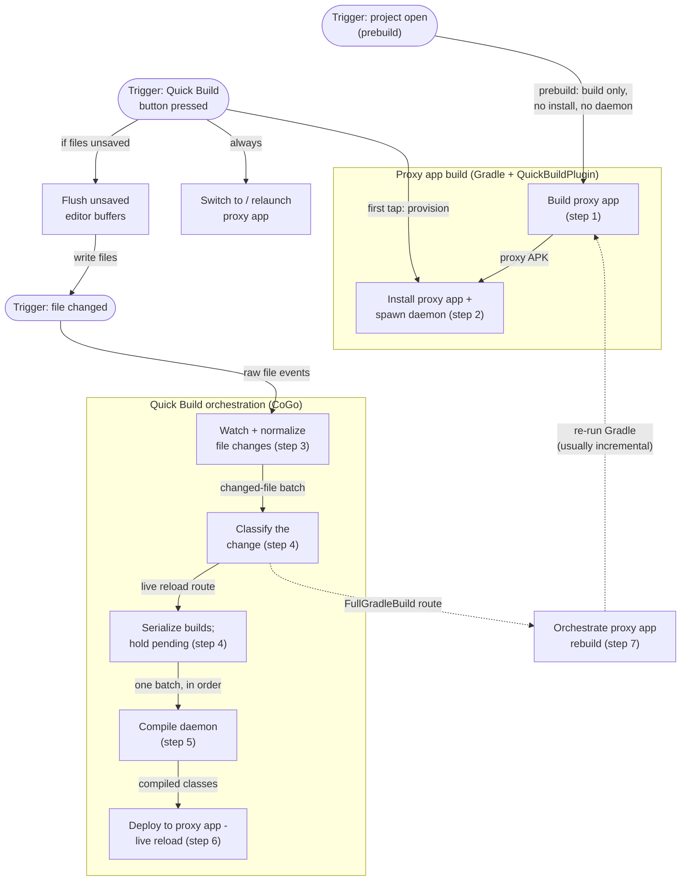
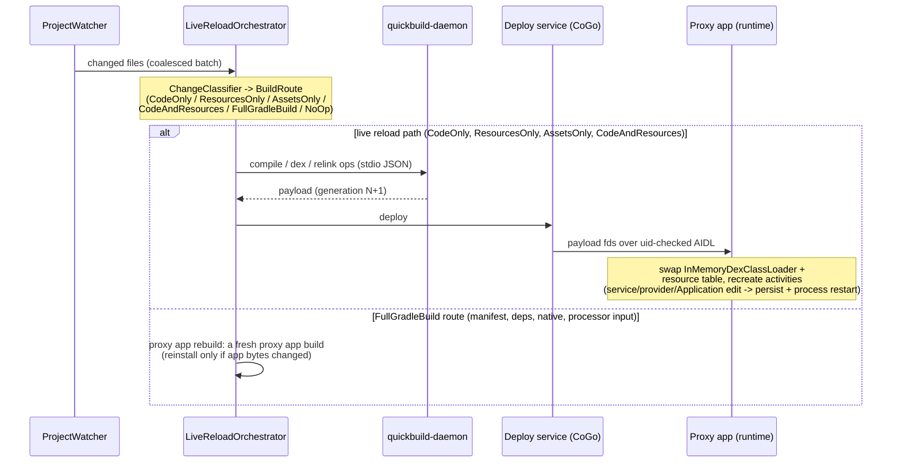
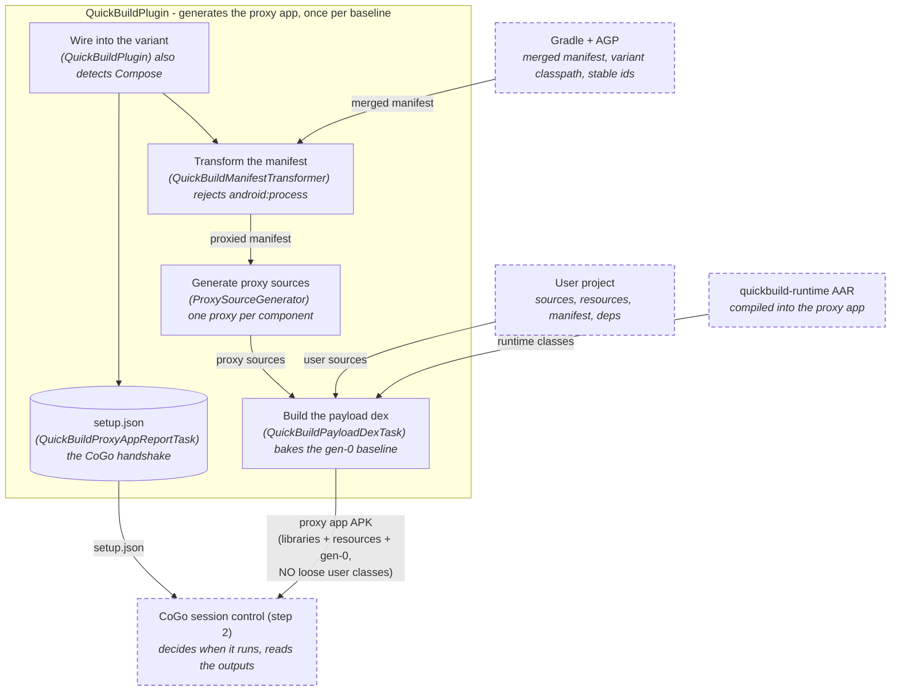
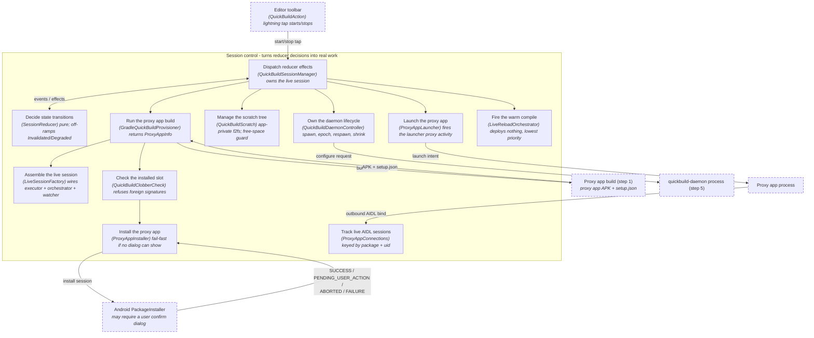
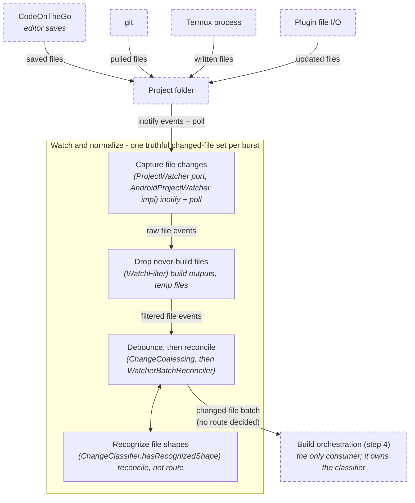
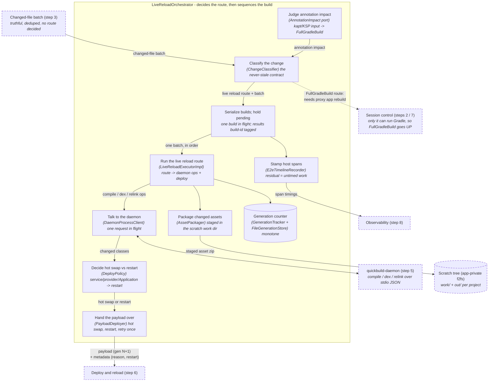
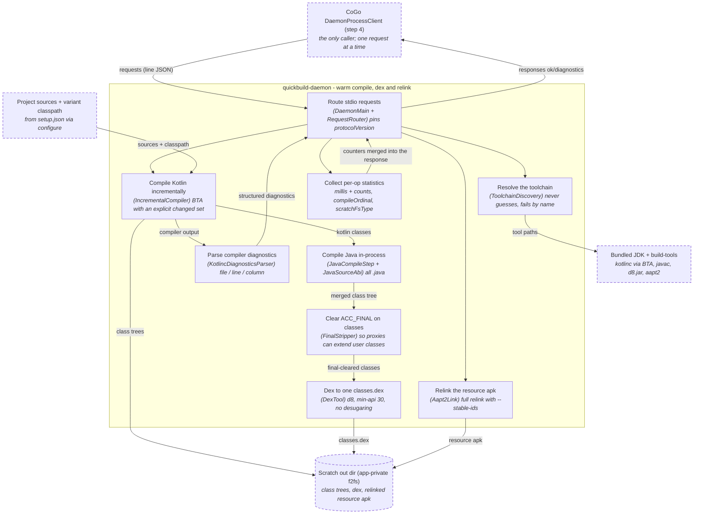
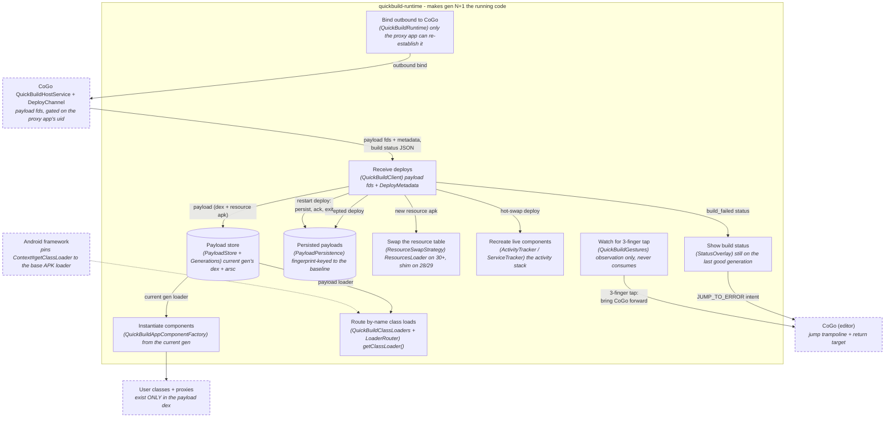
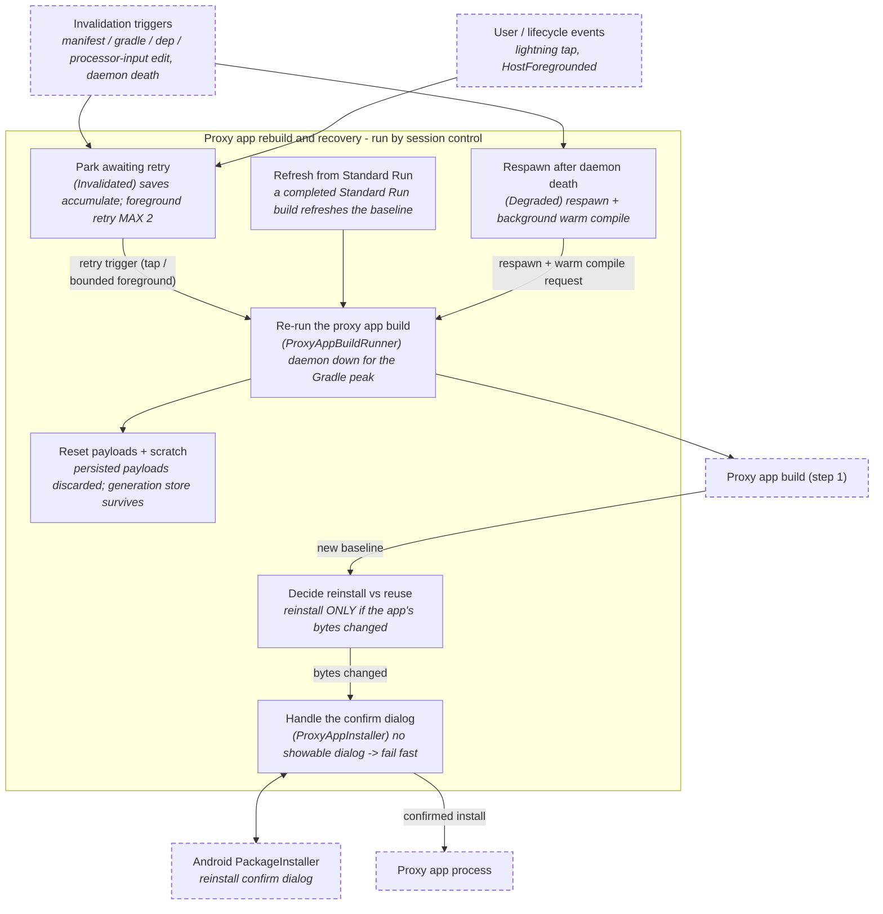
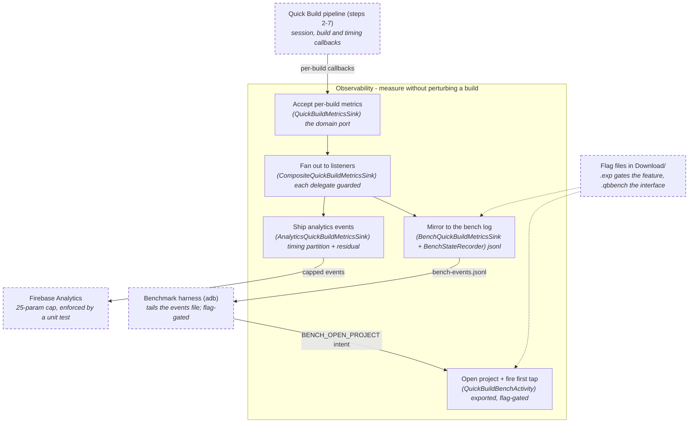

# Quick Build (ADFA-4128)

Tap the lightning-bolt button once and **CoGo** (Code On The Go, this IDE) installs a generated **proxy app** — a live-reloading build of the user's project; from then on every save live-reloads it, with no reinstall.

- **A typical save is ~1-3.5 s.**
- **The invariant: the proxy app never silently runs stale code.** Every edit either live-reloads or visibly falls back to a real Gradle build.
- **The whole loop runs on device** — edit -> watch -> compile -> dex -> deploy -> reload all happen on the phone, inside or alongside CoGo. No desktop component is part of the feature.
- **The first save is warm because of a background warm compile.** The daemon's cold compile (~12 s on a mid-spec phone) is paid by a **warm compile** fired when the session provisions (it starts once provisioning reaches `Ready`), so the tools are warm before your first save. A matched warm-compile-on/off A/B (A56, 3 trials per arm, one build, `hello-kotlin`) puts the first save at **1.9 s warmed vs 11.5 s unwarmed** — 6.1x, almost all of it cold `kotlinc` (`corpus/results/20260728T153938Z-seed-ab/`, benchmark repo). Tap-to-Ready is unchanged, because the warm compile starts after `Ready`.

What live-reloads and what falls back to a real Gradle build is [The boundary](#the-boundary-what-live-reloads-and-what-falls-back-to-gradle) below. Design history lives in Jira ticket ADFA-4128.

Two devices are referenced throughout: the **A56** (Samsung Galaxy A56, the mid-spec reference phone) and the **C107** (a low-spec 3.6 GB device, the lowest tier Quick Build runs on today). **Standard Run** means CoGo's normal Run-button Gradle build, the thing Quick Build sits beside.

## Contents

- [Where to start](#where-to-start)
- [Pipeline overview](#pipeline-overview)
- [How a save becomes a reload](#how-a-save-becomes-a-reload)
- [Pieces](#pieces)
- [The pipeline in detail](#the-pipeline-in-detail) — steps 1-8
- [Proxy-app architecture (the classloading contract)](#proxy-app-architecture-the-classloading-contract)
- [Session model](#session-model) · [Invariants you must not break](#invariants-you-must-not-break)
- [The boundary: what live-reloads, and what falls back to Gradle](#the-boundary-what-live-reloads-and-what-falls-back-to-gradle)
- [Design decisions](#design-decisions)
- [Running it on a device](#running-it-on-a-device)
- [Debugging a session on device](#debugging-a-session-on-device)
- [Driving and observing a session from outside](#driving-and-observing-a-session-from-outside)
- [One install slot (real applicationId) + confirm-on-switch](#one-install-slot-real-applicationid--confirm-on-switch)
- [Deploy metadata JSON](#deploy-metadata-json-iquickbuildtargetonpayload) · [Build status JSON](#build-status-json-iquickbuildtargetonbuildstatus) · [Daemon protocol](#daemon-protocol-line-delimited-json-over-stdinstdout)
- [Tunables and where they live](#tunables-and-where-they-live)
- [Tap-to-jump + return gesture](#tap-to-jump--return-gesture) · [Compose projects](#compose-projects)
- [Known limitations (v1)](#known-limitations-v1)
- [Verifying changes](#verifying-changes)
- [Further reading](#further-reading)

## Where to start

Reading in this order gets you to the load-bearing parts fastest:

1. Step 4's [ChangeClassifier](src/main/java/org/appdevforall/cotg/quickbuild/domain/ChangeClassifier.kt) is the correctness contract — a wrong route means stale code. It lives with the orchestrator, not with the watcher.
2. Step 2/7's reducer ([SessionReducer](src/main/java/org/appdevforall/cotg/quickbuild/domain/SessionReducer.kt), states in [QuickBuildSessionState](src/main/java/org/appdevforall/cotg/quickbuild/domain/QuickBuildSessionState.kt)) is where every lifecycle bug during ADFA-4128 development lived; the states and off-ramps are its full vocabulary.
3. [Invariants you must not break](#invariants-you-must-not-break) — five rules that are cheap to violate silently.
4. Step 5's [FinalStripper](../quickbuild-daemon/src/main/kotlin/org/appdevforall/cotg/quickbuild/daemon/dex/FinalStripper.kt) and the scratch move — moving the daemon's work/out trees off FUSE-backed shared storage into app-private f2fs storage — explain the off-FUSE benchmark: strip is per-file I/O, so it collapses when the out dir leaves FUSE ([`docs/perf-roadmap.md`](docs/perf-roadmap.md)).
5. Step 6's loader diagram is the classloading contract — both template-crash bugs were violations of "by-name resolution must see the payload loader".

## Pipeline overview

Eight steps and three triggers. **Opening a project** runs a *prebuild* — the proxy app build only, no install and no daemon. The **first lightning-bolt tap** provisions: it installs the proxy app and spawns the daemon. After that a **file change** drives the live reload loop, and only an edit the classifier refuses sends you back to Gradle. Round bubbles are triggers; each box names a process, with the step number that details it below.



Step 8 (observability) has no place in the flow because it never sits in it: every step reports to one metrics port off to the side.

**Key classes:** [QuickBuildSessionManager](src/main/java/org/appdevforall/cotg/quickbuild/service/QuickBuildSessionManager.kt) owns the session and everything Gradle-shaped · [LiveReloadOrchestrator](src/main/java/org/appdevforall/cotg/quickbuild/domain/LiveReloadOrchestrator.kt) owns the live reload loop · [ChangeClassifier](src/main/java/org/appdevforall/cotg/quickbuild/domain/ChangeClassifier.kt) is the fork between them.

## How a save becomes a reload



Terms used throughout:

- **Proxy app** — the installable app Quick Build generates for the project and runs in place of a Standard-Run install: the runtime AAR + the user's libraries and resources under the project's real `applicationId`, with generated **proxy components** (`Proxy0Activity`, ...) standing in for the user's (see "Proxy-app architecture" below). "Proxy" alone always means those generated components, never the app.
- **Proxy app build** — a real Gradle build, run once per baseline, that produces the installable proxy app (`:gradle-plugin` `QuickBuildPlugin`).
- **Baseline** — the reference point a live reload is relative to: the gen-0 dex baked into the installed proxy app, its fingerprint, and the orchestrator's matching state. A proxy app rebuild moves the baseline.
- **Live reload** — the quick path after the classifier: compile in the daemon -> deploy a payload -> the running proxy app updates. One cycle = a reload.
- **Payload** — the compiled user code (and, for a resource edit, the relinked resource table) sent to the already-running proxy app for one reload, without a reinstall.
- **Generation** — a monotonically increasing counter naming each payload; the proxy app always runs one specific generation.
- **Proxy app rebuild** — falling back to a fresh proxy app build when live-reload state can't be trusted; it refreshes the baseline and discards persisted payloads. It also tears the daemon down for its duration (freeing the daemon's RAM for the Gradle peak) and restarts it against the new proxy app's config.
- **Warm compile** — a background build (`BuildRoute.WarmCompile`, never produced by the classifier) that warms the daemon's incremental-compile caches and **deploys nothing**: generation unmoved, no reload. Fired after provisioning reaches `Ready`, after every proxy app rebuild, and after a daemon respawn with nothing pending; lowest-priority — dropped when real work is pending or in flight, and a save arriving mid-warm-compile queues behind it. Not in the diagram above because it is not triggered by a save.

The seven `BuildRoute` values are the vocabulary the rest of this doc uses verbatim: `CodeOnly`, `ResourcesOnly`, `AssetsOnly`, `CodeAndResources`, `FullGradleBuild`, `NoOp`, `WarmCompile` ([BuildRoute.kt](src/main/java/org/appdevforall/cotg/quickbuild/domain/BuildRoute.kt)).

Renamed terms — older discussions, dated writeups and bench result dirs use the retired names: *test app* -> **proxy app**, *setup build* -> **proxy app build**, *rebaseline* (the action) -> **proxy app rebuild**, *seed* -> **warm compile**, *prewarm* -> **prebuild**, *fast path* / *fast loop* -> **live reload path**, `BuildOrchestrator` -> `LiveReloadOrchestrator`. Frozen wire and flag names deliberately keep the old spellings as literals: the Firebase events (`quick_build_rebaseline`, ...), the bench-event names and pinned values (`rebaseline`, `state` value `"Prewarming"`, ...), the `CodeOnTheGo.qbnoseed` flag file, and dated result-dir names (`*-rebaseline`, `*-seed-ab`).

A compile error takes neither branch: no payload is produced, the proxy app keeps running the last good generation, and `onBuildStatus` drives its error overlay. **Hand-back** is bidirectional: an invalidated session falls back to a real Gradle build, and any completed Standard Run build refreshes a live session's baseline.

## Pieces

| Piece           | Where                                                        | What                                                         |
| --------------- | ------------------------------------------------------------ | ------------------------------------------------------------ |
| Domain model    | [`:quick-build` `domain/`](src/main/java/org/appdevforall/cotg/quickbuild/domain/) | pure-JVM: live-reload orchestrator (coalescing, never-lose-pending), change classifier (`ChangeClassifier` -> `BuildRoute`), session reducer, generation counter |
| Proxy app build | [`:gradle-plugin` `QuickBuildPlugin`](../gradle-plugin/src/main/java/com/itsaky/androidide/gradle/QuickBuildPlugin.kt) | real Gradle build, once per baseline: generates the proxy app from the merged manifest |
| Runtime         | [`:quickbuild-runtime`](../quickbuild-runtime/src/main/java/com/itsaky/androidide/quickbuild/runtime/) | Java-only AAR inside the proxy app: binds to CoGo, receives payload fds, live-reloads |
| Daemon          | [`:quickbuild-daemon`](../quickbuild-daemon/src/main/kotlin/org/appdevforall/cotg/quickbuild/daemon/) | JVM child process on the bundled JDK: incremental Kotlin compile via BTA (the Kotlin Build Tools API), d8, aapt2 |
| Wire protocol   | [`:quickbuild-protocol`](../quickbuild-protocol/src/main/kotlin/org/appdevforall/cotg/quickbuild/daemon/protocol/DaemonProtocol.kt) | the request/response data classes **both** sides share, so client and daemon cannot drift |
| Deploy service  | [`:quick-build` `service/`](src/main/java/org/appdevforall/cotg/quickbuild/service/) | bound service in CoGo; payload as ParcelFileDescriptors, uid-checked |
| App layer       | [`QuickBuildAction`](../app/src/main/java/com/itsaky/androidide/actions/build/QuickBuildAction.kt) + [`QuickBuildModule`](../app/src/main/java/com/itsaky/androidide/di/QuickBuildModule.kt) | the toolbar button and the Koin graph that binds every port to an Android implementation |
| Run statistics  | [`:quick-build` `domain/QuickBuildMetricsSink`](src/main/java/org/appdevforall/cotg/quickbuild/domain/QuickBuildMetricsSink.kt) | per-build metrics port; see decision 9 (the app wires a Firebase sink, `analytics/quickbuild/`) |

### How `:app` reaches this module

`:quick-build` is pure-JVM and Android-free by design, so **every Android capability it needs is a port it declares and `:app` implements**, wired in one Koin module ([`di/QuickBuildModule.kt`](../app/src/main/java/com/itsaky/androidide/di/QuickBuildModule.kt)). If you are looking for "where does this actually touch Android", it is one of these twelve:

| Port                                                         | Declared in           | What `:app` supplies                                         |
| ------------------------------------------------------------ | --------------------- | ------------------------------------------------------------ |
| [`QuickBuildProvisioner`](src/main/java/org/appdevforall/cotg/quickbuild/service/QuickBuildProvisioner.kt) | `service/`            | `GradleQuickBuildProvisioner` — runs the proxy app build through CoGo's Gradle |
| [`QuickBuildDaemon`](src/main/java/org/appdevforall/cotg/quickbuild/data/QuickBuildDaemon.kt) | `data/`               | the daemon child process + its staged jar                    |
| [`DeploySender`](src/main/java/org/appdevforall/cotg/quickbuild/service/DeployChannel.kt) | `service/`            | `DeployChannel` — the AIDL hand-off                          |
| [`ProjectWatcher`](src/main/java/org/appdevforall/cotg/quickbuild/data/ProjectWatcher.kt) | `data/`               | `AndroidProjectWatcher` — inotify + mtime poll               |
| [`QuickBuildPaths`](src/main/java/org/appdevforall/cotg/quickbuild/data/QuickBuildPaths.kt) | `data/`               | `EnvironmentQuickBuildPaths` — on-device locations           |
| [`QuickBuildProjectLayout`](src/main/java/org/appdevforall/cotg/quickbuild/data/QuickBuildProjectLayout.kt) | `data/`               | module layout + `liveReloadScope()`, the app-module source scope |
| [`QuickBuildHistoryStore`](src/main/java/org/appdevforall/cotg/quickbuild/service/QuickBuildHistoryStore.kt) | `service/`            | preferences-backed session history                           |
| [`InstalledPackages`](src/main/java/org/appdevforall/cotg/quickbuild/service/ProxyAppInstaller.kt) | `service/`            | PackageManager queries for the clobber check                 |
| [`GenerationStore`](src/main/java/org/appdevforall/cotg/quickbuild/domain/GenerationTracker.kt) | `domain/`             | `FileGenerationStore` under the project dir                  |
| [`LiveReloadExecutor`](src/main/java/org/appdevforall/cotg/quickbuild/domain/LiveReloadExecutor.kt) | `domain/`             | `LiveReloadExecutorImpl` (in `service/`)                     |
| [`QuickBuildMetricsSink`](src/main/java/org/appdevforall/cotg/quickbuild/domain/QuickBuildMetricsSink.kt) | `domain/`             | the composite Firebase + bench sinks                         |
| [`AnnotationImpact`](src/main/java/org/appdevforall/cotg/quickbuild/domain/annotations/AnnotationImpact.kt) | `domain/annotations/` | the analyzer built from the project's processor set          |

Session status reaches the user through [`QuickBuildStatus`](src/main/java/org/appdevforall/cotg/quickbuild/domain/QuickBuildStatus.kt) (what to show), [`QuickBuildNotice`](src/main/java/org/appdevforall/cotg/quickbuild/domain/QuickBuildNotice.kt) (one-shot messages) and [`QuickBuildTone`](src/main/java/org/appdevforall/cotg/quickbuild/domain/QuickBuildTone.kt) (how loud), rendered by [`EditorHandlerActivity`](../app/src/main/java/com/itsaky/androidide/activities/editor/EditorHandlerActivity.kt) and [`ProjectHandlerActivity`](../app/src/main/java/com/itsaky/androidide/activities/editor/ProjectHandlerActivity.kt).

## The pipeline in detail

One data-flow diagram per step, in pipeline order. These are **data-flow diagrams, not class diagrams** — each box is a *process* named for what it does, with the implementing class in parentheses; cylinders are data stores; dashed boxes are external components summarized to one box; arrows carry data and their labels name what flows.

### Step 1 — Proxy app build (`:gradle-plugin`, runs inside the project's Gradle build)

Runs once per baseline (first tap, and every proxy app rebuild). It turns the user's project into an installable **proxy app** whose manifest names are stable proxies while all user code lives in a swappable payload dex, and emits `setup.json` so CoGo knows how to drive the daemon afterwards. (`setup.json` keeps its filename: it is a frozen on-device contract.)



**Key classes:** [QuickBuildPlugin](../gradle-plugin/src/main/java/com/itsaky/androidide/gradle/QuickBuildPlugin.kt) · [QuickBuildManifestTransformer](../gradle-plugin/src/main/java/com/itsaky/androidide/gradle/quickbuild/QuickBuildManifestTransformer.kt) · [ProxySourceGenerator](../gradle-plugin/src/main/java/com/itsaky/androidide/gradle/quickbuild/ProxySourceGenerator.kt) · [ComponentProxiabilityResolver](../gradle-plugin/src/main/java/com/itsaky/androidide/gradle/quickbuild/ComponentProxiabilityResolver.kt) · [QuickBuildJson](../gradle-plugin/src/main/java/com/itsaky/androidide/gradle/quickbuild/QuickBuildJson.kt) · all four tasks live in [QuickBuildTasks.kt](../gradle-plugin/src/main/java/com/itsaky/androidide/gradle/quickbuild/QuickBuildTasks.kt) (one file, four `DefaultTask` classes)

### Step 2 — Session control and provisioning (`:quick-build` `service/` + `:app` adapters)

Owns the session lifecycle. A pure reducer decides state transitions; the session manager executes their effects — run the proxy app build, guard disk space, install and launch the proxy app, spawn the daemon, fire the warm compile.



**Key classes:** [QuickBuildSessionManager](src/main/java/org/appdevforall/cotg/quickbuild/service/QuickBuildSessionManager.kt) · [SessionReducer](src/main/java/org/appdevforall/cotg/quickbuild/domain/SessionReducer.kt) + [QuickBuildSessionState](src/main/java/org/appdevforall/cotg/quickbuild/domain/QuickBuildSessionState.kt) · [LiveSessionFactory](src/main/java/org/appdevforall/cotg/quickbuild/service/LiveSessionFactory.kt) + [LiveSession](src/main/java/org/appdevforall/cotg/quickbuild/service/LiveSession.kt) · [QuickBuildDaemonController](src/main/java/org/appdevforall/cotg/quickbuild/service/QuickBuildDaemonController.kt) · [QuickBuildProvisioner](src/main/java/org/appdevforall/cotg/quickbuild/service/QuickBuildProvisioner.kt) (port) and [GradleQuickBuildProvisioner](../app/src/main/java/com/itsaky/androidide/quickbuild/GradleQuickBuildProvisioner.kt) (`:app` impl) · [ProxyAppInstaller](src/main/java/org/appdevforall/cotg/quickbuild/service/ProxyAppInstaller.kt) · [ProxyAppLauncher](src/main/java/org/appdevforall/cotg/quickbuild/service/ProxyAppLauncher.kt) · [ProxyAppConnections](src/main/java/org/appdevforall/cotg/quickbuild/service/ProxyAppConnections.kt) · [QuickBuildScratch](src/main/java/org/appdevforall/cotg/quickbuild/data/QuickBuildScratch.kt) · [ProxyAppInfo](src/main/java/org/appdevforall/cotg/quickbuild/data/ProxyAppInfo.kt) · [QuickBuildArtifactStager](../app/src/main/java/com/itsaky/androidide/quickbuild/QuickBuildArtifactStager.kt)

### Step 3 — Watch and normalize (`:quick-build` `data/` + `domain/`)

Turns raw filesystem noise into one truthful, deduped set of changed files per save burst. It decides nothing about routes — classification belongs to step 4, which owns the `ChangeClassifier`. This step's whole job is "what actually changed", and its hard part is not lying: inotify can drop events under FUSE, so an independent mtime poll bounds how stale the app can get, and a fingerprint map written by both keeps them from double-building the same edit.



Two distinctions worth keeping straight, because the names invite confusion. `ProjectWatcher` is the port; `AndroidProjectWatcher` is the only implementation, and the inotify/poll hybrid lives *inside* it. `ChangeCoalescing` is about **time** (debounce a burst into one batch, last event per path wins); `WatcherBatchReconciler` is about **filesystem truth** (re-split modified vs deleted against an injected existence probe, dropping vanished temps so one stray file can't poison the batch into a `FullGradleBuild`).

**Two different things are called coalescing.** Step 3's is the watcher debounce above — many filesystem events become one batch. Step 4's is the orchestrator's pending set — many *batches* merge while a build is in flight. They are unrelated mechanisms with the same name; if a save seems lost, step 3's debounce is the wrong place to look unless a build was idle at the time.

**Key classes:** [ProjectWatcher](src/main/java/org/appdevforall/cotg/quickbuild/data/ProjectWatcher.kt) · [AndroidProjectWatcher](src/main/java/org/appdevforall/cotg/quickbuild/data/AndroidProjectWatcher.kt) · [WatchFilter](src/main/java/org/appdevforall/cotg/quickbuild/domain/WatchFilter.kt) · [ChangeCoalescing](src/main/java/org/appdevforall/cotg/quickbuild/domain/ChangeCoalescing.kt) · [WatcherBatchReconciler](src/main/java/org/appdevforall/cotg/quickbuild/domain/WatcherBatchReconciler.kt) · [ChangedFiles](src/main/java/org/appdevforall/cotg/quickbuild/domain/ChangedFiles.kt)

### Step 4 — Live reload orchestration (`:quick-build` `domain/` + `service/`)

The batch arrives here and the classifier decides live reload or proxy app rebuild — the orchestrator owns the classifier, which is why the fork lives inside this box. A live-reload route is sequenced and run; a `FullGradleBuild` route is handed up to session control, since only that can run Gradle. It never loses a pending edit: a save landing mid-build queues and runs next, and the two paths never run concurrently.



`AnnotationImpact` is a **port**, not the rule set. The actual enumeration of which annotations force a `FullGradleBuild` lives in [AnnotationProcessorProfile](src/main/java/org/appdevforall/cotg/quickbuild/domain/annotations/AnnotationProcessorProfile.kt) (which processors are active in the project) and [SourceAnnotationScanner](src/main/java/org/appdevforall/cotg/quickbuild/domain/annotations/SourceAnnotationScanner.kt) (what a changed file actually carries). It is **over-inclusive by design**: an annotation it cannot prove safe escalates to a real build, because a wrong "safe" answer is a stale app while a wrong "escalate" answer is only slow.

**Adding a file type or a route touches more than the classifier.** Recognition is one private `kindOf()` in [ChangeClassifier](src/main/java/org/appdevforall/cotg/quickbuild/domain/ChangeClassifier.kt) — a mix of literal filenames, path-segment predicates (`src/` + `res/`, `src/` + `assets/`) and two hardcoded extensions (`.kt`, `.java`), not one appendable list. Changing it silently changes **deletion-noise semantics too**, because `hasRecognizedShape` is the same function and decides whether a vanished path is a real deletion or a temp file to drop. Expect to touch [WatchFilter](src/main/java/org/appdevforall/cotg/quickbuild/domain/WatchFilter.kt) (a file outside the watched roots is never seen at all), [LiveReloadExecutorImpl](src/main/java/org/appdevforall/cotg/quickbuild/service/LiveReloadExecutorImpl.kt) (a new `BuildRoute` is a compile error there, which is the good kind), [AssetPackager](src/main/java/org/appdevforall/cotg/quickbuild/data/AssetPackager.kt) for asset-like types, and [Aapt2Link](../quickbuild-daemon/src/main/kotlin/org/appdevforall/cotg/quickbuild/daemon/res/Aapt2Link.kt) for resource-like ones. Assets never reach the daemon at all.

**Key classes:** [LiveReloadOrchestrator](src/main/java/org/appdevforall/cotg/quickbuild/domain/LiveReloadOrchestrator.kt) · [ChangeClassifier](src/main/java/org/appdevforall/cotg/quickbuild/domain/ChangeClassifier.kt) + [BuildRoute](src/main/java/org/appdevforall/cotg/quickbuild/domain/BuildRoute.kt) · [AnnotationImpact](src/main/java/org/appdevforall/cotg/quickbuild/domain/annotations/AnnotationImpact.kt) · [LiveReloadExecutor](src/main/java/org/appdevforall/cotg/quickbuild/domain/LiveReloadExecutor.kt) (port) + [LiveReloadExecutorImpl](src/main/java/org/appdevforall/cotg/quickbuild/service/LiveReloadExecutorImpl.kt) · [PayloadDeployer](src/main/java/org/appdevforall/cotg/quickbuild/service/PayloadDeployer.kt) · [DeployPolicy](src/main/java/org/appdevforall/cotg/quickbuild/domain/DeployPolicy.kt) · [DaemonProcessClient](src/main/java/org/appdevforall/cotg/quickbuild/data/DaemonProcessClient.kt) · [AssetPackager](src/main/java/org/appdevforall/cotg/quickbuild/data/AssetPackager.kt) · [GenerationTracker](src/main/java/org/appdevforall/cotg/quickbuild/domain/GenerationTracker.kt) · [E2eTimeline](src/main/java/org/appdevforall/cotg/quickbuild/domain/E2eTimeline.kt) + [E2eTimelineRecorder](src/main/java/org/appdevforall/cotg/quickbuild/service/E2eTimelineRecorder.kt)

### Step 5 — Compile daemon (`:quickbuild-daemon`, separate JVM child process)

A warm, pure-JVM process on the bundled JDK. It isolates the compiler's memory and crash domain from the IDE and keeps kotlinc warm — the biggest latency lever. It never exits on a build error; an exit means death, and CoGo respawns it.



**Key classes:** [DaemonMain](../quickbuild-daemon/src/main/kotlin/org/appdevforall/cotg/quickbuild/daemon/DaemonMain.kt) · [RequestRouter](../quickbuild-daemon/src/main/kotlin/org/appdevforall/cotg/quickbuild/daemon/protocol/RequestRouter.kt) + [ProtocolCodec](../quickbuild-daemon/src/main/kotlin/org/appdevforall/cotg/quickbuild/daemon/protocol/ProtocolCodec.kt) · the wire types themselves in [DaemonProtocol.kt](../quickbuild-protocol/src/main/kotlin/org/appdevforall/cotg/quickbuild/daemon/protocol/DaemonProtocol.kt) (`:quickbuild-protocol`) · [ToolchainDiscovery](../quickbuild-daemon/src/main/kotlin/org/appdevforall/cotg/quickbuild/daemon/ToolchainDiscovery.kt) · [IncrementalCompiler](../quickbuild-daemon/src/main/kotlin/org/appdevforall/cotg/quickbuild/daemon/compile/IncrementalCompiler.kt) · [JavaCompileStep](../quickbuild-daemon/src/main/kotlin/org/appdevforall/cotg/quickbuild/daemon/compile/JavaCompileStep.kt) + [JavaSourceAbi](../quickbuild-daemon/src/main/kotlin/org/appdevforall/cotg/quickbuild/daemon/compile/JavaSourceAbi.kt) · [FinalStripper](../quickbuild-daemon/src/main/kotlin/org/appdevforall/cotg/quickbuild/daemon/dex/FinalStripper.kt) · [DexTool](../quickbuild-daemon/src/main/kotlin/org/appdevforall/cotg/quickbuild/daemon/dex/DexTool.kt) · [Aapt2Link](../quickbuild-daemon/src/main/kotlin/org/appdevforall/cotg/quickbuild/daemon/res/Aapt2Link.kt) · [KotlincDiagnosticsParser](../quickbuild-daemon/src/main/kotlin/org/appdevforall/cotg/quickbuild/daemon/compile/KotlincDiagnosticsParser.kt)

### Step 6 — Deploy and reload (`:quickbuild-runtime`, inside the proxy app)

The runtime AAR baked into the proxy app. It receives payload file descriptors over uid-checked AIDL and makes the new generation real — swap the classloader and resource table and recreate activities, or persist-ack-exit for a restart deploy. The invariant it enforces is the product one: the app never silently runs stale code.



**Key classes:** [QuickBuildRuntime](../quickbuild-runtime/src/main/java/com/itsaky/androidide/quickbuild/runtime/QuickBuildRuntime.java) · [QuickBuildClient](../quickbuild-runtime/src/main/java/com/itsaky/androidide/quickbuild/runtime/QuickBuildClient.java) · [QuickBuildAppComponentFactory](../quickbuild-runtime/src/main/java/com/itsaky/androidide/quickbuild/runtime/QuickBuildAppComponentFactory.java) · [QuickBuildClassLoaders](../quickbuild-runtime/src/main/java/com/itsaky/androidide/quickbuild/runtime/QuickBuildClassLoaders.java) + [LoaderRouter](../quickbuild-runtime/src/main/java/com/itsaky/androidide/quickbuild/runtime/LoaderRouter.java) · [PayloadStore](../quickbuild-runtime/src/main/java/com/itsaky/androidide/quickbuild/runtime/PayloadStore.java) + [PayloadPersistence](../quickbuild-runtime/src/main/java/com/itsaky/androidide/quickbuild/runtime/PayloadPersistence.java) · [ResourceSwapStrategy](../quickbuild-runtime/src/main/java/com/itsaky/androidide/quickbuild/runtime/ResourceSwapStrategy.java) · [ActivityTracker](../quickbuild-runtime/src/main/java/com/itsaky/androidide/quickbuild/runtime/ActivityTracker.java) + [ServiceTracker](../quickbuild-runtime/src/main/java/com/itsaky/androidide/quickbuild/runtime/ServiceTracker.java) · [StatusOverlay](../quickbuild-runtime/src/main/java/com/itsaky/androidide/quickbuild/runtime/StatusOverlay.java) · CoGo side: [QuickBuildHostService](src/main/java/org/appdevforall/cotg/quickbuild/service/QuickBuildHostService.kt) + [DeployChannel](src/main/java/org/appdevforall/cotg/quickbuild/service/DeployChannel.kt)

### Step 7 — Proxy app rebuild and recovery (reducer off-ramps + session control)

The one fallback: every untrusted state converges on a fresh proxy app build. There is no separate rebuild-orchestrator class — the reducer's `Invalidated` state decides *when*, and session control executes it end to end: tear the daemon down so it isn't resident for the Gradle peak, run the provisioner, decide reinstall vs reuse from the app's hash, restart the daemon, fire a warm compile. `LiveReloadOrchestrator` is only *told* about it — it receives `onRebaselineStarted` / `onBaselineReset` / `onRebaselineFailed`, and [OrchestratorEventRouter](src/main/java/org/appdevforall/cotg/quickbuild/service/OrchestratorEventRouter.kt) re-pends the changed set, so edits landing mid-rebuild are rebuilt right after the baseline resets instead of being dropped. Hand-back is bidirectional — a completed Standard Run build also refreshes a live session's baseline.



Two boxes here (`Park awaiting retry`, `Respawn after daemon death`) are named for the reducer **state** that drives them rather than for a process — the one exception to the convention in this doc, kept because the state name is what you search for in a log line.

**Key classes:** [ProxyAppBuildRunner](src/main/java/org/appdevforall/cotg/quickbuild/service/ProxyAppBuildRunner.kt) · [QuickBuildDaemonController](src/main/java/org/appdevforall/cotg/quickbuild/service/QuickBuildDaemonController.kt) · [OrchestratorEventRouter](src/main/java/org/appdevforall/cotg/quickbuild/service/OrchestratorEventRouter.kt) · [SessionReducer](src/main/java/org/appdevforall/cotg/quickbuild/domain/SessionReducer.kt) · [ProxyAppInstaller](src/main/java/org/appdevforall/cotg/quickbuild/service/ProxyAppInstaller.kt) · [RealIdInstall](src/main/java/org/appdevforall/cotg/quickbuild/domain/RealIdInstall.kt) + [QuickBuildClobberCheck](src/main/java/org/appdevforall/cotg/quickbuild/service/QuickBuildClobberCheck.kt)

### Step 8 — Observability (`domain/QuickBuildMetricsSink` port + `:app` sinks)

One metrics port, several guarded listeners: the shipping Firebase sink is always on; the bench collectors exist only behind on-device flag files and can never perturb a build. The span design's point is the residual — untimed work shows up as a growing `unaccountedMs` instead of being blamed on a neighbor.



**Key classes:** [QuickBuildMetricsSink](src/main/java/org/appdevforall/cotg/quickbuild/domain/QuickBuildMetricsSink.kt) · [CompositeQuickBuildMetricsSink](../app/src/main/java/com/itsaky/androidide/quickbuild/CompositeQuickBuildMetricsSink.kt) · [AnalyticsQuickBuildMetricsSink](../app/src/main/java/com/itsaky/androidide/analytics/quickbuild/AnalyticsQuickBuildMetricsSink.kt) · [BenchQuickBuildMetricsSink](../app/src/main/java/com/itsaky/androidide/quickbuild/BenchQuickBuildMetricsSink.kt) + [BenchStateRecorder](../app/src/main/java/com/itsaky/androidide/quickbuild/BenchStateRecorder.kt) · [QuickBuildBenchActivity](../app/src/main/java/com/itsaky/androidide/quickbuild/QuickBuildBenchActivity.kt)

## Proxy-app architecture (the classloading contract)

The proxy app APK contains the runtime AAR, the user's library dependencies and resources — but **no user classes**. User classes + generated proxy activities travel ONLY in the payload dex:

- The proxy app build compiles user sources + proxies to `classes.dex` and bakes it into the APK as `assets/quickbuild/gen-0.dex` (the baseline payload).
- The runtime declares an `android:appComponentFactory` that instantiates activities through the CURRENT generation's `InMemoryDexClassLoader` (parent = the base APK's classloader — the "shell" loader, which has the libraries but no user classes; framework/androidx resolve from it, user classes exist only in the payload, so parent-first delegation cannot serve a stale copy).
- A deploy hands over new fds; reload = swap the payload classloader (+ a resource-table swap: `ResourcesLoader`/`ResourcesProvider.loadFromApk` on API 30+, a degraded `addAssetPath` shim on 28/29 — see `ResourceSwapStrategy`) and recreate the activity stack. Recreated activities are instantiated from the new loader — that is what makes reload real. The resource payload is the FULL relinked resource apk (resources.arsc plus every compiled resource file), not a bare extracted table — a bare table cannot back a file-typed resource like a drawable XML or an adaptive-icon mipmap XML. (An early arsc-only relink crashed reloads resolving the launcher icon; see Known limitations, "a crashing reload has no self-healing".)
- Generated `Proxy<N><Type>` classes (`Proxy0Activity`, `Proxy0Service`, ...) extend the user classes and give the manifest stable component names while the user's class hierarchy stays swappable (both live in the payload dex). Manifest carries superset permissions + the user's icon/label; the proxy app installs under the project's REAL `applicationId` — one install slot shared with Standard Run, confirmed on switch (see "One install slot" below). A custom `Application` gets no proxy (nothing addresses it by manifest name) but routes through the payload loader too.
- `Context#getClassLoader()` is fixed to the base APK's classloader at LoadedApk-attach time regardless of which loader instantiated the object, so it never sees a payload-only class on its own — the `AppComponentFactory` picks the payload loader for INSTANTIATION only. Every activity proxy therefore also overrides `getClassLoader()` (via `QuickBuildClassLoaders.forActivity`) so by-name resolution through `context.getClassLoader()` — androidx `FragmentFactory` resolving a `<fragment>` tag or a Navigation-Component destination, `LayoutInflater` resolving a custom view — sees the payload loader too. (Without this, BottomNav/Navigation-Drawer templates crashed on first launch with `Fragment$InstantiationException` because the default `FragmentFactory` resolved against the shell loader.)
- Services, providers and a custom `Application` swap via **process restart**, never hot-swap of a live instance: a deploy whose recompiled set hits their restart closure ([`domain/DeployPolicy.kt`](src/main/java/org/appdevforall/cotg/quickbuild/domain/DeployPolicy.kt)) ships with `"restart": "true"` metadata; the runtime persists the payload, acks and exits, and CoGo relaunches the launcher proxy. Every accepted deploy also persists app-privately (`PayloadPersistence`), so a killed-and-relaunched process boots the NEWEST generation instead of the baked gen-0 baseline — without that, providers/Application (instantiated before the binder connects) would silently pin to baseline code. The store is fingerprint-keyed to the baseline dex; a proxy app rebuild discards it.
- Scope: debug builds + D8 only; components declaring `android:process`, isolated services or multiprocess providers fail the proxy app build loudly (Standard Run instead). Device floor: **API 28+** — 30+ gets the full-fidelity `ResourcesLoader` resource swap; 28/29 take a degraded `addAssetPath` path (`ResourceSwapStrategy` in the runtime; unit-tested, not yet device-verified). The payload dex targets min-api 30 (`QuickBuildPlugin.MIN_PAYLOAD_API`) to skip desugaring; the dex format it emits (039) loads on 28+.

**Key classes:** [QuickBuildAppComponentFactory](../quickbuild-runtime/src/main/java/com/itsaky/androidide/quickbuild/runtime/QuickBuildAppComponentFactory.java) · [QuickBuildClassLoaders](../quickbuild-runtime/src/main/java/com/itsaky/androidide/quickbuild/runtime/QuickBuildClassLoaders.java) · [ResourceSwapStrategy](../quickbuild-runtime/src/main/java/com/itsaky/androidide/quickbuild/runtime/ResourceSwapStrategy.java) · [DeployPolicy](src/main/java/org/appdevforall/cotg/quickbuild/domain/DeployPolicy.kt) · [ProxySourceGenerator](../gradle-plugin/src/main/java/com/itsaky/androidide/gradle/quickbuild/ProxySourceGenerator.kt)

## Session model

One sealed state type ([`domain/QuickBuildSessionState.kt`](src/main/java/org/appdevforall/cotg/quickbuild/domain/QuickBuildSessionState.kt), with the pure reducer beside it in [`domain/SessionReducer.kt`](src/main/java/org/appdevforall/cotg/quickbuild/domain/SessionReducer.kt)):

- **The states:** `Idle` -> `Prebuilding` (eager proxy app build at project open — no install, no daemon) -> `Provisioning` (proxy app build + proxy-app install + daemon spawn) -> `Ready` <-> `Building` -> `Deployed`, plus the two off-ramps below.
- **Off-ramp: `Invalidated`** — manifest/gradle/external change; needs a proxy app rebuild.
- **Off-ramp: `Degraded`** — daemon died; respawn + background warm compile in progress — the respawned daemon deploys nothing until a real edit arrives.
- **Install-timeout park.** A proxy app rebuild whose reinstall is never confirmed (the installer times out — either the dialog was left untapped, or CoGo was backgrounded and Android never delivered the PENDING_USER_ACTION broadcast, so no dialog appeared at all) does NOT kill the session: it parks in `Invalidated(awaitingRetry = true)` — saves keep accumulating (no build runs; the daemon is down), and either the next lightning-bolt tap or CoGo's next return to the foreground re-runs the proxy app rebuild, which re-prompts the install.
- **Warm-compile timing.** A background `WarmCompile` build (see Terms) runs after `Ready` is first reached and after every proxy app rebuild, so the daemon is warm before the user's next save.
- **A compile error is NOT a state change:** the session stays `Ready` at the old generation with `lastFailure` set — the proxy app never moved, which is the never-stale invariant in state form.
- **One known exception that does NOT converge on its own:** a failed relink wedges the session at the failed resource delta (Known limitations below); the unwedge today is any gradle-file touch, which routes to a proxy app rebuild.

[`service/QuickBuildSessionManager.kt`](src/main/java/org/appdevforall/cotg/quickbuild/service/QuickBuildSessionManager.kt) turns reducer effects into real work, delegating the Gradle rebuild to [`ProxyAppBuildRunner`](src/main/java/org/appdevforall/cotg/quickbuild/service/ProxyAppBuildRunner.kt) and the daemon lifecycle to [`QuickBuildDaemonController`](src/main/java/org/appdevforall/cotg/quickbuild/service/QuickBuildDaemonController.kt). When diagnosing on device, start from which state the session is in and whether the overlay surfaced a failure — converging on a proxy app rebuild is intended behavior for any untrusted state, not a bug.

The eight `InvalidationReason` values name every way a baseline stops being trustworthy ([BuildRoute.kt](src/main/java/org/appdevforall/cotg/quickbuild/domain/BuildRoute.kt)):

| Reason                               | Means                                                        |
| ------------------------------------ | ------------------------------------------------------------ |
| `MANIFEST_CHANGED`                   | the merged manifest moved; proxy names and permissions must be regenerated |
| `GRADLE_CONFIG_CHANGED`              | a build script, `gradle.properties`, a version catalog or the wrapper changed |
| `UNSUPPORTED_FILE_CHANGED`           | a watched file whose packaging semantics the live reload path does not implement (e.g. a java-resource under `src/`) |
| `NON_APP_MODULE_SOURCE_CHANGED`      | the edit was in another Gradle module; only the app module is in the live reload scope |
| `EXTERNAL_FULL_BUILD`                | a Standard Run build ran and now owns the install slot       |
| `ANNOTATION_PROCESSOR_INPUT_CHANGED` | a kapt/KSP input (a `@Dao`, a `@Module`) changed and the processors must re-run |
| `OUTDATED_BASELINE`                  | the running app reports a generation older than what was deployed — the deploy did not take |
| `INSTALL_NOT_CONFIRMED`              | the reinstall dialog was never confirmed; the session parks awaiting retry |

### Invariants you must not break

These five are cheap to violate without any test going red. Treat a change that touches them as needing a device walk, not just a green suite.

1. **Never-stale.** Every edit either live-reloads or *visibly* falls back to a real Gradle build. A route that silently does neither — or a classifier that calls something safe when it isn't — is the one unacceptable bug class. When in doubt escalate to `FullGradleBuild`: over-building is slow, under-building is wrong.
2. **Generation monotonicity.** The generation counter only ever increases, and it is persisted **outside** the scratch tree (`<project>/.androidide/quickbuild/generation`) precisely so it survives a session teardown. Never reset it to make a test convenient — the runtime uses it to reject a payload older than what is already running.
3. **Single-threaded effect execution.** All session effects run on one dedicated `QuickBuildSession` thread. This is what makes the manager's state ownership safe without locks. **Injecting `Dispatchers.IO` "to speed it up" breaks ordering silently** — no crash, no failing test, just interleaved effects and a session that occasionally deploys the wrong generation.
4. **Epoch-guard every async result.** Both the session epoch and the daemon epoch exist because a long async operation can complete after the world moved on. Any new suspending path must re-check its captured epoch before applying its result, or a stale rebuild will clobber a fresh session. The daemon epoch's rule is exactly-one-transition-since-capture; `QuickBuildDaemonController` owns it.
5. **Frozen wire names, and bump `setup.json`'s schema deliberately.** The Firebase event names, the bench-event field names and their pinned string values, and the flag filenames are frozen so collected data stays comparable — rename them and you invalidate the benchmark history. `setup.json` is a contract between a Gradle plugin and an installed app that can be older than it: a **breaking** shape change needs its schema version bumped so CoGo invalidates with `OUTDATED_BASELINE` instead of misreading the file.

## The boundary: what live-reloads, and what falls back to Gradle

Quick Build is a **bounded live reload path beside authoritative Gradle** — correct on the edit classes it covers, not universally. Gradle stays the build engine; the live reload path is an optimization that is only allowed to be fast when it can also be right.

**On the live reload path** — incremental Kotlin compile (Kotlin Build Tools API), `javac`, `aapt2` R regeneration, `d8` relink, deploy over the bound service:

- App-module source edits
- Resource-value edits
- Asset changes

**Routed to a proxy app rebuild** (a full Gradle build):

- Manifest changes — a new component, a permission
- Native `.so` changes; native code cannot be swapped in a running process
- Edits to annotation-processor input, because kapt/KSP correctness needs a real build ([`docs/ksp-kapt-feasibility.md`](docs/ksp-kapt-feasibility.md))
- Dependency and Gradle-file changes
- Edits in any Gradle module other than the app module ([`docs/multi-module.md`](docs/multi-module.md))

The authoritative list is the classifier's `BuildRoute` / `InvalidationReason` enumeration in step 4, not this prose.

**The correctness target is equivalence on the covered classes, not 100%.** Behavioral equivalence with a real Gradle build is verified by the benchmark corpus's output-equivalence oracles. Universal equivalence would mean reimplementing Gradle, so anything outside the verified classes crosses the boundary instead. What makes that safe is the never-stale rule in [Invariants](#invariants-you-must-not-break): when the classifier is unsure, it escalates.

**The cost** is that an edit crossing the boundary pays a full rebuild, which can surprise a user expecting an instant reload. Every entry above is a candidate for narrowing later; none of them is safe to narrow silently.

The one genuinely cross-cutting claim here — real Gradle remains CoGo's authoritative build engine — is [ADR 0002](../docs/adr/0002-on-device-builds-via-gradle-tooling-api.md). Design history and the bar for lifting the experiments flag live in Jira ADFA-4128.

## Design decisions

Module-local decisions, each with its why and cost (the boundary itself is the section above):

1. **Builds trigger on file save (watcher), not on a tap.** The loop's value is removing interaction entirely: save -> running app in ~1 s with zero taps, vs a tap + three dialogs on the standard path (both measured on the minimal-app corpus, `phase1-gates-a56`; the ~1-3.5 s headline in the intro is the broader real-app corpus). The lightning button starts/stops a session; it never triggers individual builds. Consequence: in-progress code is a normal input, so compile errors are ordinary flow (error-only overlay), and the watcher filters build outputs/temp files so junk writes don't trigger builds.
2. **The whole loop runs on the device** (see the intro). This is why daemon memory and low-spec fit are first-order product concerns — the mission constraint (offline, low-end devices) applied literally.
3. **The proxy app build is a Gradle plugin riding the project's own build, not a separate tool.** The proxy app must be byte-compatible with the real app — same merged manifest, same resource ids, same dependency classpath — and the only thing that computes those correctly is the project's own AGP build. The plugin hooks the variant API to rewrite the manifest, generate proxy sources, divert user classes out of the APK and bake the gen-0 baseline; anything AGP can build, the proxy app build can build. *Alternatives considered:* post-processing the built APK (binary-XML manifest surgery plus re-signing, and no place to generate proxy sources) and reimplementing a minimal Android build inside CoGo (drifts from AGP semantics on exactly the projects that matter). Cost: session start pays one real Gradle build.
4. **Proxy app: generated proxies under the project's real `applicationId`.** One proxy source per manifest component — activity, service, receiver and provider (the custom `Application` routes through the payload loader without a proxy) — compiled against the runtime AAR. The real package id means `${applicationId}` authorities pass verbatim and package-bound services (Firebase, FCM, app links) reach the proxy app. *Alternative considered:* a suffixed id (`.quickbuild`) would let the proxy and real app coexist, but breaks manifest-placeholder authorities and every package-bound integration — diverging from production behavior in exactly the ways users would hit. Cost: one shared install slot with Standard Run, confirmed on switch (see "One install slot" below); cert-pinned services (Maps keys, OAuth against a registered SHA) still need the debug cert registered per service.
5. **Changes transmit over uid-checked binder IPC, never the network.** AIDL + ParcelFileDescriptors; the exported host service gates every call on the uid PackageManager reports for the proxy app. No sockets, no world-readable files.
6. **Compilation lives in a separate warm daemon process, not inside CoGo** (pure JVM on the bundled JDK, stdio JSON protocol, stateless: all routing policy stays in CoGo). Isolates the compiler's memory (537 MB RSS over a 28-min soak on a mid-spec phone; `phase1-gates-a56`) and its crash domain from the IDE, and keeps the compiler warm — the biggest latency lever. *Alternative considered:* compiling in-process (no spawn cost, but a compiler OOM or crash takes the IDE with it, and the heap lives inside CoGo's budget forever). That RSS is the main low-spec risk.
7. **Reloads are a classloader swap plus component restart, not in-place code patching.** Payloads load by generation via `InMemoryDexClassLoader`; the proxies re-instantiate affected components on the new loader; no APK install per edit (install only when the proxy app build changes the app's bytes, hash-checked). *Alternatives considered:* reinstalling per edit (install latency plus confirm dialogs per save kills the loop), ART hot-swap a la Apply Changes (needs an attached debugger session and swaps method bodies only — fragile across the OEM spread this mission targets), and Tinker-family dex patching (reflection into ART internals, version-brittle). The swap uses only public API; the cost is restart granularity instead of in-place patching — which the never-stale rule prefers anyway — plus the machinery to persist and re-apply payloads across process restarts.
8. **Build scratch lives in CoGo's private storage (`noBackupFilesDir`), not the project tree.** The project sits on shared storage behind FUSE, which taxes every file operation; moving the daemon's work/out trees to the app-private f2fs partition cut warm edits by ~36% subset-median (the per-file `strip` step alone collapsed 20-29x) `[measured on a56]`. Private storage also needs no permissions, is excluded from backups (these are transient build artifacts), and is reclaimed on uninstall. Costs: artifacts aren't user-browsable, so the tree carries a 100 MB guard, teardown deletion and a stale sweep. The generation counter deliberately stays in the project tree (`.androidide/quickbuild/generation`) so it survives scratch cleanup — it must never regress.
9. **Session state is a pure reducer; one thread executes effects.** Every transition is a pure function `(state, event) -> (state, effects)`, and everything stateful runs on one dedicated thread — the concurrency model is "there is no concurrency". Why: the session logic is the most invariant-dense code in the module (epochs, generations, retry budgets), and this shape makes all of it JVM-testable and auditable. *Alternative considered:* conventional locking around mutable session objects — rejected as an untestable set of interleavings. Cost: anything blocking on that thread stalls the session, so effects must stay non-blocking.
10. **The proxy app rebuild is the one fallback, and hand-back is bidirectional.** Every untrusted state converges on a full proxy app rebuild; any completed Standard Run build also refreshes a live session's baseline, so the two build paths interleave safely. *Alternative considered:* per-failure-mode recovery paths — more clever, more states to get wrong; one convergent fallback is checkable.
11. **Everything is gated behind the experiments flag** (`FeatureFlags.isExperimentsEnabled`; see "Running it on a device" below). No flag, no behavior change; the bar for lifting the gate is a product decision tracked in ADFA-4128.
12. **Run statistics exist to prioritize, not to impress.** Events carry change mix, route, duration, outcome under a `(qb_session_id, qb_build_id)` join key, to replace assumed edit-type frequencies with measured ones before optimizing anything hard. (A commit survey put the live-reload share of real-world commits below the corpus headline — one more reason to measure first.)
13. **The corpus lives in the benchmark repo; third-party source is never checked in anywhere** — synthetic apps ship with oracles and results there, real apps are pinned by `vendor.json` and fetched into a gitignored cache (see the note near "Verifying changes").

## Running it on a device

Prerequisite: a CoGo debug build from this branch installed on an Android test phone (arm-only: `:app:assembleV8Debug` for arm64) — Quick Build has not shipped in any release. Note the `:app` build needs the gitignored, team-provided `app/google-services.json` (Firebase config); external contributors without it currently can't build `:app` — an onboarding gap tracked outside this module.

With CoGo installed, Quick Build ships dark behind the experiments flag: create a file named `CodeOnTheGo.exp` in the device's `Download/` folder (the mechanism is [`utils/FeatureFlags.kt`](../common/src/main/java/com/itsaky/androidide/utils/FeatureFlags.kt) in `:common`) and restart CoGo. With the flag on, a lightning-bolt button appears next to Run in the editor toolbar; tapping it starts a Quick Build session for the open project — the first start runs the proxy app build, installs the generated proxy app (OS install dialogs apply this once), and spawns the daemon. From then on, saving any file triggers the loop above; tapping the button again stops the session.

## Debugging a session on device

### There is no single logcat tag

The host side (`:quick-build`, `:app/quickbuild`) logs through **slf4j**, and CoGo's binding derives the logcat tag from the simple class name **truncated to 23 characters with a `..` prefix**. So `adb logcat -s QuickBuildSessionManager` matches **nothing**, and there is no umbrella "QuickBuild" tag. The long names you will actually want:

| Class                            | Actual logcat tag         |
| -------------------------------- | ------------------------- |
| `QuickBuildSessionManager`       | `..ckBuildSessionManager` |
| `QuickBuildDaemonController`     | `..BuildDaemonController` |
| `GradleQuickBuildProvisioner`    | `..QuickBuildProvisioner` |
| `CompositeQuickBuildMetricsSink` | `..QuickBuildMetricsSink` |
| `QuickBuildArtifactStager`       | `..ckBuildArtifactStager` |
| `AnnotationImpactAnalyzer`       | `..otationImpactAnalyzer` |

Everything at or under 23 characters keeps its own name: `LiveReloadOrchestrator`, `LiveReloadExecutorImpl`, `OrchestratorEventRouter`, `LiveSessionFactory`, `PayloadDeployer`, `ProxyAppBuildRunner`, `ProxyAppInstaller`, `ProxyAppConnections`, `DaemonProcessClient`, `DeployChannel`, `AndroidProjectWatcher`, `FileGenerationStore`, `QuickBuildHostService`, `QuickBuildJumpActivity`.

Three logging worlds, and they are in different processes:

- **CoGo process** — the tags above.
- **The proxy app process** — one deliberate tag, `QuickBuildRuntime`, for the whole runtime ([RuntimeLog.java](../quickbuild-runtime/src/main/java/com/itsaky/androidide/quickbuild/runtime/RuntimeLog.java)). This is the reload half of the story and it is *not* in CoGo's process.
- **The daemon** — no logging framework and **no log file**. It writes to stderr, which `DaemonProcessClient` drains and re-logs as `daemon(stderr): ...` under tag `DaemonProcessClient` (warn), with non-JSON stdout as `daemon: ...` (debug). If CoGo dies, that output is gone.

A working filter set for a full walk:

```bash
adb logcat -s QuickBuildRuntime ..ckBuildSessionManager LiveReloadOrchestrator \
  LiveReloadExecutorImpl PayloadDeployer DaemonProcessClient DeployChannel \
  ProxyAppInstaller ..BuildDaemonController
# or, less precise but hard to get wrong:
adb logcat | grep -iE 'quickbuild|LiveReload|ProxyApp|daemon\(stderr\)'
```

The end-to-end timeline is also emitted as a plain log line under `LiveReloadExecutorImpl`, not only to the bench file — often the fastest way to see where a save went.

### Where things live on device

`ANDROIDIDE_HOME` is `/data/data/com.itsaky.androidide/files/home/.cg`. Note the run-as target differs per artifact — the persisted payload belongs to the **user's** app, not CoGo.

| Path                                                         | What                                                         | How to read it                                               |
| ------------------------------------------------------------ | ------------------------------------------------------------ | ------------------------------------------------------------ |
| `<ANDROIDIDE_HOME>/quickbuild/quickbuild-runtime.aar`        | staged runtime AAR (re-staged every provision)               | `run-as com.itsaky.androidide`                               |
| `<ANDROIDIDE_HOME>/quickbuild/daemon/`                       | daemon jar + full classpath + compose plugin (deleted and re-extracted every provision) | `run-as com.itsaky.androidide`                               |
| `<ANDROIDIDE_HOME>/quickbuild/bench-events.jsonl`            | the session event log                                        | `run-as com.itsaky.androidide`                               |
| `/data/data/com.itsaky.androidide/no_backup/quickbuild-scratch/<project>-<hash>/{work,out}` | payload staging + daemon outputs                             | `run-as com.itsaky.androidide` — **deleted on teardown**, so inspect while the session is live |
| `<project>/.androidide/quickbuild/generation`                | the generation counter, kept outside scratch on purpose      | plain `adb shell cat` (world-readable)                       |
| `<project>/<module>/build/quickbuild/setup.json`             | the CoGo handshake                                           | plain `adb shell cat`                                        |
| `/data/data/<the user app's applicationId>/files/quickbuild/payload/` | persisted payload (`payload.dex`, `resources.arsc`, `assets.zip`, `meta.json`) | `run-as <the user's package>`                                |

### Reading session state

Each line of `bench-events.jsonl` is one protocol-versioned JSON object; `state` lines track every session transition and `reload_timeline` lines carry the full save-to-reload span breakdown:

```bash
adb shell run-as com.itsaky.androidide cat files/home/.cg/quickbuild/bench-events.jsonl \
  | grep '"state"' | tail -20
```

Remember the recorded `state` and `outcome` values are pinned to the pre-rename spellings (`"Prewarming"`, `"RequiresRebaseline"`), deliberately — see the frozen-names note under Terms.

## Driving and observing a session from outside

Behind a second flag — `CodeOnTheGo.qbbench` in `Download/`, always paired with the experiments flag — CoGo exposes an interface to drive and observe a Quick Build session without a human at the phone. It exists for the benchmark harness today, and is the starting point for scripted end-to-end flows. Off in any shipping build, and off unless BOTH flag files are present.

**Drive** (replace the human's tap): send an adb intent to the exported `QuickBuildBenchActivity`; it opens the named project and auto-fires the first Quick Build tap as the editor loads. It is idempotent — re-sending for the already-open project just re-taps, so the harness can retry a session (e.g. after an install-confirm timeout) without a full re-open. It only opens an existing directory inside the projects folder, so a hostile sender can at worst open one of the user's own projects.

```bash
adb shell am start-activity \
  -a com.itsaky.androidide.quickbuild.action.BENCH_OPEN_PROJECT \
  -n com.itsaky.androidide/.quickbuild.QuickBuildBenchActivity \
  --es com.itsaky.androidide.quickbuild.extra.PROJECT_PATH \
     /storage/emulated/0/CodeOnTheGoProjects/<project>
```

**Observe**: every session change is appended to a JSON-lines file — one JSON object per line, each line protocol-versioned (`"v":1`) with a wall-clock stamp — at:

```
/data/data/com.itsaky.androidide/files/home/.cg/quickbuild/bench-events.jsonl
# run-as-relative: files/home/.cg/quickbuild/bench-events.jsonl
```

Two collectors write it, both running as *second* listeners beside CoGo's shipping analytics sink (via `CompositeQuickBuildMetricsSink`, which guards each delegate so instrumentation can never perturb a build): `BenchStateRecorder` writes a `state` line on every session-state change, and `BenchQuickBuildMetricsSink` mirrors each metrics callback — the load-bearing one is `reload_timeline`, which carries the whole save-to-live loop the benchmark reads.

`reload_timeline` breaks the loop down into spans that **add up**. Five host spans partition the build half (`scanMs`, `compileRpcMs`, `policyMs`, `dexRpcMs`, `relinkRpcMs`); the daemon's own timings (`kotlinMs`, `javacMs`, `stripMs`, `d8Ms`, `preSnapMs`, `postSnapMs`, `javaAbiSnapMs`, the aapt2 pair) nest *inside* those, so they are reported but never summed. On top of them:

```
accountedMs   = scanMs + compileRpcMs + policyMs + dexRpcMs + relinkRpcMs + reloadMs
unaccountedMs = totalMs - accountedMs
```

**`unaccountedMs` is the point.** Near zero is healthy — on the deep-dive's 13 device rows the spans reconciled to the total within 5 ms. A residual that grows means a step is running that nothing times, and the next reader *sees the gap* instead of misattributing that cost to whatever is measured next door. Its known contributors even when healthy are small: changed-asset packaging, and the payload bookkeeping before the deploy hand-off. A build that measured no spans reports **no** residual rather than blaming the whole build.

Each line also carries the daemon's counts (`nAllSources`, `nKotlinCompiled`, `nJavaSources`, `nChangedClasses`, `nClassFiles`, `classBytes`), `compileOrdinal`, and `scratchFs` — see "Per-build statistics" under the daemon protocol for what those two mean and why a timing row is hard to read without them.

CoGo's shipping Firebase event (`quick_build_reload_timing`) carries the same partition and residual, minus the fields that do not fit Firebase's 25-parameter cap: the aapt2 split (bounded by the reported relink span) and the two output-tree walks as separate numbers (summed into `walk_ms`). A unit test enforces the cap, because exceeding it makes Firebase drop parameters silently — the same invisible loss the residual exists to prevent.

A third, optional flag — `CodeOnTheGo.qbnoseed` in `Download/`, inert unless the bench flag is also on — suppresses the post-provisioning background warm compile, so an A/B benchmark can run a warm-compile-off arm against the same installed build (flip the flag file + restart CoGo instead of rebuilding). Shipping builds (no `qbbench`) always run the warm compile. (The flag file keeps its pre-rename name.) The matched A/B this flag exists for is quoted at the top of this file; its driver and raw data live in the benchmark repo at `corpus/results/20260728T153938Z-seed-ab/`.

**Key classes:** [QuickBuildBenchActivity](../app/src/main/java/com/itsaky/androidide/quickbuild/QuickBuildBenchActivity.kt) + [QuickBuildBenchAutostart](../app/src/main/java/com/itsaky/androidide/quickbuild/QuickBuildBenchAutostart.kt) · [BenchStateRecorder](../app/src/main/java/com/itsaky/androidide/quickbuild/BenchStateRecorder.kt) · [BenchQuickBuildMetricsSink](../app/src/main/java/com/itsaky/androidide/quickbuild/BenchQuickBuildMetricsSink.kt) · [BenchEventsFile](../app/src/main/java/com/itsaky/androidide/quickbuild/BenchEventsFile.kt) · [EnvironmentQuickBuildPaths](../app/src/main/java/com/itsaky/androidide/quickbuild/EnvironmentQuickBuildPaths.kt)

## One install slot (real applicationId) + confirm-on-switch

Quick Build and Standard Run both install under the project's REAL `applicationId` — there is no `.quickbuild` suffix and no separate opt-in mode (the earlier two-mode design was removed on 2026-07-24). One package slot means everything package-bound works in the proxy app — Firebase init, FCM into proxied services, verified app links — and the app's data directory, permissions and accounts are shared between the two build types: a same-signature install is an *update*, so switching build types preserves data. Uniform component proxying ([`docs/component-proxying-design.md`](docs/component-proxying-design.md), "Path A" — every OS entry point routed through current-generation code) is what makes a real-id proxy app honest: an entry point targeting the real package lands in current code, not a stale shell.

Sharing one slot also means installing one build type overwrites the other, so **the UI confirms a switch before it clobbers**:

- Which build currently occupies the slot is read STATELESSLY from the installed package's `android:appComponentFactory` — the proxy app build stamps the runtime's factory class into the proxy app's manifest, so no persisted mode/marker can drift from reality ([`domain/RealIdInstall.kt`](src/main/java/org/appdevforall/cotg/quickbuild/domain/RealIdInstall.kt), [`service/QuickBuildClobberCheck.kt`](src/main/java/org/appdevforall/cotg/quickbuild/service/QuickBuildClobberCheck.kt)).
- Tapping Quick Build over the Standard-Run app confirms the clobber first; over its own proxy app (or an empty slot) it installs without a prompt. Tapping Run over the proxy app confirms symmetrically; over a normal app Run behaves as always.
- Both build types use the project's own versionCode, so every switch is a same-version update — no downgrade request, no version pinning, and API 28 needs nothing special.
- An occupant that was NOT built by this device's CoGo (Play install, sideload, another machine's keystore) is refused outright before any install (`RealIdInstall.signatureRefusal`) — the only way past is a manual uninstall, i.e. deliberate data loss, because an update-install cannot preserve a foreign app's data.

Cert-pinned services are the remaining gap: a Firebase/Google Cloud project restricting API keys or OAuth clients to a specific signing SHA rejects this device's CoGo debug cert; the fix is registering that debug SHA in the service's console, which only the user can do.

## Deploy metadata JSON (`IQuickBuildTarget.onPayload`)

```json
{
	"entryActivity": "com.example.app.MainActivity",
	"changedAssets": ["data/levels.json"],
	"reason": "code|resources|assets|mixed|forced",
	"restart": "true"
}
```

`reason` mirrors the build route, except `forced`: a deploy from an explicit user tap with no pending changes (rebuild of the current sources). `restart` (string, present only when true) marks a restart deploy: the recompiled set touched a service/provider/custom-Application class (CoGo-side [`domain/DeployPolicy.kt`](src/main/java/org/appdevforall/cotg/quickbuild/domain/DeployPolicy.kt)), so the runtime must persist the payload, ack, and exit instead of hot-swapping; CoGo then relaunches the launcher proxy and the fresh process boots the persisted newest generation (design contract: [`docs/component-proxying-design.md`](docs/component-proxying-design.md), section 4). Encoder: [`service/PayloadDeployer.kt`](src/main/java/org/appdevforall/cotg/quickbuild/service/PayloadDeployer.kt) (CoGo); parser: [`DeployMetadata.java`](../quickbuild-runtime/src/main/java/com/itsaky/androidide/quickbuild/runtime/DeployMetadata.java) (runtime). The AIDL contract (`IQuickBuildHost` / `IQuickBuildTarget`) lives at [`quickbuild-runtime/src/main/aidl/`](../quickbuild-runtime/src/main/aidl/com/itsaky/androidide/quickbuild/).

## Build status JSON (`IQuickBuildTarget.onBuildStatus`)

A compile error never produces a payload, so this message is how the running proxy app learns a build failed (its overlay then says it still runs the last working version; tap jumps to the error in CoGo). `build_ok` clears a shown failure; `building` tells the app which generation is still on screen while a newer one compiles, so a slow build never reads as silence. All values are STRINGS (the runtime's MiniJson reads only strings); unknown kinds/fields are ignored by the runtime, and an older proxy app ignores the whole call (appended AIDL method) — both directions of the version skew are safe.

```json
{"kind": "build_failed", "file": "/abs/path/Foo.kt", "line": "12", "column": "5",
 "message": "first line of the first error", "moreErrors": "2"}
{"kind": "build_ok"}
{"kind": "building", "runningGeneration": "3"}
```

Encoder: [`service/BuildStatusJson.kt`](src/main/java/org/appdevforall/cotg/quickbuild/service/BuildStatusJson.kt) (CoGo); parser: [`BuildStatus.java`](../quickbuild-runtime/src/main/java/com/itsaky/androidide/quickbuild/runtime/BuildStatus.java) (runtime).

## Daemon protocol (line-delimited JSON over stdin/stdout)

**The wire types are not in `:quickbuild-daemon`.** Every request/response data class — `ConfigureRequest`, `CompileRequest`, `DaemonResponse`, `CompileStats`, `DexStats`, `ResponseKeys` — lives in a third module, [`:quickbuild-protocol`](../quickbuild-protocol/src/main/kotlin/org/appdevforall/cotg/quickbuild/daemon/protocol/DaemonProtocol.kt), shared by both sides so they cannot drift. The package is `…daemon.protocol` even though the module is `:quickbuild-protocol`, which is easy to mis-navigate; `:quickbuild-daemon`'s own `protocol/` package holds only the codec and the dispatcher.

One request in flight at a time (the orchestrator serializes). Requests:

```json
{"id": 1, "op": "configure", "projectRoot": "...", "classpath": ["..."], "outDir": "...",
 "aapt2": "/path/to/aapt2", "d8Jar": "/path/to/d8.jar", "androidJar": "...",
 "minApi": 30, "compilerPlugins": ["/optional/kotlin/compiler/plugin.jar"]}
{"id": 2, "op": "compile", "allSources": ["..."], "changedFiles": ["..."],
 "removedFiles": ["..."]}
{"id": 3, "op": "dex", "classesDirs": ["..."]}
{"id": 4, "op": "relink", "resDirs": ["..."], "manifest": "...",
 "stableIds": "/path/to/stable-ids.txt", "libraryResources": ["/lib/res.flat"]}
{"id": 5, "op": "ping"}
{"id": 6, "op": "shutdown"}
```

`aapt2`, `d8Jar` and `androidJar` are **optional** on `configure`. When a caller omits any of them, the daemon discovers its own toolchain from `$ANDROID_HOME` — newest `build-tools/<version>/aapt2` and `.../lib/d8.jar`, newest `platforms/android-<N>/android.jar` — so an external caller (e.g. a benchmark harness) doesn't need to know CoGo's internal toolchain layout. A field a caller still sends is used as-is (no discovery, no wire-shape change). If a field is omitted and `ANDROID_HOME` is unset, or the SDK lacks the tool, `configure` fails loudly with an `ok:false` diagnostic naming exactly which field couldn't be resolved and why ([`ToolchainDiscovery.kt`](../quickbuild-daemon/src/main/kotlin/org/appdevforall/cotg/quickbuild/daemon/ToolchainDiscovery.kt)).

Responses: `{"id": N, "ok": true, ...op-specific...}` or `{"id": N, "ok": false, "diagnostics": [{"severity": "ERROR", "message": "...", "file": "...", "line": 7, "column": 13}]}`. `minApi` defaults to 30 (the payload floor), and a repeated `configure` replaces the daemon's session state — there is no separate "reconfigure" op. The daemon never exits on a build error; it exits on `shutdown`, EOF on stdin, or a fatal internal error (exit code != 0, which CoGo treats as daemon death -> respawn per the session model above).

Every `ping` and successful `configure` response carries a `protocolVersion` integer (`DaemonResponse.PROTOCOL_VERSION`, currently `1`) so a caller can pin the version it was written against and abort loudly on drift instead of silently misinterpreting a changed wire shape:

```json
{"id": 5, "ok": true, "protocolVersion": 1}
```

**Adding a response field is additive and must NOT bump `protocolVersion`.** The version is a hard session gate — a mismatch aborts `configure` — and a *staged* daemon jar can lag the client that talks to it, so bumping it for a new optional field would break exactly the pairing the additive shape supports. An older daemon simply omits the key; a newer one adds one the older client ignores. Absent optional numeric keys read back as **null, never 0**, so "not measured" never masquerades as "measured, and it was free" (`CompileStats.fromValues`).

Adding a numeric stat is mostly mechanical but has two easy-to-miss steps. `ProtocolCodec.encode` is generic over the response's values, so **the codec needs no change**; what does need changing is `CompileStats` (or `DexStats`) itself — the property, the key constant, the `toValues()` entry, the `fromValues()` read, **and the private `KEYS` list**, which `fromValues` uses to decide "no keys present at all". Downstream, `E2eTimeline` and `E2eTimelineRecorder` copy stats field by field, and `BenchQuickBuildMetricsSink` gives each its own JSON key. For Firebase there is a hard blocker: the reload-timing bundle is already near the 25-parameter cap and a unit test enforces it, so a new analytics parameter may force merging or dropping an existing one — the analytics path is lossy on purpose (`preSnapMillis` + `postSnapMillis` are summed into `walk_ms` while the bench jsonl keeps them separate).

### Per-build statistics (`compile`, `dex`, `configure`)

The build ops report what they did, not just how long the two compilers took. Motivation: `kotlinMillis`/`javaMillis`/`stripMillis`/`d8Millis` account for roughly **half** a warm edit — the rest is the output-tree snapshots, the Java-ABI re-parse, and the per-file I/O around them — and that gap led a design note to name javac "the bottleneck" when javac is 19-27% of a warm edit (`corpus/results/20260728T172912Z-sora-deepdive/DEVICE-FINDINGS.md`).

```json
{"id": 2, "ok": true, "classesDir": "...", "classesChanged": ["..."],
 "kotlinMillis": 659, "javaMillis": 3983,
 "preSnapMillis": 120, "postSnapMillis": 130, "javaAbiSnapMillis": 621,
 "nAllSources": 292, "nKotlinToCompile": 0, "nJavaSources": 218,
 "nChangedClasses": 323, "compileOrdinal": 2}
{"id": 3, "ok": true, "dexFile": "...", "stripMillis": 5492, "d8Millis": 3104,
 "nClassFiles": 464, "classBytes": 1530112}
{"id": 1, "ok": true, "protocolVersion": 1, "scratchFsType": "f2fs"}
```

Two of these are context, not cost, and both are load-bearing when reading a timing row:

- **`compileOrdinal`** — 1-based compile index within the daemon session. `1` is the cold build that populates the IC caches and pays kotlinc's warm-up; reading one as a warm edit is what made a 53 s first build look like a per-edit cost. A fresh `configure` (including a respawn) restarts the count, which is correct: a respawn re-pays that cost.
- **`scratchFsType`** — the filesystem `outDir` lives on. The same 464-file class tree copies in 192 ms on the app's own filesystem and 9985 ms on Android's FUSE-backed emulated storage (`corpus/results/20260728T172912Z-sora-deepdive/`). A duration without it cannot be compared across devices or configurations.

Counters and durations only — no paths, names, or source content — so the same fields are safe to forward to analytics.

BTA incremental-compilation (IC) gotchas (re-derived from the ADFA-4128 spike, load-bearing): `SourcesChanges.Known` required (`ToBeCalculated` falls back to full compile); the shrunk snapshot — the BTA's compact record of classpath ABI that incremental invalidation reads — MUST be exactly `<rootProjectDir>/shrunk-classpath-snapshot.bin`; runtime needs `kotlinx-coroutines-core-jvm` + `trove4j`; pass ALL sources as changed on the first build to populate the IC caches; only set `assureNoClasspathSnapshotsChanges(true)` after the shrunk snapshot exists.

**Key classes:** [DaemonProtocol.kt](../quickbuild-protocol/src/main/kotlin/org/appdevforall/cotg/quickbuild/daemon/protocol/DaemonProtocol.kt) (the wire types + `PROTOCOL_VERSION`) · [DaemonService](../quickbuild-daemon/src/main/kotlin/org/appdevforall/cotg/quickbuild/daemon/DaemonService.kt) (the stateful op implementations behind the protocol) · [ProtocolCodec](../quickbuild-daemon/src/main/kotlin/org/appdevforall/cotg/quickbuild/daemon/protocol/ProtocolCodec.kt) · CoGo side: [DaemonProcessClient](src/main/java/org/appdevforall/cotg/quickbuild/data/DaemonProcessClient.kt) + [QuickBuildDaemon](src/main/java/org/appdevforall/cotg/quickbuild/data/QuickBuildDaemon.kt)

## Tunables and where they live

Every timeout and retry bound in the pipeline, because a hang usually means one of these fired (or didn't). All are constants with defaults, not settings.

| Tunable                                      | Default         | Where                                                        |
| -------------------------------------------- | --------------- | ------------------------------------------------------------ |
| Restart-deploy disconnect wait               | 5 s             | [`LiveReloadExecutorImpl.DEFAULT_RESTART_DISCONNECT_TIMEOUT_MILLIS`](src/main/java/org/appdevforall/cotg/quickbuild/service/LiveReloadExecutorImpl.kt) |
| Restart-deploy reconnect wait                | 15 s            | [`LiveReloadExecutorImpl.DEFAULT_RESTART_RECONNECT_TIMEOUT_MILLIS`](src/main/java/org/appdevforall/cotg/quickbuild/service/LiveReloadExecutorImpl.kt) |
| Install confirm timeout / poll / uid retries | 180 s / 1 s / 5 | [`ProxyAppInstaller`](src/main/java/org/appdevforall/cotg/quickbuild/service/ProxyAppInstaller.kt) |
| Daemon request timeout / shutdown grace      | 300 s / 3 s     | [`DaemonProcessClient`](src/main/java/org/appdevforall/cotg/quickbuild/data/DaemonProcessClient.kt) |
| Deploy (AIDL) timeout                        | 15 s            | [`DeployChannel.DEFAULT_TIMEOUT_MILLIS`](src/main/java/org/appdevforall/cotg/quickbuild/service/DeployChannel.kt) |
| Foreground install auto-retries              | 2               | [`SessionReducer.MAX_INSTALL_AUTO_RETRIES`](src/main/java/org/appdevforall/cotg/quickbuild/domain/SessionReducer.kt) |
| Watcher mtime poll interval                  | 2 s             | [`AndroidProjectWatcher.DEFAULT_POLL_MILLIS`](src/main/java/org/appdevforall/cotg/quickbuild/data/AndroidProjectWatcher.kt) |
| Change debounce quiet / hard cap             | 150 ms / 1 s    | [`ChangeCoalescingDefaults`](src/main/java/org/appdevforall/cotg/quickbuild/domain/ChangeCoalescing.kt) |
| Runtime rebind backoff                       | 1 s -> 30 s     | [`QuickBuildClient`](../quickbuild-runtime/src/main/java/com/itsaky/androidide/quickbuild/runtime/QuickBuildClient.java) |

## Tap-to-jump + return gesture

- Overlay tap on a build failure -> explicit intent `com.itsaky.androidide.quickbuild.action.JUMP_TO_ERROR` (extras: FILE, LINE, COLUMN; 1-based) to CoGo's `QuickBuildJumpActivity` trampoline, which validates the file against the open project, posts `QuickBuildErrorJumpEvent`, and finishes — revealing the editor, which opens the file at the error line.
- 3-finger tap anywhere in the proxy app returns to CoGo: the generated proxy activities' `dispatchTouchEvent` feeds `QuickBuildGestures` (observation only — every event still reaches the app via `super`, so normal 1-2 finger input is never consumed or delayed). A one-time hint banner on first launch makes the gesture discoverable.

**Key classes:** [QuickBuildJumpActivity](../app/src/main/java/com/itsaky/androidide/quickbuild/QuickBuildJumpActivity.kt) + [QuickBuildErrorJumpEvent](../app/src/main/java/com/itsaky/androidide/quickbuild/QuickBuildErrorJumpEvent.kt) · [JumpToEditor](../quickbuild-runtime/src/main/java/com/itsaky/androidide/quickbuild/runtime/JumpToEditor.java) · [QuickBuildGestures](../quickbuild-runtime/src/main/java/com/itsaky/androidide/quickbuild/runtime/QuickBuildGestures.java) + [ThreeFingerTapDetector](../quickbuild-runtime/src/main/java/com/itsaky/androidide/quickbuild/runtime/ThreeFingerTapDetector.java)

## Compose projects

When the user project uses Jetpack Compose, hot compiles need the Compose compiler plugin or every `@Composable` body miscompiles to a plain function. The wiring:

- `QuickBuildPlugin` detects Compose in `finalizeDsl` (`buildFeatures.compose` or the `org.jetbrains.kotlin.plugin.compose` plugin) and writes `composeEnabled` into `setup.json` (the proxy app report; the filename is a frozen on-device contract).
- CoGo stages `compose-compiler-plugin.jar` next to the daemon jar (it rides `quickbuild-daemon.zip`; see `:app`'s `quickBuildDaemonZip`, which unpacks to `<ANDROIDIDE_HOME>/quickbuild/daemon/` on every provision). The jar is `kotlin-compose-compiler-plugin-embeddable`, version-matched to the DAEMON's bundled compiler — deliberately NOT the project's own Compose compiler artifact, which tracks the project's (possibly older) Kotlin.
- On `composeEnabled`, the session manager passes that jar via `configure.compilerPlugins`; the daemon turns each entry into `-Xplugin=` on the BTA incremental compile. The compose runtime classes needed on the compile classpath already arrive via `setup.json`'s `classpath` (the variant compile classpath).

Verified host-side (corpus app `compose-kotlin` + daemon unit tests; full-corpus run `corpus/results/20260719T181349Z/`): the transform runs under the BTA incremental path, recompile sets stay minimal, and the compiler's runtime-version check accepts even the old `androidx.compose.runtime:runtime:1.3.0` the offline `localMvnRepository` bundles.

## Known limitations (v1)

Each entry is limitation + user-visible impact + status; mechanism and fix-path detail live in the linked ADR / ticket / code / design docs.

- **Gradle 9+ projects don't start.** The proxy app build fails before Quick Build runs — CoGo's init-script plugin injection throws `UnknownPluginException` under Gradle 9.x. Status: a `gradle-plugin` defect, not quick-build-specific; tracked. Evidence: benchmark repo `corpus/README.md`, sora-editor finding 1.
- **A library-module edit takes a full rebuild and an install tap.** The live reload path incrementally compiles only the app module against a frozen dependency classpath, so an edit in any other Gradle module classifies `NON_APP_MODULE_SOURCE_CHANGED` and routes to a proxy app rebuild — with a reinstall prompt if the app's bytes changed. Impact: multi-module projects get the live reload path only for app-module edits. Status: by design, per [The boundary](#the-boundary-what-live-reloads-and-what-falls-back-to-gradle); the scope is `QuickBuildProjectLayout.liveReloadScope()`. Detail: [`docs/multi-module.md`](docs/multi-module.md).
- **Bidirectional Kotlin <-> Java modules can't live-reload-compile.** A real reference cycle across the language boundary fails the daemon's two-pass (Kotlin then Java) compile, so those edits take a proxy app rebuild. Common in mature codebases. Status: inherent to the split compile; tracked. Evidence: `corpus/README.md`, sora-editor finding 2.
- **kapt/KSP-input edits take a proxy app rebuild** (Room etc.). Editing annotation-processor input (e.g. a `@Dao`) takes a real build; editing a Composable or ViewModel in the same app stays on the live reload path ([`domain/annotations/AnnotationImpact.kt`](src/main/java/org/appdevforall/cotg/quickbuild/domain/annotations/AnnotationImpact.kt) and the profile/scanner beside it enumerate what's safe). Status: by design, per [The boundary](#the-boundary-what-live-reloads-and-what-falls-back-to-gradle); running the processors in the daemon would close it ([`docs/ksp-kapt-feasibility.md`](docs/ksp-kapt-feasibility.md)).
- **Quick Build needs more RAM than CoGo itself does.** A full session works on a 3.6 GB device; at 1.9 GB it never provisions. What fails there is the **on-device Gradle build** that every session starts with: CoGo scales the Gradle daemon to device RAM, and the resulting 616m heap sends SerialGC into thrash — Gradle configuration alone takes ~8.8 min for a trivial project `[measured on itel]`. Quick Build's own live reload loop has never failed on its own at any tier, and is untested at 1.9 GB because provisioning never completes. Impact: the lowest-spec devices in the mission profile fall back to Standard Run, even though CoGo runs there fine. Status: measured; the lever is provisioning without an on-device Gradle build, not shrinking the compile daemon. Detail: [`docs/low-spec-devices.md`](docs/low-spec-devices.md).
- **Every template that produces a runnable app live-reloads in both languages: 14 of 16 template x language combinations** (9 templates from `assets/core.cgt`; 7 ship in both Kotlin and Java, 2 are single-language; the 2 failures are No Activity K/J, which by design produce no runnable app) `[measured on a56, 2026-07-23 sweep]`. Evidence: benchmark repo `results/20260723T121800Z-post-fix-resweep`. Two caveats from that walk:
  - Room-template apps fail to build *offline* at all — a CoGo bundle dependency gap that hits before Quick Build is involved (worst gap for an offline-first product; a CoGo-bundle fix, not a quick-build one).
  - The Compose template provisions + installs but its code-edit loop was never timed `[unmeasured]`.
- **Cert-pinned services need their console updated.** The proxy app runs under the real `applicationId` (see "One install slot"), so package-bound services — Firebase init, FCM push, verified app links — reach it; but a service restricting API keys or OAuth clients to a specific signing SHA (Maps keys, Sign-In) rejects this device's CoGo debug cert until the user registers that SHA in the service's console. Status: inherent to building with a local debug cert; user-fixable per service.
- **API 28/29 resource swaps take a degraded path.** Resource reloads on 28/29 use an `addAssetPath` shim that is unit-tested but not yet device-verified. Status: tracked. See Proxy-app architecture.
- **The hot relink resolves library resources from the proxy app build's snapshot.** The relink feeds the proxy app build's compiled library resource units (`.flat` files) to `aapt2 link` as overlays (`libraryResources` on the relink op), so library-provided references — Material3 themes, a library manifest ref — resolve. Two residual cases: CoGo's LogSenderPlugin manifest injection is inlined at proxy-app-build time (`QuickBuildManifestTransformer`), and a library resource that did not exist at baseline time (new dependency) still needs the proxy app rebuild that a gradle edit forces anyway. Status: fixed for baseline-known resources.
- **A failed relink wedges the session.** The dirty resource delta never clears, so subsequent edits re-fail until a gradle-file touch forces a proxy app rebuild (~7-8 s warm / ~17 s first-hit `[measured on a56; run not recorded — treat as indicative]`). Never-stale holds and the overlay surfaces each failure. Status: an automatic proxy app rebuild on repeated identical relink failure is the tracked followup. Mechanism history: [`docs/relink-poisoning-notes.md`](docs/relink-poisoning-notes.md).
- **A crashing reload has no self-healing.** If a reload crashes the proxy app on `recreate()`, the crash repeats on every reload until the session is reset — there is no automatic proxy app rebuild on a crash loop. Both known triggers are fixed: the arsc-only relink (fixed — full resource-apk payload) and the type-index shift (fixed — `aapt2 link --stable-ids` fed from AGP's `stable_resource_ids_file`; device-verified trigger at `corpus/results/20260723T111950Z-bug5-verify/`). The remaining gap is the recovery machinery itself.
- **A live service/provider calls OLD copies of recompiled helper classes until its next restart.** A helper-only edit (a class the component *uses*, not the service/provider/Application itself or a supertype in its restart closure) leaves a bounded staleness window. Status: the restart closure ([`domain/DeployPolicy.kt`](src/main/java/org/appdevforall/cotg/quickbuild/domain/DeployPolicy.kt)) covers the component's own code + supertypes; a tightening ("restart on any code deploy while a tracked service is live", which `ServiceTracker` enables) is behind a flag, priced by metrics. Detail: [`docs/component-proxying-design.md`](docs/component-proxying-design.md) section 4.
- **Forced-tap and daemon-respawn rebuilds over-restart component apps.** A forced "catch up" tap or a daemon respawn full-recompiles every source, so an app with a service, provider or custom `Application` gets an unnecessary process restart (losing in-app state) even when those classes are byte-identical to what's running. Status: the never-stale-safe direction; a sound downgrade needs per-component byte fingerprints the gen-0 baseline lacks; tracked. Genuine incremental edits are unaffected.
- **A `final` or unresolvable library component fails the proxy app build with one clear line.** Instead of a multi-line javac dump, `QuickBuildPayloadDexTask.checkProxiability` (via [`ComponentProxiabilityResolver`](../gradle-plugin/src/main/java/com/itsaky/androidide/gradle/quickbuild/ComponentProxiabilityResolver.kt), reading the class file's `ACC_FINAL` flag, never loading the class) names the offending class and the fix. Impact: a newly-discovered such class must be added by name to `UNPROXIABLE_LIBRARY_COMPONENTS` (the error says so). Status: this is DETECTION only — safe auto-skip is blocked on a Gradle task-graph cycle at manifest-generation time; tracked. Detail: [`docs/component-proxying-design.md`](docs/component-proxying-design.md) section 2.
- **A component declaring `android:process` cannot provision at all.** Quick Build rejects the project during provisioning with an explicit message — e.g. `Quick Build cannot process the merged manifest: <receiver> 'NotificationReceiver' sets android:process=":remote", which Quick Build does not support yet`. Impact: the whole project is unavailable to Quick Build, not just that component; the user falls back to the standard build. Multi-process apps put components in a second process that the daemon's single-process deploy/reload contract does not model — the payload is applied to one running process, so a component in another would keep executing baseline code with no way to reach it. Status: unsupported, correctly detected and reported rather than failing late. Evidence: corpus app `notes` on both devices (`corpus/results/20260725T161105Z-e2e-bench/notes__provision.logcat.txt`) — its *standard* build succeeds on the A56, so this is a Quick Build limitation and not an app defect `[measured on a56, measured on c107]`.
- **Four library components are never proxied**, kept under their real manifest name: `androidx.startup.InitializationProvider`, `androidx.compose.ui.tooling.PreviewActivity`, `androidx.profileinstaller.ProfileInstallReceiver`, `androidx.room.MultiInstanceInvalidationService`. Impact: none in normal use — they're never recompiled by the daemon, so proxying buys nothing, and each had blocked some project class (androidx-based, Compose, Room) until excluded. Status: fixed. Rationale per entry: [`docs/component-proxying-design.md`](docs/component-proxying-design.md) section 2.

## Verifying changes

> **Benchmark corpus moved out of this repo.** The corpus fixtures, harness, and all results
> now live in the standalone `CodeOnTheGo-build-benchmark` repo (formerly `test_app_corpus`).
> Every `corpus/...` path in this doc refers to that repo: `corpus/results/<dir>` is its
> `results/<dir>`, `corpus/README.md` is its `corpus/README.md`. The benchmark drives CoGo
> only through the declared interface (compile-daemon protocol + the flag-gated automation
> interface); see "Driving and observing a session from outside" and "Daemon protocol" above.

Run Gradle through flox so the toolchain matches CI:

```bash
flox activate -d flox/local -- ./gradlew :quick-build:test
```

- **JVM suites**: `:quick-build:test`, `:quickbuild-daemon:test`, `:quickbuild-runtime:test`, plus the proxy-app-build tests in `:gradle-plugin`. The root build sets `ignoreFailures = true` on test tasks — read the test-report XML/HTML under `<module>/build/test-results/`, don't trust `BUILD SUCCESSFUL`.
- **Tests mirror classes roughly 1:1** — 37 files in `:quick-build`, 13 in `:quickbuild-daemon`, 17 in `:quickbuild-runtime`, 11 in `:gradle-plugin`. If you add a class here, the reviewer will look for its test file by name.
- **Classification changes**: [`ChangeClassifierTest.kt`](src/test/java/org/appdevforall/cotg/quickbuild/domain/ChangeClassifierTest.kt) is the route contract — a changeset routed wrong breaks the never-stale invariant, so new file patterns need cases there first. It also covers `hasRecognizedShape`, which is why a new extension changes deletion-noise handling too.
- **State-machine changes**: [`SessionReducerTest.kt`](src/test/java/org/appdevforall/cotg/quickbuild/domain/SessionReducerTest.kt) for the reducer, `QuickBuildSessionManagerTest.kt` + `OrchestratorEventRouterTest.kt` for the effects around it.
- **Protocol changes**: the daemon's `ProtocolCodecTest` / `RequestRouterTest`, and host-side [`DaemonProcessClientTest.kt`](src/test/java/org/appdevforall/cotg/quickbuild/data/DaemonProcessClientTest.kt), which drives the real client against a scripted fake daemon and asserts the version handshake. Note the gap: **nothing runs the real daemon jar against the real client**, so a protocol regression that compiles only surfaces on device.
- **UI**: [`QuickBuildSmokeTest.kt`](../app/src/androidTest/kotlin/com/itsaky/androidide/QuickBuildSmokeTest.kt) (Kaspresso, via [`screens/QuickBuildScreen.kt`](../app/src/androidTest/kotlin/com/itsaky/androidide/screens/QuickBuildScreen.kt)) covers the button states, the clobber confirm, the error banner and the jump activity. It is UI-level only — it does not exercise the pipeline.
- **Compile-pipeline changes**: run the host corpus matrix (`corpus/README.md`) and commit the results dir. Correctness = the two oracles (recompiled-class bounds + output equivalence), not timings.
- **A new edit class or route needs all three**: a classifier test, a corpus edit declaring `expected.route`, and — if it produces a deploy — an on-device walk that checks the overlay/fallback behavior, not just the happy path. Route execution lives in [`service/LiveReloadExecutorImpl.kt`](src/main/java/org/appdevforall/cotg/quickbuild/service/LiveReloadExecutorImpl.kt) — a genuinely new route touches it too.
- **Latency claims cite a results dir** under `corpus/results/`, or say "not yet measured". The intro headline is the latest full-corpus end-to-end run on a mid-spec phone (Samsung A56, CoGo `C-d-0724-0315`; results dir `20260724T073925Z-e2e-bench` in the benchmark repo): 70 of 97 real-app edits were measured end-to-end, the other 27 documented there as named gaps.

### What to rebuild after a change

Everything ships as an APK asset — **there is no push-a-jar shortcut for any component.** One command rebuilds all of them: `flox activate -d flox/local -- ./gradlew :app:assembleV8Debug` (`V7` for 32-bit), then reinstall CoGo.

| You edited                   | Rebuild + reinstall CoGo? | Then also                                                    |
| ---------------------------- | ------------------------- | ------------------------------------------------------------ |
| `:quick-build` (this module) | yes                       | nothing — it is CoGo code                                    |
| `:quickbuild-daemon`         | yes                       | restart the session; the stager re-extracts the daemon dir on every provision |
| `:quickbuild-protocol`       | yes                       | both sides move together; no separate step                   |
| `:quickbuild-runtime`        | yes                       | **restart the Quick Build session for the project** — the AAR is compiled *into the proxy app*, so it only lands after a proxy app rebuild and reinstall. Reinstalling CoGo alone changes nothing in the running app. |
| `:gradle-plugin`             | yes                       | restart CoGo; it re-copies `cogo-plugin.jar` on every app start, and the next proxy app build uses it |

For daemon-only iteration without an APK, `:quickbuild-daemon:stageDaemon` produces a runnable `build/daemon/` layout — what the corpus harness points `--daemon-jar` at.

## Further reading

Design notes and investigations for this module live in [`quick-build/docs/`](docs/). (Repo-level ADRs are one level up, at [`../docs/adr/`](../docs/adr/) — the two `docs/` directories are different.)

| Doc                                                          | What it covers                                               |
| ------------------------------------------------------------ | ------------------------------------------------------------ |
| [`component-proxying-design.md`](docs/component-proxying-design.md) | the proxying contract: which components get proxies, the restart closure, the never-proxied list |
| [`multi-module.md`](docs/multi-module.md)                    | why only the app module is in the live reload scope, and what a library edit costs |
| [`low-spec-devices.md`](docs/low-spec-devices.md)            | why 2 GB devices are out of reach today, and what would change that |
| [`ksp-kapt-feasibility.md`](docs/ksp-kapt-feasibility.md)    | what it would take to run annotation processors in the daemon |
| [`incremental-javac-design.md`](docs/incremental-javac-design.md) | the Java half of the compile and its ABI re-parse            |
| [`relink-poisoning-notes.md`](docs/relink-poisoning-notes.md) | the resource-relink failure modes and how the wedge happens  |
| [`reliability-gaps.md`](docs/reliability-gaps.md)            | the known recovery holes, ranked                             |
| [`perf-roadmap.md`](docs/perf-roadmap.md)                    | where the remaining latency is and which levers are worth pulling |

Measurement and QA records (benchmark methodology, the low-spec runbook, the template QA sweep, the real-world commit survey) live with their data in the `CodeOnTheGo-build-benchmark` repo; earlier revisions are preserved in the archived development history (tag `adfa-4128-history-20260731`).
