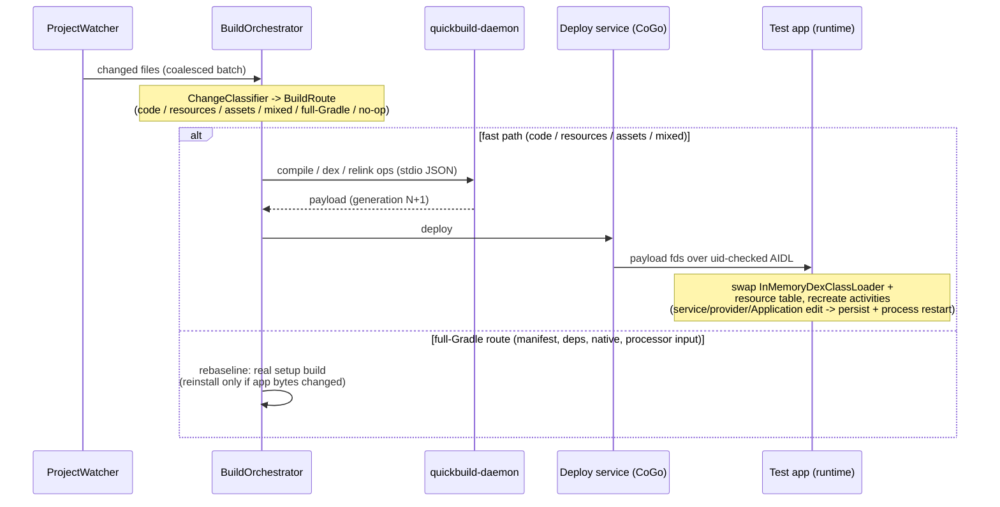

# Quick Build (ADFA-4128)

Live-reload for user projects: tap the lightning-bolt button once and CoGo installs a generated **test app**; from then on every save hot-reloads with no reinstall. A typical warm save-to-live is ~1-3.5 s. The daemon's cold compile (~12 s on a mid-spec phone) is paid by a background **seed** build in the provisioning tail, so the first save is warm too (~1.6-2.6 s measured; before the seed it landed on the user's first save). Invariant: **the test app never silently runs stale code** — every edit either hot-reloads or visibly falls back to a real Gradle build.

The whole loop runs ON DEVICE: edit -> watch -> compile -> dex -> deploy -> reload all happen on the phone inside/alongside CoGo. No desktop component is part of the feature.

The repo-level boundary decision — a **bounded, never-stale fast path beside authoritative Gradle, correct on the covered edit classes rather than universally** — is [ADR 0010](../docs/adr/0010-quick-build-fast-path-boundary.md). Design history lives in Jira ticket ADFA-4128.

## How a save becomes a reload



Terms used throughout:

- **Setup build** — a real Gradle build, run once per baseline, that produces the

  installable test app (`:gradle-plugin` `QuickBuildPlugin`).
- **Payload** — the compiled user code (and, for a resource edit, the relinked resource

  table) sent to the already-running test app for one reload, without a reinstall.
- **Generation** — a monotonically increasing counter naming each payload; the test app

  always runs one specific generation.
- **Rebaseline** — falling back to a fresh setup build when fast-path state can't be

  trusted; it reseeds the baseline and discards persisted payloads. It also tears the daemon down for its duration (freeing the daemon's RAM for the Gradle peak) and restarts it against the new setup's config.
- **Seed** — a background build (`BuildRoute.Seed`, never produced by the classifier) that warms the daemon's incremental-compile caches and **deploys nothing**: generation unmoved, no reload. Fired after provisioning reaches `Ready`, after every rebaseline, and after a daemon respawn with nothing pending; lowest-priority — dropped when real work is pending or in flight, and a save arriving mid-seed queues behind it. Not in the diagram above because it is not triggered by a save.

A compile error takes neither branch: no payload is produced, the test app keeps running the last good generation, and `onBuildStatus` drives its error overlay. **Hand-back** is bidirectional: an invalidated session falls back to a real Gradle build, and any completed Standard Gradle build (CoGo's normal Run-button build) reseeds a live session's baseline.

## Pieces

| Piece          | Where                                         | What                                                         |
| -------------- | --------------------------------------------- | ------------------------------------------------------------ |
| Domain model   | `:quick-build` `domain/`                      | pure-JVM: orchestrator (coalescing, never-lose-pending), change classifier (`ChangeClassifier` -> `BuildRoute`), session reducer, generation counter |
| Setup build    | `:gradle-plugin` `QuickBuildPlugin`           | real Gradle build, once per baseline: generates the test app from the merged manifest |
| Runtime        | `:quickbuild-runtime`                         | Java-only AAR inside the test app: binds to CoGo, receives payload fds, hot-reloads |
| Daemon         | `:quickbuild-daemon`                          | JVM child process on the bundled JDK: incremental Kotlin compile via BTA (the Kotlin Build Tools API), d8, aapt2 |
| Deploy service | `:quick-build` `service/`                     | bound service in CoGo; payload as ParcelFileDescriptors, uid-checked |
| Run statistics | `:quick-build` `domain/QuickBuildMetricsSink` | per-build metrics port; see decision 9 (the app wires a Firebase sink, `analytics/quickbuild/`) |

## Test-app architecture (the classloading contract)

The test-app APK contains the runtime AAR, the user's library dependencies and resources — but **no user classes**. User classes + generated proxy activities travel ONLY in the payload dex:

- The setup build compiles user sources + proxies to `classes.dex` and bakes it into the

  APK as `assets/quickbuild/gen-0.dex` (the baseline payload).
- The runtime declares an `android:appComponentFactory` that instantiates activities

  through the CURRENT generation's `InMemoryDexClassLoader` (parent = the base APK's classloader — the "shell" loader, which has the libraries but no user classes; framework/androidx resolve from it, user classes exist only in the payload, so parent-first delegation cannot serve a stale copy).
- A deploy hands over new fds; reload = swap the payload classloader (+ a resource-table

  swap: `ResourcesLoader`/`ResourcesProvider.loadFromApk` on API 30+, a degraded `addAssetPath` shim on 28/29 — see `ResourceSwapStrategy`) and recreate the activity stack. Recreated activities are instantiated from the new loader — that is what makes reload real. The resource payload is the FULL relinked resource apk (resources.arsc plus every compiled resource file), not a bare extracted table — a bare table cannot back a file-typed resource like a drawable XML or an adaptive-icon mipmap XML. (An early arsc-only relink crashed reloads resolving the launcher icon; see Known limitations, "a successful relink can still crash the app".)
- Generated `Proxy<N><Type>` classes (`Proxy0Activity`, `Proxy0Service`, ...) extend the

  user classes and give the manifest stable component names while the user's class hierarchy stays swappable (both live in the payload dex). Manifest carries superset permissions + the user's icon/label; the test app installs under the project's REAL `applicationId` — one install slot shared with Standard Run, confirmed on switch (see "One install slot" below). A custom `Application` gets no proxy (nothing addresses it by manifest name) but routes through the payload loader too.
- `Context#getClassLoader()` is fixed to the base APK's classloader at LoadedApk-attach

  time regardless of which loader instantiated the object, so it never sees a payload-only class on its own — the `AppComponentFactory` picks the payload loader for INSTANTIATION only. Every activity proxy therefore also overrides `getClassLoader()` (via `QuickBuildClassLoaders.forActivity`) so by-name resolution through `context.getClassLoader()` — androidx `FragmentFactory` resolving a `<fragment>` tag or a Navigation-Component destination, `LayoutInflater` resolving a custom view — sees the payload loader too. (Without this, BottomNav/Navigation-Drawer templates crashed on first launch with `Fragment$InstantiationException` because the default `FragmentFactory` resolved against the shell loader.)
- Services, providers and a custom `Application` swap via **process restart**, never

  hot-swap of a live instance: a deploy whose recompiled set hits their restart closure (`domain/DeployPolicy.kt`) ships with `"restart": "true"` metadata; the runtime persists the payload, acks and exits, and CoGo relaunches the launcher proxy. Every accepted deploy also persists app-privately (`PayloadPersistence`), so a killed-and-relaunched process boots the NEWEST generation instead of the baked gen-0 baseline — without that, providers/Application (instantiated before the binder connects) would silently pin to baseline code. The store is fingerprint-keyed to the baseline dex; a rebaseline discards it.
- Scope: debug builds + D8 only; components declaring `android:process`, isolated services

  or multiprocess providers fail the setup build loudly (Standard Run instead). Device floor: **API 28+** — 30+ gets the full-fidelity `ResourcesLoader` resource swap; 28/29 take a degraded `addAssetPath` path (`ResourceSwapStrategy` in the runtime; unit-tested, not yet device-verified). The payload dex targets min-api 30 (`QuickBuildPlugin.MIN_PAYLOAD_API`) to skip desugaring; the dex format it emits (039) loads on 28+.

## Session model

One sealed state type (`domain/QuickBuildSession.kt`): `Idle` -> `Prewarming` (eager setup build at project open — no install, no daemon) -> `Provisioning` (setup build + test-app install + daemon spawn) -> `Ready` <-> `Building` -> `Deployed`, plus two off-ramps: `Invalidated` (manifest/gradle/external change — needs a full Gradle rebaseline) and `Degraded` (daemon died; respawn + background re-seed in progress — the respawned daemon deploys nothing until a real edit arrives). A rebaseline whose reinstall is never confirmed (the installer times out — either the dialog was left untapped, or CoGo was backgrounded and Android never delivered the PENDING_USER_ACTION broadcast, so no dialog appeared at all) does NOT kill the session: it parks in `Invalidated(awaitingRetry = true)` — saves keep accumulating (no build runs; the daemon is down), and either the next lightning-bolt tap or CoGo's next return to the foreground re-runs the rebaseline, which re-prompts the install. A background `Seed` build (see Terms) runs after `Ready` is first reached and after every rebaseline, so the daemon is warm before the user's next save. A compile error is NOT a state change: the session stays `Ready` at the old generation with `lastFailure` set — the test app never moved, which is the never-stale invariant in state form. `service/QuickBuildSessionManager.kt` turns reducer effects into real work (provisioning, daemon respawn, Gradle rebaseline). When diagnosing on device, start from which state the session is in and whether the overlay surfaced a failure — converging on a rebaseline is intended behavior for any untrusted state, not a bug. One known exception that does NOT converge on its own: a failed relink wedges the session at the failed resource delta (Known limitations below); the unwedge today is any gradle-file touch, which routes to rebaseline.

## Design decisions

Module-local decisions, each with its why and cost (the repo-level ADR 0010 boundary is in the intro):

1. **Builds trigger on file save (watcher), not on a tap.** The loop's value is removing

  interaction entirely: save -> running app in ~1 s with zero taps, vs a tap + three dialogs on the standard path (both measured on the minimal-app corpus, `phase1-gates-a56`; the ~1-3.5 s headline in the intro is the broader real-app corpus). The lightning button starts/stops a session; it never triggers individual builds. Consequence: in-progress code is a normal input, so compile errors are ordinary flow (error-only overlay), and the watcher filters build outputs/temp files so junk writes don't trigger builds.
2. **The whole loop runs on the device** (see the intro). This is why daemon memory and

  low-spec fit are first-order product concerns — the mission constraint (offline, low-end devices) applied literally.
3. **Test app: generated proxies under the project's real ****`applicationId`****.** One proxy source per

  manifest component — activity, service, receiver and provider (the custom `Application` routes through the payload loader without a proxy) — compiled against the runtime AAR. The real package id means `${applicationId}` authorities pass verbatim and package-bound services reach the test app; the cost is one shared install slot with Standard Run, confirmed on switch (see "One install slot" below). Cert-pinned services (Maps keys, OAuth against a registered SHA) still need the debug cert registered per service.
4. **Changes transmit over uid-checked binder IPC, never the network.** AIDL +

  ParcelFileDescriptors; the exported host service gates every call on the uid PackageManager reports for the test app. No sockets, no world-readable files.
5. **Compilation lives in a separate warm daemon process** (pure JVM on the bundled JDK,

  stdio JSON protocol). Isolates the compiler's memory (537 MB RSS over a 28-min soak on a mid-spec phone; `phase1-gates-a56`) and its crash domain from the IDE; keeps the compiler warm (the biggest latency lever). That RSS is the main low-spec risk.
6. **Hot deploys load by generation via ****`InMemoryDexClassLoader`****.** No APK install per edit;

  install only when the setup build changes the app's bytes (hash-checked).
7. **Rebaseline is the one fallback, and hand-back is bidirectional.** Every untrusted state

  converges on a full setup-build rebaseline; any completed Standard Gradle build also reseeds a live session, so the two build paths interleave safely.
8. **Everything is gated behind the experiments flag** (`FeatureFlags.isExperimentsEnabled`;

  see "Running it on a device" below). No flag, no behavior change; the bar for lifting the gate is a product decision tracked in ADFA-4128.
9. **Run statistics exist to prioritize, not to impress.** Events carry change mix, route,

  duration, outcome under a `(qb_session_id, qb_build_id)` join key, to replace assumed edit-type frequencies with measured ones before optimizing anything hard.
10. **The corpus lives in the benchmark repo; third-party source is never checked in

  anywhere** — synthetic apps ship with oracles and results there, real apps are pinned by `vendor.json` and fetched into a gitignored cache (see the note near "Verifying changes").

## Running it on a device

Prerequisite: a CoGo debug build from this branch installed on an Android test phone (arm-only: `:app:assembleV8Debug` for arm64) — Quick Build has not shipped in any release. Note the `:app` build needs the gitignored, team-provided `app/google-services.json` (Firebase config); external contributors without it currently can't build `:app` — an onboarding gap tracked outside this module.

With CoGo installed, Quick Build ships dark behind the experiments flag: create a file named `CodeOnTheGo.exp` in the device's `Download/` folder (the mechanism is `utils/FeatureFlags.kt` in `:common`) and restart CoGo. With the flag on, a lightning-bolt button appears next to Run in the editor toolbar; tapping it starts a Quick Build session for the open project — the first start runs the setup build, installs the generated test app (OS install dialogs apply this once), and spawns the daemon. From then on, saving any file triggers the loop above; tapping the button again stops the session.

## Driving and observing a session from outside

Behind a second flag — `CodeOnTheGo.qbbench` in `Download/`, always paired with the experiments flag — CoGo exposes an interface to drive and observe a Quick Build session without a human at the phone. It exists for the benchmark harness today, and is the seed of scripted end-to-end flows. Off in any shipping build, and off unless BOTH flag files are present.

**Drive** (replace the human's tap): send an adb intent to the exported `QuickBuildBenchActivity`; it opens the named project and auto-fires the first Quick Build tap as the editor loads. It is idempotent — re-sending for the already-open project just re-taps, so the harness can retry a session (e.g. after an install-confirm timeout) without a full re-open. It only opens an existing directory inside the projects folder, so a hostile sender can at worst open one of the user's own projects.

```bash
adb shell am start-activity \
  -a com.itsaky.androidide.quickbuild.action.BENCH_OPEN_PROJECT \
  -n com.itsaky.androidide/.quickbuild.QuickBuildBenchActivity \
  --es com.itsaky.androidide.quickbuild.extra.PROJECT_PATH \
     /storage/emulated/0/CodeOnTheGoProjects/<project>
```

**Observe**: every session change is appended to a JSON-lines file — one JSON object per line, each line protocol-versioned (`"v":1`) with a wall-clock stamp — at:

```
/data/data/com.itsaky.androidide/files/home/.cg/quickbuild/bench-events.jsonl
# run-as-relative: files/home/.cg/quickbuild/bench-events.jsonl
```

Two collectors write it, both running as *second* listeners beside CoGo's shipping analytics sink (via `CompositeQuickBuildMetricsSink`, which guards each delegate so instrumentation can never perturb a build): `BenchStateRecorder` writes a `state` line on every session-state change, and `BenchQuickBuildMetricsSink` mirrors each metrics callback — the load-bearing one is `reload_timeline`, which carries the whole save-to-live loop the benchmark reads.

Files: `app/src/main/java/com/itsaky/androidide/quickbuild/Bench*.kt` + `QuickBuildBench*.kt`; the flags live in `:common`'s `utils/FeatureFlags.kt`.

## One install slot (real applicationId) + confirm-on-switch

Quick Build and Standard Run both install under the project's REAL `applicationId` — there is no `.quickbuild` suffix and no separate opt-in mode (the earlier two-mode design was removed; ADR 0010 records the revision). One package slot means everything package-bound works in the test app — Firebase init, FCM into proxied services, verified app links — and the app's data directory, permissions and accounts are shared between the two build types: a same-signature install is an *update*, so switching build types preserves data. Uniform component proxying (`docs/component-proxying-design.md`, "Path A" — every OS entry point routed through current-generation code) is what makes a real-id test app honest: an entry point targeting the real package lands in current code, not a stale shell.

Sharing one slot also means installing one build type overwrites the other, so **the UI confirms a switch before it clobbers**:

- Which build currently occupies the slot is read STATELESSLY from the installed package's `android:appComponentFactory` — the setup build stamps the runtime's factory class into the test app's manifest, so no persisted mode/marker can drift from reality (`domain/RealIdInstall.kt`, `service/QuickBuildClobberCheck.kt`).
- Tapping Quick Build over the Standard-Run app confirms the clobber first; over its own test app (or an empty slot) it installs without a prompt. Tapping Run over the test app confirms symmetrically; over a normal app Run behaves as always.
- Both build types use the project's own versionCode, so every switch is a same-version update — no downgrade request, no version pinning, and API 28 needs nothing special.
- An occupant that was NOT built by this device's CoGo (Play install, sideload, another machine's keystore) is refused outright before any install (`RealIdInstall.signatureRefusal`) — the only way past is a manual uninstall, i.e. deliberate data loss, because an update-install cannot preserve a foreign app's data.

Cert-pinned services are the remaining gap: a Firebase/Google Cloud project restricting API keys or OAuth clients to a specific signing SHA rejects this device's CoGo debug cert; the fix is registering that debug SHA in the service's console, which only the user can do.

## Deploy metadata JSON (`IQuickBuildTarget.onPayload`)

```json
{
	"entryActivity": "com.example.app.MainActivity",
	"changedAssets": ["data/levels.json"],
	"reason": "code|resources|assets|mixed|forced",
	"restart": "true"
}
```

`reason` mirrors the build route, except `forced`: a deploy from an explicit user tap with no pending changes (rebuild of the current sources). `restart` (string, present only when true) marks a restart deploy: the recompiled set touched a service/provider/custom-Application class (CoGo-side `domain/DeployPolicy.kt`), so the runtime must persist the payload, ack, and exit instead of hot-swapping; CoGo then relaunches the launcher proxy and the fresh process boots the persisted newest generation (design contract: `docs/component-proxying-design.md`, section 4). Encoder: `service/QuickBuildExecutorImpl.kt` (CoGo); parser: `DeployMetadata.java` (runtime). The AIDL contract (`IQuickBuildHost` / `IQuickBuildTarget`) lives at `quickbuild-runtime/src/main/aidl/`.

## Build status JSON (`IQuickBuildTarget.onBuildStatus`)

A compile error never produces a payload, so this message is how the running test app learns a build failed (its overlay then says it still runs the last working version; tap jumps to the error in CoGo). `build_ok` clears a shown failure; `building` tells the app which generation is still on screen while a newer one compiles, so a slow build never reads as silence. All values are STRINGS (the runtime's MiniJson reads only strings); unknown kinds/fields are ignored by the runtime, and an older test app ignores the whole call (appended AIDL method) — both directions of the version skew are safe.

```json
{"kind": "build_failed", "file": "/abs/path/Foo.kt", "line": "12", "column": "5",
 "message": "first line of the first error", "moreErrors": "2"}
{"kind": "build_ok"}
{"kind": "building", "runningGeneration": "3"}
```

Encoder: `service/BuildStatusJson.kt` (CoGo); parser: `BuildStatus.java` (runtime).

## Daemon protocol (line-delimited JSON over stdin/stdout)

One request in flight at a time (the orchestrator serializes). Requests:

```json
{"id": 1, "op": "configure", "projectRoot": "...", "classpath": ["..."], "outDir": "...",
 "aapt2": "/path/to/aapt2", "d8Jar": "/path/to/d8.jar", "androidJar": "...",
 "minApi": 30, "compilerPlugins": ["/optional/kotlin/compiler/plugin.jar"]}
{"id": 2, "op": "compile", "allSources": ["..."], "changedFiles": ["..."],
 "removedFiles": ["..."]}
{"id": 3, "op": "dex", "classesDirs": ["..."]}
{"id": 4, "op": "relink", "resDirs": ["..."], "manifest": "...",
 "stableIds": "/path/to/stable-ids.txt", "libraryResources": ["/lib/res.flat"]}
{"id": 5, "op": "ping"}
{"id": 6, "op": "shutdown"}
```

`aapt2`, `d8Jar` and `androidJar` are **optional** on `configure`. When a caller omits any of them, the daemon discovers its own toolchain from `$ANDROID_HOME` — newest `build-tools/<version>/aapt2` and `.../lib/d8.jar`, newest `platforms/android-<N>/android.jar` — so an external caller (e.g. a benchmark harness) doesn't need to know CoGo's internal toolchain layout. A field a caller still sends is used as-is (no discovery, no wire-shape change). If a field is omitted and `ANDROID_HOME` is unset, or the SDK lacks the tool, `configure` fails loudly with an `ok:false` diagnostic naming exactly which field couldn't be resolved and why (`ToolchainDiscovery.kt`).

Responses: `{"id": N, "ok": true, ...op-specific...}` or `{"id": N, "ok": false, "diagnostics": [{"severity": "ERROR", "message": "...", "file": "...", "line": 7, "column": 13}]}`. `minApi` defaults to 30 (the payload floor), and a repeated `configure` replaces the daemon's session state — there is no separate "reconfigure" op. The daemon never exits on a build error; it exits on `shutdown`, EOF on stdin, or a fatal internal error (exit code != 0, which CoGo treats as daemon death -> respawn per the session model above).

Every `ping` and successful `configure` response carries a `protocolVersion` integer (`DaemonResponse.PROTOCOL_VERSION`, currently `1`) so a caller can pin the version it was written against and abort loudly on drift instead of silently misinterpreting a changed wire shape:

```json
{"id": 5, "ok": true, "protocolVersion": 1}
```

BTA incremental-compilation (IC) gotchas (re-derived from the ADFA-4128 spike, load-bearing): `SourcesChanges.Known` required (`ToBeCalculated` falls back to full compile); the shrunk snapshot — the BTA's compact record of classpath ABI that incremental invalidation reads — MUST be exactly `<rootProjectDir>/shrunk-classpath-snapshot.bin`; runtime needs `kotlinx-coroutines-core-jvm` + `trove4j`; pass ALL sources as changed on the first build to seed the IC caches; only set `assureNoClasspathSnapshotsChanges(true)` after the shrunk snapshot exists.

## Tap-to-jump + return gesture

- Overlay tap on a build failure -> explicit intent

  `com.itsaky.androidide.quickbuild.action.JUMP_TO_ERROR` (extras: FILE, LINE, COLUMN; 1-based) to CoGo's `QuickBuildJumpActivity` trampoline, which validates the file against the open project, posts `QuickBuildErrorJumpEvent`, and finishes — revealing the editor, which opens the file at the error line.
- 3-finger tap anywhere in the test app returns to CoGo: the generated proxy activities'

  `dispatchTouchEvent` feeds `QuickBuildGestures` (observation only — every event still reaches the app via `super`, so normal 1-2 finger input is never consumed or delayed). A one-time hint banner on first launch makes the gesture discoverable.

## Compose projects

When the user project uses Jetpack Compose, hot compiles need the Compose compiler plugin or every `@Composable` body miscompiles to a plain function. The wiring:

- `QuickBuildPlugin` detects Compose in `finalizeDsl` (`buildFeatures.compose` or the

  `org.jetbrains.kotlin.plugin.compose` plugin) and writes `composeEnabled` into `setup.json`.
- CoGo stages `compose-compiler-plugin.jar` next to the daemon jar (it rides

  `quickbuild-daemon.zip`; see `:app`'s `quickBuildDaemonZip`). The jar is `kotlin-compose-compiler-plugin-embeddable`, version-matched to the DAEMON's bundled compiler — deliberately NOT the project's own Compose compiler artifact, which tracks the project's (possibly older) Kotlin.
- On `composeEnabled`, the session manager passes that jar via `configure.compilerPlugins`;

  the daemon turns each entry into `-Xplugin=` on the BTA incremental compile. The compose runtime classes needed on the compile classpath already arrive via `setup.json`'s `classpath` (the variant compile classpath).

Verified host-side (corpus app `compose-kotlin` + daemon unit tests; full-corpus run `corpus/results/20260719T181349Z/`): the transform runs under the BTA incremental path, recompile sets stay minimal, and the compiler's runtime-version check accepts even the old `androidx.compose.runtime:runtime:1.3.0` the offline `localMvnRepository` bundles.

## Known limitations (v1)

Each entry is limitation + user-visible impact + status; mechanism and fix-path detail live in the linked ADR / ticket / code / design docs.

- **Gradle 9+ projects don't start.** The setup build fails before Quick Build runs — CoGo's

  init-script plugin injection throws `UnknownPluginException` under Gradle 9.x. Status: a `gradle-plugin` defect, not quick-build-specific; tracked. Evidence: benchmark repo `corpus/README.md`, sora-editor finding 1.
- **Bidirectional Kotlin <-> Java modules can't fast-compile.** A real reference cycle across

  the language boundary fails the daemon's two-pass (Kotlin then Java) compile, so those edits rebaseline. Common in mature codebases. Status: inherent to the split compile; tracked. Evidence: `corpus/README.md`, sora-editor finding 2.
- **kapt/KSP-input edits rebaseline** (Room etc.). Editing annotation-processor input (e.g. a

  `@Dao`) takes a real build; editing a Composable or ViewModel in the same app stays on the fast path (`domain/annotations/AnnotationImpact.kt` enumerates what's safe). Status: the ADR 0010 boundary; running the processors in the daemon would close it (`docs/ksp-kapt-feasibility.md`).
- **Cert-pinned services need their console updated.** The test app runs under the real

  `applicationId` (see "One install slot"), so package-bound services — Firebase init, FCM push, verified app links — reach it; but a service restricting API keys or OAuth clients to a specific signing SHA (Maps keys, Sign-In) rejects this device's CoGo debug cert until the user registers that SHA in the service's console. Status: inherent to building with a local debug cert; user-fixable per service.
- **API 28/29 resource swaps take a degraded path.** Resource reloads on 28/29 use an

  `addAssetPath` shim that is unit-tested but not yet device-verified. Status: tracked. See Test-app architecture.
- **The hot relink resolves library resources from the setup build's snapshot.** The relink

  feeds the setup build's compiled library resource units (`.flat` files) to `aapt2 link` as overlays (`libraryResources` on the relink op), so library-provided references — Material3 themes, a library manifest ref — resolve. Two residual cases: CoGo's LogSenderPlugin manifest injection is inlined at setup time (`QuickBuildManifestTransformer`), and a library resource that did not exist at baseline time (new dependency) still needs the rebaseline that a gradle edit forces anyway. Status: fixed for baseline-known resources.
- **A failed relink wedges the session.** The dirty resource delta never clears, so

  subsequent edits re-fail until a gradle-file touch forces a rebaseline (~7-8 s warm / ~17 s first-hit). Never-stale holds and the overlay surfaces each failure. Status: auto-rebaseline on repeated identical relink failure is the tracked followup.
- **A crashing reload has no self-healing.** If a reload crashes the test app on

  `recreate()`, the crash repeats on every reload until the session is reset — there is no auto-rebaseline on a crash loop. Both known triggers are fixed: the arsc-only relink (fixed — full resource-apk payload) and the type-index shift (fixed — `aapt2 link --stable-ids` fed from AGP's `stable_resource_ids_file`; device-verified trigger at `corpus/results/20260723T111950Z-bug5-verify/`). The remaining gap is the recovery machinery itself. Mechanism history: `docs/relink-poisoning-notes.md`.
- **A live service/provider calls OLD copies of recompiled helper classes until its next

  restart.** A helper-only edit (a class the component *uses*, not the service/provider/Application itself or a supertype in its restart closure) leaves a bounded staleness window. Status: the restart closure (`domain/DeployPolicy.kt`) covers the component's own code + supertypes; a tightening ("restart on any code deploy while a tracked service is live", which `ServiceTracker` enables) is behind a flag, priced by metrics. Detail: `docs/component-proxying-design.md` section 4.
- **Forced-tap and daemon-respawn rebuilds over-restart component apps.** A forced "catch up"

  tap or a daemon respawn full-recompiles every source, so an app with a service, provider or custom `Application` gets an unnecessary process restart (losing in-app state) even when those classes are byte-identical to what's running. Status: the never-stale-safe direction; a sound downgrade needs per-component byte fingerprints the gen-0 baseline lacks; tracked. Genuine incremental edits are unaffected.
- **A ****`final`**** or unresolvable library component fails the setup build with one clear line.**

  Instead of a multi-line javac dump, `QuickBuildPayloadDexTask.checkProxiability` (via `ComponentProxiabilityResolver`, reading the class file's `ACC_FINAL` flag, never loading the class) names the offending class and the fix. Impact: a newly-discovered such class must be added by name to `UNPROXIABLE_LIBRARY_COMPONENTS` (the error says so). Status: this is DETECTION only — safe auto-skip is blocked on a Gradle task-graph cycle at manifest-generation time; tracked. Detail: `docs/component-proxying-design.md` section 2.
- **Four library components are never proxied**, kept under their real manifest name:

  `androidx.startup.InitializationProvider`, `androidx.compose.ui.tooling.PreviewActivity`, `androidx.profileinstaller.ProfileInstallReceiver`, `androidx.room.MultiInstanceInvalidationService`. Impact: none in normal use — they're never recompiled by the daemon, so proxying buys nothing, and each had blocked some project class (androidx-based, Compose, Room) until excluded. Status: fixed. Rationale per entry: `docs/component-proxying-design.md` section 2.

## Verifying changes

> **Benchmark corpus moved out of this repo.** The corpus fixtures, harness, and all results
> now live in the standalone `CodeOnTheGo-build-benchmark` repo (formerly `test_app_corpus`).
> Every `corpus/...` path in this doc refers to that repo: `corpus/results/<dir>` is its
> `results/<dir>`, `corpus/README.md` is its `corpus/README.md`. The benchmark drives CoGo
> only through the declared interface (compile-daemon protocol + the flag-gated automation
> interface); see "Driving and observing a session from outside" and "Daemon protocol" above.

- **JVM suites**: `:quick-build:test`, `:quickbuild-daemon:test`, `:quickbuild-runtime:test`,

  plus the setup-build tests in `:gradle-plugin`. The root build sets `ignoreFailures = true` on test tasks — read the test-report XML/HTML under `<module>/build/test-results/`, don't trust `BUILD SUCCESSFUL`.
- **Classification changes**: `ChangeClassifierTest.kt` in `:quick-build` is the route

  contract — a changeset routed wrong breaks the never-stale invariant, so new file patterns need cases there first.
- **Compile-pipeline changes**: run the host corpus matrix (`corpus/README.md`) and commit

  the results dir. Correctness = the two oracles (recompiled-class bounds + output equivalence), not timings.
- **A new edit class or route needs all three**: a classifier test, a corpus edit declaring

  `expected.route`, and — if it produces a deploy — an on-device walk that checks the overlay/fallback behavior, not just the happy path. Route execution (mapping a `BuildRoute` to daemon ops + a deploy) lives in `service/QuickBuildExecutorImpl.kt` — a genuinely new route touches it too.
- **Latency claims cite a results dir** under `corpus/results/`, or say "not yet measured".

  The intro headline is the latest full-corpus end-to-end run on a mid-spec phone (Samsung A56, CoGo `C-d-0724-0315`; results dir `20260724T073925Z-e2e-bench` in the benchmark repo): 70 of 97 real-app edits were measured end-to-end, the other 27 documented there as named gaps.
