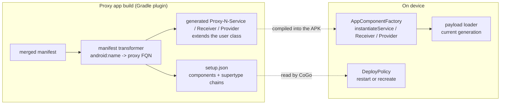
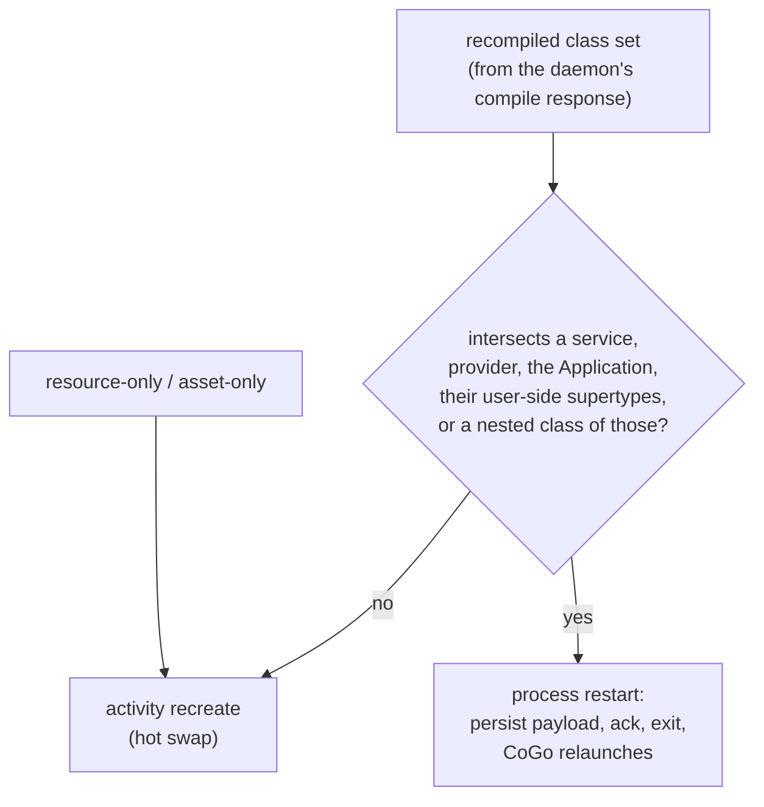

# Component proxying

How a generated proxy app can host a project's services, receivers, providers and custom
`Application` - not just its activities. Implemented on this branch (ADFA-4128).

Every manifest component is replaced by a generated `extends` subclass compiled into the proxy
app, while the user's own classes travel in the swappable payload dex - so a swap replaces the
whole hierarchy at once. A manifest *change* still takes a proxy app rebuild; this only widens what
a generated proxy app can host. See
[the boundary](../README.md#the-boundary-what-live-reloads-and-what-falls-back-to-gradle).

## Key decisions

- **Every component is proxied - user code and library code alike.** Keeps the transform free of
  user-vs-library discrimination.
- **Two shapes defeat `extends`, and both fail the build loudly**: a `final` library class, and a
  class present only on the runtime classpath. Never a silent component drop.
- **A short exclusion list keeps known-unproxiable library components under their real manifest
  name.** Each entry came from a real crash; the per-entry reasons live in the KDoc on
  `QuickBuildManifestTransformer.UNPROXIABLE_LIBRARY_COMPONENTS` - read that, not a copy here.
  Today: androidx `InitializationProvider` (resolves itself by hardcoded name), Compose
  `PreviewActivity` and Room `MultiInstanceInvalidationService` (both `final`).
- **The `Application` gets no proxy.** Nothing addresses it by manifest name, and
  `instantiateApplication` already routes through the payload loader.
- **Provider authorities pass through verbatim.** The proxy app installs under the project's real
  `applicationId`, so `${applicationId}` resolves exactly as the real app's would.
- **Unsupported attributes fail the build with the component and attribute named** - no stripping,
  no silent loss. `android:process` and isolated/multi-process providers are the live cases.
- **The runtime persists the newest payload to disk.** Providers and the `Application`
  instantiate before the binder connects and are never re-instantiated, so without it they would
  pin to baseline code forever - a never-stale violation. A fingerprint mismatch or read failure
  falls back to gen-0.

## Restart vs recreate

Decided after compilation, from the set of classes the daemon actually recompiled - the
path-shape classifier runs too early to know it.

- **Receivers are deliberately not in the restart set** - manifest receivers are instantiated
  fresh per delivery, so they already run current code.
- **The restart is honest, not clever**: the process really dies and reboots from the persisted
  generation, reusing the never-stale catch-up path rather than inventing one. Cost is the back
  stack and all in-process state - the same trade Apply Changes makes on structural changes.
- **Skew guard.** An older installed baseline whose baked runtime predates restart support would
  ignore the restart flag and hot-swap - stale. `setup.json`'s top-level `schema` field gates it:
  below schema 2, a restart-requiring deploy routes to a full proxy app rebuild, which
  self-heals by regenerating a schema-2 baseline.
- **Accepted residual**: a *live* service or provider keeps calling old copies of recompiled
  non-component helper classes until its next restart - a loader swap updates instantiation, not
  live object graphs. Same kind as an activity mid-recreate; see README "Known limitations".

## Where the code lives

| Concern | Code |
|---|---|
| Manifest rewrite, exclusion list, authority recording | `gradle-plugin/.../QuickBuildManifestTransformer.kt` |
| Detecting final/unresolvable components before javac | `gradle-plugin/.../ComponentProxiabilityResolver.kt` |
| Proxy source generation | `gradle-plugin/.../ProxySourceGenerator.kt` |
| `setup.json` shape and schema version | `gradle-plugin/.../QuickBuildJson.kt`, read by `quick-build/.../data/ProxyAppInfo.kt` |
| Supertype chains for the restart closure | `gradle-plugin/.../SupertypeResolver.kt`, `domain/ClassHeader.kt` |
| Restart-vs-recreate decision | `quick-build/.../domain/DeployPolicy.kt` |
| Component instantiation on device | `quickbuild-runtime/.../QuickBuildAppComponentFactory` |
| Payload persistence across process death | `quickbuild-runtime/.../PayloadPersistence` |

Tests sit beside each of those; `DeployPolicyTest` is the one to read first, since it pins the
closure rule and the skew guard.

## Known gaps

- **Multi-process components are unsupported** - per-process payload and generation coherence is
  unverified, so `android:process` fails the build rather than deploying something unproven.
- **The exclusion list is maintained by hand.** Detecting unproxiable components generally at
  manifest-generation time needs the variant's compile classpath, which isn't reachable there
  without a Gradle task-graph cycle (tried; it cycles back through source generation).
- **Tightening the live-instance residual** - restart on any code deploy while a tracked service
  is live - is possible behind a flag (the service census exists). Price it with metrics first.
