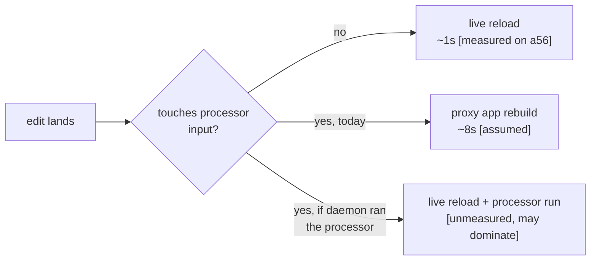

# Running annotation processors in the quick-build daemon

Research only - nothing here is implemented. Today, an edit that touches annotation-processor
input (a `@Dao`, `@Entity`, `@Module`) falls off the live reload path entirely and takes a full
proxy app rebuild, even though the shipped classifier
([`domain/annotations/`](../src/main/java/org/appdevforall/cotg/quickbuild/domain/annotations))
already keeps every *other* edit in the same project on live reload. This asks: could the daemon
run kapt/KSP itself and close that last gap?

**Finding:** both mechanisms are technically reachable from the daemon. kapt rides the daemon's
existing `-Xplugin` compiler-plugin route (a 475 KB jar); KSP2 works too but needs an 83 MB
standalone jar bundling its own Analysis API session.

**Constraint:** the prize is narrow (DAO/entity/module edits only), and KSP2's 83 MB lands on the
low-end offline devices this product exists for.

**Recommended next step:** one ~1-hour A56 experiment (below) - everything else hangs on it.

**Fallback:** a negative result changes nothing. Processor-touching edits keep going to Gradle,
already a small minority after the shipped classifier.

## Key decisions

- **Try kapt before KSP2.** kapt's jar is 475 KB and reuses the daemon's existing `-Xplugin`
  plugin-loading path (same mechanism as the Compose compiler plugin); KSP2 needs an 83 MB
  embeddable jar and a second Analysis API session that doesn't share the daemon's existing
  compile session. Escalate to KSP2 only if kapt's stub round proves too slow.
- **Gate everything on one on-device experiment, not a build-out.** The open question that decides
  feasibility (does Room's native query verifier load on-device) is answerable in about an hour;
  no other work here is worth doing before that answer exists.
- **Java-only processors (`annotationProcessor`, JSR-269) are nearly free but don't move the
  needle.** `JavaCompileStep` already runs javac in-process and only needs `-proc:none` dropped -
  see "Where the code lives" - but that only covers Java sources, not a Kotlin-declared `@Entity`.
- **How often processor-input edits happen in practice is `[unmeasured]`.** The corpus e2e data
  can answer this and should, before investing in either mechanism.

## Mechanism comparison

| Mechanism | Verdict | Cost to wire | Why |
|---|---|---|---|
| Java `annotationProcessor` (JSR-269) | cheap | days `[assumed]` | rides the daemon's existing in-process javac; just needs `-processorpath` + generated-source routing |
| kapt via `-Xplugin=` | possible | 1-2 weeks `[assumed]` | reuses the daemon's plugin-jar route, but needs a second kotlinc pass (stub/apt round) orchestrated alongside the daemon's incremental compile |
| KSP2 standalone | possible, heavy | weeks `[assumed]` | incremental-aware (takes the same modified/removed/changed-class sets the daemon already computes), but ships its own 83 MB Analysis API and does not reuse the daemon's compile session |
| KSP1 as a compiler plugin | gone | n/a | KSP 2.3.6 dropped the `symbol-processing-cmdline` artifact; only the standalone/embeddable path remains |
| Room's query verifier on-device | walled today, looks removable | days, incl. the A56 experiment `[assumed]` | see below |

## Room: the interesting finding

Room's on-device wall is not what it looks like. `DatabaseVerifier$Companion.create` catches only
`java.lang.Exception` - but a failed native load throws `UnsatisfiedLinkError`, which is an
`Error`. That escapes the catch and kills the whole processing round instead of degrading to
Room's own documented "verification disabled" warning.

The native itself is not the problem: `sqlite-jdbc-3.41.2.2.jar` (the version in this workspace's
cache) genuinely ships a bionic build at `org/sqlite/native/Linux-Android/aarch64/libsqlitejdbc.so`
(`DT_NEEDED`: `libm.so`, `libc.so`, `libandroid.so`, `libdl.so`, `liblog.so` - real Android libs,
not the `libm.so.6`-requiring glibc build that failed in a prior on-device attempt). Selection
between the two depends on `OSInfo.isAndroid()`, which the daemon's bundled OpenJDK likely fails
(its `java.runtime.name` doesn't say "android") unless the Termux-`uname` fallback catches it -
`[unverified, needs a device]`. Either way, `SQLiteJDBCLoader` exposes an escape hatch
(`org.sqlite.lib.path` / `org.sqlite.lib.name` system properties) that lets the daemon force-load
the correct native without patching Room or sqlite-jdbc.

Also confirmed: there is no `room.verifySchema=false`-style opt-out (the only escape is the
source-level `@SkipQueryVerification` annotation), and KSP vs kapt makes no difference - both
backends share the same `DatabaseProcessor` verification path.

## Where the code lives

| Concern | Code |
|---|---|
| Shipped classifier that already keeps non-processor edits on live reload | [`domain/annotations/`](../src/main/java/org/appdevforall/cotg/quickbuild/domain/annotations) |
| Why the daemon's in-process javac disables annotation processing today | `-proc:none` in [`quickbuild-daemon/.../compile/JavaCompileStep.kt`](../../quickbuild-daemon/src/main/kotlin/org/appdevforall/cotg/quickbuild/daemon/compile/JavaCompileStep.kt) |

Everything else in this document is analysis of third-party jars (kotlinc, kapt, KSP, Room,
sqlite-jdbc) - there is no in-repo code to point to yet, because none of it is implemented.

## Recommended next step

Run a plain JVM as the app's own uid on the A56 (`adb shell run-as com.itsaky.androidide`, using
CoGo's bundled OpenJDK - the same mechanism used in earlier on-device build experiments), open
`jdbc:sqlite::memory:` through xerial sqlite-jdbc with `org.sqlite.lib.path` pointed at an
extracted `Linux-Android/aarch64/libsqlitejdbc.so`, and check whether the connection opens.

- **If it opens:** Room's verifier is not a wall, and the choice becomes a plain cost comparison -
  kapt first, KSP2 only if kapt is too slow.
- **If it doesn't:** the fallback is unchanged - processor-touching edits keep going to Gradle.

## Known gaps

- **Resolved-version provenance is unverified.** 3.41.2.2 is what happened to be in this
  workspace's cache, not confirmed as what room-compiler 2.8.4 actually resolves.
- **Whether kapt's stub/apt pass can share the daemon's incremental-compile caches is unknown** -
  it is a separate kotlinc invocation, not a plugin riding the normal compile the way Compose does.
- **Whether newly-generated classes (names the baseline dex has never seen) load through the live
  reload path is unverified** - the delivery half of this feature (dex/deploy/reload of generated
  `*_Impl` classes) is untested and must be confirmed alongside the A56 experiment.
