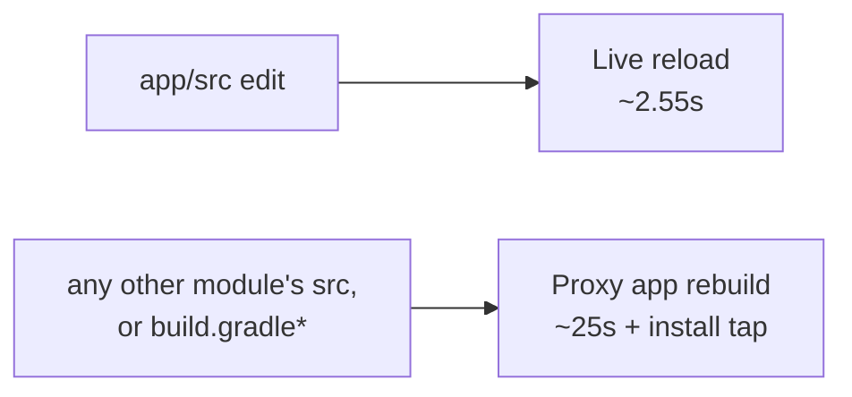

# Decision: build Level 2 (live reload for library-module edits) this cycle?

**Goal, stated so it can be checked:** an edit to any module reaches the running app in under
3 s with no install prompt - the loop app-module edits already get.

Multi-module projects are correct today, just slow outside the app module: a library or gradle
edit costs a full proxy app rebuild, ~25 s plus an install tap, against a ~2.55 s live reload
`[measured on a56]`. Every module's `src` is watched so no edit is silently dropped; only
`app/src` is in live-reload scope.

## Decision: no-go this cycle

- It buys **latency** on edits that already behave correctly - not a correctness unblock.
- Its value rests on `[inferred]` ratios from a GitHub commit survey (~37% of commits would
  move to live reload), not on observed CoGo users.
- Cost: ~2-3 calendar weeks `[assumed]`, plus a standing differential-correctness harness and a
  new dependency on the project-model builders.
- Take instead: **L2.0**, the correctness harness alone (it also protects single-module Quick
  Build), and **analytics** on how often real users edit outside the app module - a day of field
  data replaces the survey's weakest input.
- [`perf-roadmap.md`](perf-roadmap.md)'s storage work (shipped: -36% per warm edit, median
  across 6 apps `[measured on a56]`) is the better-evidenced use of the same weeks.

## Where the code lives

| Concern | Code |
|---|---|
| Watched roots, live-reload scope, module discovery | `data/QuickBuildProjectLayout.kt` |
| Routing an out-of-scope edit to a full build | `domain/ChangeClassifier.kt` |
| Generation counter (a proxy app rebuild resets it to 0) | `domain/GenerationTracker.kt` |
| Install-confirm fail-fast + re-prompt | `service/ProxyAppInstaller.kt`, `domain/SessionReducer.kt` |

Two things to know before revisiting. Module discovery is a depth-bounded walk (depth 4), so a
`:a:b:c:d`-deep module's tail falls to the periodic mtime sweep - rare, `[unmeasured]` in the
wild. And the install-confirm prompt (`reliability-gaps.md` #90) fires on *every* out-of-scope
edit, not once per session, which is what makes library edits feel fragile rather than merely
slow.

Device verification: `quick-build/corpus/results/20260728T044815Z-watchscope-verify2-run4/` -
A56, CoGo dev build `C-d-0727-1820`.
