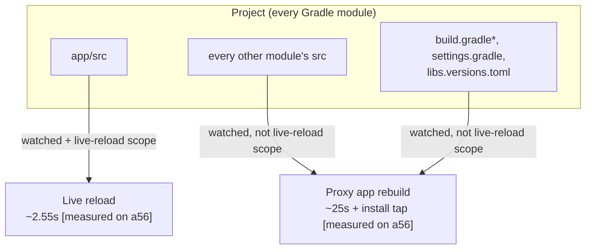

# Decision: multi-module library edits cost a 25s rebuild, not a correctness gap

Multi-module projects work correctly today - a two-module project provisions, and both an
app-module edit and a library-module edit reach the running app. The cost lives entirely
**outside** the app module: any such edit takes a full proxy app rebuild instead of a live
reload. This doc is the go/no-go on Level 2, the design that would close that gap.

**Correction for future readers**: an earlier status claimed multi-module projects were
rejected at Quick Build setup. They are not - they provision and run fine. The real bug was
quieter and has since been fixed: the watcher only watched the app module, so a library save
fired no event at all (fixed in `cc9bedea7`).

## Scope: what live-reloads vs what rebuilds

## Key decisions

- **Watch every module's `src`, live-reload only `app/src`.** A library edit must be *seen*
  (so it rebaselines) rather than silently dropped, even though only the app module is fast.
  See `QuickBuildProjectLayout.watchedRoots()` / `liveReloadScope()`.
- **Module discovery is a shallow, depth-bounded filesystem walk** (depth 4) that errs toward
  watching more, not less - over-inclusion just costs one stray rebuild; under-inclusion
  resurrects the silent-drop bug. See `moduleDirs()` in the same file.
- **A successful proxy app rebuild resets the generation counter to 0** `[measured on a56]` -
  a consumer that assumes monotonically increasing generations across a rebuild will break.
- **The install-confirm prompt makes every library edit fragile, not just a rare rebuild.**
  Same defect as `reliability-gaps.md` #90 (fixed on this branch); multi-module just hits it
  on every out-of-scope edit instead of once per session.

## Decision: build Level 2 this cycle?

**No-go.** Level 2 would replace the ~25s rebuild + install tap with a projected ~2-3s live
reload `[inferred]` for edits outside the app module - but that is a latency win on edits that
already behave correctly, not a correctness unblock, and its value rests on `[inferred]`
ratios from a GitHub commit survey, not CoGo users. Estimated cost: ~2-3 calendar weeks
`[assumed]`, plus a standing differential-correctness harness and a new dependency on the
project-model builders.

Take instead:
- **L2.0**, the differential-correctness harness alone - it also protects single-module Quick
  Build retroactively.
- **Analytics** on how often real users hit a non-app-module edit - a day of field data
  `[assumed]` replaces the survey's weakest input.

The storage work in [`perf-roadmap.md`](perf-roadmap.md) (item 1, shipped: -36% per warm edit,
median across 6 apps `[measured on a56]`) is the better-evidenced use of the same time if only
one thing lands.

Level 2's value case, for the record: of the ~60% of surveyed real-world commits that touch a
multi-module project, ~37% (library
code/resource edits) are "correct today but slow" and would move to live reload under Level 2;
the remainder either already works (app-module edits, no-ops) or still needs a full build
(gradle/manifest changes) regardless `[measured on host, inferred combination]`.

## Where the code lives

| Concern | Code |
|---|---|
| Watched roots, watched files, live-reload scope, module discovery | `data/QuickBuildProjectLayout.kt` |
| Routing an out-of-scope edit to a full build | `domain/ChangeClassifier.kt` |
| Generation counter | `domain/GenerationTracker.kt`, `data/FileGenerationStore.kt` |
| Install-confirm fail-fast + re-prompt | `service/ProxyAppInstaller.kt`, `domain/SessionReducer.kt` |

Device verification: `quick-build/corpus/results/20260728T044815Z-watchscope-verify2-run4/`
(clean pass) and `.../20260728T011901Z-watchscope-verify` (first run, failed on the install
prompt) - A56, CoGo dev build `C-d-0727-1820`.

## Known gaps

- A `:a:b:c:d`-deep module path watches less of its tail past the depth-4 bound; those edits
  fall to the periodic mtime sweep instead. Rare shape, `[unmeasured]` in the wild.
- The 37%/60% survey shares are commit-level proxies from changed-file-list heuristics, not
  observed CoGo developer behavior, and the classifier that produced them predates the
  app-module boundary rule. Treat the shares as an upper bound, not a forecast; measuring the
  real ratios is the gate before committing to Level 2.
