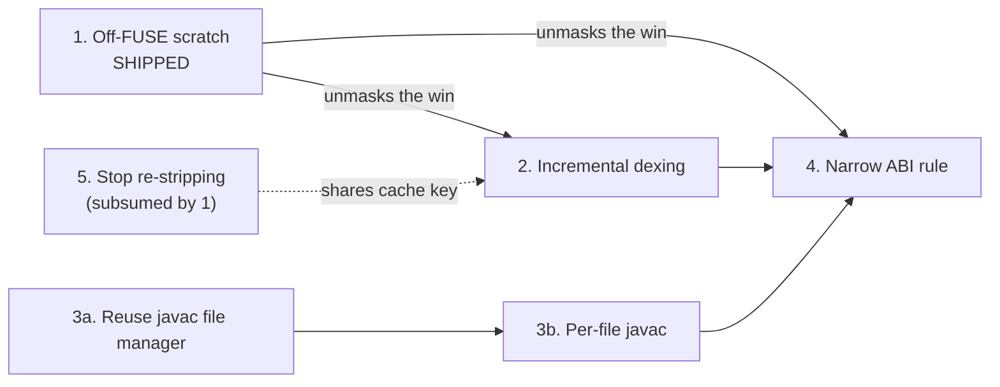

# Performance roadmap

Where the remaining Quick Build latency lives, and which levers are worth pulling next.

Quick Build already runs a median 3.45x faster than an incremental standard build, over 78 edits
across 23 corpus apps `[measured on a56]` (run `20260724T073925Z-e2e-bench`, predates lever #1
shipping). Five levers were identified below; #1 has shipped, the rest are ranked by ROI.

| #   | Fix                                               | Affects             | Payoff per warm edit                               | Effort | Risk | Status                   |
| --- | ------------------------------------------------- | ------------------- | -------------------------------------------------- | ------ | ---- | ------------------------ |
| 1   | Move the daemon scratch tree off emulated storage | All apps            | -36% subset-median, 6 apps `[measured on a56]`      | S      | M    | **SHIPPED** (2026-07-31) |
| 3a  | Reuse the javac file manager                      | Apps with Java      | ~0.5-1.0 s `[inferred]`                             | S      | L    | open                     |
| 3b  | Per-changed-file javac                            | Apps with Java      | ~1.5-3.2 s more `[inferred]`                        | M      | M    | open                     |
| 2   | Incremental dexing                                | All apps            | 2.1-4.6 s                                           | L      | M    | open                     |
| 4   | Narrow "Java ABI moved -> recompile all Kotlin"    | Mixed Java + Kotlin | 14.9 s, but only on ABI-change edits                | L      | M    | open                     |

Background not restated here: [`docs/on-device-storage-performance.md`](../../docs/on-device-storage-performance.md)
(lever 1's mechanism + FUSE toll) and [`incremental-javac-design.md`](incremental-javac-design.md)
(levers 3a/3b's design). Evidence: pre-landing analysis in
`quick-build/corpus/results/20260728T172912Z-sora-deepdive/`; lever 1's production numbers in
benchmark repo `CodeOnTheGo-build-benchmark`, branch `adfa-4128-followups`,
`results/analysis/offfuse-comparison-2026-07-31.md`.

## Sequencing

Item 4 is last on purpose: it is blocked on the same Build Tools API limitation its own KDoc
documents, and its target number should be measured after 1-3 land.

## Where a warm edit goes today

- **javac** - compiles all the project's `.java` sources in-process, not incremental today.
- **kotlinc** - the Build Tools API incremental compile: just the edited `.kt` files, or every
  Kotlin source if a Java ABI moved.
- **strip** - clears `ACC_FINAL` on a mirror of every `.class` so generated proxy activities can
  extend user classes; deletes and rewrites the whole tree each time, which is why it dominated
  on FUSE (now fixed by lever 1).
- **d8** - dexes the whole stripped tree every time.
- **policy+walks** - two `Files.walk` passes to diff mtimes into a changed-class set, plus the
  deploy policy that ASM-parses those headers to pick restart / recreate / proxy rebuild. Not
  additive with `total` (mixes a daemon-side and host-side span; walk time is already inside the
  compile RPC).

Reference workload: `sora-editor-full` (288 sources: 214 `.java` + 74 `.kt`, 464 classes /
1.46 MB) - the corpus's worst Quick Build case, the only app where it lost to a standard build.
Warm edit, ms, pre-lever-1 `[measured on a56]`:

| edit            | total | javac | kotlinc | strip | d8   | policy+walks |
| --------------- | ----- | ----- | ------- | ----- | ---- | ------------ |
| Java body       | 14718 | 3983  | 659     | 5492  | 3104 | 883          |
| Kotlin body     | 14922 | 2849  | 3447    | 4659  | 2421 | 1058         |
| Java ABI change | 28055 | 2677  | 16377   | 4776  | 2268 | 1465         |

## The levers

### 1. Move the daemon scratch tree off emulated storage - SHIPPED

- What: per-project scratch tree keyed under `noBackupFilesDir` instead of emulated/FUSE storage.
- Payoff: -36% per warm edit, subset-median across 6 apps, n=26 `[measured on a56]`;
  `sora-editor-full` flipped 0.77x -> 1.20x vs the standard build. (Prototype measured -45% on
  2 apps - the gap is unresolved; levers 2 and 4 flag numbers still anchored to the prototype.)
- Task #101. Design: [`docs/on-device-storage-performance.md`](../../docs/on-device-storage-performance.md).

### 2. Incremental dexing

- What: dex per-class + merge (as Gradle's `dexBuilder` already does), instead of re-dexing all
  464 classes every edit. Needs a cache key derived from post-strip class bytes, shared with
  lever 5 - the correctness risk is a merge that reuses a cached dex for changed input bytes.
- Payoff: 2.1-4.6 s/edit `[measured on a56]`; the largest remaining line on a Java body edit
  specifically (3.7-3.9 s of 8.1 s) `[prototype-derived; re-measure on production]`.
- Task #102. Code: `DexTool.kt`.

### 3a + 3b. Incremental javac

- What: javac today recompiles all `.java` sources every edit and rebuilds its classpath file
  manager each time, though the classpath is fixed. Split in two for attributable risk:
  - **3a** (S / L): reuse the file manager. ~24% of the win `[measured on host]`; risk is cache
    staleness, contained. Land first.
  - **3b** (M / M): compile only changed files, gated on two guards behind one flag - no Java
    ABI moved (exists) and no Kotlin-emitted public API moved (new, ~150 LOC). Risk is stale
    bytecode, so guards default conservative.
- Payoff: 2.1-4.2 s/edit `[measured on a56]`, ~30% of what remains after lever 1. Host
  microbenchmark at sora's shape (214 `.java`): 308 ms all-sources -> 20 ms single-source ->
  7 ms with a reused file manager `[measured on host]`.
- Task #103. Design: [`incremental-javac-design.md`](incremental-javac-design.md) SS3A.

### 4. Narrow the "Java ABI moved -> recompile all Kotlin" rule

- What: a javac `TaskListener` dependency graph over the real dependent closure, replacing the
  current blanket "any Java ABI move recompiles all Kotlin" (deliberate - BTA has no dependency
  tracking over non-classpath Java, and the cheap approximations both leave stale bytecode). An
  under-approximating graph is itself a stale-bytecode bug. Do last: blocked on that same BTA
  limitation, and its target should be measured after levers 1-3 land.
- Payoff: 14.9 s of a 22.9 s ABI-change edit `[prototype-derived; re-measure on production]` -
  the only edit class still losing to a standard build (0.52x with the prototype fix applied).
- Task #104.

### 5. Stop re-stripping unchanged classes

- What: strip is a pure function of input bytes, so an unchanged class never needs re-stripping.
  Largely subsumed by lever 1 already (4.7-5.5 s -> 0.17-0.33 s `[measured on a56]`); shares its
  cache key with lever 2, so fold in there rather than scheduling separately.
- Code: `DexTool.openClasses`, `DexTool.kt:119-123`.

## Ruled out

- *"The Java-ABI gate fails open, recompiling all Kotlin on a Java edit."* False - a Java body
  edit measured `nKotlinToCompile=0` `[measured on a56]`. The 74-file recompile only happens on
  a genuine ABI change (lever 4's documented design).
- *"Non-incremental dexing is the dominant cost."* Half right - dex is 48-60% of the edit, but
  most of that was the strip pass's file I/O, not dex compute (strip fell 20x once only the
  filesystem changed).
- *"javac is the bottleneck."* No - javac is 25-36% of a warm edit today (19-27% before the
  storage move). `compileMs` alone reads higher because it excludes dex entirely. Options A+B in
  [`incremental-javac-design.md`](incremental-javac-design.md) (levers 3a/3b) are still worth
  taking, just not as the headline. Its ~40x host-scaling estimate is also too high; the A56's
  factor is 7-14x at N=214 `[inferred]`.
- The tool timings cover only about half a warm edit, so read the analytics event's unaccounted
  **residual** field alongside them - an expensive un-timed step grows the residual instead of
  being misattributed to whatever is measured next door.

## Not covered here

- **Standard Gradle build's own exposure to the same filesystem toll** - project `build/` dirs
  are on emulated storage too; cost is `[unmeasured]`. Option list and costs:
  [`docs/on-device-storage-performance.md`](../../docs/on-device-storage-performance.md).
  Task #106.
- **The low device tiers** - every number above is the A56; the C107 and 1.9 GB tier are
  4-13x slower overall and were not re-measured.
- **`readyou`** - a pure-Kotlin 6-file module measuring gen1 13.7 s / gen2 15.2 s before
  dropping to 2.9 s `[measured on a56]`. No javac, no large class tree - none of the above
  explains it. Separate investigation, task #96.

Two facts worth not re-deriving: daemon IPC is free (20-60 ms on multi-second calls
`[measured on a56]`), and the "53 s per edit" figure was never a per-edit cost - it was the
session's first build, which now runs as a background warm compile before the user can save.
