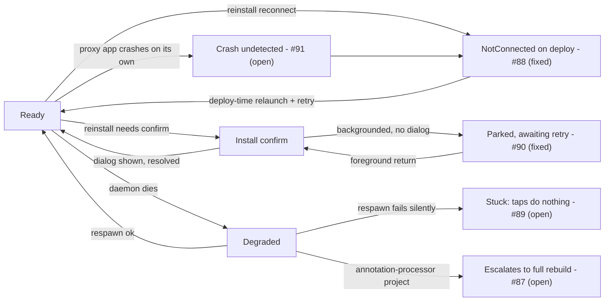

# Decision: Review five user-facing defects found during testing

Device testing (2026-07-25..28) surfaced five user-facing defects, ADFA-4128 tasks #87-#91. #88
and #90 - the two that hit every user on every proxy app rebuild - are fixed on this branch. #89,
#91, #87 are open.

Correctness is not at risk in any of the five - the never-stale invariant holds throughout. What's
at stake is trust: a live reload path that goes slow, dead, or quiet.

**Decision: do #89, #91, #87 block v1?** Proposed: no - all three go to v1.1.

Provenance: `[measured on a56]` = Samsung A56. Untagged prose in the open sections is code reading
against `75483b6eb`; #88/#90 are re-read against this branch's current tree.

## Status and priority

Sorted by priority per Bryan's 2026-07-28 review (#88 "the most important bug", #90 "necessary for
v1" - both fixed; #87 is priority 5, not blocking). Blocks-v1 is TBD on every open row - that's the
call this doc is asking for.

| Task | What breaks | Frequency | Severity | Status | Blocks v1? |
| ---- | ----------- | --------- | -------- | ------ | ---------- |
| #88 | Every deploy after a proxy app rebuild reinstall failed "Proxy app is not connected" until the user relaunched their app | Deterministic on every reinstall | High | **Fixed** - deploy-time launch-and-retry-once (`PayloadDeployer.kt`) | Fixed |
| #90 | A backgrounded reinstall waited 180s in silence, then showed a message wrong about what happened | Every backgrounded reinstall - the normal case | High on the wait | **Fixed** - fail-fast park + truthful message + bounded re-prompt (`ProxyAppInstaller.kt`, `SessionReducer.kt`) | Fixed |
| #89 | A failed daemon respawn strands the session in `Degraded`; tapping Quick Build does nothing | No device repro; probably low `[inferred]` | High when it happens | Open | TBD |
| #91 | The user's own app crash is never surfaced; CoGo misattributes the fallout to deploy infra | `[unmeasured]`; as often as user code crashes | Moderate | Open | TBD |
| #87 | A one-line edit in a Room/KSP project triggers a full ~200s rebuild + reinstall | Only annotation-processor projects; 3/3 when attempted | High | Open | TBD |

## Where these gaps sit in the session lifecycle

## Symptom index - which task a symptom belongs to

| The user sees | Task |
| ------------- | ---- |
| "Proxy app is not connected. Relaunch your app to reconnect, then deploy again." right after a reinstall | #88 - post-fix, reached only when the automatic launch-and-retry itself failed |
| The same "not connected" failure with no reinstall involved - the app crashed on its own | #91 |
| "Your app needs a reinstall - return to CoGo to confirm." | #90 - the fixed fail-fast park (also the timeout message when CoGo was never foregrounded) |
| Red alert toolbar icon; tapping Quick Build does nothing | #89 |
| A one-line body edit runs a full ~200s Gradle rebuild ending in a reinstall dialog (Room/KSP project) | #87 |

## Why #88 and #90 shipped now, and the rest didn't

- #88 and #90 sit on a path every user takes (a proxy app rebuild) and left the product explaining
  itself wrongly or not at all - either would reasonably read as "Quick Build is unreliable."
- #89 has no device reproduction; needs a race to strand the session. #91 is softened by the #88
  fix (next save relaunches the crashed app). #87 needs an annotation processor to fire at all,
  which Quick Build barely supports yet, so it lands where expectations are already low - priority 5.
- #90's shipped fix is fail-fast + a max-attempts guard; a notification-based confirm is the right
  end state but is new OEM-variant surface area - deferred to v1.1.

None of these five is in the README's "Known limitations (v1)" list, which is honest about
deliberate scope. These are cases where behavior fell short of the design's own intent.

## #88 - FIXED: dead reload path after a proxy app rebuild reinstall

- **Symptom:** rebuild succeeded, session said Ready, but every following save failed
  "Proxy app is not connected" until the user manually relaunched their app - deterministic on
  every reinstall.
- **Fix:** on a `NotConnected` deploy, CoGo launches the proxy app once, awaits the rebind, and
  retries exactly once. `PayloadDeployer.deployRecovering` (`PayloadDeployer.kt:200-220`, KDoc has
  the full rationale). Tests: `PayloadDeployerTest.kt:82`, `LiveReloadExecutorImplTest.kt:1210`.
- **Why it happens (unchanged by the fix):** the connection is the proxy app's outbound AIDL
  binding; a reinstall kills the process, and only the proxy app can re-establish it
  (`QuickBuildRuntime.onActivityCreated`, `QuickBuildRuntime.java:225`) - recovery needs a launch,
  not just a retry. Bonus: the same relaunch removes most of #91's symptom (see below).
- **Evidence** `[measured on a56]`: `corpus/results/20260728T113213Z-task32-roomksp-online/DEVICE-FINDINGS.md:58-61`;
  reproduced independently in two other runs.
- **Alternatives:** relaunch right after the rebuild itself (steals foreground unasked); fix the
  message only (leaves the dead end). Chosen: recover at deploy time - covers #91 for free, retry
  bounded to exactly one.

## #90 - FIXED: 180s of silence, then a misleading install-confirm message

- **Symptom:** a reinstall needed while CoGo was backgrounded (the normal middle of the
  loop) waited 180s in silence, then showed "Proxy app install was not confirmed within 180s" -
  wrong, since no dialog was ever shown, and it conflated three different situations.
- **Platform fact:** Android *defers* the install-confirm broadcast until CoGo is next
  foregrounded - it does not drop it (`ProxyAppInstaller.kt` KDoc, `SessionReducer.kt:350-352`)
  `[measured on a56]`.
- **Fix:** a `PENDING_USER_ACTION` with no dialog launchable now parks immediately with a truthful
  message, and returning to CoGo re-prompts automatically, bounded at `MAX_INSTALL_AUTO_RETRIES = 2`.
  `ProxyAppInstaller.kt:75-193`, `SessionReducer.kt:348-418` (KDoc distinguishes the three outcomes:
  `DIALOG_NOT_SHOWN` / `DECLINED` / `TIMED_OUT`). Tests: `SessionReducerTest.kt:387`,
  `QuickBuildSessionManagerTest.kt:1491`.
- **Evidence** `[measured on a56, 2026-07-28]`: park-to-message-shown 186.5s and 193.8s across two
  runs; recovery after foregrounding 7.6s.
- **Not verified on device:** the retried reinstall committed with no confirm dialog on this
  Samsung/Android 16 build, so "foregrounding makes the dialog appear" was never itself observed;
  also unverified: a user actually declining, and the initial-provisioning path's timeout. JVM
  tests cover the fixed logic; on-device re-verification is pending.
- **Alternatives:** a notification-based confirm is the right end state but costs a notification
  channel and a fresh set of OEM behaviors to test - deferred to v1.1.

## #89 - OPEN: a failed daemon respawn strands the session; taps do nothing

- **Symptom:** toolbar icon turns red-alert; tapping Quick Build does nothing at all. Only "Restart
  session," or an edit that forces a full rebuild, recovers it.
- **Root cause:** `respawnDaemon()` has two silent, log-only exits - superseded before/mid-start
  (`QuickBuildSessionManager.kt:910-930`) - that never dispatch `DaemonRespawned`, and
  `reduceDegraded` has no arm for `QuickBuildTapped` (`SessionReducer.kt:374-408`), so the tap falls
  into an empty-effects catch-all. `shrinkDaemonForMemory()` contributes: its guard is on `Building`
  only (`:407`), so in `Degraded` it bumps `daemonEpoch`, which is what makes an in-flight respawn
  discard itself. `Degraded` also carries no explanatory text, and `onWatcherBatch` bypasses the
  reducer entirely, so a save while Degraded can force a rebuild or fail silently against the dead
  daemon.
- **Evidence:** code reading only, no device repro - frequency is `[inferred]`. The swallowed tap
  itself is not race-dependent: any time the session is Degraded, taps do nothing.
- **Options:** give `Degraded` a `QuickBuildTapped` arm re-issuing `RespawnDaemon` (small, needs a
  guard against stacking respawns) - likely fix. Alternatives: explanatory text only; a mutex
  serializing the daemon lifecycle (bigger, addresses the cause); a bounded retry then park.

## #91 - OPEN: an organic proxy-app crash never reaches the crash surface

- **Symptom:** the user's app crashes on its own; CoGo shows nothing and still reports the session
  up to date. The next save hits the same `NotConnected` path as #88 - post-#88-fix this usually
  recovers via relaunch, but a failed retry still blames deploy infrastructure, not the crash, with
  no stack summary.
- **Root cause:** the runtime only reports a crash while a reload is in flight
  (`QuickBuildRuntime.java:306` gates on `pendingReloadGeneration >= 0`, which is -1 between builds),
  so the throwable passes through unreported. The disconnect *is* detected -
  `ProxyAppConnections.onDisconnected()` emits `TargetReport.Disconnected` - but the session
  manager's collector only tests for `Crashed` and drops everything else
  (`QuickBuildSessionManager.kt:235`). Even when `ProxyAppCrashed` does fire, nothing surfaces the
  summary - today's entire user-visible consequence of a crash is an icon color change.
- **Evidence:** code reading; no run deliberately crashed a proxy app between builds - `[unmeasured]`.
- **Options:** route `Disconnected` to the session as `TargetDisconnected` (small, fixes the lie,
  no stack recovered); report crashes unconditionally with a sentinel generation (gets the real
  summary, but the reducer must not treat an organic crash as a reload failure); partly folded into
  #88's fix already (relaunch-and-retry recovers the session, doesn't explain what happened).

## #87 - OPEN: a body-only edit escalates to a full proxy app rebuild

- **Symptom:** a one-line method-body edit in a Room/KSP (or any annotation-processor) project
  triggers a full Gradle rebuild + reinstall dialog - 198s in the captured run
  `[measured on a56, 2026-07-28]` instead of a ~2s reload. Invisible trigger: the compile daemon
  died between builds, usually because the OS reclaimed memory while the user looked at their app.
- **Root cause:** daemon death parks the session in `Degraded` and schedules a respawn. On respawn,
  `LiveReloadOrchestrator.kt:147` re-primes the pending set with `ChangedFiles.Unknown`, an absorbing
  element (`ChangedFiles.kt:66-68`) that destroys the known file set, and `ChangeClassifier.kt:47`
  then escalates unconditionally on `annotationImpact.active` ("project has any processor," not
  "this edit touched processor input") before reaching the per-file check. Unnecessary: the known
  changed-file set, the annotation baseline, and on-disk sources are all still intact at that point.
- **Evidence** `[measured on a56, 2026-07-28]`: `corpus/results/20260728T113213Z-task32-roomksp-online/DEVICE-FINDINGS.md:46-57`,
  3/3 reproductions.
- **Options:** reclassify from the preserved set instead of falling back to `Unknown` (correct fix -
  must distinguish "lost the daemon" from "lost track of files," since a genuinely unenumerable
  change still needs to escalate) - likely fix. Alternatives: a distinct `DaemonRestarted` sentinel
  forcing compile-only, no rebuild; keep the daemon alive more often (partly landed, frequency only);
  document it (not defensible - not rare).
