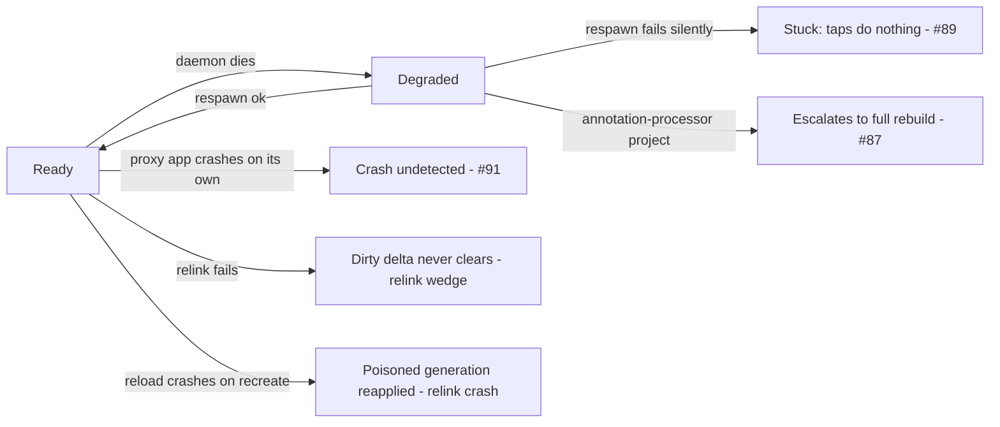

# Decision: do the open Quick Build recovery gaps block v1?

Device testing (2026-07-25..28) surfaced five user-facing defects. Two are fixed on this branch;
three are open, alongside two open relink recovery gaps.

Correctness is not at risk in any of them - the never-stale invariant holds throughout. What's at
stake is trust: a live reload path that goes slow, dead, or quiet.

**Decision: do #87, #89, #91 and the two relink gaps block v1?** Proposed: no - all go to v1.1.

| Gap | What the user sees | Frequency | Blocks v1? |
| --- | --- | --- | --- |
| #89 | Red-alert icon; tapping Quick Build does nothing until "Restart session" | No device repro `[inferred]` | TBD |
| #91 | Their own app crash is never surfaced; CoGo blames deploy infra | `[unmeasured]` | TBD |
| #87 | A one-line edit in a Room/KSP project runs a full ~200s rebuild + reinstall | 3/3 when attempted | TBD |
| Relink crash | A reload that crashes the app repeats the crash at every process boot | Trigger fixed; net still absent | TBD |
| Relink wedge | A failed relink re-fails on every later save until a gradle-file touch | `[unmeasured]` | TBD |

Provenance: `[measured on a56]` = Samsung A56. Untagged prose is code reading against `75483b6eb`.

## Where they sit in the session lifecycle

## #89 - a failed daemon respawn strands the session; taps do nothing

- **Root cause:** `respawnDaemon()` has two silent, log-only exits - superseded before/mid-start
  (`QuickBuildSessionManager.kt:910-930`) - that never dispatch `DaemonRespawned`, and
  `reduceDegraded` has no arm for `QuickBuildTapped` (`SessionReducer.kt:374-408`), so the tap falls
  into an empty-effects catch-all. `shrinkDaemonForMemory()` contributes: its guard is on `Building`
  only, so in `Degraded` it bumps `daemonEpoch`, which is what makes an in-flight respawn discard
  itself.
- **Evidence:** code reading only, no device repro. The swallowed tap is not race-dependent: any
  time the session is Degraded, taps do nothing.
- **Likely fix:** give `Degraded` a `QuickBuildTapped` arm re-issuing `RespawnDaemon`, guarded
  against stacking respawns. Alternatives: explanatory text only; a mutex serializing the daemon
  lifecycle (bigger, addresses the cause).

## #91 - an organic proxy-app crash never reaches the crash surface

- **Root cause:** the runtime only reports a crash while a reload is in flight
  (`QuickBuildRuntime.java:306` gates on `pendingReloadGeneration >= 0`, which is -1 between
  builds). The disconnect *is* detected - `ProxyAppConnections.onDisconnected()` emits
  `TargetReport.Disconnected` - but the session manager's collector only tests for `Crashed`
  (`QuickBuildSessionManager.kt:235`). Today's entire user-visible consequence of a crash is an
  icon color change.
- **Evidence:** code reading; no run deliberately crashed a proxy app between builds `[unmeasured]`.
- **Likely fix:** route `Disconnected` to the session as `TargetDisconnected` - small, fixes the
  lie, recovers no stack. Reporting crashes unconditionally with a sentinel generation gets the
  real summary but the reducer must not treat an organic crash as a reload failure.

## #87 - a body-only edit escalates to a full proxy app rebuild

- **Symptom:** a one-line method-body edit in a Room/KSP project triggers a full Gradle rebuild +
  reinstall dialog - 198s in the captured run `[measured on a56, 2026-07-28]` instead of a ~2s
  reload. Invisible trigger: the compile daemon died between builds, usually because the OS
  reclaimed memory while the user looked at their app.
- **Root cause:** on respawn, `LiveReloadOrchestrator.kt:147` re-primes the pending set with
  `ChangedFiles.Unknown`, an absorbing element that destroys the known file set, and
  `ChangeClassifier.kt:47` then escalates unconditionally on `annotationImpact.active` ("project
  has any processor", not "this edit touched processor input"). Unnecessary: the changed-file set,
  the annotation baseline and on-disk sources are all still intact at that point.
- **Evidence** `[measured on a56, 2026-07-28]`: 3/3 reproductions,
  `corpus/results/20260728T113213Z-task32-roomksp-online/DEVICE-FINDINGS.md:46-57`.
- **Likely fix:** reclassify from the preserved set instead of falling back to `Unknown` - must
  still distinguish "lost the daemon" from "lost track of files", since a genuinely unenumerable
  change has to escalate.

## Relink crash - a crashing reload has no self-healing

- **Symptom:** a reload crashes the proxy app on `recreate()`, and every later process boot
  re-reads the same payload and repeats it until the session is reset.
- **Root cause:** `handlePayload` (`QuickBuildRuntime.java`) persists the payload before applying
  it, and the crash lands on a later main-thread frame - caught only by the process's
  uncaught-exception handler, so `failReload`'s rollback never runs.
- **Status:** the known trigger (resource-id drift on relink) is closed by `aapt2 link
  --stable-ids`, device-verified 2026-07-28 `[measured on a56]`. What's missing is the
  trigger-independent net: treat a crash during a pending reload as reason to distrust the
  just-applied generation and fall back to the last known-good one.

## Relink wedge - a failed relink never clears its dirty delta

- **Symptom:** once a relink fails, the failing resource rides along in every later build.
- **Root cause:** the orchestrator's never-lose-an-edit invariant
  (`domain/LiveReloadOrchestrator.kt`) re-queues a failed build's whole batch, and there is no
  per-file eviction or auto-retry.
- **Unwedge today:** touch a gradle file. That classifies `GRADLE_CONFIG_CHANGED` and forces a full
  Gradle build, which resets the baseline and absorbs the dirty delta; `PayloadStore` then drops
  any persisted store whose fingerprint no longer matches the new baseline dex.
- **Likely fix:** an automatic proxy app rebuild on repeated identical relink failure.

## Fixed on this branch

- **#88** - every deploy after a proxy app rebuild reinstall failed "Proxy app is not connected"
  until the user relaunched their app. Fixed by a deploy-time launch-and-retry-once
  (`PayloadDeployer.deployRecovering`); its KDoc carries the rationale. Also removes most of #91's
  symptom.
- **#90** - a backgrounded reinstall waited 180s in silence, then showed a message wrong about what
  happened. Fixed by a fail-fast park with a truthful message and a bounded re-prompt
  (`ProxyAppInstaller.kt`, `SessionReducer.kt`). Not verified on device: the dialog reappearing on
  foregrounding, a user actually declining, and the initial-provisioning timeout.
