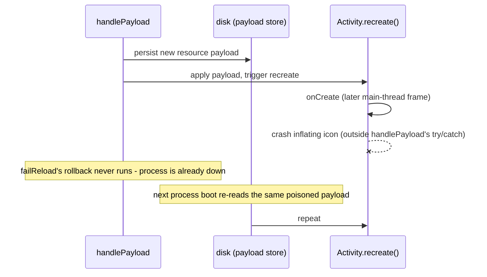
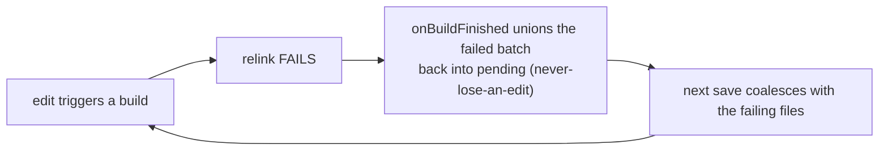

# Relink resource-table poisoning - forensic notes (ADFA-4128)

Mechanism behind two README "Known limitations" entries: *"a crashing reload has no
self-healing"* and *"a failed relink wedges the session"*. README carries the
user-facing summary; this doc carries the mechanism, the fix, and how to unwedge a
live session. Both poisoning triggers below are FIXED (2026-07-24); the
crash-recovery safety net is the part still open.

## Symptom

`[measured on a56]` (2026-07-23 bug5-verify run, cited below): a resource reload that
aapt2 reports as SUCCESSFUL still crashes the proxy app on the next `recreate()` -
sometimes on a pure code edit that touched no resource at all - with
`ClassNotFoundException: android.view.adaptive-icon` while inflating the launcher
icon. The framework is inflating whatever XML a wrongly-resolved resource id points
at, and reading its `<adaptive-icon>` root tag as a view class name. Once it happens,
every reload repeats the crash until the session is reset.

## Two independent triggers, same symptom

1. **Original (fixed):** the old arsc-only relink dropped every file-backed resource.
   Fixed by shipping the full relinked resource apk, not a bare extracted table. See
   README "Proxy-app architecture".
2. **Second trigger, fixed via `--stable-ids` (device-verified 2026-07-23,**
   `corpus/results/20260723T111950Z-bug5-verify/` **in `CodeOnTheGo-build-benchmark`;
   that run predates the fix build):** quick-build's relink only feeds aapt2 the
   project's own `src/main/res`, never the build-generated/injected resources the
   real Gradle build merges in (e.g. CoGo's LogSenderPlugin's
   `bool/logsender_enabled`). Dropping a whole resource type shifts aapt2's
   type-index for every type ordered after it, so the baseline manifest's fixed
   `android:icon` id resolves to the wrong type against the relinked table.

## How the wedge forms (crash-recovery gap)

`handlePayload` (`quickbuild-runtime/.../QuickBuildRuntime.java`) persists the payload
before applying it. The crash lands on a later main-thread frame than `handlePayload`
itself, caught only by the process's uncaught-exception handler - so the rollback in
`failReload` (same file) never runs, and the poisoned table is reapplied at every
process boot until something resets the session.

## Fix (built 2026-07-24)

- **Trigger-specific (built):** `aapt2 link --stable-ids`, fed from AGP's own
  `stable_resource_ids_file`, pins relink ids to the baseline's - closing this whole
  trigger class. Wired end-to-end: gradle-plugin reports the file
  (`QuickBuildJson`), `QuickBuildProjectLayout.stableIdsFile()` carries it,
  `DaemonProtocol`'s `RelinkRequest.stableIds` transports it, `Aapt2Link` emits the
  flag. Library resources are overlaid separately via
  `RelinkRequest.libraryResources`.
- **Post-fix verification:** the trigger run above predates the fix build. The
  fixed path has since run green on-device: the 2026-07-28 consolidated verify
  (`quick-build/corpus/results/20260728T064805Z-consolidated-verify/`) drove
  `ResourcesOnly` relinks end-to-end on two templates - relink, deploy, recreate,
  correct render, no icon crash `[measured on a56]`. The injected-resource trigger
  itself has not been replayed post-fix; that `--stable-ids` closes it is
  `[inferred]` from the mechanism above.
- **Still open:** a trigger-independent safety net - treat any crash during a
  pending reload as reason to distrust the just-applied generation and fall back to
  the last known-good one. Not built; this is the README's remaining
  "no self-healing" gap.

## The other wedge: a failed relink never clears its dirty delta

A different failure mode, no poisoning involved: when aapt2 reports the relink as
FAILED, the session wedges on that failing resource delta.

Root cause is the orchestrator's never-lose-an-edit invariant
(`quick-build/.../domain/LiveReloadOrchestrator.kt`): a build failure re-queues its
whole batch instead of dropping it, and there is no per-file eviction or auto-retry
- so the failing resource rides along in every later build until something forces a
proxy app rebuild.

**Unwedge today:** touch a gradle file. That classifies `GRADLE_CONFIG_CHANGED` and
forces a full Gradle build, which resets the baseline and absorbs the dirty delta;
the runtime's `PayloadStore` then drops any persisted store whose fingerprint no
longer matches the new baseline dex - clearing the poisoned table. Tracked followup
in the README: an automatic proxy app rebuild on repeated identical relink failure.
