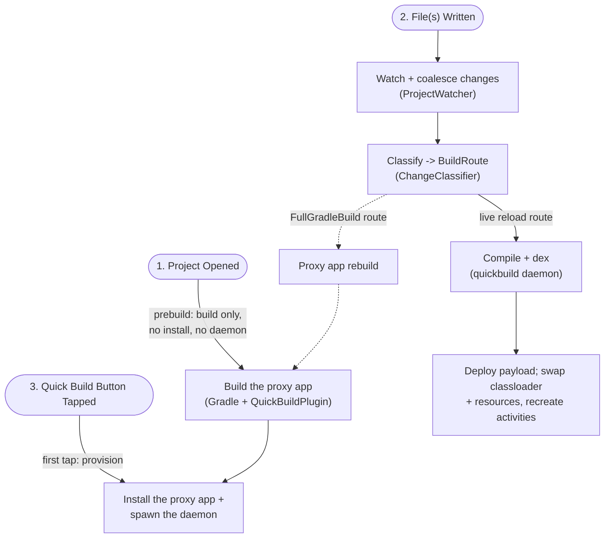

# Quick Build (ADFA-4128)

Quick Build makes the on-device edit loop much faster. Tap the lightning-bolt button once and **CoGo** (Code On The Go, this IDE) installs a generated **proxy app** - a live-reloading build of the user's project. From then on every save reaches the running app in seconds, with no Gradle build and no reinstall. The whole loop runs on device - edit, watch, compile, dex, deploy, reload - with no desktop component.

From early benchmarks, this is what we've seen for supported edits (code, assets, resource, but not manifest or build config):

- 8 GB higher-spec device (A56): a change typically live reloads in 1-3.5 s, a median 3.45x faster than an incremental Gradle build across the whole corpus (78 warm edits, 23 apps) `[measured on a56]`
- 3.6 GB lower-spec device (C107): slower in absolute terms, but it gains *more* from Quick Build than the A56 does - across the 19 edits measured on both devices its speedup was higher on all 19, saving a median 17.5 s per edit against 3.1 s on the A56 `[measured on c107]`

## Goals

1. **Live-reload should be fast enough that the user stays in flow. **Under 1s is ideal, but we're not there yet on most devices.
2. **The proxy app behaves like the real app, and is never stale.** Same `applicationId`, permissions, components and resources; and every edit either live-reloads or visibly falls back to a real Gradle build.
3. **Avoid modifying the user's code**We use a Gradle plugin to create the proxy app that works as a wrapper, and try not to modify any of the user's app otherwise.
4. **Good enough, but no need to be 100% compatible**Where the proxy app cannot match the real app, make that clear to the user - see [the boundary](#edit-types-that-can-live-reload) and [Known limitations](#known-limitations-v1).  We're not trying to be 100% compatible with a Gradle build -- just enough to be useful.
5. **We accept some tradeoffs to make live reload fast, but try to minimize tradeoffs**
  1. A reasonable amount of extra time at project open is OK! ( ~24s on A56)
  2. We need some memory to keep Quick Build's compile daemon resident and available
6. **Runs offline, on device. **Same standard as Code on the Go

## Overview

### Terms

| Term                  | Meaning                                                      |
| --------------------- | ------------------------------------------------------------ |
| **Proxy app**         | The installable app Quick Build generates and runs in place of a Standard-Run install: the runtime AAR plus the user's libraries and resources under the project's real `applicationId`, with generated **proxy components** (`Proxy0Activity`, ...) standing in for the user's. "Proxy" alone always means those components, never the app. |
| **Proxy app build**   | The real Gradle build, run once per baseline, that produces the proxy app |
| **Baseline**          | what a live reload is relative to: the gen-0 dex baked into the installed proxy app, its fingerprint, and the orchestrator's matching state |
| **Live reload**       | the quick path after the classifier: compile in the daemon, deploy a payload, the running proxy app updates. One cycle is one reload. |
| **Payload**           | the compiled user code (plus, for a resource edit, the relinked resource table) sent to the running proxy app for one reload, without a reinstall |
| **Generation**        | a monotonic counter naming each payload; the proxy app runs one generation |
| **Proxy app rebuild** | falling back to a fresh proxy app build when live-reload state cannot be trusted. Refreshes the baseline, discards persisted payloads, and tears the daemon down for its duration (freeing its RAM for the Gradle peak). |
| **Warm compile**      | a background build (`BuildRoute.WarmCompile`, never produced by the classifier) that warms the daemon's incremental caches and deploys nothing. Lowest priority. |

### Edit Types that can Live Reload

Quick Build is a bounded live reload path beside authoritative Gradle - correct on the edit classes it covers, not universally. Gradle stays the build engine ([ADR 0002](../docs/adr/0002-on-device-builds-via-gradle-tooling-api.md)).

**On the live reload path** (incremental Kotlin compile, `javac`, `aapt2` R regeneration, `d8` relink, deploy over the bound service): app-module source edits, resource-value edits, asset changes. 

**Routed to a proxy app rebuild:** manifest changes; native `.so` changes; annotation-processor input - a `@Dao` or `@Module` edit takes a real build, while a Composable or ViewModel in the same app stays on the live reload path ([`AnnotationImpact.kt`](core/src/main/java/org/appdevforall/cotg/quickbuild/domain/annotations/AnnotationImpact.kt), [`docs/ksp-kapt-feasibility.md`](docs/ksp-kapt-feasibility.md)); dependency and Gradle-file changes; edits in any Gradle module other than the app module.

Over time, we can decide if we want to work on expanding the types of edits that we can live reload -- but some of these edits will be hard to handle.

The current authoritative list of supported edit types is in the classifier's `BuildRoute` / `InvalidationReason` enumeration.

### Quick Build Workflow

Using the terms above, this shows the three ways a user can trigger the Quick Build module:

1. Pre-build proxy app during project initialization
2. Writing files (save, git pull, termux script, tapping quick build button) triggers a live reload
3. Clicking the Quick Build button (lightning icon) triggers flushing editor buffers and a live reload, and switching to the proxy app

### Error Handling

A compile error takes neither branch: no payload is produced, the proxy app keeps running the last good generation, and `onBuildStatus` drives its error overlay. Hand-back is bidirectional - an invalidated session falls back to a real Gradle build, and any completed Standard Run build refreshes a live session's baseline.

### Map of the code

`:quickbuild:core` is pure-JVM and Android-free by design: every Android capability is a port it declares and `:app` implements, wired in one Koin module ([`di/QuickBuildModule.kt`](../app/src/main/java/com/itsaky/androidide/di/QuickBuildModule.kt)).

| Module / package                                             | Responsibility                                               | Entry point                                                  |
| ------------------------------------------------------------ | ------------------------------------------------------------ | ------------------------------------------------------------ |
| [`:quickbuild:core` `domain/`](core/src/main/java/org/appdevforall/cotg/quickbuild/domain/) | pure logic: routing, session state, generations, deploy policy | [`LiveReloadOrchestrator`](core/src/main/java/org/appdevforall/cotg/quickbuild/domain/LiveReloadOrchestrator.kt), [`ChangeClassifier`](core/src/main/java/org/appdevforall/cotg/quickbuild/domain/ChangeClassifier.kt), [`SessionReducer`](core/src/main/java/org/appdevforall/cotg/quickbuild/domain/SessionReducer.kt), [`DeployPolicy`](core/src/main/java/org/appdevforall/cotg/quickbuild/domain/DeployPolicy.kt) |
| [`:quickbuild:core` `service/`](core/src/main/java/org/appdevforall/cotg/quickbuild/service/) | session lifecycle, provisioning, install, deploy over AIDL   | [`QuickBuildSessionManager`](core/src/main/java/org/appdevforall/cotg/quickbuild/service/QuickBuildSessionManager.kt), [`QuickBuildDaemonController`](core/src/main/java/org/appdevforall/cotg/quickbuild/service/QuickBuildDaemonController.kt), [`LiveReloadExecutorImpl`](core/src/main/java/org/appdevforall/cotg/quickbuild/service/LiveReloadExecutorImpl.kt) |
| [`:quickbuild:core` `data/`](core/src/main/java/org/appdevforall/cotg/quickbuild/data/) | ports for device I/O: watcher, paths, daemon process         | `ProjectWatcher`, `QuickBuildPaths`, `DaemonProcessClient`   |
| [`:gradle-plugin`](../gradle-plugin/src/main/java/com/itsaky/androidide/gradle/QuickBuildPlugin.kt) | the proxy app build: manifest transform, proxy sources, gen-0 dex, `setup.json` | [`QuickBuildPlugin`](../gradle-plugin/src/main/java/com/itsaky/androidide/gradle/QuickBuildPlugin.kt), [`ProxySourceGenerator`](../gradle-plugin/src/main/java/com/itsaky/androidide/gradle/quickbuild/ProxySourceGenerator.kt) |
| [`:quickbuild:runtime`](runtime/src/main/java/com/itsaky/androidide/quickbuild/runtime/) | Java-only AAR inside the proxy app: binds to CoGo, receives payload fds, reloads | [`QuickBuildAppComponentFactory`](runtime/src/main/java/com/itsaky/androidide/quickbuild/runtime/QuickBuildAppComponentFactory.java), [`QuickBuildClassLoaders`](runtime/src/main/java/com/itsaky/androidide/quickbuild/runtime/QuickBuildClassLoaders.java), [`ResourceSwapStrategy`](runtime/src/main/java/com/itsaky/androidide/quickbuild/runtime/ResourceSwapStrategy.java) |
| [`:quickbuild:daemon`](daemon/src/main/kotlin/org/appdevforall/cotg/quickbuild/daemon/) | JVM child process on the bundled JDK: incremental Kotlin compile via the Kotlin Build Tools API, javac, d8, aapt2 | `DaemonService`                                              |
| [`:quickbuild:protocol`](protocol/src/main/kotlin/org/appdevforall/cotg/quickbuild/daemon/protocol/DaemonProtocol.kt) | the request/response types **both** sides share, so client and daemon cannot drift | `DaemonProtocol.kt`                                          |
| `:app` layer                                                 | the toolbar button, the Koin graph binding every port to Android, and the Firebase + bench metrics sinks | [`QuickBuildAction`](../app/src/main/java/com/itsaky/androidide/actions/build/QuickBuildAction.kt), [`QuickBuildModule`](../app/src/main/java/com/itsaky/androidide/di/QuickBuildModule.kt), [`QuickBuildMetricsSink`](core/src/main/java/org/appdevforall/cotg/quickbuild/domain/QuickBuildMetricsSink.kt) (port) |

### Code on the Go + Proxy App Live Reload Method

The proxy app APK contains the runtime AAR, the user's library dependencies and resources - but **no user classes**. User classes and generated proxies travel only in the payload dex.

- The proxy app build bakes the baseline payload into the APK as `assets/quickbuild/gen-0.dex`. The runtime declares an `android:appComponentFactory` that instantiates components through the current generation's `InMemoryDexClassLoader`, whose parent is the base APK's "shell" loader (libraries but no user classes), so parent-first delegation cannot serve a stale copy.
- Every `Activity` proxy also overrides `getClassLoader()`. `Context#getClassLoader()` is otherwise pinned to the base APK's loader, so by-name resolution - `LayoutInflater` custom views, `FragmentFactory`, Navigation destinations - would never see a payload-only class.
- A reload swaps the payload classloader plus the resource table and recreates the activity stack. The resource payload is the full relinked resource apk, not a bare `resources.arsc`; a bare table cannot back a file-typed resource such as an adaptive-icon mipmap XML.
- Services, providers and a custom `Application` swap by **process restart**, never hot-swap of a live instance. Every accepted deploy is also persisted app-privately so a relaunched process boots the newest generation instead of gen-0. Scope: debug builds and D8 only, API 28+. API 30+ gets the full-fidelity `ResourcesLoader` resource swap; 28/29 take a degraded `addAssetPath` shim that is unit-tested but not device-verified.

### Session model

States: `Idle` -> `Prebuilding` (proxy app build at project open, no install, no daemon) -> `Provisioning` (build + install + daemon spawn) -> `Ready` <-> `Building` -> `Deployed`, plus two recovery states - `Invalidated` (needs a proxy app rebuild) and `Degraded` (daemon died; respawn plus a background warm compile). A pure reducer decides transitions ([`SessionReducer.kt`](core/src/main/java/org/appdevforall/cotg/quickbuild/domain/SessionReducer.kt)); [`QuickBuildSessionManager`](core/src/main/java/org/appdevforall/cotg/quickbuild/service/QuickBuildSessionManager.kt) executes their effects. The rest - what each recovery state carries, the eight `InvalidationReason` values, the install-retry budget - is in [docs/pipeline.md](docs/pipeline.md).

- **A compile error is not a state change.** The session stays `Ready` at the old generation with `lastFailure` set - that is how never-stale appears in the state machine. The one state that does not recover on its own is a failed relink (see Known limitations).
- **The warm compile is what makes the first save fast.** It runs after `Ready` is first reached and after every proxy app rebuild, and is worth 6.1x on that first save - see [docs/perf-roadmap.md](docs/perf-roadmap.md). Tap-to-`Ready` is unchanged, because it starts after `Ready`.

## Other Key Decisions

Quick Build inherits CoGo's constraints rather than choosing them: the whole loop runs on the device, offline. That is why daemon memory and low-spec fit are first-order product concerns here. What follows is what Quick Build chose *given* those constraints, and what each choice costs.

| Decision, why, and what it costs                             | Alternative considered                                       |
| ------------------------------------------------------------ | ------------------------------------------------------------ |
| **Payloads travel over a uid-checked binder channel, never the network** - AIDL plus `ParcelFileDescriptor`s, no sockets and no world-readable files, so no other app on the device can reach a payload or impersonate CoGo. Cost: the proxy app has to bind back to CoGo before anything can be delivered, so a rebuild must re-establish that connection. | -                                                            |
| **Everything is gated behind the experiments flag** (`FeatureFlags.isExperimentsEnabled`) - no flag, no behavior change. The bar for lifting the gate is tracked in ADFA-4128. | -                                                            |
| **Builds trigger on file write**This handles more write types in a unified manner.  And gives us a chance to start incrementally compiling as soon as a write happens (e.g. in case user saves or autosave happens) instead of accumulating changes until Quick Build button press. | Event triggers on editor (incomplete)On tap-only             |
| **The proxy app build is a Gradle plugin inside the project's own build** - only the project's own AGP build computes the merged manifest, resource ids and dependency classpath correctly. Cost: session start pays one real Gradle build. | post-processing the built APK (binary-XML surgery, re-signing, nowhere to generate proxy sources); a minimal build reimplemented in CoGo (drifts from AGP semantics) |
| **One install slot, under the project's real ****`applicationId`**, so `${applicationId}` authorities pass verbatim and package-bound services (Firebase, FCM, app links) reach the proxy app. Cost: Quick Build and Standard Run share one slot, so the UI confirms before clobbering - read statelessly from the installed package's `android:appComponentFactory` ([`RealIdInstall.kt`](core/src/main/java/org/appdevforall/cotg/quickbuild/domain/RealIdInstall.kt)); a foreign-signature occupant is refused outright. | a `.quickbuild`-suffixed id, letting both coexist but breaking placeholder authorities and every package-bound integration. That two-mode design was removed on 2026-07-24. |
| **Compilation lives in a separate warm daemon process**, stateless, with all routing policy in CoGo. Isolates the compiler's crash domain and memory (537 MB RSS over a 28-minute soak on a mid-spec phone, `phase1-gates-a56` - the main low-spec risk) and keeps it warm, the biggest latency lever. | compiling in-process: no spawn cost, but a compiler OOM takes the IDE with it and its heap lives in CoGo's budget forever |
| **Reloads are a classloader swap plus component restart, not in-place code patching**, using only public API. Cost: restart granularity, which never-stale prefers anyway. | reinstalling per edit (install latency and a confirm dialog per save); ART hot-swap as in Apply Changes (needs an attached debugger, method bodies only); Tinker-style dex patching (reflection into ART internals) |
| **Build scratch lives in CoGo's private storage (****`noBackupFilesDir`****), not the project tree** - the project sits on FUSE-backed shared storage, and moving the daemon's work and out trees to the app-private f2fs partition cut warm edits by ~36% subset-median `[measured on a56]`. Cost: not user-browsable, so the tree carries a 100 MB guard, teardown deletion and a stale sweep. The generation counter deliberately stays in the project tree so it survives scratch cleanup. | -                                                            |
| **Session state is a pure reducer; one thread executes effects** - the most invariant-dense code here, and this shape makes all of it JVM-testable. Cost: anything blocking that thread stalls the session. | conventional locking around mutable session objects: an untestable set of interleavings |
| **The proxy app rebuild is the only fallback, and it works both ways** - any untrusted state ends in a rebuild, and any completed Standard Run build refreshes a live baseline. | per-failure-mode recovery paths: more states to get wrong, and not checkable as a whole |
| **Run statistics exist to prioritize, not to impress** - change mix, route, duration and outcome under a `(qb_session_id, qb_build_id)` join key, replacing assumed edit-type frequencies with measured ones. A commit survey put the live-reload share of real-world commits below the corpus headline, one more reason to measure before optimizing. | -                                                            |
| **The corpus lives in the benchmark repo and third-party source is never checked in anywhere** - synthetic apps ship with oracles and results there; real apps are pinned by `vendor.json` and fetched into a gitignored cache. | -                                                            |

## Working on Quick Build

### How to Test

In addition to the usual unit tests and Kaspresso tests that cover flows in Code on the Go, some updates require end to end testing between Code on the Go and the proxy app.

For any changes that might affect the integration between apps, 

- 

- **Compile-pipeline changes run the host corpus matrix** (`corpus/README.md` in the benchmark repo) and commit the results dir. **Correctness is the two oracles** - recompiled-class bounds and output equivalence - **not timings.**
- **A new edit class or route needs all three:** a classifier test, a corpus edit declaring `expected.route`, and, if it deploys, an on-device walk checking the overlay and fallback behavior, not just the happy path. **Latency claims cite a results dir** under `corpus/results/`, or say "not yet measured".
- Tests mirror classes roughly 1:1 - 37 files in `:quickbuild:core`, 13 in `:quickbuild:daemon`, 17 in `:quickbuild:runtime`, 11 in `:gradle-plugin`. A reviewer will look for a new class's test file by name. Start from [`ChangeClassifierTest.kt`](core/src/test/java/org/appdevforall/cotg/quickbuild/domain/ChangeClassifierTest.kt) for routes and [`SessionReducerTest.kt`](core/src/test/java/org/appdevforall/cotg/quickbuild/domain/SessionReducerTest.kt) for state. **The root build sets ****`ignoreFailures = true`**** on test tasks**, so read the XML/HTML under `<module>/build/test-results/` and never trust `BUILD SUCCESSFUL`.
- Known test gap: nothing runs the real daemon jar against the real client ([`DaemonProcessClientTest`](core/src/test/java/org/appdevforall/cotg/quickbuild/data/DaemonProcessClientTest.kt) drives a scripted fake), so a protocol regression that compiles only surfaces on device.

### Invariants that fail silently

All five break without any test going red. A change touching them needs a device walk.

1. **Never-stale.** Every edit either live-reloads or *visibly* falls back to Gradle. When in doubt escalate to `FullGradleBuild`: over-building is slow, under-building is wrong.
2. **Generation monotonicity.** The counter only increases and is persisted outside the scratch tree (`<project>/.androidide/quickbuild/generation`) so it survives teardown. Never reset it for a test - the runtime uses it to reject a payload older than what is running.
3. **Single-threaded effect execution.** All session effects run on one `QuickBuildSession` thread. Injecting `Dispatchers.IO` "to speed it up" breaks ordering with no crash and no failing test.
4. **Epoch-guard every async result.** Any new suspending path must re-check its captured session and daemon epoch before applying its result, or a stale rebuild clobbers a fresh session.
5. **Frozen wire names; bump ****`setup.json`****'s schema deliberately.** Renaming a Firebase event, a bench field or a flag file invalidates the benchmark history. `setup.json` is a contract with an installed app that can be older than the plugin, so a breaking shape change needs its schema version bumped or CoGo misreads the file instead of invalidating.

### Deliberate things that look wrong

Each is something a reader would plausibly "fix" and break the feature by fixing.

| Looks wrong                                                  | Why it is that way                                           |
| ------------------------------------------------------------ | ------------------------------------------------------------ |
| The daemon strips `final` off classes before dexing ([`FinalStripper`](daemon/src/main/kotlin/org/appdevforall/cotg/quickbuild/daemon/dex/FinalStripper.kt)) | Not an optimization: a `final` user class cannot be extended by its generated proxy. |
| The daemon's work and out trees live in app-private storage, not beside the project | Shared storage is FUSE-backed, and keeping the out dir off FUSE is where a large part of the warm-edit gain comes from ([`docs/perf-roadmap.md`](docs/perf-roadmap.md)). Moving them "next to the project" for tidiness gives that back. |
| Activity proxies override `getClassLoader()`                 | See the classloading contract. Both template crashes seen during development (Bottom Navigation and Navigation Drawer, `Fragment$InstantiationException` on first launch, the default `FragmentFactory` resolving against the shell loader) were violations of this one rule. |
| The runtime is Java-only, with no androidx and no CoGo dependencies | It is compiled into the user's app, so a convenience dependency here ships in someone else's APK. |

### Running it on a device

A CoGo debug build from this branch (`:app:assembleV8Debug` for arm64; Quick Build has not shipped in any release), plus flag files in the device's `Download/` folder, then restart CoGo. `CodeOnTheGo.exp` gates the feature - without it the lightning-bolt button does not appear ([`FeatureFlags.kt`](../common/src/main/java/com/itsaky/androidide/utils/FeatureFlags.kt)). `:app` needs the gitignored, team-provided `app/google-services.json`, so external contributors currently cannot build it - an onboarding gap tracked outside this module.

- `CodeOnTheGo.qbbench` (always paired with `.exp`) exposes the flag-gated automation interface the benchmark uses: an exported activity that opens a project and fires the first tap, and a `bench-events.jsonl` event log. Its `reload_timeline` spans partition the save-to-reload loop and must add up: `unaccountedMs` near zero is healthy - the sora-editor investigation's 13 device rows reconciled within 5 ms - and its known healthy contributors are changed-asset packaging and payload bookkeeping before the deploy hand-off. A build that measured no spans reports no residual rather than blaming the whole build.
- `CodeOnTheGo.qbnoseed` (inert without `.qbbench`) suppresses the post-provisioning warm compile so an A/B can run against the same installed build - flip the flag file and restart CoGo instead of rebuilding. Shipping builds always run the warm compile.

### There is no single logcat tag

The host side logs through slf4j, and CoGo's binding truncates the simple class name to 23 characters with a `..` prefix. So `adb logcat -s QuickBuildSessionManager` matches **nothing**, and there is no umbrella "QuickBuild" tag. The six long names:

| Class                            | Actual tag                |
| -------------------------------- | ------------------------- |
| `QuickBuildSessionManager`       | `..ckBuildSessionManager` |
| `QuickBuildDaemonController`     | `..BuildDaemonController` |
| `GradleQuickBuildProvisioner`    | `..QuickBuildProvisioner` |
| `CompositeQuickBuildMetricsSink` | `..QuickBuildMetricsSink` |
| `QuickBuildArtifactStager`       | `..ckBuildArtifactStager` |
| `AnnotationImpactAnalyzer`       | `..otationImpactAnalyzer` |

Everything at or under 23 characters keeps its own name (`LiveReloadOrchestrator`, `PayloadDeployer`, `DeployChannel`, ...). There are three logging worlds in three processes: **CoGo**, with the tags above, where the end-to-end timeline is emitted as a plain log line under `LiveReloadExecutorImpl` - often the fastest way to see where a save went; **the proxy app**, with one deliberate tag, `QuickBuildRuntime`, for the whole runtime; and **the daemon**, which has no logging framework and no log file - it writes to stderr, which `DaemonProcessClient` drains and re-logs as `daemon(stderr): ...` (warn), with non-JSON stdout as `daemon: ...` (debug), so if CoGo dies that output is gone. Two on-device locations are easy to get wrong: the scratch tree (`no_backup/quickbuild-scratch/<project>-<hash>/{work,out}`) is **deleted on teardown**, so inspect it while the session is live; and the persisted payload belongs to the **user's** app (`/data/data/<user applicationId>/files/quickbuild/payload/`), so the `run-as` target differs.

### What to rebuild after a change

Everything ships as an APK asset - **there is no push-a-jar shortcut for any component.** `./gradlew :app:assembleV8Debug` plus reinstalling CoGo rebuilds all of them. Then:

| You edited                                 | Also needed                                                  |
| ------------------------------------------ | ------------------------------------------------------------ |
| `:quickbuild:core`, `:quickbuild:protocol` | nothing - it is CoGo code, and both protocol sides move together |
| `:quickbuild:daemon`                       | restart the session; the stager re-extracts the daemon dir every provision |
| `:quickbuild:runtime`                      | **restart the Quick Build session for the project** - the AAR is compiled *into* the proxy app, so reinstalling CoGo alone changes nothing in the running app |
| `:gradle-plugin`                           | restart CoGo, which re-copies `cogo-plugin.jar` on app start |
| daemon-only iteration                      | `:quickbuild:daemon:stageDaemon` produces a runnable `build/daemon/` layout - what the harness points `--daemon-jar` at |

## Known limitations (v1)

| Limitation                                                   | Impact, status, evidence                                     |
| ------------------------------------------------------------ | ------------------------------------------------------------ |
| **A Gradle 9 start-up failure, now unconfirmed**             | One sora-editor corpus run threw `UnknownPluginException` from CoGo's init-script plugin injection. Since then `AndroidIDEInitScriptPluginTest` exercises that injection on Gradle 9.5.1 and passes, and nothing in the mechanism is version-specific - so the original failure may have had another cause. Not re-run `[unverified]`. |
| **A library-module edit takes a full rebuild and an install tap** | Multi-module projects pay ~25 s plus an install tap where an app-module edit pays ~2.55 s `[measured on a56]`, and the install-confirm prompt fires per out-of-scope edit rather than once per session (reliability gap #90). Every module's `src` is still watched, which keeps an out-of-scope edit from being silently dropped. |
| **A Kotlin <-> Java corpus failure that the tests contradict** | `IncrementalCompilerTest` pins a genuine cycle - mutual calls plus a Java class whose supertype is a Kotlin source in the same compile - and it compiles through the two-pass shape. A sora-editor corpus run failed on this axis anyway. A cross-*module* relationship would route to a rebuild for the module reason instead, which may be what was really seen. Not re-run `[unverified]`. |
| **Quick Build needs more RAM than CoGo itself**              | A full session works on a 3.6 GB device; at 1.9 GB it never provisions, and what fails is the on-device *Gradle* build every session starts with - Gradle configuration alone takes ~8.8 min for a trivial project `[measured on itel]`. The live reload loop has never failed on its own at any tier. Detail: [`docs/low-spec-devices.md`](docs/low-spec-devices.md). |
| **Room-template apps cannot build offline at all**           | A CoGo bundle dependency gap that fires before Quick Build is involved, so it is a bundle fix, not one here. The worst gap for an offline-first product `[measured on a56]`. |
| **The Compose template's edit loop is unmeasured**           | It was never timed `[unmeasured]`, and the full-corpus Compose run that backed the corpus-wide claim is no longer retained - so "Compose is covered" is currently unevidenced. |
| **Cert-pinned services need their console updated**          | A service restricting API keys or OAuth clients to a signing SHA (Maps keys, Sign-In) rejects this device's CoGo debug cert until the user registers that SHA. User-fixable per service. |
| **A failed relink leaves the session stuck**                 | The dirty resource delta never clears, so the only way out today is touching a gradle file, which forces a proxy app rebuild at ~7-8 s warm / ~17 s first-hit `[measured on a56; run not recorded - treat as indicative]`. Never-stale holds throughout. Followup: [`docs/reliability-gaps.md`](docs/reliability-gaps.md). Relatedly, the hot relink resolves library resources from the proxy app build's snapshot, so a library resource that did not exist at baseline time needs the rebuild a gradle edit forces anyway. |
| **A crashing reload has no self-healing**                    | It repeats on every reload until the session is reset. Both known triggers are fixed (arsc-only relink; type-index shift, now `aapt2 link --stable-ids`) and the fixed path is device-verified in `corpus/results/20260728T064805Z-consolidated-verify/`; the run that captured the original trigger is no longer retained. The gap is the recovery machinery itself. |
| **A live service or provider calls OLD copies of recompiled helper classes until its next restart** | The restart closure ([`DeployPolicy.kt`](core/src/main/java/org/appdevforall/cotg/quickbuild/domain/DeployPolicy.kt)) covers the component's own code and supertypes; a tightening is behind a flag. Detail: [`docs/component-proxying-design.md`](docs/component-proxying-design.md). |
| **Forced-tap and daemon-respawn rebuilds over-restart component apps** | Both full-recompile every source, so an app with a service, provider or custom `Application` gets an unnecessary process restart - losing in-app state - even when those classes are byte-identical to what is running. A sound downgrade needs per-component byte fingerprints the gen-0 baseline lacks. Genuine incremental edits are unaffected. |
| **A ****`final`**** library component is skipped automatically, from any dependency** | [`ComponentProxiabilityResolver`](../gradle-plugin/src/main/java/com/itsaky/androidide/gradle/quickbuild/ComponentProxiabilityResolver.kt) reads `ACC_FINAL` off the variant's dependency artifacts and leaves such components under their real manifest name. Two more are excluded by name: `androidx.startup.InitializationProvider` and `androidx.profileinstaller.ProfileInstallReceiver`. No user impact - neither is ever recompiled. |
| **A component declaring ****`android:process`**** cannot provision at all** | The whole project falls back to the standard build. The payload is applied to one process, so a component in a second one would keep executing baseline code; Quick Build rejects it explicitly during provisioning rather than failing late. Evidence: corpus app `notes` on both devices (`corpus/results/20260725T161105Z-e2e-bench/notes__provision.logcat.txt`) - its *standard* build succeeds on the A56, which proves this is a Quick Build limitation and not an app defect `[measured on a56, measured on c107]`. |

## Further reading

Design notes live in [`docs/`](docs/); repo-level ADRs are elsewhere, at [`docs/adr/`](../docs/adr/) - the two `docs/` directories are different.

| Doc                                                          | What it covers                                               |
| ------------------------------------------------------------ | ------------------------------------------------------------ |
| [`docs/pipeline.md`](docs/pipeline.md)                       | the class-level map of all eight steps, in pipeline order - read this to find the file that implements a step |
| [`docs/debugging.md`](docs/debugging.md)                     | why a save did not show up: watch rules, logcat tags, on-device paths, `bench-events.jsonl`, every timeout |
| [`../protocol/README.md`](protocol/README.md)                | the three wire formats - daemon protocol, deploy metadata, build status - and how version skew is handled |
| [`component-proxying-design.md`](docs/component-proxying-design.md) | which components get proxies, the restart closure, the never-proxied list |
| [`low-spec-devices.md`](docs/low-spec-devices.md)            | what we measured on 1.4-3.6 GB devices, and why the low-end question is still open |
| [`ksp-kapt-feasibility.md`](docs/ksp-kapt-feasibility.md)    | what it would take to run annotation processors in the daemon |
| [`incremental-javac-design.md`](docs/incremental-javac-design.md) | the Java half of the compile and its ABI re-parse            |
| [`reliability-gaps.md`](docs/reliability-gaps.md)            | the known recovery holes, ranked                             |
| [`perf-roadmap.md`](docs/perf-roadmap.md)                    | where the remaining latency is and which levers are worth pulling |

Three things live outside this repo:

- **The benchmark corpus, harness and results**, in the standalone `CodeOnTheGo-build-benchmark` repo - every `corpus/...` path above maps into it. It drives CoGo only through the declared interfaces, so it cannot mask a break in them. Methodology and the QA records (low-spec runbook, template sweep, commit survey) are there too.
- **History** - earlier revisions of these docs in the archived tag `adfa-4128-history-20260731`, design history in Jira ADFA-4128.
