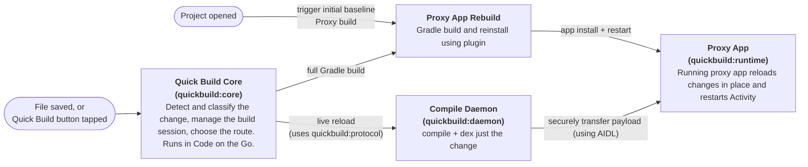
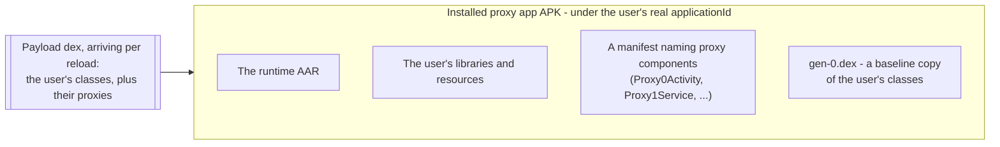
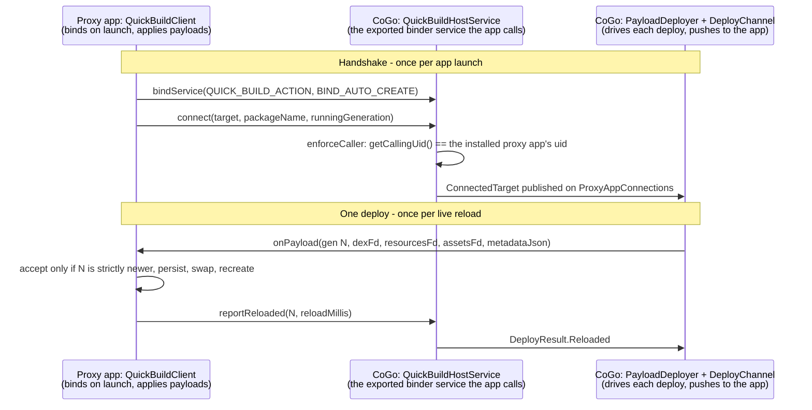
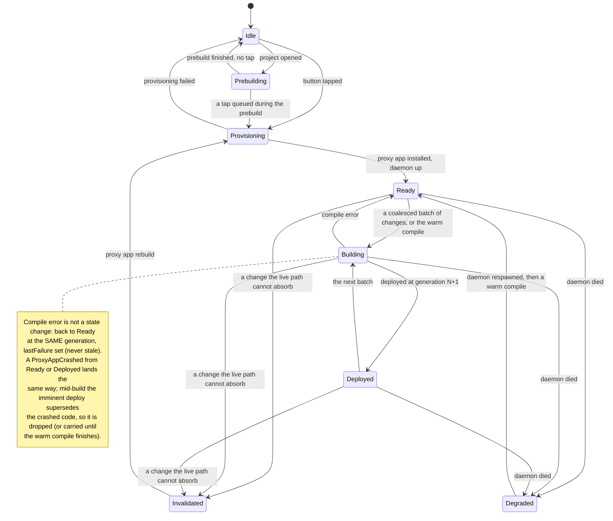

# Quick Build (ADFA-4128)

Quick Build makes the on-device edit loop much faster. Tap the lightning-bolt button once and **CoGo** (Code On The Go, this IDE) installs a generated **proxy app** - a live-reloading build of the user's project. From then on every compatible save reaches the running app in seconds, with no Gradle build and no reinstall. The whole loop runs on device - edit, watch, compile, dex, deploy, reload.

Measured against a standard incremental Gradle build of the same edit on real devices, Quick Build gives **about a 5x median speedup** on a warm edit. The gain is bigger on slower phones.

Three things that number does not say:

- **It is conditional on a save that live-reloaded.** Not every attempted edit produces one: compile or deploy can fail, provisioning can fail, and the classifier declines some edits by design.
- **The Gradle side excludes the install and launch it needs**, which biases the comparison against Quick Build.
- **It is not always faster.** A Java ABI change in a Java-heavy app can lose to a standard build, and the first project open is slower, once per session.

## Goals

1. **Live-reload should be fast enough that the user stays in flow.** Under 1s is ideal, but we're not there yet on most devices.
2. **The proxy app behaves like the real app, and is never stale.** Same `applicationId`, permissions, components and resources; and every edit either live-reloads or visibly falls back to a real Gradle build.
3. **Avoid modifying the user's code.** We use a Gradle plugin to create the proxy app that works as a wrapper, and try not to modify any of the user's app otherwise.
4. **Good enough, but no need to be 100% compatible.** Where the proxy app cannot match the real app, make that clear to the user - see [the boundary](#edit-types-that-can-live-reload) and [Known limitations](#known-limitations-v1). We're not trying to match a Gradle build exactly, just to be useful.
5. **Accept some tradeoffs to make live reload fast, but try to reduce tradeoffs**
  1. A reasonable amount of extra time at project open is OK - today the first open costs noticeably more than a standard Run's first build.
  2. We need some memory to keep Quick Build's compile daemon resident and available.
6. **Runs offline, on device.** Same standard as Code on the Go.

## Overview

### Terms

| Term                  | Meaning                                                      |
| --------------------- | ------------------------------------------------------------ |
| **Standard Run**      | CoGo's ordinary Run button: a full Gradle build that installs and launches the real app. Quick Build's fallback, and the thing it shares a Gradle slot and the device's single install slot with. |
| **Proxy app**         | The installable app Quick Build generates and runs in place of a Standard Run install: the `:quickbuild:runtime` AAR plus the user's libraries and resources under the project's real `applicationId`, with generated **proxy components** (`Proxy0Activity`, ...) standing in for the user's. "Proxy" alone always means those components, never the app. |
| **Baseline**          | The last full proxy app build's output, which every live reload is computed against: the baseline dex baked into the installed proxy app (`gen-0.dex`, booted at the generation stamped beside it), its fingerprint, and the orchestrator's matching state. |
| **Live reload**       | The quick path after `ChangeClassifier`: compile in the daemon, deploy a payload, the running proxy app updates. One cycle is one reload. |
| **Payload**           | The compiled user code (plus, for a resource edit, the relinked resource apk) sent to the running proxy app for one reload, without a reinstall. |
| **Generation**        | A monotonic counter naming each payload; the proxy app runs one generation. |
| **Proxy app rebuild** | Falling back to a fresh proxy app build when live-reload state cannot be trusted. Refreshes the baseline and tears the daemon down for its duration (freeing its RAM for the Gradle peak). Stale persisted payloads are not cleared by session control - the runtime discards them itself when its stored baseline fingerprint stops matching. |
| **Warm compile**      | A background build (`BuildRoute.WarmCompile`, never produced by the classifier) that warms the daemon's incremental caches and deploys nothing. Lowest priority. |
| **Scratch tree**      | CoGo's private per-session working directory (`no_backup/quickbuild-scratch/...`) holding the daemon's work and out trees. Deleted on teardown. |

### Edit Types That Can Live Reload

Quick Build handles only some types of edits using live reload.  For edits it can't handle yet, it falls back on a longer Gradle build.

| Live reload (fast path)                                      | Proxy app rebuild (slow path, via Gradle)                    |
| ------------------------------------------------------------ | ------------------------------------------------------------ |
| App-module source edits (Kotlin or Java) Resource value edits Asset changes | Source edits in a non-app module Manifest changes Native `.so` changes Annotation-processor input edits Gradle file changes |

Over time we can try to expand what can live reload, but some of these edit types will be harder to support.

The authoritative list is the classifier's `BuildRoute` / `InvalidationReason` enumeration ([`BuildRoute.kt`](core/src/main/java/org/appdevforall/cotg/quickbuild/domain/classify/BuildRoute.kt)).

### Quick Build Workflow Overview

Three things can trigger the Quick Build workflow:

1. **Project opened**
  1. A **proxy app prebuild** runs in the background: build only, no install, no daemon.
2. **File(s) written**
  1. An editor save, `git pull`, termux script or plugin write triggers a live reload.
3. **Quick Build button tapped**
  1. Flushes the editor's dirty buffers to disk (which can trigger a live reload) 
  2. Provisions the session on the first tap
  3. Switches to the proxy app

At a high level, `:quickbuild:core` (inside CoGo) does the thinking, and it routes each change down one of two paths:

For more depth on each component (component diagrams and more sequence diagrams), see [`docs/pipeline.md`](docs/pipeline.md#the-four-processes-and-every-hop-between-them).

### Map of the Code

Here's a more detailed map of the key components:

`:quickbuild:core`'s `domain/` layer is the pure-JVM, Android-free floor - all the routing and session logic, unit-testable without a device. Every Android capability it needs is a port it declares and `:app` implements, wired in one Koin module ([`di/QuickBuildModule.kt`](../app/src/main/java/com/itsaky/androidide/di/QuickBuildModule.kt)); the module's own `data/` and `service/` layers touch `android.*` only where a port's implementation is inherently framework-bound. Detail: [`core/README.md`](core/README.md).

| Module                                                       | Responsibility                                               | Entry point                                                  |
| ------------------------------------------------------------ | ------------------------------------------------------------ | ------------------------------------------------------------ |
| [`:quickbuild:core`](core/README.md)                         | The orchestration layer - it watches for file changes, classifies changes, and then orchestrates live reload via the daemon or (re)building the proxy app using Gradle.  The core makes sure that all changes eventually lead to a consistent proxy app (or a clear error shown to the user) | [`LiveReloadOrchestrator`](core/src/main/java/org/appdevforall/cotg/quickbuild/domain/reload/LiveReloadOrchestrator.kt), [`ChangeClassifier`](core/src/main/java/org/appdevforall/cotg/quickbuild/domain/classify/ChangeClassifier.kt), [`SessionReducer`](core/src/main/java/org/appdevforall/cotg/quickbuild/domain/session/SessionReducer.kt), [`QuickBuildSessionManager`](core/src/main/java/org/appdevforall/cotg/quickbuild/service/session/QuickBuildSessionManager.kt) |
| [`:gradle-plugin`](../gradle-plugin/src/main/java/com/itsaky/androidide/gradle/QuickBuildPlugin.kt) | Gradle plugin that minimally wraps the user's app to create the proxy app | [`QuickBuildPlugin`](../gradle-plugin/src/main/java/com/itsaky/androidide/gradle/QuickBuildPlugin.kt), [`ProxySourceGenerator`](../gradle-plugin/src/main/java/com/itsaky/androidide/gradle/quickbuild/ProxySourceGenerator.kt) |
| [`:quickbuild:runtime`](runtime/src/main/java/com/itsaky/androidide/quickbuild/runtime/) | Java-only AAR that runs inside the proxy app and securely connects back to Code on the Go and handles live reloads and connection lifecycle.  The runtime defines an AIDL interface for bidirectional communication with `quickbuild:core`. | [`QuickBuildAppComponentFactory`](runtime/src/main/java/com/itsaky/androidide/quickbuild/runtime/QuickBuildAppComponentFactory.java), [`PayloadStore`](runtime/src/main/java/com/itsaky/androidide/quickbuild/runtime/PayloadStore.java), [`ResourceSwapStrategy`](runtime/src/main/java/com/itsaky/androidide/quickbuild/runtime/ResourceSwapStrategy.java) |
| [`:quickbuild:daemon`](daemon/src/main/kotlin/org/appdevforall/cotg/quickbuild/daemon/) | JVM child process of Code on the Go that handles incremental Kotlin compile via the Kotlin Build Tools API, javac, d8 (DEXing), aapt2 (updating resources) | [`DaemonMain`](daemon/src/main/kotlin/org/appdevforall/cotg/quickbuild/daemon/DaemonMain.kt), [`DaemonService`](daemon/src/main/kotlin/org/appdevforall/cotg/quickbuild/daemon/DaemonService.kt) |
| [`:quickbuild:protocol`](protocol/README.md)                 | Interface definition between core and compile daemon         | [`DaemonProtocol.kt`](protocol/src/main/kotlin/org/appdevforall/cotg/quickbuild/protocol/DaemonProtocol.kt) |
| `:app` layer                                                 | Integration points in the Code on the Go IDE, including the toolbar button, the Koin graph binding every port to Android, and the Firebase + bench metrics sinks | [`QuickBuildAction`](../app/src/main/java/com/itsaky/androidide/actions/build/QuickBuildAction.kt), [`QuickBuildModule`](../app/src/main/java/com/itsaky/androidide/di/QuickBuildModule.kt), [`QuickBuildMetricsSink`](core/src/main/java/org/appdevforall/cotg/quickbuild/domain/telemetry/QuickBuildMetricsSink.kt) (port) |

## Live Reload Protocol Between Code on the Go and Proxy App

How `:quickbuild:core` gets a compiled change into the running app - the step the overview glosses over. Wire formats and version-skew rules are in [`protocol/README.md`](protocol/README.md).

### Proxy-App Architecture

What gets proxied: every **manifest-declared** activity, service, receiver, and provider gets a generated `Proxy<N><Type> extends <user class>` compiled into the APK; the `Application` keeps the user's class (the runtime already hooks process start), and runtime-registered receivers are ordinary objects needing nothing.

What the installed proxy app is made of:

The APK's own dex holds **no user classes at all**. They live only in the payload, which is why a reload can replace every one of them and why parent-first delegation can never serve a stale copy.

- **A proxy is a subclass, not a delegate.** `Proxy0Activity extends com.user.MainActivity`, so the manifest name stays fixed while the class beneath it is replaced wholesale. Proxy and user class travel in the same payload dex, so a reload swaps them together.
- **Activity proxies exist for one runtime reason:** they override `getClassLoader()`. `Context#getClassLoader()` is otherwise pinned to the APK loader, so by-name resolution (`LayoutInflater` custom views, `FragmentFactory`, Navigation destinations) would never find a payload-only class.

How the proxies and the baseline dex are generated, which components get one, and the ones deliberately never proxied: [`docs/component-proxying-design.md`](docs/component-proxying-design.md).

### The Deploy Channel

Two AIDL interfaces in [`runtime/src/main/aidl/`](runtime/src/main/aidl/com/itsaky/androidide/quickbuild/) - [`IQuickBuildTarget`](runtime/src/main/aidl/com/itsaky/androidide/quickbuild/IQuickBuildTarget.aidl) (proxy app side, `oneway`) and [`IQuickBuildHost`](runtime/src/main/aidl/com/itsaky/androidide/quickbuild/IQuickBuildHost.aidl) (CoGo side). The handshake, then one successful payload:

1. **The proxy app calls CoGo first.** `QuickBuildHostService` is `exported` - the proxy app is a different package - so nothing can be delivered until the app has bound and registered its callback. A reinstall therefore has to re-establish the connection before the next payload; until it does, a deploy returns `NotConnected` and CoGo launches the app once and retries.
2. **The uid check is the whole trust boundary for calls into CoGo, and it runs on every inbound call.** `enforceCaller` throws unless `Binder.getCallingUid()` matches the uid the live session accepts, taken from `PackageManager` at install time and never from anything the caller sent. No live session means nothing is accepted `[inferred]`. It is not what protects the app: see the next point.
3. **What stops the running app taking code from anywhere is that it never publishes a receiving endpoint.** The app binds out to CoGo by explicit package name and hands back a `Binder` callback over that binding, so there is no port, no exported component and no file path on the app's side - delivering a payload means holding that callback, and the only process ever given it is CoGo's. Binder handles come from the kernel, so another app cannot guess or forge one. **Known gap:** the app trusts CoGo by *package name*, not by signing key. Android will not let a second app claim a name already installed, so this is narrow - but a proxy app left on a phone after CoGo is uninstalled would bind to whatever later claims that name. A signing-cert check at bind time closes it.
4. **Payloads travel as file descriptors, not paths or bytes.** `DeployChannel` opens the dex, the relinked resource apk and the assets zip `MODE_READ_ONLY` and passes the `ParcelFileDescriptor`s across binder; the files themselves stay in CoGo's private scratch tree. No socket, no port, no shared-storage drop - so nothing to firewall and nothing another app can read `[inferred]`.
5. **Generations decide what applies.** The runtime accepts a payload only when its generation is *strictly* newer than the one it runs, loads it through an `InMemoryDexClassLoader`, and persists it app-privately so a relaunched process boots the newest persisted generation rather than the baseline (the baseline itself boots at the generation the proxy app build stamped into the APK, so a rebaselined app reconnects in-sync rather than at 0). A reload that throws rolls back to the previous generation and calls `reportCrash`, so the app keeps running the last working code and says so.
6. **Every wait is bounded.** `onPayload` is `oneway`, so the send returns immediately; `DeployChannel` subscribes to the reports flow *before* the call and matches replies by generation, so a superseded build's report is never mistaken for the current one. A hung app becomes `DeployResult.TimedOut` (15 s) and `linkToDeath` makes a dead one fail fast, rather than either stalling a build.
7. **Services, providers and a custom `Application` swap by process restart**, never hot-swap of a live instance ([`DeployPolicy`](core/src/main/java/org/appdevforall/cotg/quickbuild/domain/reload/DeployPolicy.kt)).

The two `.aidl` files *are* the contract - `:quickbuild:core` compiles the same files via `aidl.srcDir("../runtime/src/main/aidl")` rather than depending on the runtime module, so the two ends cannot drift within one source tree. Append methods only, never reorder or remove; the runtime AAR is compiled *into* the proxy app, so a new message only exists after a rebuild and reinstall.

## Session Management and Concurrency

A lot arrives at once: saves landing while a build runs, a button tap mid-build, an external Standard Run build, a daemon that dies, a proxy app that crashes.

The orchestrator in `quickbuild:core` tries to maintain two invariants across all of it:

1. **Nothing gets missed.** Once outstanding changes and interactions have been processed successfully, the running proxy app reflects the codebase. A save leaves the pending set only via a build that succeeded with it.
2. **Errors are visible and recoverable.** Any state we cannot trust is named to the user and has a path back to a working session - ultimately a proxy app rebuild.

Every edge is in [`docs/pipeline.md` step 2](docs/pipeline.md#step-2-session-control-and-provisioning-quickbuildcore-service--app); the nine `InvalidationReason` values and the retry budgets are in its step 7; the full diagram with every guard sits next to the reducer in [`domain/session/README.md`](core/src/main/java/org/appdevforall/cotg/quickbuild/domain/session/README.md). [`SessionReducer`](core/src/main/java/org/appdevforall/cotg/quickbuild/domain/session/SessionReducer.kt) is the authority. The reducer is *total* - an unhandled `(state, event)` pair is a no-op - which is why every guard below can be "drop it" rather than "unwind it".

How the triggers get sequenced:

- **One thread decides everything; every expensive thing runs in another process** `[inferred from code]`. The reducer, all session effects and all session state live on one `QuickBuildSession` thread with no locks. Compiling happens in the daemon, Gradle in CoGo's tooling server, reloading in the proxy app; every result hops back onto the session thread before it touches state.
- **A burst of saves becomes one batch** - coalescing emits 150 ms after the last write, capped 1 s from the first, last event per path winning.
- **One build in flight.** Starting a build *moves* the pending set into it; the set clears only on success and a failed batch is unioned back, so saves arriving mid-build simply join the next one. New work never cancels a running compile - it waits.
- **Stale work cannot apply itself.** Every result carries its build id, and two epochs (session and daemon) guard every async result, so a build superseded by a teardown or a baseline reset is discarded rather than rendered.
- **A deploy racing a reconnect is safe**, because the proxy app takes a payload only if it is strictly newer than what it runs.
- **The warm compile is what makes the first save fast** ([`docs/perf-roadmap.md`](docs/perf-roadmap.md)). It starts only after `Ready` is reached, so it costs nothing on the way there.
- **Standard Run contention is gated, not locked.** The one Gradle slot answers `SlotBusy` as a distinct outcome rather than a build failure, and the device's single install slot (one install per `applicationId`, shared by the proxy app and a Standard Run install) is confirmed statelessly before either side clobbers the other. It goes both ways: any completed Standard Run build hands state back to a live session, refreshing or invalidating its baseline.

Which threads exist, what each gate does, the mid-build sequence in full, and the reliability-mechanism table: [`docs/concurrency.md`](docs/concurrency.md).

## Notable Decisions

### Build Triggers On File Write

Watching the filesystem handles every kind of write - editor save, autosave, `git pull`, a termux script, a plugin - through one path, and starts compiling as soon as bytes land instead of accumulating changes until the button is pressed. Alternatives: instrumenting editor events, which means catching several events reliably and still misses every write from outside the editor; building on tap only, which is simpler and saves some battery but is slower at the moment that matters.

### Use AIDL for Secure Communication Between Code on the Go and Proxy App

AIDL plus `ParcelFileDescriptor`s and a per-call uid check - no sockets, no ports, no world-readable files, so no other app on the device can read a payload or impersonate CoGo. Cost: the proxy app must bind back to CoGo before anything can be delivered, so every rebuild re-establishes that connection.

### Create Proxy App Using Gradle Plugin

The plugin runs inside the project's own AGP build, because only that build computes the merged manifest, resource ids and dependency classpath correctly. CoGo injects it at provisioning time through its Gradle init script - the user's own build files are never edited. Cost: session start pays one real Gradle build. Alternatives: post-processing the built APK (binary-XML surgery, re-signing, and nowhere to generate proxy sources); a minimal build reimplemented in CoGo (drifts from AGP semantics); replacing `android.jar` (judged too complex and infeasible in early discussions - [`docs/why-not-android-jar.md`](docs/why-not-android-jar.md)).

### Proxy App Uses Same Application ID

`${applicationId}` authorities pass verbatim and package-bound integrations (Firebase, FCM, app links) reach the proxy app. Cost: Quick Build and Standard Run share the device's one install slot, so the UI confirms before clobbering - read statelessly from the installed package's `android:appComponentFactory` ([`RealIdInstall.kt`](core/src/main/java/org/appdevforall/cotg/quickbuild/domain/reload/RealIdInstall.kt)) - and a foreign-signature occupant is refused outright. Alternative: a `.quickbuild`-suffixed id, which would let both coexist but breaks placeholder authorities and every package-bound integration; that two-mode design was removed on 2026-07-24.

### Compilation Lives In Separate Process

A stateless warm daemon, with all routing policy left in CoGo. It isolates the compiler's crash domain and memory (537 MB RSS over a 28-minute soak on a mid-spec phone, `phase1-gates-a56` - the main low-spec risk) and keeps the compiler warm, which is the biggest latency lever. Alternative: compiling in-process - no spawn cost, but a compiler OOM takes the IDE with it and its heap sits in CoGo's budget forever.

### Raise Gradle's Metaspace Cap and Let an Idle Daemon Hand Heap Back

Two daemons now share one phone's memory, so the Gradle side had to be retuned. All three build strategies ([`BalancedStrategy.kt`](../app/src/main/java/com/itsaky/androidide/services/builder/BalancedStrategy.kt), [`LowMemoryStrategy.kt`](../app/src/main/java/com/itsaky/androidide/services/builder/LowMemoryStrategy.kt), [`HighPerformanceStrategy.kt`](../app/src/main/java/com/itsaky/androidide/services/builder/HighPerformanceStrategy.kt)) raise the Metaspace cap from 192 to 384 MB, because 192 MB OOM'd real builds on a 3.6 GB C107, and each gains a per-tier daemon idle timeout so an idle Gradle daemon returns heap to the quick-build daemon instead of holding it. Cost: a build that starts after the timeout pays daemon start again, and peak footprint rises on devices that were already tight. Alternative: a single shared daemon budget, which removes the handback problem but makes either daemon able to starve the other.

### Session State Lives in a Service-Held Manager, Not a ViewModel

A Quick Build session outlives the editor Activity - it survives rotation, backgrounding, and the editor being torn down and rebuilt, because the compile daemon and the app's binder connection stay up across all three. A `ViewModel` is scoped to a `ViewModelStoreOwner`, the wrong lifetime for that, so the session lives in a service-held manager and the toolbar renders from the state it exposes.

### Reload Using Public APIs Only (Classloader Swap)

A reload swaps the payload classloader plus the resource apk and restarts components; it never patches code in place. Cost: restart granularity, which never-stale prefers anyway. Alternatives: reinstalling per edit (install latency and a confirm dialog per save); ART hot-swap as in Apply Changes (needs an attached debugger, method bodies only); Tinker-style dex patching (reflection into ART internals).

### Build Scratch Lives in Faster Private Storage

The daemon's work and out trees live in CoGo's `noBackupFilesDir`, not the project tree: the project sits on FUSE-backed shared storage, and moving off it measurably cut warm-edit time `[measured on a56]`. Cost: not user-browsable, so the tree carries a 100 MB guard, teardown deletion and a stale sweep. The generation counter deliberately stays in the project tree so it survives scratch cleanup.

### Benchmarking Corpus Lives in Separate Repo

Synthetic apps ship with their oracles and results in the `CodeOnTheGo-build-benchmark` repo; real apps are pinned by `vendor.json` and fetched into a gitignored cache, so third-party source is never checked into any repo. The harness drives CoGo only through the declared interfaces, so it cannot mask a break in them.

### The Per-Save Path Does Not Use Gradle

Provisioning runs a real Gradle build, but every save after it does not - the daemon compiles, dexes and swaps resources directly, because a Gradle invocation per save costs seconds that this feature exists to remove. ADR 0002 chose the Gradle Tooling API for on-device builds and still reads as covering all of them, so this branch adds ADR 0012 to record the second path and its limits rather than leave 0002 quietly overstated. Cost: two build paths to keep honest. The proxy app is only ever produced by AGP, and the per-save path is never allowed to produce an installable artifact.

### The Proxy App Connection Registry Is a Process-Wide Singleton

[`ProxyAppConnections.INSTANCE`](core/src/main/java/org/appdevforall/cotg/quickbuild/service/deploy/ProxyAppConnections.kt) is process-wide and bound into Koin, which ADR 0006 discourages. Android instantiates `QuickBuildHostService` itself, so the registry cannot be constructor-injected into it. The existing Gradle build hits the same constraint and answers it the same way - `GradleBuildService` publishes itself into the process-wide `Lookup` registry when it starts. This differs only in going through Koin rather than the legacy locator, so the dependency stays visible and swappable in tests. Cost: one piece of global state whose lifetime is the process rather than a scope.

## Working on Quick Build

### How to Test

Unit and Kaspresso tests cover CoGo itself; anything that crosses into the proxy app needs one of the two on-device tiers below.

- **Run the unit tests.** They live in each module's `src/test` - `:quickbuild:core` carries most of them (the domain layer is pure JVM by design), with more in `:quickbuild:daemon` and `:gradle-plugin`. Run them with `flox activate -d flox/local -- ./gradlew :quickbuild:core:test :quickbuild:daemon:test :gradle-plugin:test`.

- **Script a session over `adb`.** Under the `CodeOnTheGo.qbbench` flag an exported activity opens a project and fires the first tap in place of a human, so a whole session - including a retry after an install-confirm timeout - runs unattended. Command and options: [`docs/debugging.md` §6](docs/debugging.md).
- **Run the corpus.** The `CodeOnTheGo-build-benchmark` repo carries the open-source app corpus, realistic edits and the E2E harness. Correctness comes from its two oracles - recompiled-class bounds and output equivalence - not from timings. Commit the results dir for any compile-pipeline change.

A new edit class or route needs all three: a classifier test, a corpus edit declaring `expected.route`, and an on-device walk if it deploys. Two traps: the root build sets `ignoreFailures = true` on test tasks, so read `<module>/build/test-results/` rather than trusting `BUILD SUCCESSFUL`; and nothing runs the real daemon jar against the real client ([`DaemonProcessClientTest`](core/src/test/java/org/appdevforall/cotg/quickbuild/data/DaemonProcessClientTest.kt) drives a scripted fake), so a protocol regression that compiles only surfaces on device.

### How to Run On Device

Build and install `:app:assembleV8Debug` from this branch - Quick Build has not shipped in any release, and `:app` needs the gitignored, team-provided `app/google-services.json`. Then drop flag files in the device's `Download/` folder and **restart CoGo**, because flags are read once per process ([`FeatureFlags.kt`](../common/src/main/java/com/itsaky/androidide/utils/FeatureFlags.kt)).

| Flag file              | Effect                                                       |
| ---------------------- | ------------------------------------------------------------ |
| `CodeOnTheGo.exp`      | the experiments flag; required - without it the lightning-bolt button does not appear |
| `CodeOnTheGo.qbbench`  | adds the adb entry point and the `bench-events.jsonl` event log; **debug builds only** - the benchmark code lives in `app/src/debug/` and is absent from a release APK |
| `CodeOnTheGo.qbnoseed` | suppresses the post-provisioning warm compile so an A/B runs against the same installed build; inert without `.qbbench`, never on in a shipping build |

### When a Save Doesn't Show Up

Work down this list and stop at the first answer.

- **Was the file watched?** The most common cause, and silent by design. Only `<module>/src` trees and a named set of Gradle files are watched, so a file one directory outside them produces no event at all.
- **Did a build start?** `adb logcat | grep QB-` catches the whole feature, and each tag stays individually greppable (`adb logcat -s QB-SessionManager`). Every state transition logs there.
- **Where did the time go?** The end-to-end timeline is one line under `QB-ReloadExecutor`.
- **Which process should I be looking at?** Three log differently: CoGo under the `QB-` tags; the proxy app under the single tag `QB-Runtime`; and the daemon not at all - it writes stderr, which `DaemonProcessClient` re-logs as `daemon(stderr): ...`, so if CoGo dies that output is gone.

Full triage in that order, the exact watch rules, on-device paths, the log-tag conventions and every timeout: [`docs/debugging.md`](docs/debugging.md).

### Areas to Be Careful Of

Each of these breaks the feature without any test going red, so a change touching one needs a device walk.

- **Never-stale is the invariant everything else serves** - when in doubt escalate to `FullGradleBuild`, because over-building is slow but under-building is wrong.
- **The generation counter is persisted outside the scratch tree** so it survives teardown - never reset it for a test.
- **Session effects belong on the one `QuickBuildSession` thread** (see Session Management above) - injecting `Dispatchers.IO` "to speed it up" breaks ordering with no crash and no failing test.
- **Every new suspending path must re-check its captured session and daemon epoch** before applying its result, or stale work clobbers a fresh session.
- **Wire names are frozen** - renaming a Firebase event, a bench field or a flag file invalidates the benchmark history, and a breaking `setup.json` shape change needs its schema version bumped or CoGo misreads the file instead of invalidating.
- **The daemon strips `final` off classes before dexing** ([`FinalStripper`](daemon/src/main/kotlin/org/appdevforall/cotg/quickbuild/daemon/dex/FinalStripper.kt)) - not an optimization: a `final` user class cannot be extended by its generated proxy.
- **Do not move the scratch tree next to the project** for tidiness; that puts it back on FUSE and gives back most of the warm-edit gain (see Build Scratch above).
- **Activity proxies override `getClassLoader()` on purpose** - both template crashes seen during development were violations of this one rule.
- **The runtime is Java-only, with no androidx and no CoGo dependencies** - it is compiled into someone else's APK, so a convenience dependency here ships in a user's app.

### What to Rebuild After a Change

Everything ships as an APK asset - **there is no push-a-jar shortcut for any component.** `./gradlew :app:assembleV8Debug` plus reinstalling CoGo rebuilds all of them. Then:

| You edited                                 | Also needed                                                  |
| ------------------------------------------ | ------------------------------------------------------------ |
| `:quickbuild:core`, `:quickbuild:protocol` | nothing further - it is CoGo code, and both protocol sides move together |
| `:quickbuild:daemon`                       | restart the session; the stager re-extracts the daemon dir every provision |
| `:quickbuild:runtime`                      | **restart the Quick Build session for the project** - the AAR is compiled *into* the proxy app, so reinstalling CoGo alone changes nothing in the running app |
| `:gradle-plugin`                           | restart CoGo, which re-copies `cogo-plugin.jar` on app start |
| daemon-only iteration                      | `:quickbuild:daemon:stageDaemon` produces a runnable `build/daemon/` layout - what the harness points `--daemon-jar` at |

## Known Limitations (v1)

| Limitation                                                   | Impact and status                                            |
| ------------------------------------------------------------ | ------------------------------------------------------------ |
| **The API 28/29 resource-swap path has never run on a device** | Android 9/10 take the legacy `addAssetPath` shim instead of `ResourcesLoader`. Only its failure branch is JVM-tested; the success path needs a real 28/29 device and none of our test devices is one `[unverified on device]`. Candidate for closing it: a targeted instrumented test on the farm's `SM_J737A` (API 28, arm32). |
| **A deleted asset stays readable until the next proxy app rebuild** | The API 30+ asset overlay (a `DirectoryAssetsProvider` on the shared `ResourcesLoader`) can add and replace but cannot hide baked-in assets, so new and modified assets live-reload while a deletion lands only on the next proxy app rebuild. Content an app read and cached before the recreate stays stale until its process restarts, same as resources. On API 28/29 nothing serves a deployed asset payload, so asset-bearing edits route to the standard Gradle build instead - never stale, at full-build cost `[unverified on device]`. |
| **A Gradle 9 start-up failure, contested and never re-run**  | The setup build threw `UnknownPluginException` from CoGo's init-script plugin injection against a Gradle 9 project. This was **not** an incidental one-off: the corpus work isolated the variable, substituting Gradle 9.5.1 into `gradle-plugin`'s own AGP 8.11.0 fixture and reproducing the same failure, and concluded it blocks the setup build for **any** project pinned to Gradle 9+. Against that, `AndroidIDEInitScriptPluginTest` is now parameterized on 8.14.3 and 9.5.1 and passes. So either the wall is fixed or the TestKit fixture does not reproduce real injection against a real multi-module project - **no Gradle 9 project has been re-tried since the test went green** `[unverified]`. Matters beyond the corpus: sora-editor pins Gradle 9.5.1 / AGP 9.2.1 and KISS pins 9.4.1, and new projects increasingly pin 9. |
| **A library-module edit takes a full rebuild and an install tap** | ~25 s plus an install tap, against ~2.55 s for an app-module edit measured the same way, both from an earlier pass `[measured on a56, earlier pass]`; the prompt fires per out-of-scope edit rather than once per session. Every module's `src` stays watched, so nothing is silently dropped. |
| **A Kotlin/Java corpus failure the tests contradict**        | `IncrementalCompilerTest` compiles the same cycle cleanly, yet a sora-editor corpus run failed on this axis. A cross-*module* relationship would route to a rebuild anyway, which may be what was really seen. Not re-run `[unverified]`. |
| **Quick Build needs more RAM than CoGo itself**              | Works on both 4 GB-tier devices we own; at 1.9 GB it never provisions, and what fails is the Gradle build every session starts with `[measured on itel]`. The live reload loop has never failed on its own at any tier. Detail: [`docs/low-spec-devices.md`](docs/low-spec-devices.md). |
| **Room-template apps cannot build offline at all**           | A CoGo bundle dependency gap that fires before Quick Build is involved, so it is a bundle fix, not one here. The worst gap for an offline-first product `[measured on a56]`. |
| **The Compose template's edit loop is unmeasured**           | Never timed `[unmeasured]`, and the full-corpus run that backed the corpus-wide claim is no longer retained - so "Compose is covered" is currently unevidenced. |
| **Cert-pinned services need their console updated**          | A service pinned to a signing SHA (Maps keys, Sign-In) rejects this device's CoGo debug cert until the user registers that SHA. User-fixable per service. |
| **A resource aapt2 rejects blocks every save until it is fixed** | The relink links the whole `res/` tree, so one unlinkable resource fails every later build - pure-code saves included. Never-stale holds: nothing is deployed and the diagnostics show every time. Both halves are now handled - self-escalation, plus a `QuickBuildNotice.RELINK_STUCK` prompt `[unverified on device]`. Argument and the deliberate non-fix: [`docs/reliability-gaps.md`](docs/reliability-gaps.md). |
| **A crashing reload has no self-healing, and a between-builds crash is silent** | A reload crash repeats on every reload until the session is reset; the known trigger (resource-id drift on relink) is fixed and the fixed path is device-verified, but the trigger-independent net is missing (the user is told via `QuickBuildNotice.RELOAD_CRASHED`). Separately, the runtime's crash guard reports to CoGo *only while a reload is in flight*, so the proxy app's own organic crash *between* builds is never reported - the user sees only the status-icon color change, not a crash notice (reliability gap #91). `[unverified on device]` Detail: [`docs/reliability-gaps.md`](docs/reliability-gaps.md). |
| **A live service or provider calls OLD copies of recompiled helper classes until its next restart** | The restart closure ([`DeployPolicy.kt`](core/src/main/java/org/appdevforall/cotg/quickbuild/domain/reload/DeployPolicy.kt)) covers the component's own code and supertypes; a tightening is behind a flag. Surfaced once per session as `QuickBuildNotice.STALE_COMPONENT_HELPERS` `[unverified on device]`. Detail: [`docs/component-proxying-design.md`](docs/component-proxying-design.md). |
| **Forced-tap and daemon-respawn rebuilds over-restart component apps** | Both full-recompile every source, so an app with a service, provider or custom `Application` loses in-app state to an unnecessary process restart even when those classes are byte-identical to what is running. Genuine incremental edits are unaffected. |
| **A `final` library component is skipped**                   | No user-visible cost and no live-reload coverage lost: it keeps its real manifest name, and the daemon only ever recompiles the project's own sources. Two more are excluded by name. Why, and the mechanism: [`docs/component-proxying-design.md`](docs/component-proxying-design.md). |
| **One `android:process` anywhere costs the whole project Quick Build** | Every save falls back to the standard Gradle build, per project rather than per component - often for a component the user never wrote. Provisioning fails loud and early rather than dropping behavior late, but the only account the user gets is the build log. Why a second process cannot be served: [`docs/component-proxying-design.md`](docs/component-proxying-design.md). |

## Further Reading

Design notes live in [`docs/`](docs/); repo-level ADRs are elsewhere, at [`docs/adr/`](../docs/adr/) - the two `docs/` directories are different.

| Doc                                                          | What it covers                                               |
| ------------------------------------------------------------ | ------------------------------------------------------------ |
| [`core/README.md`](core/README.md)                           | inside `:quickbuild:core` - the ports-and-adapters rule, the packages, and what is unit-testable |
| [`docs/pipeline.md`](docs/pipeline.md)                       | the class-level map of all eight steps, in pipeline order - read this to find the file that implements a step |
| [`docs/debugging.md`](docs/debugging.md)                     | why a save did not show up: watch rules, logcat tags, on-device paths, `bench-events.jsonl`, every timeout |
| [`docs/concurrency.md`](docs/concurrency.md)                 | what runs on which thread or process, the Standard Run contention gates, and what happens when edits arrive mid-build |
| [`protocol/README.md`](protocol/README.md)                   | the three wire formats - daemon protocol, deploy metadata, build status - and how version skew is handled |
| [`docs/component-proxying-design.md`](docs/component-proxying-design.md) | which components get proxies, the restart closure, the never-proxied list, and the multi-process gap |
| [`docs/low-spec-devices.md`](docs/low-spec-devices.md)       | what we measured on 1.4-3.6 GB devices, and why the low-end question is still open |
| [`docs/ksp-kapt-feasibility.md`](docs/ksp-kapt-feasibility.md) | what it would take to run annotation processors in the daemon |
| [`docs/incremental-javac-design.md`](docs/incremental-javac-design.md) | the Java half of the compile and its ABI re-parse            |
| [`docs/reliability-gaps.md`](docs/reliability-gaps.md)       | the known recovery holes, ranked                             |
| [`docs/perf-roadmap.md`](docs/perf-roadmap.md)               | where the remaining latency is and which levers are worth pulling |
| [`docs/why-not-android-jar.md`](docs/why-not-android-jar.md) | why interception is manifest proxies + `ResourcesLoader` and not a patched `android.jar` |

Three things live outside this repo:

- **The benchmark corpus, harness and results**, in the standalone `CodeOnTheGo-build-benchmark` repo. It drives CoGo only through the declared interfaces, so it cannot mask a break in them. Methodology and the QA records (low-spec runbook, template sweep, commit survey) are there too.
- **History** - earlier revisions of these docs in the archived tag `adfa-4128-history-20260731`, design history in Jira ADFA-4128.
