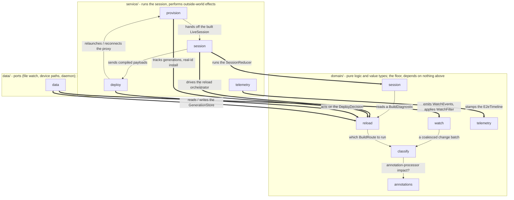

# `:quickbuild:core` - the IDE-side half of Quick Build

Decides *what* to do on every save and drives the session that does it: watch the project,
classify each change into a [`BuildRoute`](src/main/java/org/appdevforall/cotg/quickbuild/domain/classify/BuildRoute.kt),
run the live reload path or hand back to Gradle, and deploy the result to the running proxy app.

For what Quick Build is and how the whole loop fits together, read [`../README.md`](../README.md)
first. This file only covers what is inside this module.

## The one rule that shapes everything here

**The domain layer is the Android-free floor.** Nothing under `domain/` imports `android.*` or
`androidx.*`, and nothing there takes a `Context`. Every Android capability the module needs is
declared as an interface - a *port* - and implemented in `:app`, wired in one Koin module
([`QuickBuildModule.kt`](../../app/src/main/java/com/itsaky/androidide/di/QuickBuildModule.kt)).

**The module as a whole is not Android-free, and is not meant to be.** It is a
`com.android.library` with AIDL, and six files under `data/` and `service/` import `android.*`
where the implementation is inherently framework-bound - `FileObserver` in
[`AndroidProjectWatcher`](src/main/java/org/appdevforall/cotg/quickbuild/data/AndroidProjectWatcher.kt),
`Service` and `Binder` in the deploy channel, `ComponentCallbacks2` for memory pressure. Those are
adapters at the edge, not logic.

Two things follow from an Android-free `domain/`, and both are the point:

- The routing rules, the session state machine and the deploy policy are **unit-testable on the
  JVM** with no device and no Robolectric. That is most of `src/test/`.
- Swapping how CoGo installs an APK, watches files or reports metrics does not touch `domain/`.

Adding a dependency on an Android type inside `domain/` breaks both. Add a port instead.

## Packages

Three layers, and dependencies flow **down** toward `domain/`. Nothing depends upward. Within
`domain/` and `service/` the sub-packages name the concern, and they line up: the `service/`
sub-package acts on what the `domain/` one of the same name decides.

Thin arrows are references **within** a layer, which are allowed: `service/` components call each
other, `domain/` value types reference each other. Thick arrows (`==>`) cross layers, and every one
points **down** into `domain/`. The two directions review must reject are **`domain/ -> service/`**
and **`domain/ -> data/`** - the pure-logic floor never reaches up to effects or ports. Edge labels
name what each dependency carries; the diagram shows the principal edges, and the per-package tables
below carry the full file-level detail.

`domain/` - pure logic and value types. `ChangedFiles`, the batch every layer speaks in, sits at
the root because it belongs to no single concern.

| Package | Holds | Start reading at |
| --- | --- | --- |
| [`domain/watch/`](src/main/java/org/appdevforall/cotg/quickbuild/domain/watch/) | what counts as a change: the debounce, the filter, the batch reconciler | [`ChangeCoalescing`](src/main/java/org/appdevforall/cotg/quickbuild/domain/watch/ChangeCoalescing.kt), [`WatchFilter`](src/main/java/org/appdevforall/cotg/quickbuild/domain/watch/WatchFilter.kt) |
| [`domain/classify/`](src/main/java/org/appdevforall/cotg/quickbuild/domain/classify/) | which route a batch takes, and why a baseline stops being trustworthy | [`ChangeClassifier`](src/main/java/org/appdevforall/cotg/quickbuild/domain/classify/ChangeClassifier.kt), [`BuildRoute`](src/main/java/org/appdevforall/cotg/quickbuild/domain/classify/BuildRoute.kt) |
| [`domain/session/`](src/main/java/org/appdevforall/cotg/quickbuild/domain/session/) | the state machine: states, events, effects, and what the user is told | [`SessionReducer`](src/main/java/org/appdevforall/cotg/quickbuild/domain/session/SessionReducer.kt), [`QuickBuildSessionState`](src/main/java/org/appdevforall/cotg/quickbuild/domain/session/QuickBuildSessionState.kt) |
| [`domain/reload/`](src/main/java/org/appdevforall/cotg/quickbuild/domain/reload/) | the live reload path: what to rebuild, hot swap versus restart, generations | [`LiveReloadOrchestrator`](src/main/java/org/appdevforall/cotg/quickbuild/domain/reload/LiveReloadOrchestrator.kt), [`DeployPolicy`](src/main/java/org/appdevforall/cotg/quickbuild/domain/reload/DeployPolicy.kt) |
| [`domain/telemetry/`](src/main/java/org/appdevforall/cotg/quickbuild/domain/telemetry/) | the measurement vocabulary: one timeline per edit, one sink to report it | [`E2eTimeline`](src/main/java/org/appdevforall/cotg/quickbuild/domain/telemetry/E2eTimeline.kt) |
| [`domain/annotations/`](src/main/java/org/appdevforall/cotg/quickbuild/domain/annotations/) | whether a change feeds an annotation processor, and what that costs | [`AnnotationImpact`](src/main/java/org/appdevforall/cotg/quickbuild/domain/annotations/AnnotationImpact.kt) |

| Package | Holds | Start reading at |
| --- | --- | --- |
| [`data/`](src/main/java/org/appdevforall/cotg/quickbuild/data/) | the ports themselves: file watching, device paths, the daemon process | `ProjectWatcher`, `QuickBuildPaths`, `DaemonProcessClient` |

`service/` - session lifecycle and the effects that touch the outside world.

| Package | Holds | Start reading at |
| --- | --- | --- |
| [`service/provision/`](src/main/java/org/appdevforall/cotg/quickbuild/service/provision/) | getting a proxy app built, installed and launched - including the clobber check | [`QuickBuildProvisioner`](src/main/java/org/appdevforall/cotg/quickbuild/service/provision/QuickBuildProvisioner.kt), [`ProxyAppInstaller`](src/main/java/org/appdevforall/cotg/quickbuild/service/provision/ProxyAppInstaller.kt) |
| [`service/deploy/`](src/main/java/org/appdevforall/cotg/quickbuild/service/deploy/) | the AIDL channel to the proxy app and everything sent over it | [`PayloadDeployer`](src/main/java/org/appdevforall/cotg/quickbuild/service/deploy/PayloadDeployer.kt), [`DeployChannel`](src/main/java/org/appdevforall/cotg/quickbuild/service/deploy/DeployChannel.kt) |
| [`service/session/`](src/main/java/org/appdevforall/cotg/quickbuild/service/session/) | the session itself: holds the reducer, runs the effects, drives one build at a time | [`QuickBuildSessionManager`](src/main/java/org/appdevforall/cotg/quickbuild/service/session/QuickBuildSessionManager.kt), [`LiveReloadExecutorImpl`](src/main/java/org/appdevforall/cotg/quickbuild/service/session/LiveReloadExecutorImpl.kt) |
| [`service/telemetry/`](src/main/java/org/appdevforall/cotg/quickbuild/service/telemetry/) | stamping a timeline as a build runs, and reporting it | [`E2eTimelineRecorder`](src/main/java/org/appdevforall/cotg/quickbuild/service/telemetry/E2eTimelineRecorder.kt) |

The split that matters: **`domain/` decides, `service/` acts.** A pure reducer computes the next
state and a list of effects; the session manager executes them. If you find yourself doing IO in
`domain/`, the logic wants to move to `service/` or the IO wants to become a port.

## Two invariants that are easy to break

- **Everything stateful runs on one dispatcher, and it must be single-threaded.** Effects are
  `launch`ed rather than run inline so a dispatch can never re-enter itself.
- **The reducer is total.** An unknown `(state, event)` pair keeps the current state and produces
  no effects, so a late or duplicate event cannot corrupt a session. Adding a state or event
  without extending the reducer silently gets you this fallback, not a compile error.

## Where the rest is

| For | Read |
| --- | --- |
| What Quick Build is, the loop, the decisions | [`../README.md`](../README.md) |
| Which file implements which pipeline step | [`../docs/pipeline.md`](../docs/pipeline.md) |
| My edit did not show up - where to look | [`../docs/debugging.md`](../docs/debugging.md) |
| The wire formats this module speaks | [`../protocol/README.md`](../protocol/README.md) |

The other halves of the feature live in sibling modules: [`../daemon/`](../daemon/) compiles,
[`../runtime/`](../runtime/) runs inside the proxy app, and
[`../../gradle-plugin/`](../../gradle-plugin/) builds it.
