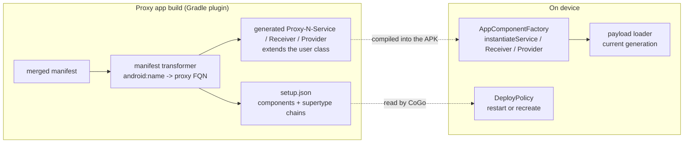
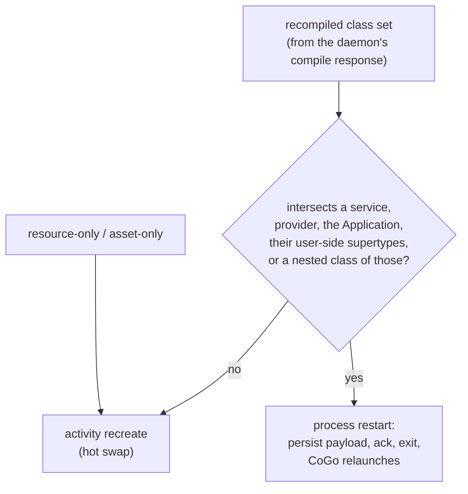

# Component proxying

How a generated proxy app can host a project's services, receivers, providers and custom
`Application` - not just its activities. Implemented on this branch (ADFA-4128).

Every manifest component is replaced by a generated `extends` subclass compiled into the proxy
app, while the user's own classes travel in the swappable payload dex - so a swap replaces the
whole hierarchy at once. A manifest *change* still takes a proxy app rebuild; this only widens what
a generated proxy app can host. See
[the boundary](../README.md#the-boundary-what-live-reloads-and-what-falls-back-to-gradle).

## What the proxy app must satisfy

Every decision below is trying to preserve these. When a change forces a trade-off, trade in this
order - 1 and 2 are not negotiable against the rest.

1. **It never silently runs stale code.** Every edit either live-reloads or visibly falls back to a
   real Gradle build. This outranks speed: a fast wrong answer is worse than a slow right one.
2. **It behaves like the real app.** Same `applicationId`, permissions, icon, label, intent filters
   and components; real resources; the merged manifest preserved verbatim apart from component
   names. Where it cannot, the difference is written down and surfaced to the user -
   [the boundary](../README.md#the-boundary-what-live-reloads-and-what-falls-back-to-gradle) and the
   README's Known limitations. **A divergence nobody documented is a bug, not a limitation.**
3. **New classes, resources and assets plug in quickly and reliably.** Generated component names are
   stable across generations, so a reload never needs a manifest change; user classes travel in a
   swappable payload dex, resources through a replaceable loader.
4. **A reload never reinstalls.** The install is paid once, at provisioning. That is where
   seconds-instead-of-minutes comes from, so any design that reinstalls per edit has lost the point.
5. **It never strands the user's real app.** One install slot under the real `applicationId`,
   confirm-on-switch, and a completed Standard Run hands back to a live session - the user can
   always get back to an ordinary build.
6. **It runs standalone.** With CoGo not attached the proxy app still starts and runs the newest
   payload it persisted, rather than silently reverting to the baseline.
7. **It stays cheap to embed.** The runtime is compiled into the user's app, so it is Java-only with
   no CoGo dependencies - it must not drag `kotlin-stdlib` or anything else into someone's APK.
8. **Getting from the running app back to the next edit is smooth.** Tap-to-jump and the return
   gesture exist today, but this one is directional rather than finished: the review-to-edit loop is
   where the next round of work goes.

1-7 hold today. 8 is partial by design.

## Key decisions

- **Every component is proxied by default - user code and library code alike.** The transform never
  discriminates by origin; every exception comes from the resolver below, which decides from the
  class file rather than from whose code it is.
- **A component that defeats `extends` is never silently dropped.** A `final` library class is
  skipped and logged, keeping its real manifest name. One present only on the runtime classpath
  cannot be detected before compilation, so it fails the proxy app build loudly, naming the
  component and pointing the user at Run/Debug.
- **`ComponentProxiabilityResolver` is the single authority on which components get proxied.**
  Both the manifest transform and the payload dex task ask it. It reads each component's class
  from the variant's dependency artifacts and skips any `final` one - from any library, named
  nowhere - leaving it under its real manifest name. Only what a class file cannot reveal is
  listed by name: androidx `InitializationProvider` (resolves itself by hardcoded name) and
  `ProfileInstallReceiver` (absent from some proxy compile classpaths, and absence is
  indistinguishable from project-owned before compilation). Reasons live in that class's KDoc.
- **The `Application` gets no proxy.** Nothing addresses it by manifest name, and
  `instantiateApplication` already routes through the payload loader.
- **Provider authorities pass through verbatim.** The proxy app installs under the project's real
  `applicationId`, so `${applicationId}` resolves exactly as the real app's would.
- **Unsupported attributes fail the build with the component and attribute named** - no stripping,
  no silent loss. `android:process` and isolated/multi-process providers are the live cases.
- **The runtime persists the newest payload to disk.** Providers and the `Application`
  instantiate before the binder connects and are never re-instantiated, so without it they would
  pin to baseline code forever - a never-stale violation. A fingerprint mismatch or read failure
  falls back to gen-0.

## Restart vs recreate

Decided after compilation, from the set of classes the daemon actually recompiled - the
path-shape classifier runs too early to know it.

- **Receivers are deliberately not in the restart set** - manifest receivers are instantiated
  fresh per delivery, so they already run current code.
- **The restart is honest, not clever**: the process really dies and reboots from the persisted
  generation, reusing the never-stale catch-up path rather than inventing one. Cost is the back
  stack and all in-process state - the same trade Apply Changes makes on structural changes.
- **Skew guard.** An older installed baseline whose baked runtime predates restart support would
  ignore the restart flag and hot-swap - stale. `setup.json`'s top-level `schema` field gates it:
  below schema 2, a restart-requiring deploy routes to a full proxy app rebuild, which
  self-heals by regenerating a schema-2 baseline.
- **Accepted residual**: a *live* service or provider keeps calling old copies of recompiled
  non-component helper classes until its next restart - a loader swap updates instantiation, not
  live object graphs. Same kind as an activity mid-recreate; see README "Known limitations".

## Where the code lives

| Concern | Code |
|---|---|
| Manifest rewrite, authority recording | `gradle-plugin/.../QuickBuildManifestTransformer.kt` |
| Which components can be proxied (the one authority) | `gradle-plugin/.../ComponentProxiabilityResolver.kt` |
| Proxy source generation | `gradle-plugin/.../ProxySourceGenerator.kt` |
| `setup.json` shape and schema version | `gradle-plugin/.../QuickBuildJson.kt`, read by `quickbuild/core/.../data/ProxyAppInfo.kt` |
| Supertype chains for the restart closure | `gradle-plugin/.../SupertypeResolver.kt`, `domain/ClassHeader.kt` |
| Restart-vs-recreate decision | `quickbuild/core/.../domain/DeployPolicy.kt` |
| Component instantiation on device | `quickbuild/runtime/.../QuickBuildAppComponentFactory` |
| Payload persistence across process death | `quickbuild/runtime/.../PayloadPersistence` |

Tests sit beside each of those; `DeployPolicyTest` is the one to read first, since it pins the
closure rule and the skew guard.

## Known gaps

- **Multi-process components are unsupported** - per-process payload and generation coherence is
  unverified, so `android:process` fails the build rather than deploying something unproven.
- **A runtime-only library component still has to be excluded by name.** The manifest transform
  searches the variant's DEPENDENCY artifacts, which resolve without compiling anything;
  `variant.compileClasspath` cannot be used there, because it drags in `processResources` (for
  the project's own R jar), which needs the very manifest this task produces - a real cycle,
  reproduced on demand by the mutation in `QuickBuildProxyAppBuildTest`'s KDoc. The cost of the
  narrower view: a class it cannot find is either project-owned or runtime-only, and nothing at
  that point distinguishes them, so the runtime-only case stays a named entry.
- **Tightening the live-instance residual** - restart on any code deploy while a tracked service
  is live - is possible behind a flag (the service census exists). Price it with metrics first.
