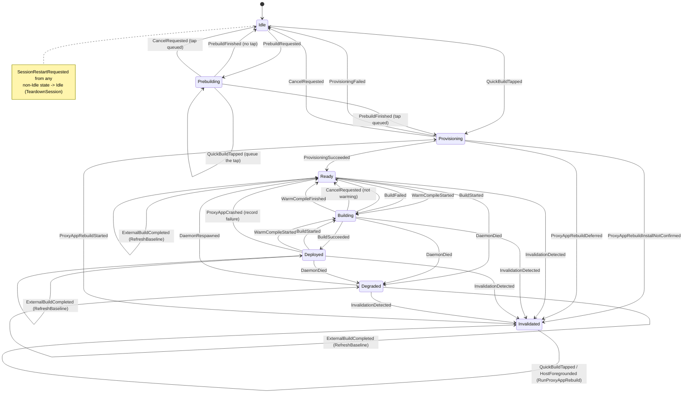

# `domain/session/` - the session state machine

Pure-JVM state machine for a quick-build session: its states, the events that drive them, the effects the shell must run, and what the user is told. No Android. `SessionReducer.reduce` is total - an unhandled (state, event) pair keeps the state and emits no effects, so a late or duplicate event can never corrupt the session. `QuickBuildStatus` and `QuickBuildTone` derive purely from state, so a stuck banner or a wrong icon color is unrepresentable.

| File | Purpose |
| --- | --- |
| [`SessionReducer.kt`](SessionReducer.kt) | The total transition function: maps (state, event) to next state plus ordered effects. |
| [`QuickBuildSessionState.kt`](QuickBuildSessionState.kt) | The state sealed type plus `SessionFailure`, `SessionEvent`, `SessionEffect`, and `SessionTransition`. |
| [`QuickBuildStatus.kt`](QuickBuildStatus.kt) | The status surface derived from state via `from(state)`. |
| [`QuickBuildTone.kt`](QuickBuildTone.kt) | The colorblind-safe toolbar tone derived from status via `toTone()`. |
| [`QuickBuildNotice.kt`](QuickBuildNotice.kt) | Enum of host-shown notices (named, not written, since this module has no `R`), each carrying its own tone. |
| [`QuickBuildMessage.kt`](QuickBuildMessage.kt) | Sealed type of named failure messages the host maps to string resources; `Literal` passes final text through. |

## State machine

This is the authoritative rendering: every transition with a guard, drawn in full. The copies in [quickbuild/README.md](../../../../../../../../../../README.md) and [docs/pipeline.md](../../../../../../../../../../docs/pipeline.md) are deliberately simplified for orientation.

Arrows are labeled with the `SessionEvent` that drives them; parentheticals note the guard or a key effect. Self-loops that only run an effect (a tap that triggers a live reload, a retry that kicks off a rebuild) are shown; pure no-ops are not.

The reducer is total: any (state, event) pair not drawn above keeps the current state and emits no effects.
