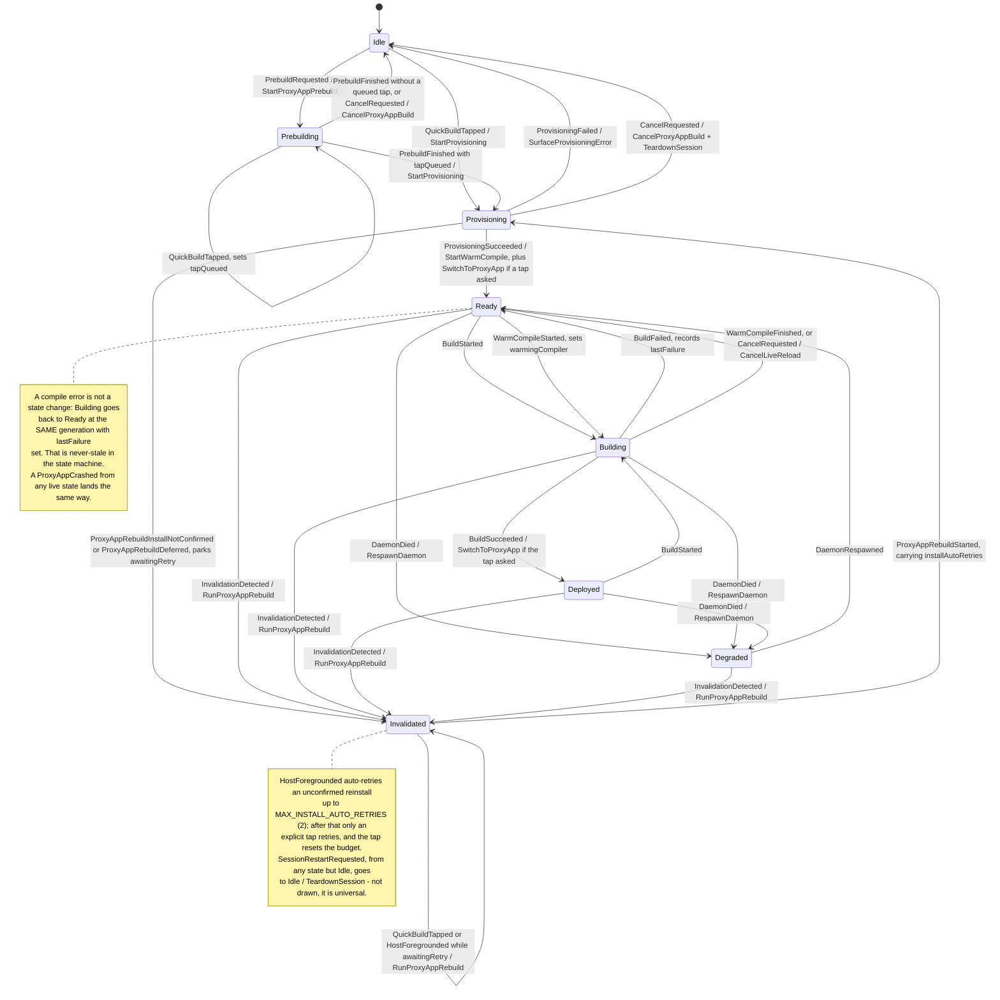
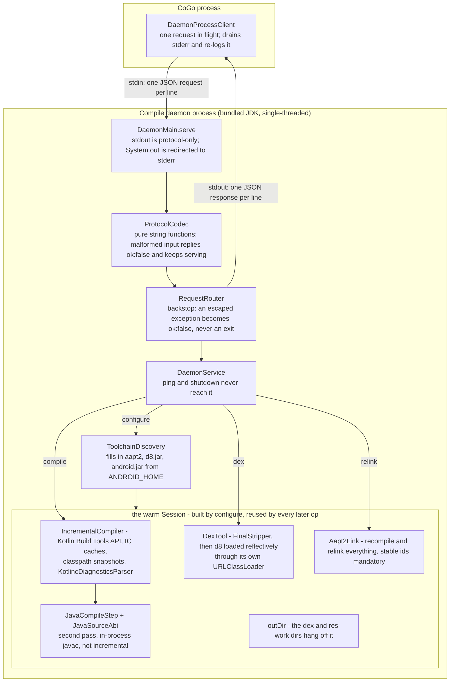

# Quick Build architecture, in diagrams

Four diagrams for someone who needs the shape of Quick Build before the detail: one sequence across the four processes, then one per stateful component - the session manager, the compile daemon, the runtime inside the proxy app. Every participant and box is a real class or process, checked against the source on this branch.

No measurements appear here. Latency numbers live in the [README](../README.md) and [`perf-roadmap.md`](perf-roadmap.md); the class-level map of every step is [`pipeline.md`](pipeline.md).

## The four processes, and every hop between them

Quick Build spans four processes, and each boundary is a different transport: Gradle over the tooling API, the compile daemon over line-delimited JSON on stdin/stdout, the proxy app over uid-checked binder AIDL. Arrows prefixed **[cross-process]** leave CoGo; self-messages are work inside CoGo. Steps 1-6 happen once per baseline, the loop repeats per save.

```mermaid
sequenceDiagram
    autonumber
    actor Dev as You
    participant CoGo as CoGo process
    participant Daemon as Compile daemon process
    participant App as Proxy app process
    participant Gradle as Gradle process

    Note over CoGo,Gradle: Once per baseline - prebuild at project open, then the first tap provisions
    CoGo->>Gradle: [cross-process, tooling API] proxy app build (assemble + QuickBuildProxyAppReportTask)
    Gradle-->>CoGo: [cross-process] setup.json -> ProxyAppInfo
    CoGo->>CoGo: ProxyAppInstaller - install unless the APK sha256 matches the installed one
    CoGo->>Daemon: [cross-process, spawn + stdin JSON] configure (classpath, aapt2, d8.jar, android.jar)
    Daemon-->>CoGo: [cross-process, stdout JSON] ok + scratchFsType
    CoGo->>App: [cross-process, launch intent] ProxyAppLauncher (a tap only; a rebuild stays in the editor)
    App->>CoGo: [cross-process, binder] IQuickBuildHost.connect(target, packageName, runningGeneration)

    Note over Dev,Gradle: Per save - the warm loop
    Dev->>CoGo: file write (editor save, git pull, Termux script)
    CoGo->>CoGo: AndroidProjectWatcher - FileObserver + mtime poll, debounced into one batch
    CoGo->>CoGo: WatcherBatchReconciler -> ChangedFiles.Known
    CoGo->>CoGo: ChangeClassifier -> BuildRoute
    alt live-reload route (CodeOnly, ResourcesOnly, CodeAndResources, AssetsOnly)
        CoGo->>Daemon: [cross-process, stdin JSON] compile(allSources, changed, removed)
        Daemon->>Daemon: IncrementalCompiler (Kotlin Build Tools API), then JavaCompileStep (javac)
        Daemon-->>CoGo: [cross-process, stdout JSON] classesDir + classesChanged + timings
        CoGo->>Daemon: [cross-process, stdin JSON] dex(classesDirs)
        Daemon->>Daemon: FinalStripper, then DexTool (d8 through its own URLClassLoader)
        Daemon-->>CoGo: [cross-process, stdout JSON] classes.dex
        opt resources changed
            CoGo->>Daemon: [cross-process, stdin JSON] relink(resDirs, manifest, stable ids)
            Daemon-->>CoGo: [cross-process, stdout JSON] the relinked resource apk
        end
        CoGo->>CoGo: GenerationTracker allocates gen N; DeployPolicy picks Recreate or Restart
        CoGo->>App: [cross-process, binder + fds] IQuickBuildTarget.onPayload(gen N, dex, resources, assets, metadata)
        App->>App: PayloadPersistence write, PayloadStore.apply, ResourceStore.applyTable
        App->>App: ActivityTracker.topActivity().recreate() - or exit, for a Restart deploy
        App->>CoGo: [cross-process, binder] IQuickBuildHost.reportReloaded(gen N, reloadMillis)
    else compile error - no payload is produced
        CoGo->>App: [cross-process, binder] IQuickBuildTarget.onBuildStatus(build_failed)
        App->>App: StatusOverlay banner; the app keeps running the last good generation
    else FullGradleBuild route - the only fallback
        CoGo->>Daemon: [cross-process, stdin JSON] shutdown, before Gradle starts
        CoGo->>Gradle: [cross-process, tooling API] proxy app rebuild
        Gradle-->>CoGo: [cross-process] a fresh baseline; reinstall if the APK changed, then configure again
    end
```

A generation is allocated only after compile and dex succeed, which is why a compile error burns none. The daemon is shut down before a rebuild deliberately: Gradle's peak and a warm daemon should not share a low-spec device's memory, and the daemon's incremental state is stale after a rebuild anyway.

Step by step, with the file that implements each: [`pipeline.md`, the eight steps](pipeline.md#the-eight-steps). Watching and classification are [step 3](pipeline.md#step-3-watch-and-normalize-quickbuildcore-data--domain) and [step 4](pipeline.md#step-4-live-reload-orchestration-quickbuildcore-domain--service).

## The session manager: eight states, one pure reducer

[`SessionReducer`](../core/src/main/java/org/appdevforall/cotg/quickbuild/domain/SessionReducer.kt) is total - an unhandled (state, event) pair keeps the state and emits no effects - and [`QuickBuildSessionManager`](../core/src/main/java/org/appdevforall/cotg/quickbuild/service/QuickBuildSessionManager.kt) runs the effects on one single-threaded dispatcher. Edge labels read `event / effect`; `Ready` and `Deployed` share one reducer branch, so they answer the same events.



What each recovery state carries, the eight `InvalidationReason` values and the retry budget: [`pipeline.md` step 2](pipeline.md#step-2-session-control-and-provisioning-quickbuildcore-service--app) and [step 7](pipeline.md#step-7-proxy-app-rebuild-and-recovery-reducer-states--session-control).

## The compile daemon: one warm session, four ops

A pure-JVM child process on the bundled JDK, single-threaded because CoGo serializes requests. Its whole state is the `Session` that `configure` builds - the incremental caches and tool wrappers that make a warm compile fast - and `compile`, `dex` and `relink` reuse it. An op arriving before any `configure` answers `ok:false`, and a re-configure closes the old `DexTool` and replaces the session.



The four compile-chain constraints that degrade silently, and why d8 is loaded reflectively: [`pipeline.md` step 5](pipeline.md#step-5-compile-daemon-quickbuilddaemon). The wire format itself is [`protocol/README.md`](../protocol/README.md).

## The runtime inside the proxy app: one live generation

The Java-only AAR compiled into the user's app. It is installed at Application instantiation, holds exactly one live generation process-wide, and rolls back rather than staying broken: a reload that throws restores the previous payload and reports the crash, so the app keeps running the last working code and says so.

```mermaid
flowchart TB
    subgraph boot["Process start, before any deploy"]
        f["QuickBuildAppComponentFactory<br/>declared android:appComponentFactory; the earliest hook an AAR gets"]
        r["QuickBuildRuntime.install<br/>ActivityTracker, ComponentMap, crash guard - no Context yet"]
        b["PayloadStore.ensureBaseline<br/>the baked gen-0 dex, then the newest persisted generation"]
        c["first activity: QuickBuildClient.bind + attachPersistence<br/>BIND_AUTO_CREATE, so a CoGo restart reconnects"]
        k["IQuickBuildHost.connect(target, packageName, runningGeneration)"]
        f --> r --> b --> c --> k
    end
    subgraph deploy["One deploy - onPayload, on a binder thread"]
        p["IQuickBuildTarget.onPayload(gen N, dex?, resource apk?, assets zip?, metadata)"]
        g{"Generations.accepts(running, N)?"}
        drop["dropped, unreported - acking a refused payload would mislead CoGo"]
        per["PayloadPersistence - temp-then-rename, meta.json last"]
        rq{"metadata.restart?"}
        ex["reportReloaded, then exitForRestart<br/>the fresh process boots the persisted generation"]
        ap["PayloadStore.apply - InMemoryDexClassLoader, APK loader as parent"]
        rs["ResourceStore.applyTable / applyAssets"]
        mainthread["main thread: topActivity().recreate(), else launchEntryActivity"]
        okk["onActivityResumed -> IQuickBuildHost.reportReloaded"]
        bad["failReload -> PayloadStore.restore(previous) + IQuickBuildHost.reportCrash"]
        p --> g
        g -- "no, not strictly newer" --> drop
        g -- "yes" --> per --> rq
        rq -- "yes: a service, provider or Application class changed" --> ex
        rq -- "no" --> ap --> rs --> mainthread
        mainthread -- "rendered" --> okk
        mainthread -- "threw" --> bad
    end
    subgraph hold["What stays live between deploys"]
        h1["PayloadStore - one immutable Payload, generation and loader swapped together"]
        h2["ResourceStore - one ResourcesLoader on API 30+, LegacyResourceSwap on 28/29 (ResourceSwapStrategy)"]
        h3["ActivityTracker (weak refs) + ServiceTracker (identity census)"]
        h4["LoaderRouter + QuickBuildClassLoaders - every by-name lookup routes to the payload loader"]
        h5["OverlayState -> StatusOverlay + JumpToEditor, fed by onBuildStatus"]
    end
```



Why `getClassLoader()` is overridden on every activity proxy, the persist-ordering rule, and the API-level resource-swap split: [`pipeline.md` step 6](pipeline.md#step-6-deploy-and-reload-quickbuildruntime). Which components get a proxy at all: [`component-proxying-design.md`](component-proxying-design.md).
