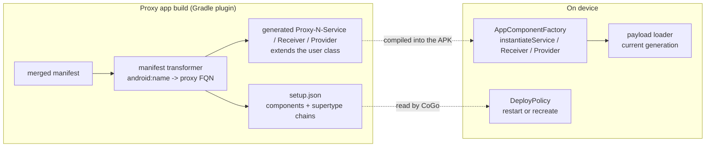
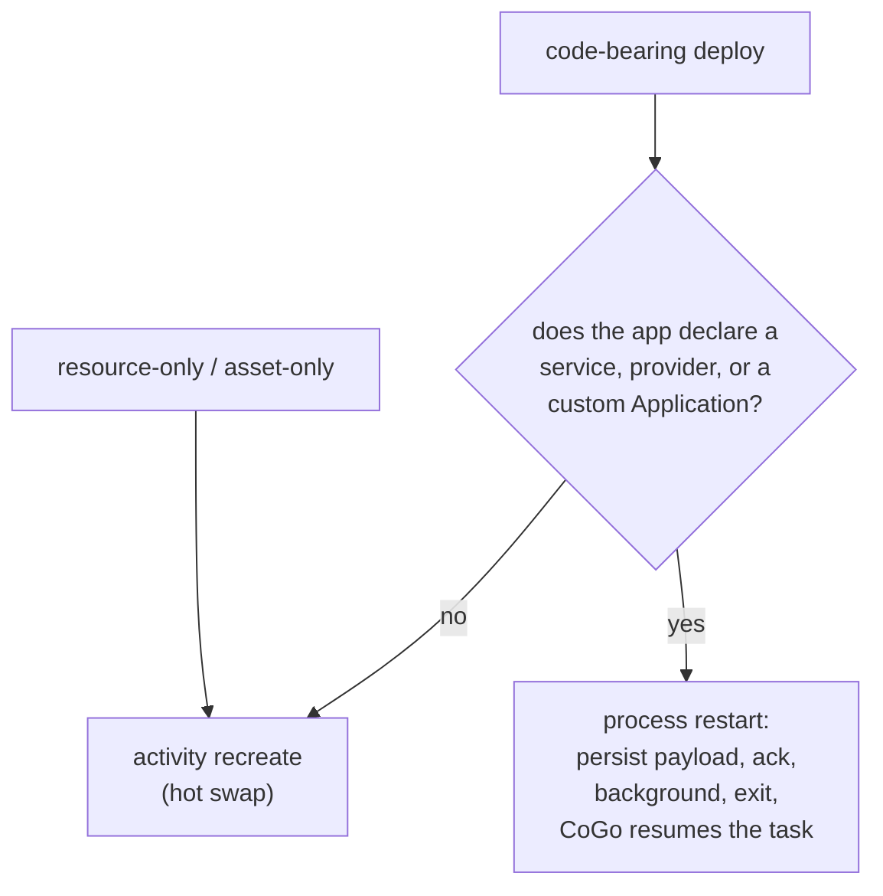

# Component proxying

The generated proxy app names generated `Proxy<N><Type>` classes in its manifest instead of the
user's own. This page says why, which Android components that covers, how the Gradle plugin builds
it, and the constraints a change here must not break. It is the design as built (ADFA-4128, the
initial implementation) - not a change to something already shipped.

## Why proxy at all

- **The user's classes are deliberately absent from the installed APK.** They travel only in the
  swappable payload dex, so the parent-first classloader chain can never serve a stale copy of a
  class the user just edited.
- **But Android instantiates manifest components by class name**, and the manifest is fixed at
  install time. Changing it means reinstalling - the cost Quick Build exists to avoid.
- **So the manifest must name a class that is in the APK and never changes**, while the code behind
  that name changes on every reload. A generated `Proxy<N><Type> extends <user class>` is that name;
  `QuickBuildAppComponentFactory` instantiates it through the current payload generation's loader.
- **The proxy is compiled once, at proxy app build time**, and bundled into every payload dex. Its
  `extends` is a *symbolic* reference resolved by name at load time, which is why the same compiled
  proxy keeps working as the user's class changes underneath it.
- **The proxy is also where the runtime injects behaviour.** Activity proxies carry a
  `getClassLoader()` override, so by-name resolution - Fragment and Navigation
  destinations, `LayoutInflater` custom views - can see payload-only classes; service proxies
  register with the runtime's live-service census. Receiver and provider proxies are empty
  subclasses: they exist for the stable name alone.

## What has to be proxied

Android instantiates five kinds of class by name from the merged manifest:

| Manifest element | Android class | Proxied | Why / note |
|---|---|---|---|
| `<activity>` | `android.app.Activity` | yes | Gains the `getClassLoader()` override |
| `<service>` | `android.app.Service` | yes | Registers with the live-service census; swaps by process restart |
| `<receiver>` | `android.content.BroadcastReceiver` | yes | Manifest-declared only - receivers registered at runtime are ordinary objects and need nothing |
| `<provider>` | `android.content.ContentProvider` | yes | Swaps by process restart |
| `<application android:name>` | `android.app.Application` | **no** | Keeps the user's FQN, which `instantiateApplication` resolves against the payload loader like any other component. A proxy would buy nothing: the runtime's own per-process hook (`QuickBuildRuntime.install`) already runs inside `instantiateApplication`, so there is no behaviour to inject via a subclass |

`<activity-alias>` is not instantiated itself, but its `targetActivity` must follow the activity it
points at, or the alias would reference a component the manifest no longer declares.

The `Application` is instantiated exactly once per process and never re-instantiated, so an app
that declares one restarts the process on every code-bearing deploy rather than hot-swapping.
See "Restart vs recreate".

## How: a Gradle plugin rewrites the merged manifest

`QuickBuildPlugin` transforms AGP's merged-manifest artifact: every component's `android:name`
becomes a generated proxy FQN, a `Proxy<N><Type> extends <user class>` source is generated and
compiled into the APK, and `<application>` gains the runtime's `android:appComponentFactory`.
For each proxied activity the transform also synthesizes an `<activity-alias>` under the
activity's REAL class name, pointing at the proxy - so an explicit in-app
`Intent(ctx, SomeActivity::class.java)` still resolves instead of throwing
`ActivityNotFoundException` (`QuickBuildManifestTransformer.transformActivities`). The alias
copies its target's `android:exported` verbatim (absent reads as `false`): the alias is the
only manifest entry left under the real name, so pinning it to `false` would reject a launch
that works under a standard run - a pinned shortcut or a share target the app published records
that real name, and the launcher is a different uid.
Everything else - permissions, icon, label, intent filters, `exported`, meta-data - is preserved
verbatim. A manifest *change* (adding a component, editing an intent filter) still needs a proxy
app rebuild; see
[the boundary](../README.md#edit-types-that-can-live-reload).

Subclassing works rather than delegation because the proxy and the user class both travel in the
payload dex, so a reload swaps the whole hierarchy at once.

## Alternatives, and why this one

| Approach | Why not |
|---|---|
| **No proxy: leave the user's own class names in the manifest** and let `AppComponentFactory` load them from the payload | Loads fine - this is exactly what the `Application` does today. What it loses is the injection point: no `getClassLoader()` override (so `LayoutInflater` and Fragment/Navigation by-name resolution cannot see payload-only classes), no live-service census. For a receiver or provider, which need none of those, the no-proxy option is genuinely close - they are proxied for uniformity. |
| **Delegation: one generic proxy per component type that forwards to a user instance** | A component's behaviour is inherited, not forwardable - lifecycle callbacks, `onBind`, `getResources`/theme overrides, and the concrete type that the framework and libraries check with `instanceof`. Subclassing keeps the real type. |
| **Rewrite the manifest on every reload** | A manifest change means a reinstall. That is the cost Quick Build exists to remove. |
| **Redefine classes in place (Apply Changes / HotSwap style)** | ART's redefinition cannot add or remove classes, methods or fields, so adding a class or a method - routine while developing - falls back to a full build anyway. |
| **Post-process the built APK inside CoGo instead of using a Gradle plugin** | The merged manifest, the variant's dependency artifacts and the compile classpath only exist inside the Gradle build. Doing it outside means re-implementing manifest merging and losing incrementality. |

**Why the Gradle plugin.** It is the only place with the merged manifest as a first-class artifact
and the variant's real classpath, so proxy generation is an ordinary incremental task rather than a
bolt-on; CoGo already injects Gradle plugins by init script, so it needs no new seam; and everything
it produces (`setup.json`, the proxy sources, the payload dex) is a declared task output that Gradle
caches and invalidates for us.

## What the proxy app must satisfy

Every decision above is trying to preserve these. When a change forces a trade-off, trade in this
order - 1 and 2 are not negotiable against the rest.

1. **It never silently runs stale code.** Every edit either live-reloads or visibly falls back to a
   real Gradle build. This outranks speed: a fast wrong answer is worse than a slow right one.
2. **It behaves like the real app.** Same `applicationId`, permissions, icon, label, intent filters
   and components; real resources; the merged manifest preserved verbatim apart from component
   names. Where it cannot, the difference is written down and surfaced to the user -
   [the boundary](../README.md#edit-types-that-can-live-reload) and the
   README's Known limitations. **A divergence nobody documented is a bug, not a limitation.**
3. **New classes, resources and assets plug in quickly and reliably.** Generated component names are
   stable across generations, so a reload never needs a manifest change; user classes travel in a
   swappable payload dex, resources through a replaceable loader.
4. **A reload never reinstalls.** The install is paid once, at provisioning. That is where
   seconds-instead-of-minutes comes from, so any design that reinstalls per edit has lost the point.
5. **It never strands the user's real app.** One install slot under the real `applicationId`,
   confirm-on-switch, and a completed Standard Run hands back to a live session - the user can
   always get back to an ordinary build.
6. **It runs standalone.** With CoGo not attached the proxy app still starts and runs the newest
   payload it persisted, rather than silently reverting to the baseline.
7. **It stays cheap to embed.** The runtime is compiled into the user's app, so it is Java-only with
   no CoGo dependencies - it must not drag `kotlin-stdlib` or anything else into someone's APK.
8. **Getting from the running app back to the next edit is smooth.** Today the OS app switcher is
   how the user returns to CoGo, and build failures are narrated into CoGo's Build Output pane
   (`QuickBuildOutputLines.kt`) rather than jumped to; the review-to-edit loop is where the next
   round of work goes. (An earlier tap-to-jump mechanism was removed on this branch.)

1-7 hold today. 8 is partial by design.

## Key decisions

- **Every component is proxied by default - user code and library code alike.** The transform never
  discriminates by origin; every exception comes from the resolver below, which decides from the
  class file rather than from whose code it is.
- **A component that defeats `extends` is never silently dropped.** A `final` library class is
  skipped and logged, keeping its real manifest name. One present only on the runtime classpath
  cannot be detected before compilation, so it fails the proxy app build loudly, naming the
  component and pointing the user at Run/Debug.

  **Skipping a `final` component costs nothing, in either direction.** Nothing changes for the
  user: the component keeps its real manifest name and the framework instantiates it exactly as
  in an ordinary app. It also costs no live-reload coverage, because the daemon only ever
  recompiles the project's own sources - a skipped library component is never one the user could
  have edited `[inferred]`. And it cannot be fixed by trying harder: a proxy *is* a generated
  subclass (`Proxy<N><Type> extends <userClass>`), and a `final` class cannot be extended, so
  covering it would mean rewriting library bytecode inside an offline on-device build - which
  buys nothing given the two lines above. Because
  [`ComponentProxiabilityResolver`](../../gradle-plugin/src/main/java/com/itsaky/androidide/gradle/quickbuild/ComponentProxiabilityResolver.kt)
  reads `ACC_FINAL` off the variant's dependency artifacts at manifest-transform time, a future
  `final` library component needs no CoGo release; a class it cannot find there is assumed
  project-owned and proxied.
- **`ComponentProxiabilityResolver` is the single authority on which components get proxied.**
  Both the manifest transform and the payload dex task ask it. It reads each component's class
  from the variant's dependency artifacts and skips any `final` one - from any library, named
  nowhere - leaving it under its real manifest name. Only what a class file cannot reveal is
  listed by name: androidx `InitializationProvider` (resolves itself by hardcoded name),
  `ProfileInstallReceiver` (absent from some proxy compile classpaths, and absence is
  indistinguishable from project-owned before compilation), and Firebase's
  `ComponentDiscoveryService` (an ordinary non-final class the SDK never instantiates - it reads
  its own `<meta-data>` by that exact name, so renaming it silently disables SDK discovery). Reasons live in that class's KDoc.
- **Provider authorities pass through verbatim.** The proxy app installs under the project's real
  `applicationId`, so `${applicationId}` resolves exactly as the real app's would.
- **Unsupported attributes fail the build with the component and attribute named** - no stripping,
  no silent loss. `android:process` and isolated/multi-process providers are the live cases.
- **The runtime persists the newest payload to disk.** Providers and the `Application`
  instantiate before the binder connects and are never re-instantiated, so without it they would
  pin to baseline code forever - a never-stale violation. A fingerprint mismatch or read failure
  falls back to gen-0.

## Restart vs recreate

Decided per app, not per edit: if the manifest declares a service, provider or custom
`Application`, every code-bearing deploy restarts the process.

**Why not key on the recompiled set.** It was tried, and it is wrong. A payload is never a
delta: `DexTool.dex` walks the compiler's whole output tree, so every generation ships every
user class and a hot swap re-defines all of them through a fresh loader. The held instance -
the `Application`, a live service, a provider - keeps the previous class, and the first cast
across the two throws `ClassCastException: Foo cannot be cast to Foo`. A rule that asks
whether the edit *named* the component therefore passes on exactly the edits that break the
app: measured on an A56, an edit to a string literal in an activity's `onCreate` crashed a
probe app that declares its own `Application`
(`spike2-repro-restart-jvmti-2026-08-20.md`).

Keeping every class in place instead - JVMTI `RedefineClasses`, or compile-time dispatch
injection - is the real answer and is deferred to a follow-up; see
`hot-swap-correctness-plan-2026-08-20.md`.

- **Receivers are deliberately not in the restart set** - manifest receivers are instantiated
  fresh per delivery, so they already run current code.
- **Nor are the components CoGo injects.** `LogSenderPlugin` puts the logsender AAR into every
  debuggable variant, so its `LogSenderService` and `LogSenderInstaller` reach the policy in
  every app - and without an exemption every app would restart on every save. They are safe
  because they ship in the base APK dex and never enter a payload, so no generation redefines
  them; the exemption is keyed on those two exact class names for exactly that reason, since a
  library class that *did* land in the payload would still be redefined. One predicate
  (`ComponentInfo.isRestartSensitive`) applies it to both the restart decision and the
  stale-helpers notice. See `live-reload-alternatives.md`.
- **The restart is honest, not clever**: the process really dies and reboots from the persisted
  generation, reusing the never-stale catch-up path rather than inventing one.
- **It is cooperative, so the user keeps their place.** Before killing, the runtime moves its own
  task to the back and waits for Android to capture the top activity's state
  (`RestartHandoff`); CoGo then relaunches with the launcher's own intent, which resumes the
  surviving task. The user comes back to the screen they were on, with that screen's saved state
  and the back stack. Measured on an A56: 586 ms against 563 ms for a launcher relaunch that
  loses all three, 3 of 3 replicates. Two things follow from this and are easy to undo by
  accident:
  - **The kill must come from inside the app.** CoGo binds the app's keep-alive service to hold
    it out of the cached-app freezer, which also holds it out of the killable bucket, so
    `am kill` reports success and leaves the process running (3 of 3 on an A56).
  - **The relaunch must be the launcher's intent, not an explicit component.** An explicit one
    means "start this screen", and against a just-killed task it was delivered to the dead top
    record and dropped, leaving the app down in 2 of 8 restart deploys.
  - What is still lost is state outside `onSaveInstanceState`, and, for anyone debugging, the
    attached session: the process is gone, so the debugger detaches.
- **Skew guard.** An older installed baseline whose baked runtime predates restart support would
  ignore the restart flag and hot-swap - stale. `setup.json`'s top-level `schema` field gates it:
  below schema 2, a restart-requiring deploy routes to a full proxy app rebuild, which
  self-heals by regenerating a schema-2 baseline.
- **Accepted residual**: a *live* service or provider keeps calling old copies of recompiled
  non-component helper classes until its next restart - a loader swap updates instantiation, not
  live object graphs. Same kind as an activity mid-recreate; see README "Known limitations".

## Where the code lives

| Concern | Code |
|---|---|
| Manifest rewrite, authority recording | `gradle-plugin/.../QuickBuildManifestTransformer.kt` |
| Which components can be proxied (the one authority) | `gradle-plugin/.../ComponentProxiabilityResolver.kt` |
| Proxy source generation | `gradle-plugin/.../ProxySourceGenerator.kt` |
| `setup.json` shape and schema version | `gradle-plugin/.../QuickBuildJson.kt`, read by `quickbuild/core/.../data/ProxyAppInfo.kt` |
| Supertype chains recorded per component (written, not currently read - the restart rule no longer needs them) | `gradle-plugin/.../SupertypeResolver.kt`, `domain/ClassHeader.kt` |
| Restart-vs-recreate decision | `quickbuild/core/.../domain/DeployPolicy.kt` |
| Component instantiation on device | `quickbuild/runtime/.../QuickBuildAppComponentFactory` |
| Payload persistence across process death | `quickbuild/runtime/.../PayloadPersistence` |

Tests sit beside each of those; `DeployPolicyTest` is the one to read first, since it pins the
restart rule and the skew guard.

## Known gaps

- **Multi-process components are unsupported** - per-process payload and generation coherence is
  unverified, so `android:process` fails the build rather than deploying something unproven.

  **One `android:process` anywhere costs the whole project Quick Build.** The switch is per
  project, not per component, so a single component in a second process - often one the user
  never wrote, pulled in by a library - turns live reload off for the whole app and sends every
  save through the standard Gradle build. Why a second process cannot be served today: a reload
  delivers one payload into one process and swaps that process's classloader, so a component
  living elsewhere would keep executing the baseline dex - half the app new, half of it old,
  which is precisely the staleness Quick Build guarantees cannot happen. Serving it needs a
  second delivery channel, a second baseline and generation to track, and a restart closure
  spanning processes; none of that exists.

  The failure is loud and early rather than a late loss of behavior:
  [`QuickBuildManifestTransformer`](../../gradle-plugin/src/main/java/com/itsaky/androidide/gradle/quickbuild/QuickBuildManifestTransformer.kt)
  rejects a non-blank `android:process` on any component (and `android:isolatedProcess` on a
  service, `android:multiprocess` on a provider), naming the component and pointing at Standard
  Run, so provisioning fails outright. What the user does *not* get is an in-app explanation:
  `QuickBuildNotice` has no case for this fallback (verified against the enum - it carries
  `BUILD_CANCELLED`, `RELOAD_CRASHED`, `STALE_COMPONENT_HELPERS`, `RELINK_STUCK` and
  `PROXY_APP_WONT_STAY_UP`, none of which fit), so the only account of it is the build log
  `[inferred]`.

  Evidence: corpus app `notes` on both devices
  (`corpus/results/20260725T161105Z-e2e-bench/notes__provision.logcat.txt`). Its *standard*
  build succeeds on the A56, which proves this is a Quick Build limitation and not an app defect
  `[measured on a56, measured on c107]`.
- **A runtime-only library component still has to be excluded by name.** The manifest transform
  searches the variant's DEPENDENCY artifacts, which resolve without compiling anything;
  `variant.compileClasspath` cannot be used there, because it drags in `processResources` (for
  the project's own R jar), which needs the very manifest this task produces - a real cycle,
  reproduced on demand by the mutation in `QuickBuildProxyAppBuildTest`'s KDoc. The cost of the
  narrower view: a class it cannot find is either project-owned or runtime-only, and nothing at
  that point distinguishes them, so the runtime-only case stays a named entry.
- **Renaming or moving a proxied component class is untested, and proxying may make it worse than
  no-proxy would.** The payload's proxy classes are the ones compiled at proxy app build time, so
  `Proxy0Activity extends com.foo.MainActivity` keeps resolving that name at load time - fine while
  the class merely changes, but a *rename* removes the target. Under proxying the manifest does not
  mention the user class, so the edit stays on the live reload path; without proxying it would have
  edited the manifest and correctly forced a Gradle build. Nothing in the code detects this today
  and no test or device walk covers it. Needs a device repro before we claim either way.
- **Tightening the live-instance residual** - restart on any code deploy while a tracked service
  is live - is possible behind a flag (the service census exists). Price it with metrics first.
