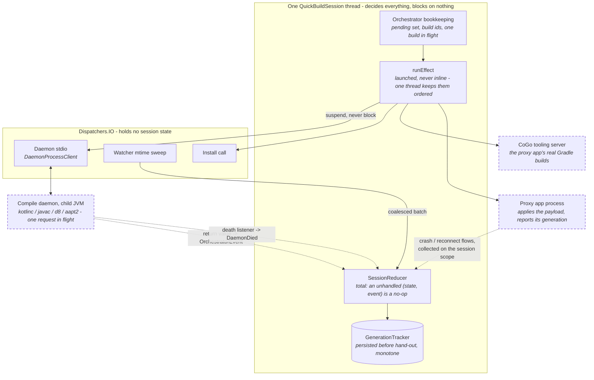
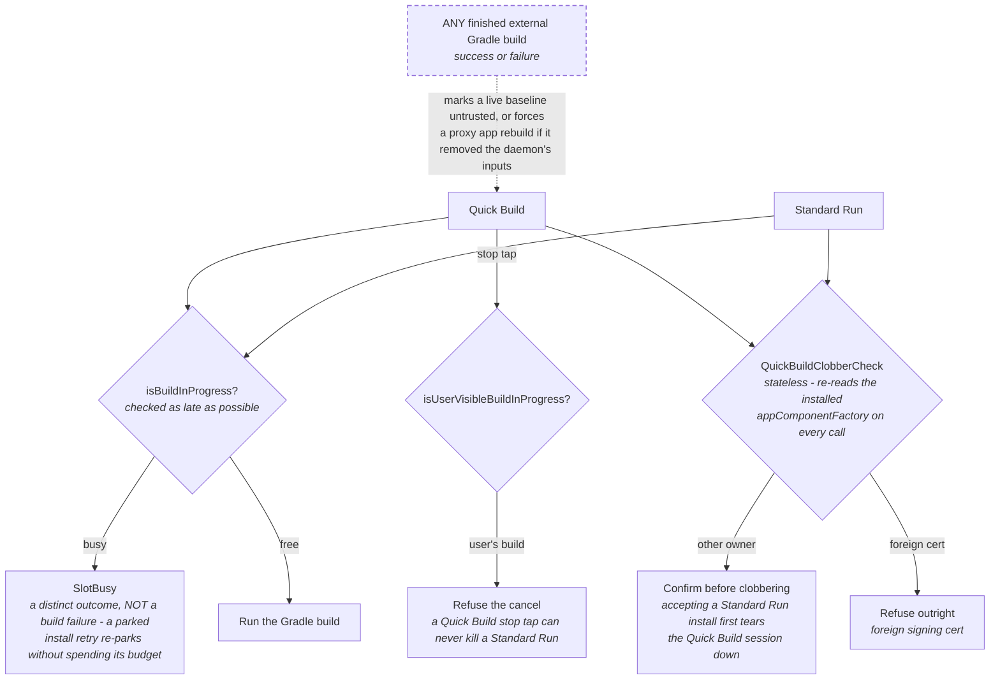

# Quick Build concurrency and contention

One thread decides everything; every expensive thing runs in another process. That is the whole model. `[inferred from code]`

| Runs on | What runs there | Wired in |
| --- | --- | --- |
| One `QuickBuildSession` thread | the reducer, every session effect, the orchestrator's bookkeeping, the generation counter, watcher batch delivery | [`QuickBuildModule.kt`](../../app/src/main/java/com/itsaky/androidide/di/QuickBuildModule.kt) (`newSingleThreadExecutor`) |
| `Dispatchers.IO` | daemon process I/O, the watcher's mtime poll sweep, the install call | [`DaemonProcessClient`](../core/src/main/java/org/appdevforall/cotg/quickbuild/data/DaemonProcessClient.kt), [`AndroidProjectWatcher`](../core/src/main/java/org/appdevforall/cotg/quickbuild/data/AndroidProjectWatcher.kt) |
| A child JVM (the daemon) | incremental Kotlin compile, `javac`, `d8`, `aapt2` relink | [`DaemonMain`](../daemon/src/main/kotlin/org/appdevforall/cotg/quickbuild/daemon/DaemonMain.kt) |
| CoGo's tooling server | the proxy app's real Gradle builds (prebuild, provision, rebuild) | [`GradleQuickBuildProvisioner`](../../app/src/main/java/com/itsaky/androidide/quickbuild/GradleQuickBuildProvisioner.kt) |
| The proxy app process | applying the payload and reporting the generation it now runs | [`:quickbuild:runtime`](../runtime/src/main/java/com/itsaky/androidide/quickbuild/runtime/) |



Every dotted edge is a result **hopping back onto the session thread**. Nothing outside that box ever touches session state, which is why there are no locks around it.

**What is single-threaded, and why.** All session state - the reducer's state, `live`, both epochs, the generation counter - is touched only on the session thread, so there are no locks around it and no interleavings to reason about ([`QuickBuildSessionManager`](../core/src/main/java/org/appdevforall/cotg/quickbuild/service/session/QuickBuildSessionManager.kt)). Three properties depend on that thread being *one* thread:

- **Effects are launched, not run inline.** `runEffect` launches each effect so a dispatch can never re-enter itself; the launches still land in order because there is one thread. Swap in `Dispatchers.IO` and ordering breaks with no crash and no failing test (README, invariant 3 of [Areas to Be Careful Of](../README.md#areas-to-be-careful-of)).
- **The reducer is total.** An unhandled `(state, event)` pair keeps the state and produces no effects ([`SessionReducer`](../core/src/main/java/org/appdevforall/cotg/quickbuild/domain/session/SessionReducer.kt)), so a late, duplicate or out-of-order event is a no-op rather than a corrupt session. Every guard below can therefore be "drop it" instead of "unwind it".
- **Nothing on that thread may block.** Every outward call is `suspend`; the daemon client hops its process I/O to `Dispatchers.IO` and the watcher runs its stat sweep there. A blocking call added here stalls the whole session.

**What is farmed out, and how results come back.** The session thread never compiles anything. Each build is one suspending pass through [`LiveReloadExecutorImpl`](../core/src/main/java/org/appdevforall/cotg/quickbuild/service/session/LiveReloadExecutorImpl.kt) - compile, dex, relink, deploy, strictly in order, each step one request to the daemon. The daemon holds **one request in flight** (`requestMutex`) and its own loop is single-threaded on purpose, so the pipeline is serial end to end; a request that exceeds `requestTimeoutMillis` (300 s) comes back as a failed reply rather than an exception. Results re-enter the model three ways, all of them hopping back onto the session thread: the executor's return value becomes an `OrchestratorEvent`, which the orchestrator delivers *outside* its own lock and the manager `launch`es into a dispatch; the proxy app's crash and reconnect reports arrive as flows collected on the session scope; the daemon's death arrives as a listener callback that dispatches `DaemonDied`.

**Quick Build vs Standard Run: two shared resources.** They contend for the device's one Gradle slot and the project's one package slot, and each has an explicit gate rather than a lock.

| Shared resource | Gate | Behaviour when contended |
| --- | --- | --- |
| One Gradle build at a time | `buildService.isBuildInProgress`, checked as late as possible in [`GradleQuickBuildProvisioner`](../../app/src/main/java/com/itsaky/androidide/quickbuild/GradleQuickBuildProvisioner.kt) | returns `SlotBusy` - a distinct outcome, not a build failure. A parked install retry re-parks without spending its auto-retry budget, because it ran no build and prompted nothing. |
| One Gradle cancellation token | `isUserVisibleBuildInProgress` in `cancelProxyAppBuild` | refuses, so a Quick Build stop tap can never kill the user's Standard Run. |
| The editor's build UI (one listener) | `GradleBuildService.withInternalBuild`, spanning the *await* | a prebuild at project open does not drive the status line, the first-build notice, or relabel the Run button. There is no separate acquire/release pair: a leaked acquire would suppress the editor's build UI for the rest of the process, stranding the Run button on the Cancel-build label. |
| One package slot (the real `applicationId`) | [`QuickBuildClobberCheck`](../core/src/main/java/org/appdevforall/cotg/quickbuild/service/provision/QuickBuildClobberCheck.kt), stateless - it re-reads the installed `android:appComponentFactory` on every call | both directions confirm before clobbering; accepting a Standard Run install first tears the Quick Build session down. A foreign signing cert is refused outright ([`RealIdInstall`](../core/src/main/java/org/appdevforall/cotg/quickbuild/domain/reload/RealIdInstall.kt)). |



Hand-back closes the loop: *any* finished external Gradle build - success or failure - marks a live session's baseline untrusted, or forces a proxy app rebuild if that build removed the artifacts the daemon reads ([`QuickBuildSessionManager.refreshBaseline`](../core/src/main/java/org/appdevforall/cotg/quickbuild/service/session/QuickBuildSessionManager.kt)).

**Multiple edits arriving mid-build.** Nothing queues per save and nothing is dropped.

```mermaid
sequenceDiagram
    autonumber
    participant U as Saves
    participant W as Watcher + coalescing
    participant O as Orchestrator<br/>(session thread)
    participant D as Daemon (child JVM)
    participant A as Proxy app

    U->>W: burst of writes (save-all, git pull, codegen)
    Note over W: emit 150 ms after the LAST event,<br/>capped 1 s from the first;<br/>last event per path wins
    W->>O: ONE batch, vanished rename-temps dropped
    O->>O: pending set MOVED into build #1
    O->>D: compile / dex / relink, serial

    U->>W: more saves arrive mid-build
    W->>O: batch 2
    Note over O: never cancels build #1 - it waits.<br/>batch 2 joins the pending set

    D-->>O: result, tagged build #1
    alt build id still current
        O->>A: payload at generation N+1
        Note over A: accepted only if STRICTLY newer<br/>than what it runs
        O->>O: pending set clears
    else superseded (a baseline reset raced it)
        Note over O: result discarded, never rendered.<br/>the daemon has no cancel op, so that<br/>compile ran to completion unheard
    end
    O->>D: build #2, from the pending set
```

On failure the batch is unioned back into pending, so the only way a save leaves the set is a build that succeeded with it.

**The Quick Build tap races its own save.** `[measured on a56, 2026-08-13 manual QA; redesign implemented 2026-08-13, unverified on device]`

The tap awaits a save-all, then triggers ([`QuickBuildAction`](../../app/src/main/java/com/itsaky/androidide/actions/build/QuickBuildAction.kt)). The coalescer emits 150 ms after the last event - so at tap time the save is on disk but its batch is still inside the quiet window, and pending is empty. This is deterministic, not a race that sometimes wins: every tap with a dirty buffer sees an empty pending set. Four consequences, all observed in one QA run:

- the tap routes as a forced `NoOp` - a whole-module blind recompile where an incremental would do;
- the batch (the very files the tap saved) lands mid-build and rebuilds identical bytes behind it (7 echo pairs, 38.9 s of duplicated build time in a 20-minute session);
- the forced path derives its asset list from the (empty) changed set, so it ships no assets - the "redundant" echo build is what actually delivers an asset save;
- a `build.gradle.kts` echo arriving while a rebaseline absorbs the pending set strands unaccounted, and resurfaces on `onBaselineReset` as a spurious `GRADLE_CONFIG_CHANGED` 27 ms after the rebaseline succeeded.

The redesign (implemented 2026-08-13) keeps the watcher as the **single** changeset source (seeding the tap with saved file names was considered and rejected - a second ingestion path):

1. The tap carries one bit: whether its save-all wrote anything. Wrote something -> arm the on-deploy switch and let the coalescer's batch drive the one, correctly-routed build. Wrote nothing, pending empty, runtime at the deployed generation -> switch to the app and build **nothing**.
2. The baseline generation becomes monotonic: a rebaseline stamps the next generation from the persistent counter into the proxy APK (a sibling asset of the baseline payload, read the same pre-Context way), instead of [`PayloadStore`](../runtime/src/main/java/com/itsaky/androidide/quickbuild/runtime/PayloadStore.java)'s constant 0. A post-rebaseline reconnect then reads in-sync by construction, and the reconnect check needs no change.
3. A same-baseline reconnect below the deployed generation (persistence lost) is answered by **re-sending the retained last payload**, not by rebuilding - payloads are cumulative over the baseline, and the session still holds the bytes it last deployed.
4. The forced blind rebuild survives only as last-resort repair: runtime behind and no retained payload to send.
5. A batch arriving during absorption whose files the running Gradle build will read anyway is absorbed with the rest, not stranded.
6. The deferred foreground ask expires: a 34-second-old ask must not beat where the user is now.

Two bounded non-fixes, deliberate: the watcher's hybrid design (inotify + 2 s mtime-xor-size poll sweep) already bounds a missed event, so the tap needs no repair semantics; and the 1 s coalescer cap can still split a save-all slower than the cap into two builds - rare, self-correcting, and the fix (hold the cap while a save-all is in flight, over the same one-bit channel) is designed but deferred until observed in practice.

- **Coalesce first.** A burst of writes (save-all, `git pull`, codegen) becomes one batch: emit 150 ms after the last event, capped 1 s from the first, last event per path wins ([`ChangeCoalescing.kt`](../core/src/main/java/org/appdevforall/cotg/quickbuild/domain/watch/ChangeCoalescing.kt)). [`WatcherBatchReconciler`](../core/src/main/java/org/appdevforall/cotg/quickbuild/domain/watch/WatcherBatchReconciler.kt) then drops rename-tool temps that vanished, so one stray file cannot push the batch to a full Gradle build.
- **One build in flight, everything else coalesced.** Starting a build *moves* the pending set into it; the set clears only on success and a failed batch is unioned back ([`LiveReloadOrchestrator`](../core/src/main/java/org/appdevforall/cotg/quickbuild/domain/reload/LiveReloadOrchestrator.kt)). New work never cancels a running compile - it waits. Only a stop tap abandons a build, and even then the batch returns to pending.
- **Every result carries its build id.** A build whose id no longer matches the in-flight one was superseded (a baseline reset raced it); its result is discarded, never rendered. The daemon has no cancel op, so a cancelled build's compile still runs to completion unheard - it can delay the next build, but cannot deploy.
- **Generations only go up.** [`GenerationTracker`](../core/src/main/java/org/appdevforall/cotg/quickbuild/domain/reload/GenerationTracker.kt) persists a number *before* handing it out, so a crash burns it rather than letting a later session reuse it. The proxy app accepts a payload only if it is *strictly* newer than what it runs ([`PayloadStore`](../runtime/src/main/java/com/itsaky/androidide/quickbuild/runtime/PayloadStore.java)), which is what makes "an old payload cannot replace a newer one" hold even when a deploy races a reconnect.
- **Two epochs guard every async result.** `sessionEpoch` is bumped by every teardown, and a provision or rebuild that captured the old value discards its result - otherwise a provision completing after "Restart session" would install a zombie session with a live watcher behind an `Idle` UI. The daemon has its own epoch with an exactly-one-transition rule ([`QuickBuildDaemonController`](../core/src/main/java/org/appdevforall/cotg/quickbuild/service/session/QuickBuildDaemonController.kt)), so a respawn racing a teardown cannot leave two daemons.
- **Quick builds are suspended while a proxy app rebuild runs.** The pending set is handed to Gradle as absorbed and restored if the rebuild fails; saves that arrive mid-rebuild stay pending and build when the new baseline lands.

**Where reliability comes from.** Named mechanisms, each with a bounded failure mode:

| Mechanism | What it prevents |
| --- | --- |
| Reducer totality + single-threaded effects | a late or duplicate event corrupting a session |
| Build-id supersession + the two epochs | stale work applying itself over fresher state |
| Generation monotonicity + the runtime's strictly-newer gate | a stale payload reaching a running app |
| Coalesce-and-union pending set | a save being lost, or one build per keystroke |
| `SlotBusy` as a distinct outcome | Gradle contention reading as a build failure |
| Stateless clobber check | a cached view of the package slot going stale after an install outside CoGo |
| Bounded retries: 2 identical pipeline failures escalate once (latched), 2 foreground install auto-retries | a failing recovery path retrying forever |
| Reconnect catch-up ladder: the runtime restores its persisted payload; a rebaselined APK boots at its monotonic stamped generation; a runtime still reporting `runningGeneration` < `lastDeployedGeneration` gets the retained payload re-sent; a forced rebuild only when retention is missing | a relaunched app silently running old code |

None of this is device-verified as a set `[unverified on device]`, and the ordering invariants above break without any test going red - see [Areas to Be Careful Of](../README.md#areas-to-be-careful-of).
