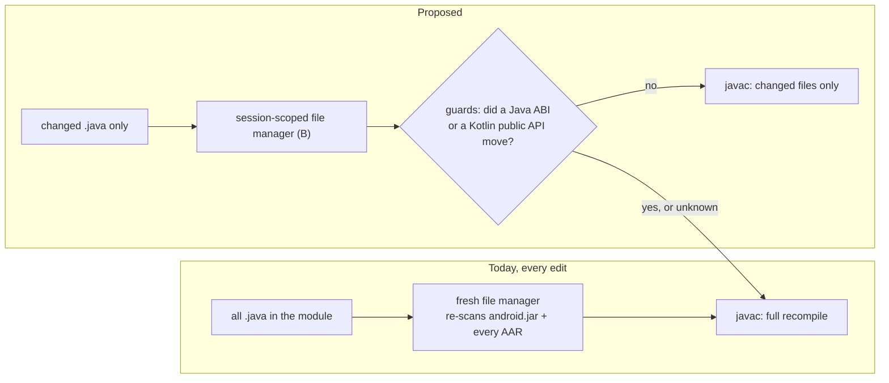

# Incremental javac in the Quick Build daemon

Design for making the daemon's javac pass cost-proportional to the edit. **Nothing here is
implemented.** The two guards below are the correctness argument - preserve them if you change
this area.

The problem: the daemon recompiles every `.java` file in the module on every save, which is how
Quick Build ends up slower than plain incremental Gradle on a Java-heavy app. `sora-editor-full`
(214 `.java` files) runs at 0.34-0.40x on warm edits [measured on a56, earlier pass]; it is still
the only app Quick Build loses on, at 0.76x on its Java-ABI edit in the 2026-08-11 pass
[measured on a56].

## Where the cost comes from

- **Every `.java` source is passed on every compile** - javac has no incremental mode of its own.
  On a 214-file module a host micro-benchmark puts the per-file path at 308 ms -> 7 ms
  [measured on host].
- **The file manager is rebuilt per compile**, so `android.jar`'s 27 MB zip index and every AAR
  jar is re-scanned, even though the session's classpath is fixed for its whole life. Reuse alone
  is worth ~24% [measured on host].
- **Modules with no `.java` pay none of this** - `JavaCompileStep` is never called.

## The design

Two independent changes, built in this order behind a new `quickbuild.javac.incremental` flag
(default off):

1. **B - reuse the file manager across the session.** Small and self-contained.
2. **A - compile only the changed files.** The correctness-sensitive half.

B goes first because the two risks are disjoint - stale cache versus stale bytecode - so a bug
stays attributable to one of them. Within A, wire the fallback to a full javac before the fast
path, so a guard bug costs speed rather than correctness.

## The two guards, which are the whole correctness argument

- **Guard 1: no Java ABI moved.** Already built (`JavaSourceAbi`), already gating the Kotlin side.
  It deliberately bakes constant initializer values into the fingerprint, because Kotlin inlines
  Java constants into its callers - a constant-value-only edit must not take the fast path.
- **Guard 2: no Kotlin-emitted public API moved.** Not built; this is the remaining work. It has
  to diff the pre/post output keysets rather than only the files it rewrote, or a *deleted* Kotlin
  class is invisible to it.
- Both fail conservative: unknown means full recompile.

## Alternatives

- **ECJ instead of javac** - rejected: a 3 MB dependency, an EPL audit, an incremental builder
  that is not a standalone API, and no measured win over A+B.
- **javac `TaskListener` dependency graph** - deferred: it only narrows the ABI-change path, and
  its payoff is unmeasurable until A+B set a baseline.
- **Annotation processing** - not a factor: the daemon passes `-proc:none`, and processor-input
  edits leave the live-reload path entirely (`ksp-kapt-feasibility.md`).

## Where the code lives

| Concern | Code |
| --- | --- |
| Compile orchestration, classpath snapshot, ABI baseline | `quickbuild/daemon/.../compile/IncrementalCompiler.kt` |
| javac invocation and the file manager | `quickbuild/daemon/.../compile/JavaCompileStep.kt` |
| Java ABI fingerprint (guard 1) | `quickbuild/daemon/.../compile/JavaSourceAbi.kt` |
| Current status and post-storage-move numbers | `perf-roadmap.md` |

## Not done yet

- Guard 2 - the only real implementation work left.
- Tests. They belong beside `IncrementalCompilerTest` in `:quickbuild:daemon:test`, and must cover
  at minimum: a body-only edit rewriting just its class, an ABI edit falling back, a deleted Kotlin
  class recompiling its Java callers, and a compile error *not* promoting the ABI baseline.
- The a56 sweep needs `javacMs` populated; today's device split is inferred from the c107
  breakdown plus the host curve [inferred].
- An ABI-changing Java edit still forces a full Kotlin recompile - a separate problem, tracked as
  lever 4 in `perf-roadmap.md`.
