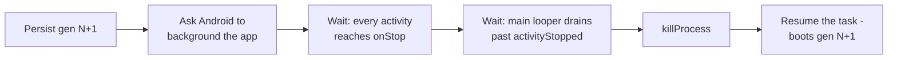

# Live reload

How a Quick Build code deploy reaches the running app, as shipped. The alternatives we
weighed and rejected are kept as history at the end. Vocabulary - generation, payload,
baseline, proxy app, `setup.json` - is defined in `pipeline.md`; how components are proxied
is in `component-proxying-design.md`.

## The shipped method

Every generation ships the **whole** user class set: `DexTool.dex` dexes the daemon's compile
output tree, never a delta, and `PayloadStore.apply` loads it through a **fresh**
`InMemoryDexClassLoader` parented to the APK loader. So a deploy redefines every user class,
whatever the edit was.

That is what forces the restart rule. An object the app holds across the deploy - a custom
`Application`, a live `Service` or `ContentProvider` - keeps the previous copy of its class,
and the first cast between old and new throws `ClassCastException: Foo cannot be cast to Foo`.
Reproduced end to end on device `[measured on a56, 2026-08-20]`.

### The restart rule

A code-bearing deploy **restarts** the proxy-app process when the app declares a
restart-sensitive component - `<service>`, `<provider>`, or a custom `Application` - and
**hot-swaps** otherwise. `DeployPolicy` decides it. A save that compiles no code - a resource
or asset edit - never reaches this rule: it follows the resource path (`resource-updates.md`)
and never restarts.

- The rule keys on what the app **declares**, not on what the compile touched. Keying on the
  recompiled set is what let an activity-only edit crash the app: the payload redefines the
  `Application` either way.
- Activities and receivers never count. Recreate already refreshes an activity, and a manifest
  receiver is instantiated fresh per delivery through the component factory.
- A baseline whose `setup.json` predates schema v2 has no component list and a runtime that
  would ignore a restart request, so a code deploy there falls back to a full proxy-app
  rebuild rather than hot-swapping something stale. One carve-out: a compile that emitted
  nothing deploys nothing that can stale a component, so it recreates instead of paying the
  rebuild.

### The CoGo-component exemption

**CoGo's own injected components do not count.** Exactly two class names are exempt
(`COGO_INJECTED_COMPONENTS`, `quickbuild/core/.../domain/reload/ComponentInfo.kt`):

| Class | Kind |
|---|---|
| `com.itsaky.androidide.logsender.LogSenderService` | service |
| `com.itsaky.androidide.logsender.utils.LogSenderInstaller` | provider |

Without this, **every** app restarts on **every** save: `LogSenderPlugin` adds the logsender AAR
to every debuggable variant, so its service and installer provider land in every app CoGo
builds, and the restart rule saw them as the user's held components.

Why it is safe: those two classes ship in the **base APK dex** and are absent from every
per-generation payload dex, which is exactly the daemon's compile output plus the generated
proxy classes. The AAR reaches the build only as a runtime dependency and a compile classpath
entry - never as a project artifact, and the class divert (`QuickBuildPayloadTransformTask`)
is registered at `ScopedArtifacts.Scope.PROJECT`, which covers the project's own classes only
(`component-proxying-design.md`) - so it is never dexed into a payload. Payload loaders are parent-first with the APK loader as parent, so
every generation's `Proxy0Service` resolves the **same** `LogSenderService` class object. Their
identity cannot change across a deploy, and the crash the restart rule exists to prevent cannot
arise from them. The proxies hold no state of their own: `ProxySourceGenerator` emits an empty
subclass for services and providers.

Why it is keyed on **exact** class names, and must stay that way: the safety comes from these
specific classes being absent from the payload, not from being "library code". Any library class
that *did* land in the payload would still be redefined per generation, and a package-prefix or
origin-based test would wrongly exempt it. Same shape and same reason as the Gradle plugin's
`ComponentProxiabilityResolver.UNPROXIABLE_BY_NAME`.

Nothing enforces the premise at build time: no test fails if a future build change lands these
classes in the compile output tree. The tests pin the exemption's behaviour, not the build's;
the absent-from-payload invariant is upheld by review of the logsender and Gradle-plugin
wiring above.

The exemption applies in **both** consumers of the rule, through one predicate
(`ComponentInfo.isRestartSensitive()`): `DeployPolicy`'s restart decision, and the
`STALE_COMPONENT_HELPERS` notice that fires when a restart-sensitive component merely exists and
the deploy hot-swapped anyway. Exempting only the first would turn every hot swap on an ordinary
app into a spurious warning about CoGo's own logsender.

### The cooperative relaunch

A restart deploy does not just kill the process. `RestartHandoff` waits for the app to hand its
state to the system server first, so the user comes back to the same screen, state, and back
stack.

Both waits are needed, and only the second is the one the server reads: stopping is when
`ActivityThread` *captures* the state, and the `activityStopped` report carrying it is then
posted to the main looper. A message queued behind the stop cannot run before the report the
stop queued, so draining the looper is the proof it landed.

Killing early is not a cosmetic loss. A process killed while the server still believes its top
activity has no saved state gets that record force-removed - taking the task with it when it was
the only entry, so the relaunch has nothing to resume and the user lands on the launcher with no
Back to their work. `[measured on a56]`: force-removed on 8 of 8 restarts made with the app in
front, against 0 of 5 made with it backgrounded; a clean two-entry stack collapsed to one entry;
and in six consecutive warm saves of that first pass, twice the force-removal left the relaunch
nothing to start, so the save waited out the relaunch retry's deadline and cost 17 s instead
of 2 (the second pass, with this handoff, saw 0 of 6 and 0 of 9 force-removals). The wait is
bounded across both phases - the process is killed either way - so an app that will not stop
delays a restart rather than blocking it.

### Crash safety

A generation that crashes is quarantined, and the next boot falls back to the last generation
that actually reached the screen.

- **Both deploy paths are covered.** A hot swap names the generation awaiting its first frame.
  A restart deploy names nothing by itself - it persists and kills, so the fresh process boots
  that generation with no reload pending - so `BootProbation` puts a generation adopted at boot
  **on probation** until it proves itself. Without that, a bad generation crash-looped on every
  launch with no way out `[measured on a56]`.
- **The proof is reaching the screen.** `PayloadPersistence.markGood` records a generation only
  once an activity of it was resumed; `good.json` names it. That is the same record a fallback
  needs, so proving and falling back share one source of truth.
- **Fallback cannot loop.** `quarantine` refuses to name a generation already recorded good, so
  the generation a fallback boots onto cannot be quarantined by the next crash. Blaming too
  widely therefore costs a log line, not the user's last working code. If no generation was
  ever marked good, the floor is install-time code.

### What a save costs

| Phase of a warm save | Hot swap | Restart |
|---|---|---|
| Apply the payload | 10-13 ms | 394-407 ms |

`[measured on a56, 2026-08-21; 42 paired warm saves across 3 apps, one installed build]`,
per-app medians. The apply phase ends when the process is reconnected at the deployed
generation, so on the restart side it **contains** the relaunch - persist, exit, relaunch,
reconnect - as one fixed ~390 ms step that does not scale with app size.

End to end, a restart save ran a median **+477 ms** slower than the same save hot-swapped, in
the same pass. The two numbers compose: ~390 ms of the gap is the apply step above, and the
remaining 60-128 ms is the compile running slower with logsender on - a cost of logsender
itself, which the exemption keeps. So the exemption buys back the ~390 ms apply step on every
save; treat that as the firm number. A restart also detaches an attached debugger - a
per-save cost no millisecond figure captures - which the exemption spares the apps that
hot-swap.

That gap is the whole argument for the exemption. It is the difference between the common case
and the rare one only while logsender is exempt; without the exemption it is what *every* save
on *every* app pays. (History's 586 ms relaunch figure below measured to full screen restore
on the earlier spike build; it overlaps the apply step, it does not add to it.)

## History: the alternatives we weighed

Everything below is the decision record from 2026-08-20, kept for the reasoning. It describes
the choice, not the current behaviour.

### The constraint

The original method - one `InMemoryDexClassLoader` per generation, replacing all classes - had
two issues:

- Apps declaring their own `Application`, `Service` or `Provider` crash with `ClassCastException`
  when any caller casts across the generation boundary.
- If class A calls class B and only B is replaced, the running A keeps the old B forever. A
  class's references are fixed the first time it runs, and no classloader arrangement can update
  them `[measured on a56, 2026-08-20]`. Replacing every class sidesteps this, and is exactly what
  causes the first issue. **Identity or propagation: a classloader design gets one, never both.**

### Goals

- Significantly faster than the standard Gradle pipeline (new APK, install, restart).
- Correctness and reliability. An occasional failed swap is fine if it visibly falls back to a
  restart; silent wrong behaviour is not.
- Ideally, debugging keeps working.
- Not every possible app - the target is what people build on CodeOnTheGo, which we aspire to
  include moderately complex Android apps.

### Options

Restart is the universal fallback whichever option wins: the app relaunches from the
already-installed payload in well under a second, never a reinstall. So each option is really
"how often does a save land without paying that restart".

- **Replace everything, warn on risk** (the pre-decision behaviour). Keeping it means shipping
  the reproduced crash.
- **Restart when the app holds a component.** Today's mechanism plus a relaunch on save for apps
  declaring one - 5 of 29 corpus apps. A few lines of code. **Chosen.**
- **JVMTI in-place redefinition** - what Android Studio's Apply Changes uses. Update each running
  class in place, so nothing ever has two identities. A device spike proved redefinition works on
  target hardware with no host machine involved. Most expensive (~80-120 h expert baseline),
  needs a native agent per ABI inside the user's app, and structural edits still restart.
- **Compile-time dispatch injection** - what Instant Run did. A hidden switch in every method,
  repointed on reload. Same in-place effect with no native code and no Android version floor, at
  roughly half to two-thirds the cost. Google retired the design, and the injected machinery
  shows up in stack traces while debugging.
- **ArtMethod entry-point hooking** (Pine/LSPlant-style). Rides unpublished ART internals that
  change with each Android release - a break we cannot chase on offline devices - and can
  silently miss inlined methods.
- **Delta payloads.** Measured dead on device: running code silently keeps the old version, with
  no error raised anywhere.

| Alternative | Speed and feel on save | Correctness | Debugging | Effort | Key risk |
|---|---|---|---|---|---|
| Replace everything | ~1 s, in place | Fails - reproduced crash | Fine until the crash | None | Ships a known crash |
| Restart on held component | ~1 s; +0.4 s restart for 5 of 29 apps, back to the same screen | Correct | Detaches on each save for those apps | Hours | Restart-path defect to fix alongside |
| JVMTI redefinition | ~1 s, stays on screen for method-body edits | Correct by construction | Best - shares the debugger's interface | ~80-120 h | Native agent packaging, per ABI |
| Dispatch injection | ~1 s, stays on screen for method-body edits | Correct for body edits | Works; injected frames in stack traces | ~50-80 h | Google retired the design; the transform is the hard part |
| ArtMethod hooking | ~1 s, stays on screen | Can silently miss inlined methods | Weakest - contends with the debugger | ~80-120 h | Breaks on Android releases we cannot chase |
| Delta payloads | - | Fails - silent stale code | - | - | Ruled out by measurement |

Effort figures are expert-baseline estimates; ~1 s is the measured median warm reload.

### Decision, 2026-08-20

Ship the restart rule with the cooperative relaunch. Pursue JVMTI in-place redefinition as a
followup ticket, sizing it against dispatch injection before committing.

### Why the pre-decision guard missed the crash

The old `DeployPolicy` restarted only when the *recompiled* set intersected a restart-sensitive
component's closure. Its premise - that only changed classes get new identities - is false
against a whole-tree payload, so the guard passed on exactly the edits that break the app: after
an activity-only edit the recreated activity resolved the `Application` class through generation
N while `getApplication()` still returned a generation N-1 instance, and the cast threw.

### Evidence

From a Samsung A56 (Android 16), 2026-08-20 unless noted; full probe logs and drivers live in
the ADFA-4128 working notes (spike 1: cross-generation resolution; spike 2: crash repro,
restart cost, JVMTI). The shipped section's per-save numbers (10-13 ms vs 394-407 ms apply,
+477 ms end to end) are from a later paired pass on the same device, 2026-08-21 03:19-04:22Z,
against one installed build carrying the restart-rule fixes: 42 paired warm saves across 3
apps, logsender on (every save restarts) vs off (every save hot-swaps), restart classification
read per save from logcat. That pass and its raw events live in the working notes as
`partial-bench-restart-vs-hotswap-2026-08-21`.

- **Classloader constraint:** 8 loader arrangements, 56/56 probes - every arrangement either
  crashes on held objects or silently stops delivering new code.
- **Crash repro:** one activity-only edit in a real proxy app crashed it twice (quarantine
  rebooted onto install-time code, the re-sent batch crashed again), ending at the system error
  dialog.
- **Restart cost:** restart step median 376 ms vs 13 ms hot swap. Cooperative relaunch
  (background so saved-state capture runs, kill, resume the task) restored screen, state and back
  stack in 586 ms vs 563 ms for the launcher relaunch - which starts the launch activity fresh,
  restoring neither screen, state, nor back stack, so the 23 ms it saves buys nothing; direct
  relaunch of the top activity is faster (319 ms) but returns a fresh instance in a
  single-entry task.
- **JVMTI:** a native agent redefined a method body host-free, including a class loaded via the
  same in-memory dex path the runtime uses, already called before the redefine. Minimal
  capability (`can_redefine_classes` alone) succeeds where broader requests are refused; the
  payload is a per-class dex.
