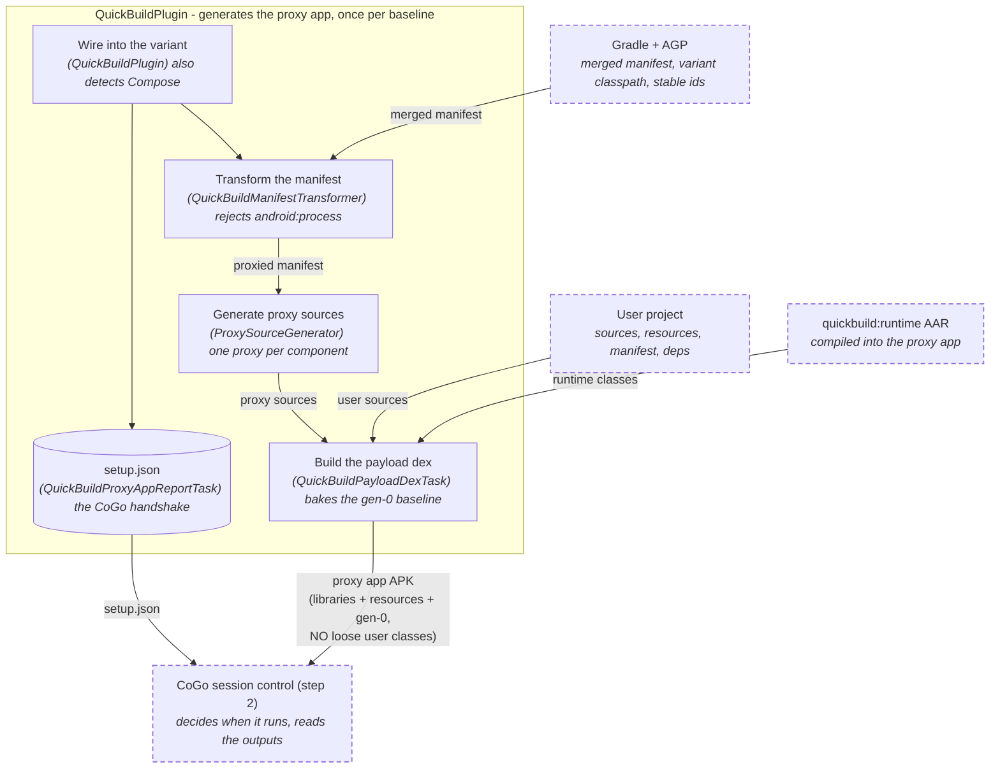
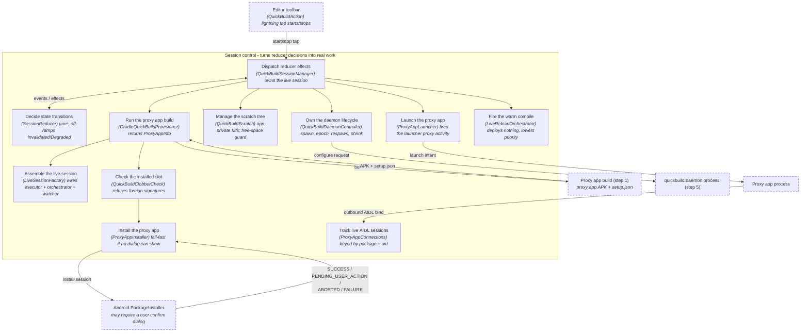
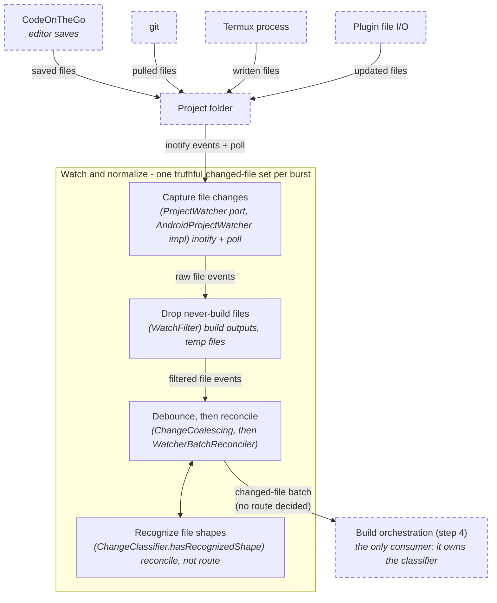
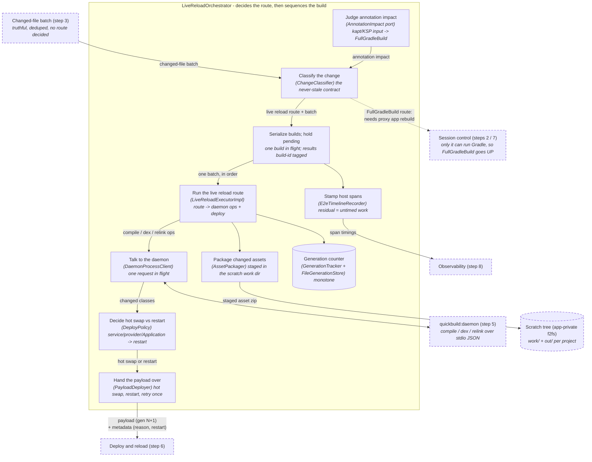
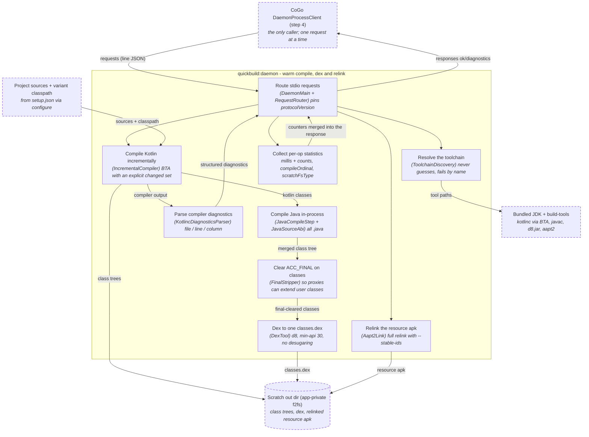
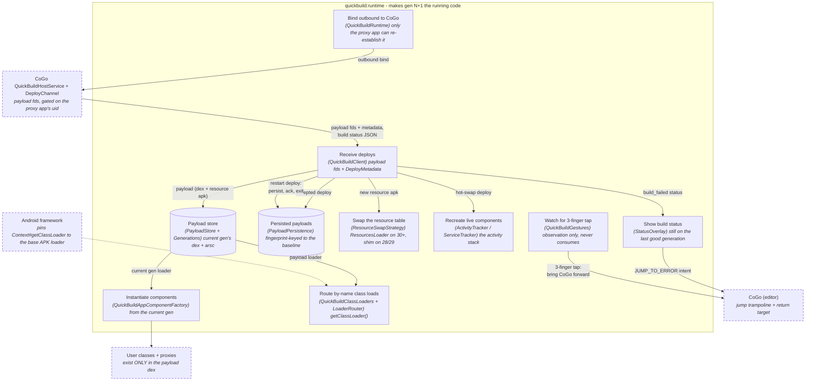
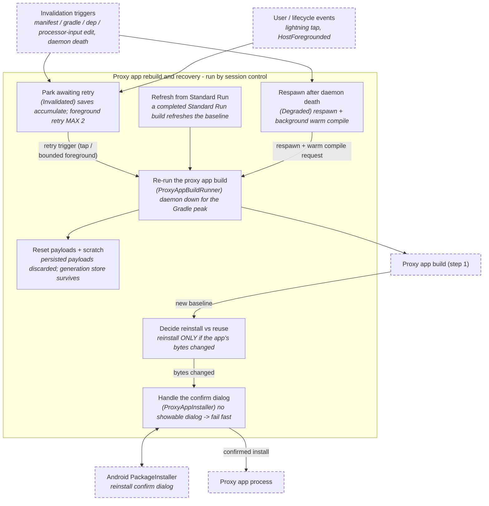
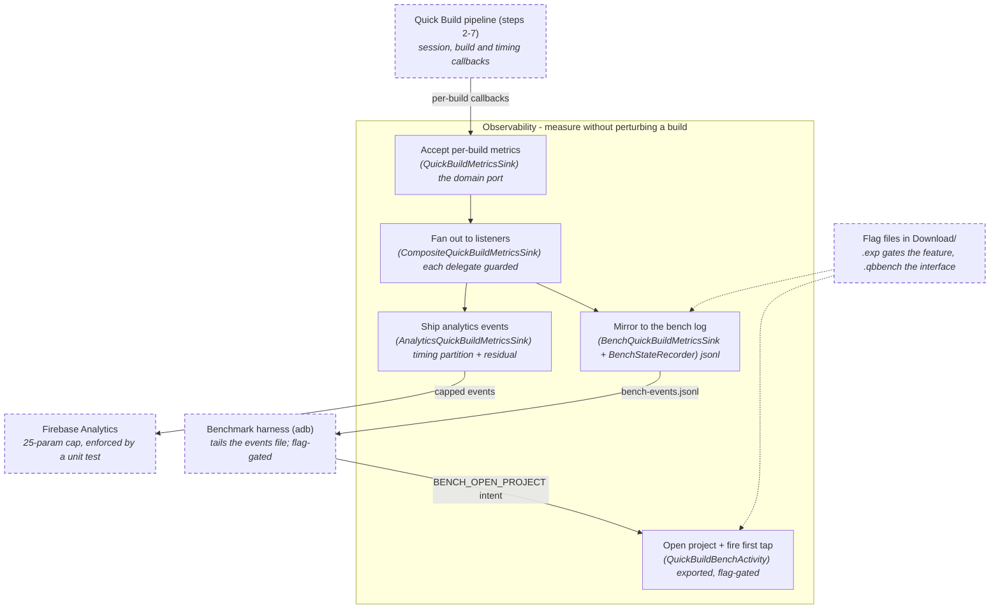

# The Quick Build pipeline, step by step

For anyone who knows which step of a Quick Build is misbehaving and needs the file that implements it. The [README](../README.md) has the summary, the terms and the one diagram; this page is the class-level map behind it, in pipeline order.

Every claim here was checked against the source on this branch. Where a class name, a callback name or a location differs from an older writeup, this page is the one that matches the code.

## The eight steps

| # | Step | Module | Open first |
| --- | --- | --- | --- |
| 1 | Proxy app build | `:gradle-plugin`, inside the project's Gradle build | [QuickBuildPlugin.kt](../../gradle-plugin/src/main/java/com/itsaky/androidide/gradle/QuickBuildPlugin.kt) |
| 2 | Session control and provisioning | `:quickbuild:core` `service/` + `:app` adapters | [QuickBuildSessionManager.kt](../core/src/main/java/org/appdevforall/cotg/quickbuild/service/QuickBuildSessionManager.kt) |
| 3 | Watch and normalize | `:quickbuild:core` `data/` + `domain/` | [AndroidProjectWatcher.kt](../core/src/main/java/org/appdevforall/cotg/quickbuild/data/AndroidProjectWatcher.kt) |
| 4 | Live reload orchestration | `:quickbuild:core` `domain/` + `service/` | [LiveReloadOrchestrator.kt](../core/src/main/java/org/appdevforall/cotg/quickbuild/domain/LiveReloadOrchestrator.kt) |
| 5 | Compile daemon | `:quickbuild:daemon`, a separate JVM child process | [DaemonService.kt](../daemon/src/main/kotlin/org/appdevforall/cotg/quickbuild/daemon/DaemonService.kt) |
| 6 | Deploy and reload | `:quickbuild:runtime`, inside the proxy app | [QuickBuildRuntime.java](../runtime/src/main/java/com/itsaky/androidide/quickbuild/runtime/QuickBuildRuntime.java) |
| 7 | Proxy app rebuild and recovery | reducer recovery states + session control | [ProxyAppBuildRunner.kt](../core/src/main/java/org/appdevforall/cotg/quickbuild/service/ProxyAppBuildRunner.kt) |
| 8 | Observability | `domain/QuickBuildMetricsSink` port + `:app` sinks | [CompositeQuickBuildMetricsSink.kt](../../app/src/main/java/com/itsaky/androidide/quickbuild/CompositeQuickBuildMetricsSink.kt) |

Steps 1, 2 and 7 run once per baseline. Steps 3-6 are the per-save loop. Step 8 watches all of them.

## Step 1: Proxy app build (`:gradle-plugin`)

Turns the user's project into an installable proxy app whose manifest names never change, with all user code moved into a swappable payload dex.

- Applied by `AndroidIDEGradlePlugin` when the `PROPERTY_QUICK_BUILD_ENABLED` property is set, and only to **debuggable application variants** (`variant.debuggable`, read in `onVariants`).
- Fails the build immediately if `-Pcotg.quickbuild.runtimeAar` is missing or does not point at a file. The runtime AAR is added to the variant's **runtime** configuration only, never the compile classpath.
- Compose is detected in `finalizeDsl`, from either `buildFeatures.compose` or the `org.jetbrains.kotlin.plugin.compose` plugin, and reported to the daemon through `setup.json`.

Four `DefaultTask` classes, all in one file, [QuickBuildTasks.kt](../../gradle-plugin/src/main/java/com/itsaky/androidide/gradle/quickbuild/QuickBuildTasks.kt):

| Task | What it produces |
| --- | --- |
| `QuickBuildGenerateSourcesTask` | transforms AGP's `MERGED_MANIFEST` in place, and emits the proxy `.java` sources, the `components.json` asset and `manifest-info.json` from that one input |
| `QuickBuildPayloadTransformTask` | diverts every PROJECT-scope class out of the APK's classes pipeline into `payload-classes/`, handing the pipeline back a jar carrying only the R classes |
| `QuickBuildPayloadDexTask` | javac's the proxy sources, then dexes proxies plus diverted classes into `assets/quickbuild/gen-0.dex` |
| `QuickBuildProxyAppReportTask` | writes `build/quickbuild/setup.json`, the handshake CoGo reads; wired as `finalizedBy` on `assemble<Variant>` |

Manifest and proxy-source detail, if the symptom is a wrong or missing proxy:

- [QuickBuildManifestTransformer](../../gradle-plugin/src/main/java/com/itsaky/androidide/gradle/quickbuild/QuickBuildManifestTransformer.kt) names proxies `Proxy<N><Type>` (`proxySimpleName`), **fails the build** on any `android:process` and on a provider with `android:multiprocess="true"`, neutralizes `android:backupAgent`, and keeps everything else the merged manifest said.
- [ComponentProxiabilityResolver](../../gradle-plugin/src/main/java/com/itsaky/androidide/gradle/quickbuild/ComponentProxiabilityResolver.kt) is the single authority on whether a component gets a proxy: a name list first, then the class file's `ACC_FINAL` flag read off the variant's dependency artifacts. A class it cannot find is assumed project-owned and proxiable.
- [ProxySourceGenerator](../../gradle-plugin/src/main/java/com/itsaky/androidide/gradle/quickbuild/ProxySourceGenerator.kt) emits a subclass, not a delegate. Activity proxies add the gesture hook and the `getClassLoader()` override; service proxies report to `ServiceTracker`; receivers and providers are empty; the Application entry gets no proxy at all.
- The payload dex's min API is `max(variant.minSdk, 30)` (`MIN_PAYLOAD_API`). That is the dex floor, not the device floor - Quick Build runs on API 28+.

## Step 2: Session control and provisioning (`:quickbuild:core` `service/` + `:app`)

Owns the session lifecycle. A pure reducer decides transitions; the manager executes their effects.

- [SessionReducer](../core/src/main/java/org/appdevforall/cotg/quickbuild/domain/SessionReducer.kt) is **total** - an unknown (state, event) pair keeps the current state and produces no effects, so a late or duplicate event cannot corrupt a session.
- [QuickBuildSessionManager](../core/src/main/java/org/appdevforall/cotg/quickbuild/service/QuickBuildSessionManager.kt) holds the reducer and the live session. Everything stateful runs on one dispatcher, which **must** be single-threaded; effects are `launch`ed rather than run inline so a dispatch never re-enters itself.
- The eight states (`Idle`, `Prebuilding`, `Provisioning`, `Ready`, `Building`, `Deployed`, `Invalidated`, `Degraded`) and the three `SessionFailure` kinds (`CompileError`, `DeployError`, `ProxyAppCrash`) live in [QuickBuildSessionState.kt](../core/src/main/java/org/appdevforall/cotg/quickbuild/domain/QuickBuildSessionState.kt), alongside every `SessionEvent`.

Who starts what:

| Trigger | Path |
| --- | --- |
| project open | `ProjectHandlerActivity` calls `QuickBuildSessionManager.prebuild()` -> `SessionEvent.PrebuildRequested` -> `SessionEffect.StartProxyAppPrebuild` |
| lightning-bolt tap | [QuickBuildAction](../../app/src/main/java/com/itsaky/androidide/actions/build/QuickBuildAction.kt) -> `QuickBuildTapped` / `CancelRequested` |
| build finished elsewhere | a completed Standard Run build raises `InvalidationDetected(EXTERNAL_FULL_BUILD)`, which refreshes a live baseline (step 7) |

Provisioning, in the order it happens:

1. [QuickBuildArtifactStager](../../app/src/main/java/com/itsaky/androidide/quickbuild/QuickBuildArtifactStager.kt) extracts the runtime AAR and the daemon zip from CoGo's APK assets into `<ANDROIDIDE_HOME>/quickbuild/`. It re-extracts on **every** provision on purpose: a version-keyed marker serves a stale bundle when content changes without a version bump.
2. [GradleQuickBuildProvisioner](../../app/src/main/java/com/itsaky/androidide/quickbuild/GradleQuickBuildProvisioner.kt) runs the proxy app build through CoGo's existing `BuildService.executeTasks`, then parses `setup.json` into [ProxyAppInfo](../core/src/main/java/org/appdevforall/cotg/quickbuild/data/ProxyAppInfo.kt).
3. [QuickBuildScratch](../core/src/main/java/org/appdevforall/cotg/quickbuild/data/QuickBuildScratch.kt) creates `noBackupFilesDir/quickbuild-scratch/<projectKey>/{work,out}` and enforces the free-space floor. It must stay on app-private storage - see the README's "Deliberate things that look wrong".
4. [QuickBuildClobberCheck](../core/src/main/java/org/appdevforall/cotg/quickbuild/service/QuickBuildClobberCheck.kt) plus [RealIdInstall](../core/src/main/java/org/appdevforall/cotg/quickbuild/domain/RealIdInstall.kt) read the installed package's `android:appComponentFactory` to decide whether the tap clobbers a Standard Run install. Stateless: an install or uninstall outside CoGo cannot leave it stale.
5. [ProxyAppInstaller](../core/src/main/java/org/appdevforall/cotg/quickbuild/service/ProxyAppInstaller.kt) sha256's the built APK against the installed one and **skips the install entirely when the bytes match**. That is what keeps rebuilds free of reinstall prompts. Verdicts arrive as real PackageInstaller broadcasts (`InstallBroadcast`), not uid polling; a failure broadcast with no package name is accepted as ours.
6. [QuickBuildDaemonController](../core/src/main/java/org/appdevforall/cotg/quickbuild/service/QuickBuildDaemonController.kt) spawns the daemon and owns the epoch rule. `start` and `shutdown` deliberately do **not** bump the epoch; `markIntentionalTransition` does.
7. [LiveSessionFactory](../core/src/main/java/org/appdevforall/cotg/quickbuild/service/LiveSessionFactory.kt) assembles a [LiveSession](../core/src/main/java/org/appdevforall/cotg/quickbuild/service/LiveSession.kt), whose `executor` and `annotationImpact` are switchable delegates so a rebuild can move to a new baseline without discarding the orchestrator's pending set.

The proxy app binds back to CoGo on launch; [ProxyAppConnections](../core/src/main/java/org/appdevforall/cotg/quickbuild/service/ProxyAppConnections.kt) is the registry both the Android-instantiated host service and the session pipeline meet at. [ProxyAppLauncher](../core/src/main/java/org/appdevforall/cotg/quickbuild/service/ProxyAppLauncher.kt) is only the relaunch primitive - a `fun interface` implemented in `:app` - and a null launcher activity is expected for `<activity-alias>` launchers, where the implementation falls back to the default launch intent.

## Step 3: Watch and normalize (`:quickbuild:core` `data/` + `domain/`)

Turns raw filesystem events into one deduped changed-file set per save burst. It decides no routes.

- [ProjectWatcher](../core/src/main/java/org/appdevforall/cotg/quickbuild/data/ProjectWatcher.kt) is the port; [AndroidProjectWatcher](../core/src/main/java/org/appdevforall/cotg/quickbuild/data/AndroidProjectWatcher.kt) is the only implementation. It is a hybrid by necessity: `FileObserver` for latency, plus an mtime+size poll sweep because the project sits on FUSE, which drops inotify events under load.
- Triggering is on file change from **any** source - the editor, a Termux script, a plugin write, a `git pull` - never on an editor save event.
- Watched files outside the watched roots (the gradle config files and kin) are covered by the poll only; no inotify watch is registered on their parents.
- [WatchFilter](../core/src/main/java/org/appdevforall/cotg/quickbuild/domain/WatchFilter.kt) drops build intermediates and recognized rename-tool temp names. An unrecognized temp name (`sed`'s `sedXXXXXX`) survives this filter by design and is dropped later.
- [ChangeCoalescing.kt](../core/src/main/java/org/appdevforall/cotg/quickbuild/domain/ChangeCoalescing.kt) holds the `WatchEvent` type and the debounce. Deletions are a separate event kind because a standalone delete fires no create-or-modify event.

**The reconciler does not run inside the watcher.** [WatcherBatchReconciler](../core/src/main/java/org/appdevforall/cotg/quickbuild/domain/WatcherBatchReconciler.kt) is called from `QuickBuildSessionManager.onWatcherBatch`, with `File::isFile` as the existence probe. It re-splits modified against removed:

- a vanished path with a recognized shape becomes a deletion,
- a vanished path without one is dropped as noise, which is what stops a stray temp file from pushing the whole batch to `FullGradleBuild`,
- a path that still exists but cannot be classified stays modified and keeps its Gradle fallback.

`ChangedFiles.Known` versus `Unknown` ([ChangedFiles.kt](../core/src/main/java/org/appdevforall/cotg/quickbuild/domain/ChangedFiles.kt)) is load-bearing: an empty `Known` set means "nothing changed" and must not recompile, while `Unknown` means "we cannot tell" and makes the next build treat every source as dirty. `plus` reconciles per path with the newer batch winning, so modify-then-delete ends up as a removal.

**Two unrelated things are called coalescing.** This step's is the watcher debounce (many events, one batch). Step 4's is the orchestrator's pending set (many batches merged while a build is in flight). If a save seems lost, this step is the wrong place to look unless no build was running.

## Step 4: Live reload orchestration (`:quickbuild:core` `domain/` + `service/`)

The batch arrives, the classifier picks a route, and the live-reload routes are sequenced and run. This is the never-stale contract: a wrong route means stale code.

[LiveReloadOrchestrator](../core/src/main/java/org/appdevforall/cotg/quickbuild/domain/LiveReloadOrchestrator.kt) runs the live-reload path only. A `FullGradleBuild` verdict is escalated as `OrchestratorEvent.InvalidationRequired` and never executed here, because session control owns Gradle, the install prompts and the device's single Gradle slot. What it guarantees:

- at most one build in flight; new work never cancels a running compile, it waits and coalesces,
- starting a build **moves** the pending set into it; the set clears only on success and a failed batch is unioned back,
- every result carries its build id, so a superseded build's result is discarded,
- after a failure it rebuilds immediately only if new saves arrived mid-build, since an unchanged batch would fail identically,
- event **order** holds only when the public API and the scope share one single-threaded dispatcher. Wire it that way.

Routing:

- [ChangeClassifier](../core/src/main/java/org/appdevforall/cotg/quickbuild/domain/ChangeClassifier.kt) classifies by **path shape**, not content. Recognition is one private `kindOf()` - literal filenames, `src/`+`res/` and `src/`+`assets/` predicates, and the two hardcoded extensions `.kt` and `.java`. It is not an appendable list.
- The same `kindOf()` backs the public `hasRecognizedShape`, which step 3's reconciler uses. Changing one changes deletion-noise semantics too.
- `fastPathRoots` is the app module's scope. A change under any other Gradle module routes to `NON_APP_MODULE_SOURCE_CHANGED`. Empty disables the boundary, which is what single-module projects and pure-shape unit tests use.
- [AnnotationImpact](../core/src/main/java/org/appdevforall/cotg/quickbuild/domain/annotations/AnnotationImpact.kt) is the port; the analyzer that implements it lives in the same file. The rule set is split between [AnnotationProcessorProfile](../core/src/main/java/org/appdevforall/cotg/quickbuild/domain/annotations/AnnotationProcessorProfile.kt) (which annotations count as processor input, given the processors `setup.json` reported) and [SourceAnnotationScanner](../core/src/main/java/org/appdevforall/cotg/quickbuild/domain/annotations/SourceAnnotationScanner.kt) (what the changed file carries). Both are over-inclusive on purpose: anything unparseable returns null, which the analyzer reads as "rebuild".

Executing:

| Concern | Class |
| --- | --- |
| route -> daemon ops -> deploy | [LiveReloadExecutorImpl](../core/src/main/java/org/appdevforall/cotg/quickbuild/service/LiveReloadExecutorImpl.kt) |
| daemon child process and its wire protocol | [DaemonProcessClient](../core/src/main/java/org/appdevforall/cotg/quickbuild/data/DaemonProcessClient.kt) |
| changed assets zipped into the scratch work dir | [AssetPackager](../core/src/main/java/org/appdevforall/cotg/quickbuild/data/AssetPackager.kt) |
| hot swap versus process restart | [DeployPolicy](../core/src/main/java/org/appdevforall/cotg/quickbuild/domain/DeployPolicy.kt) |
| everything downstream of that decision | [PayloadDeployer](../core/src/main/java/org/appdevforall/cotg/quickbuild/service/PayloadDeployer.kt) |
| the monotone counter | [GenerationTracker](../core/src/main/java/org/appdevforall/cotg/quickbuild/domain/GenerationTracker.kt) + [FileGenerationStore](../core/src/main/java/org/appdevforall/cotg/quickbuild/data/FileGenerationStore.kt) |
| span timings and the residual | [E2eTimeline](../core/src/main/java/org/appdevforall/cotg/quickbuild/domain/E2eTimeline.kt) + [E2eTimelineRecorder](../core/src/main/java/org/appdevforall/cotg/quickbuild/service/E2eTimelineRecorder.kt) |
| orchestrator events -> session events | [OrchestratorEventRouter](../core/src/main/java/org/appdevforall/cotg/quickbuild/service/OrchestratorEventRouter.kt) |

**A generation is allocated only after the build steps succeed**, inside `PayloadDeployer`, so a compile error burns none and the proxy app stays where it was. `DaemonProcessClient` holds one request in flight; a process exit without a preceding `shutdown` fails every pending request and fires the death listener, which becomes the `Degraded` flow.

Adding a file type or a route touches more than the classifier: `WatchFilter` (a file outside the watched roots is never seen), `LiveReloadExecutorImpl` (a new `BuildRoute` is a compile error there, which is the good kind), `AssetPackager` for asset-like types, and `Aapt2Link` for resource-like ones. Assets never reach the daemon.

## Step 5: Compile daemon (`:quickbuild:daemon`)

A warm, pure-JVM child process on the bundled JDK. It holds the incremental caches between builds, which is the biggest latency lever.

- [DaemonMain](../daemon/src/main/kotlin/org/appdevforall/cotg/quickbuild/daemon/DaemonMain.kt) owns the serve loop, the stdout/stderr split and the exit contract. Those are wire behavior, so they are stated once in [the protocol reference](../protocol/README.md#transport-rules) rather than here.
- [DaemonService](../daemon/src/main/kotlin/org/appdevforall/cotg/quickbuild/daemon/DaemonService.kt) holds the warm state - `configure` builds the session, `compile` / `dex` / `relink` reuse it. [RequestRouter](../daemon/src/main/kotlin/org/appdevforall/cotg/quickbuild/daemon/protocol/RequestRouter.kt) is the backstop that turns an escaped exception into an `ok:false` response.
- The wire types live in `:quickbuild:protocol` ([DaemonProtocol.kt](../protocol/src/main/kotlin/org/appdevforall/cotg/quickbuild/daemon/protocol/DaemonProtocol.kt)) so client and daemon cannot drift; [ProtocolCodec](../daemon/src/main/kotlin/org/appdevforall/cotg/quickbuild/daemon/protocol/ProtocolCodec.kt) is pure string functions.
- [ToolchainDiscovery](../daemon/src/main/kotlin/org/appdevforall/cotg/quickbuild/daemon/ToolchainDiscovery.kt) fills in aapt2, `d8.jar` and `android.jar` from `$ANDROID_HOME` when `configure` omits them; highest build-tools and platform version wins. Which fields CoGo sends and which the harness omits: [the `configure` table](../protocol/README.md#requests).

The compile chain:

- [IncrementalCompiler](../daemon/src/main/kotlin/org/appdevforall/cotg/quickbuild/daemon/compile/IncrementalCompiler.kt) drives the Kotlin Build Tools API. Four constraints are invisible from the call sites and each degrades silently: changes must be `SourcesChanges.Known`; the shrunk snapshot path is derived from `setRootProjectDir` and must be exactly `<rootProjectDir>/shrunk-classpath-snapshot.bin`; the first compile must pass all sources as changed to seed the caches; `assureNoClasspathSnapshotsChanges(true)` is only safe once that snapshot exists.
- Java takes two passes - kotlinc reads `.java` for symbol resolution only, then [JavaCompileStep](../daemon/src/main/kotlin/org/appdevforall/cotg/quickbuild/daemon/compile/JavaCompileStep.kt) runs javac in-process against the same classpath plus the Kotlin output. javac's pass is not incremental.
- [JavaSourceAbi](../daemon/src/main/kotlin/org/appdevforall/cotg/quickbuild/daemon/compile/JavaSourceAbi.kt) decides when a `.java` edit forces a Kotlin recompile, by fingerprinting declarations only. Constant-field initializers and annotations stay in the fingerprint although they look like implementation. Unparseable yields null, which callers must read as "the ABI changed".
- [FinalStripper](../daemon/src/main/kotlin/org/appdevforall/cotg/quickbuild/daemon/dex/FinalStripper.kt) clears `ACC_FINAL` on every hot recompile, mirroring the plugin's `ClassOpener`. Kotlin classes are final by default, so this is not an optimization - without it a generated proxy cannot extend its user class and the dex verifier rejects the load.
- [DexTool](../daemon/src/main/kotlin/org/appdevforall/cotg/quickbuild/daemon/dex/DexTool.kt) loads the device's `lib/d8.jar` through its own `URLClassLoader` and calls it reflectively, so the daemon carries no AGP or r8 build dependency and works against whatever build-tools the device ships.
- [KotlincDiagnosticsParser](../daemon/src/main/kotlin/org/appdevforall/cotg/quickbuild/daemon/compile/KotlincDiagnosticsParser.kt) parses rendered kotlinc text leniently; anything unrecognized degrades to a location-less diagnostic rather than being dropped. javac needs no parsing - its structured diagnostics map onto the protocol shape directly.

Resources are relinked by [Aapt2Link](../daemon/src/main/kotlin/org/appdevforall/cotg/quickbuild/daemon/res/Aapt2Link.kt), which recompiles and relinks everything on every call. Its KDoc is the reference; the three rules that make a partial relink safe are `--stable-ids` (mandatory - without it a missing resource type shifts every later type's id and the manifest's numeric `android:icon` resolves wrong), carrying **both** of AGP's library-resource mechanisms, and passing the fresh project resources as the last `-R` argument.

## Step 6: Deploy and reload (`:quickbuild:runtime`)

The Java-only AAR inside the proxy app. It receives payload file descriptors over uid-checked AIDL and makes the new generation the running code.

CoGo's side of the channel:

- [QuickBuildHostService](../core/src/main/java/org/appdevforall/cotg/quickbuild/service/QuickBuildHostService.kt) is **exported**, so the uid gate is the whole trust boundary: every inbound call must come from the uid PackageManager reported for the installed proxy app at session start.
- [DeployChannel](../core/src/main/java/org/appdevforall/cotg/quickbuild/service/DeployChannel.kt) is an interface so the executor stays JVM-testable.
- [BuildStatusJson](../core/src/main/java/org/appdevforall/cotg/quickbuild/service/BuildStatusJson.kt) encodes `onBuildStatus`; the schema, its string-only rule and its defaults are in [the protocol reference](../protocol/README.md#build-status-json-iquickbuildtargetonbuildstatus).
- The AIDL lives with the runtime: `quickbuild/runtime/src/main/aidl/com/itsaky/androidide/quickbuild/{IQuickBuildHost,IQuickBuildTarget}.aidl`.

Inside the app:

| Concern | Class |
| --- | --- |
| coordinator; installed at Application instantiation | [QuickBuildRuntime](../runtime/src/main/java/com/itsaky/androidide/quickbuild/runtime/QuickBuildRuntime.java) |
| the bind back to CoGo | [QuickBuildClient](../runtime/src/main/java/com/itsaky/androidide/quickbuild/runtime/QuickBuildClient.java) |
| instantiate every component from the current generation | [QuickBuildAppComponentFactory](../runtime/src/main/java/com/itsaky/androidide/quickbuild/runtime/QuickBuildAppComponentFactory.java) + [LoaderRouter](../runtime/src/main/java/com/itsaky/androidide/quickbuild/runtime/LoaderRouter.java) |
| the loader proxy activities return from `getClassLoader()` | [QuickBuildClassLoaders](../runtime/src/main/java/com/itsaky/androidide/quickbuild/runtime/QuickBuildClassLoaders.java) |
| current generation + its loader, process-wide | [PayloadStore](../runtime/src/main/java/com/itsaky/androidide/quickbuild/runtime/PayloadStore.java) |
| newest generation on disk | [PayloadPersistence](../runtime/src/main/java/com/itsaky/androidide/quickbuild/runtime/PayloadPersistence.java) |
| resource and asset overrides | [ResourceStore](../runtime/src/main/java/com/itsaky/androidide/quickbuild/runtime/ResourceStore.java) + [ResourceSwapStrategy](../runtime/src/main/java/com/itsaky/androidide/quickbuild/runtime/ResourceSwapStrategy.java) |
| which activity to recreate; whether a service is live | [ActivityTracker](../runtime/src/main/java/com/itsaky/androidide/quickbuild/runtime/ActivityTracker.java) + [ServiceTracker](../runtime/src/main/java/com/itsaky/androidide/quickbuild/runtime/ServiceTracker.java) |
| the error banner and the jump back to the editor | [StatusOverlay](../runtime/src/main/java/com/itsaky/androidide/quickbuild/runtime/StatusOverlay.java) + [JumpToEditor](../runtime/src/main/java/com/itsaky/androidide/quickbuild/runtime/JumpToEditor.java) |
| getting back to CoGo by hand | [QuickBuildGestures](../runtime/src/main/java/com/itsaky/androidide/quickbuild/runtime/QuickBuildGestures.java) + [ReturnToIdeButton](../runtime/src/main/java/com/itsaky/androidide/quickbuild/runtime/ReturnToIdeButton.java) |
| the generation acceptance rule, stated once | [Generations](../runtime/src/main/java/com/itsaky/androidide/quickbuild/runtime/Generations.java) |

Behavior worth knowing before changing any of it:

- `QuickBuildRuntime` is installed by the component factory at Application instantiation, the earliest hook a library gets without a ContentProvider. Context work (binding to CoGo, cache dirs) waits for the first activity, because the Application has no base context yet.
- Failure policy: a reload failure calls `reportCrash` and **rolls back to the old generation**, so the app keeps running the last working code and says so.
- `PayloadStore` loads the dex through `InMemoryDexClassLoader` with the APK loader as parent. Framework and androidx resolve from the APK, user classes exist only in the payload, so parent-first delegation cannot serve a stale user class. At boot it loads the baked gen-0 dex, then swaps in the newest persisted generation.
- `PayloadPersistence` writes `payload.dex`, `resources.arsc`, `assets.zip` and `meta.json` temp-then-rename, with `meta.json` last, so a crash mid-persist leaves the store claiming an **older** generation than it serves. That is the safe direction. It discards the store when the stored baseline fingerprint no longer matches the running baseline.
- `BIND_AUTO_CREATE` keeps the binding alive across a CoGo service restart; `onServiceConnected` re-runs connect with the current running generation, which is how a relaunched proxy app catches up.
- Resource swap by API level: 30+ swaps one long-lived `ResourcesLoader`'s provider, loaded with `loadFromApk` because `loadFromTable` does not serve file-based resources; 28/29 take the [LegacyResourceSwap](../runtime/src/main/java/com/itsaky/androidide/quickbuild/runtime/LegacyResourceSwap.java) `addAssetPath` shim; below 28 resource payloads are ignored, which is unreachable in practice.
- Assets have no in-memory API, so the changed-assets zip is extracted to a cache dir and served through `ResourceStore.overrideAsset`. Code that reads through `AssetManager` directly still sees the baked-in APK assets until the next proxy app build.
- `QuickBuildGestures` only observes the touch - the proxy always forwards to `super.dispatchTouchEvent`, so the app under test sees every touch unmodified.

## Step 7: Proxy app rebuild and recovery (reducer states + session control)

The only fallback. Every state that cannot be trusted ends in a fresh proxy app build.

There is **no rebuild-orchestrator class**. The reducer's `Invalidated` state decides when, and session control executes it:

1. [ProxyAppBuildRunner.rebuildProxyApp](../core/src/main/java/org/appdevforall/cotg/quickbuild/service/ProxyAppBuildRunner.kt) shuts the daemon down **first**, to free its memory for the Gradle peak - on a 3-4 GB device the two must not coexist. Nothing is lost: the daemon's incremental state is stale after a rebuild anyway, and a survivor would keep serving the old configure's classpath.
2. It runs the provisioner, then probes the `superseded` closure - the manager's epoch check, which the runner never sees directly.
3. `ProxyAppInstaller` decides reinstall versus reuse from the APK's sha256 (step 2), so a rebuild that changed nothing installable shows no dialog.
4. On success it restarts the daemon against the new config. A daemon that refuses the new configuration is its own result, `DaemonRestartFailed`.

The runner is stateless: it never reads the live session, touches the epoch or dispatches. The manager does all of that with the returned result.

Handover to and from the orchestrator uses three callbacks - **`onProxyAppRebuildStarted`, `onBaselineReset`, `onProxyAppRebuildFailed`** (older writeups say `onRebaselineStarted` / `onRebaselineFailed`; those names no longer exist). Only changes that existed when the rebuild started count as absorbed; a save landing mid-rebuild stays pending, and [OrchestratorEventRouter](../core/src/main/java/org/appdevforall/cotg/quickbuild/service/OrchestratorEventRouter.kt) re-pends it so it is rebuilt as soon as the baseline resets.

The two recovery states:

- **`Invalidated`** carries the `InvalidationReason`, the deployed generation, and an `awaitingRetry` flag with an `installAutoRetries` counter. The eight reasons are every way a baseline stops being trustworthy: `MANIFEST_CHANGED`, `GRADLE_CONFIG_CHANGED`, `UNSUPPORTED_FILE_CHANGED`, `NON_APP_MODULE_SOURCE_CHANGED`, `EXTERNAL_FULL_BUILD`, `ANNOTATION_PROCESSOR_INPUT_CHANGED`, `OUTDATED_BASELINE`, `INSTALL_NOT_CONFIRMED` ([BuildRoute.kt](../core/src/main/java/org/appdevforall/cotg/quickbuild/domain/BuildRoute.kt)). A rebuild whose reinstall is never confirmed parks here rather than killing the session; `HostForegrounded` retries it up to `SessionReducer.MAX_INSTALL_AUTO_RETRIES` (2), after which only an explicit tap retries, and the tap resets the budget.
- **`Degraded`** is daemon death: respawn plus a background warm compile, while the proxy app keeps running its generation untouched.

Persisted payloads are **not** cleared by session control. The runtime discards them itself when the stored baseline fingerprint stops matching the running baseline (step 6). The generation counter survives teardown because it lives outside the scratch tree - path and the trap that goes with it in [debugging.md](debugging.md#4-where-quick-builds-files-live-on-device).

Handback works in both directions: a completed Standard Run build raises `InvalidationDetected(EXTERNAL_FULL_BUILD)` against a live session, which routes into the same rebuild path.

## Step 8: Observability (`domain/QuickBuildMetricsSink` + `:app` sinks)

One port, several guarded listeners. Instrumentation must never affect a build, so every call site guards and every sink swallows.

| Sink | When it runs | File |
| --- | --- | --- |
| fan-out | always | [CompositeQuickBuildMetricsSink](../../app/src/main/java/com/itsaky/androidide/quickbuild/CompositeQuickBuildMetricsSink.kt) |
| Firebase analytics | always (shipping) | [AnalyticsQuickBuildMetricsSink](../../app/src/main/java/com/itsaky/androidide/analytics/quickbuild/AnalyticsQuickBuildMetricsSink.kt) + [QuickBuildMetrics](../../app/src/main/java/com/itsaky/androidide/analytics/quickbuild/QuickBuildMetrics.kt) |
| benchmark JSON lines | behind the `qbbench` flag file | [BenchQuickBuildMetricsSink](../../app/src/main/java/com/itsaky/androidide/quickbuild/BenchQuickBuildMetricsSink.kt) + [BenchEventsFile](../../app/src/main/java/com/itsaky/androidide/quickbuild/BenchEventsFile.kt) |
| session-state mirror | behind the same flag | [BenchStateRecorder](../../app/src/main/java/com/itsaky/androidide/quickbuild/BenchStateRecorder.kt) |

- The composite overrides **every** method, including the interface's defaulted ones, so a defaulted event still reaches the delegates that implement it.
- `QuickBuildMetrics.MAX_EVENT_PARAMS = 25` is Firebase's hard cap, pinned by the unit test `the reload-timing bundle stays within Firebase's per-event parameter cap` in `AnalyticsQuickBuildMetricsSinkTest`. What it costs a new stat: [the protocol reference](../protocol/README.md#adding-a-numeric-stat-touches-five-places-and-the-codec-is-not-one-of-them).
- `reload_timeline` is the load-bearing bench event. Its fields and its residual arithmetic are in [debugging.md](debugging.md#reload_timeline-and-why-the-residual-is-the-point).
- [QuickBuildBenchActivity](../../app/src/main/java/com/itsaky/androidide/quickbuild/QuickBuildBenchActivity.kt) replaces the human's first tap for unattended runs. It is exported by necessity and double-gated on the experiments and bench flags; it accepts only an existing directory inside `Environment.PROJECTS_DIR`.
- [QuickBuildJumpActivity](../../app/src/main/java/com/itsaky/androidide/quickbuild/QuickBuildJumpActivity.kt) is the tap-to-jump trampoline the runtime's error banner starts. Same hardening: the file must exist and resolve inside the currently open project.
