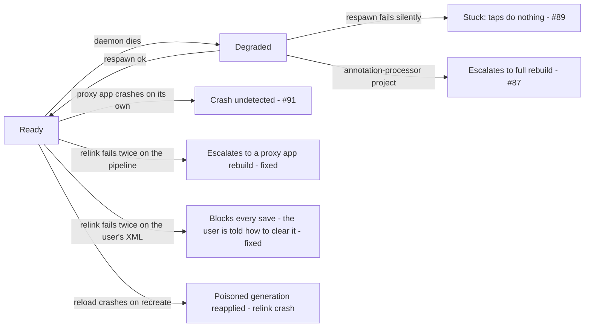

# Decision: do the open Quick Build recovery gaps block v1?

**Decision: do #87, #89, #91 and the relink-crash recovery gap block v1? Proposed: no - all go to
v1.1.** Correctness is not at risk in any of them - the never-stale invariant holds throughout.
What is at stake is trust: a live reload path that goes slow, dead, or quiet. The rest of this page
is the evidence for that call, one section per gap - symptom, root cause with file references,
likely fix.

Device testing (2026-07-25..28) surfaced five user-facing defects. Three are fixed on this branch
(see the last section, which also closes the relink-stuck gap); three are open, alongside the
relink-crash recovery gap.

| Gap | What the user sees | Frequency | Blocks v1? |
| --- | --- | --- | --- |
| #89 | Red-alert icon; tapping Quick Build does nothing until "Restart session" | No device repro `[inferred]` | TBD |
| #91 | Their own app crash is never surfaced; CoGo blames deploy infra | `[unmeasured]` | ADFA-5466 |
| #87 | A one-line edit in a Room/KSP project runs a full ~200s rebuild + reinstall | 3/3 when attempted | TBD |
| Relink crash | A reload that crashes the app repeats the crash at every process boot | Trigger fixed; net still absent | TBD |
| Relink stuck | A failed relink re-fails on every later save until a gradle-file touch | `[unmeasured]` | No - fixed below |

Provenance: `[measured on a56]` = Samsung A56. Untagged prose is code reading against `75483b6eb`.

## Where they sit in the session lifecycle

## #89 - a failed daemon respawn strands the session; taps do nothing

- **Root cause:** a respawn has two silent exits - superseded before start and mid-start
  (`QuickBuildDaemonController.kt:121-133`, log-only) - whose caller arm in `respawnDaemon()` is a
  bare no-op (`QuickBuildSessionManager.kt:905-907`), so neither ever dispatches `DaemonRespawned`;
  and `reduceDegraded` has no arm for `QuickBuildTapped` (`SessionReducer.kt:374-408`), so the tap falls
  into an empty-effects catch-all. `shrinkDaemonForMemory()` contributes: its guard is on `Building`
  only, so in `Degraded` it bumps `daemonEpoch`, which is what makes an in-flight respawn discard
  itself.
- **Evidence:** code reading only, no device repro. The swallowed tap is not race-dependent: any
  time the session is Degraded, taps do nothing.
- **Likely fix:** give `Degraded` a `QuickBuildTapped` arm re-issuing `RespawnDaemon`, guarded
  against stacking respawns. Alternatives: explanatory text only; a mutex serializing the daemon
  lifecycle (bigger, addresses the cause).

## #91 - an organic proxy-app crash never reaches the crash surface

- **Root cause:** the runtime only reports a crash while a reload is in flight
  (the crash guard gates on `FirstFrameGate.pending() >= 0`, which is -1 between
  builds). The disconnect *is* detected - `ProxyAppConnections.onDisconnected()` emits
  `TargetReport.Disconnected` - but the session manager's collector only tests for `Crashed`
  (`QuickBuildSessionManager.kt:281`). Today's entire user-visible consequence of a crash is an
  icon color change.
- **Evidence:** code reading; no run deliberately crashed a proxy app between builds `[unmeasured]`.
- **Likely fix:** route `Disconnected` to the session as `TargetDisconnected` - small, fixes the
  lie, recovers no stack. Reporting crashes unconditionally with a sentinel generation gets the
  real summary but the reducer must not treat an organic crash as a reload failure.

## #87 - a body-only edit escalates to a full proxy app rebuild

- **Symptom:** a one-line method-body edit in a Room/KSP project triggers a full Gradle rebuild +
  reinstall dialog - 198s in the captured run `[measured on a56, 2026-07-28]` instead of a ~2s
  reload. Invisible trigger: the compile daemon died between builds, usually because the OS
  reclaimed memory while the user looked at their app.
- **Root cause:** on respawn, `LiveReloadOrchestrator.kt:283` re-primes the pending set with
  `ChangedFiles.Unknown`, an absorbing element that destroys the known file set, and
  `ChangeClassifier.kt:47` then escalates unconditionally on `annotationImpact.active` ("project
  has any processor", not "this edit touched processor input"). Unnecessary: the changed-file set,
  the annotation baseline and on-disk sources are all still intact at that point.
- **Evidence** `[measured on a56, 2026-07-28]`: reproduced 3 times out of 3.
- **Likely fix:** reclassify from the preserved set instead of falling back to `Unknown` - must
  still distinguish "lost the daemon" from "lost track of files", since a genuinely unenumerable
  change has to escalate.

## Relink crash - a crashing reload has no self-healing

- **Symptom:** a reload crashes the proxy app on `recreate()`, and every later process boot
  re-reads the same payload and repeats it until the session is reset.
- **Root cause:** `handlePayload` (`QuickBuildRuntime.java`) persists the payload before applying
  it, and the crash lands on a later main-thread frame - caught only by the process's
  uncaught-exception handler, so `failReload`'s rollback never runs.
- **Status:** the known trigger (resource-id drift on relink) is closed by `aapt2 link
  --stable-ids`, device-verified 2026-07-28 `[measured on a56]`. What's missing is the
  trigger-independent net: treat a crash during a pending reload as reason to distrust the
  just-applied generation and fall back to the last known-good one.

## Fixed on this branch

- **Relink stuck** - a failed relink re-failed on every later save forever, because the
  never-lose-an-edit invariant re-queues the failed batch and nothing ever retried differently. Two
  causes, each with its own fix, because they need opposite treatment.

  **Pipeline half - the daemon could not link at all** (`BuildOutcome.InfrastructureFailure`), for a
  reason no edit could reach. Fixed in `LiveReloadOrchestrator`: two consecutive builds failing with
  an *identical* non-daemon-death `InfrastructureFailure` emit
  `InvalidationRequired(RELOAD_PIPELINE_FAILED)`, so the pending set is handed to a proxy app
  rebuild - the same visible Gradle fallback a gradle-file touch produces, without the user having
  to know that trick. `recordFailureLocked` carries the reasoning for what is excluded: compile
  errors (the user's code, already on screen), daemon deaths (their own respawn path), and warm
  compiles (never surfaced). **Loop guard:** the escalation is latched to once per baseline -
  cleared by a success or by `onBaselineReset`, deliberately NOT by `onProxyAppRebuildFailed`, so a
  rebuild that fails leaves plain build failures instead of rebuilding on every save.

  **aapt2 half - aapt2 rejects the project's resources** (`DaemonService.relink` ->
  `DaemonResponse.failure(id, diagnostics)` -> `BuildOutcome.CompileError`). The mechanism is not
  the dirty delta: `LiveReloadExecutorImpl.relink` links the **whole `res/` tree from disk**, not
  the changed set, so an unlinkable resource fails every later build whatever the user saves - a
  pure-code save included, which is why the error looks unrelated to what they just did. Almost
  always the user's own error, and their next good save clears it. What has no self-healing is a
  reference the relink cannot resolve at all - a library resource absent from the proxy app build's
  resource snapshot - which no edit to the file naming it fixes. Fixed by **telling the user**: a
  repeating aapt2 rejection now sets `OrchestratorEvent.BuildFailed.relinkStuck`, which the session
  manager surfaces once per streak as `QuickBuildNotice.RELINK_STUCK` - asking for the fix first and
  naming Restart session (long-press Quick Build), whose fresh proxy app build resolves against the
  full resource set. `blocksEveryBuild` attributes the failure to aapt2 rather than kotlinc by
  requiring every error to name a file under `res/`, which is exact because a failed compile returns
  before the relink runs, so the two never mix in one outcome. Latch cleared by a success or a fresh
  baseline.

  **Why the aapt2 half is deliberately NOT auto-escalated** (unchanged judgement, restated because
  the fix chose around it): the identical-repeat signal cannot tell a **fixable** user typo from an
  **unfixable** reference - both come back as aapt2 diagnostics naming a file under `res/`. So
  escalating would fire on the ordinary flow "resource is broken, user saves a Kotlin file next",
  spending ~200s of Gradle on a typo that the next save would have cleared in ~2s; and a proxy app
  rebuild that fails dispatches `ProvisioningFailed`, which drops the whole session to `Idle`
  (`SessionReducer.kt:133-138`). Trading a visible, self-clearing compile error for a killed session
  is a worse defect than the one being fixed. A notice needs no such discrimination, because the
  advice is correct in both cases.

  **Never-stale holds throughout:** the user sees aapt2's diagnostics on every attempt and nothing
  is deployed; the notice adds a message and changes no build or deploy decision. The gradle-file
  touch still works as before, and `PayloadStore` still drops any persisted store whose fingerprint
  no longer matches the new baseline dex.

  **Not device-verified** - the A56 was unplugged for both changes `[unverified on device]`. Covered
  by 7 orchestrator unit tests for the pipeline half (3 watched red before the fix) plus 3
  orchestrator tests and 1 session-manager test for the aapt2 half, all 4 watched red under mutation
  before the fix `[measured on host]`. What a device walk still owes: the toast actually appearing,
  and Restart session actually clearing an unfixable-reference case end to end.

- **#88** - every deploy after a proxy app rebuild reinstall failed "Proxy app is not connected"
  until the user relaunched their app. Fixed by a deploy-time launch-and-retry-once
  (`PayloadDeployer.deployRecovering`); its KDoc carries the rationale. Also removes most of #91's
  symptom.
- **#90** - a backgrounded reinstall waited 180s in silence, then showed a message wrong about what
  happened. Fixed by a fail-fast park with a truthful message and a bounded re-prompt
  (`ProxyAppInstaller.kt`, `SessionReducer.kt`). Not verified on device: the dialog reappearing on
  foregrounding, a user actually declining, and the initial-provisioning timeout.
