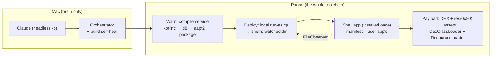

# Son-of-Stubby (Mini-Stubby) — Design Doc

**Jira:** ADFA-4128 · **Status:** spike complete, design decisions recorded · **Author:** spike agent + Bryan · **Updated:** 2026-07-10

> Fast edit→run loop for Code on the Go: a shell app, installed once, dynamically loads
> the user app's **DEX + resources + assets** from storage so edits appear in the running
> app in seconds — **no APK build to install, no PackageInstaller, no Play Protect prompt.**
> This doc records the use cases we commit to, the design decisions (with the alternatives
> we rejected and why), the on-device benchmark data, and the open questions.

Companion docs: `demo/ONDEVICE-BENCHMARK.md` (raw numbers), `demo/FINDINGS-and-fixes.md`
(bugs found + fixed), `TIERED-IMPLEMENTATION.md` (tier mechanics), `MULTI-ACTIVITY-OPTIONS.md`.

---

## 1. Use cases

### Must work (non-negotiable — the loop is not shippable without these)

| # | Use case | How it's served |
|---|---|---|
| M1 | **Resource / styling changes** — colors, dimens, strings, layouts, drawables, `values-night` | Tier 0 (no compiler): aapt2 relink + reuse cached code dex |
| M2 | **Code changes** — logic, new functions, new classes, new fields | Tier 2 (full compile → dex → reload) |
| M3 | **Asset changes** — bundled files under `assets/` | Served through the payload apk's `getAssets()`; instant |
| M4 | **Multi-page apps** — multiple screens / `Activity`-style navigation | Payload owns its content (`setContentView`) + `ProxyActivity` for a real 2nd Activity window |
| M5 | **Debugging** — breakpoints, step, variable inspection | Real DEX in ART in a **debuggable** process → standard Android debugger (JDWP) attaches to the shell process; works because we *kept* DEX (unlike a bespoke JVM) |
| M6 | **Runtime permissions** — camera, location, mic, notifications | Shell pre-declares the superset in its fixed manifest; payload calls `requestPermissions()`, OS shows the real prompt |
| M7 | **Fast turnaround** — see §2 targets | Warm compile service on-device; tiered dispatch |

### Should work (strongly want; degrade gracefully if not)

| # | Use case | Notes |
|---|---|---|
| S1 | **State preserved across a reload** | Via `SharedPreferences` re-read at render() — see D4. Preserved when the app persists it; **sometimes lost, and that's acceptable** (§ D4). |
| S2 | **Rich UI toolkits** — androidx, Material3, Compose, Fragments | Validated on-device earlier in the spike (loads via DexClassLoader + ResourcesLoader). Fragments need a plugin-classloader-aware `FragmentFactory`. |
| S3 | **Native libraries** (`.so`) | Shell copies `.so`s to the app's private lib dir at load; `useLegacyPackaging`/extract path. |
| S4 | **Payload behaves like a normal Android app** | Payload may call `setContentView`, launch Activities, manage its own view tree. Shell controls live in sub-windows so they survive (D5). |

### May work (best-effort; explicitly NOT guaranteed)

| # | Use case | Why it's only "may" |
|---|---|---|
| V1 | **In-memory state preserved for arbitrary code edits** | We have **no component tree to diff** (unlike Flutter/Compose). A full reload rebuilds from persisted state only. Non-persisted in-RAM state is lost. **This is a deliberate trade — see D4.** |
| V2 | **Sub-1s reload on low-spec devices** | Currently ~3 s warm on a mid-range A56; kotlinc-bound. Needs incremental compile (D8 / open questions). |
| V3 | **Manifest changes** — new components, new permissions, icon/package | Require a **new shell build + install** (rare). The whole point is the manifest is fixed in the shell. |
| V4 | **Pre-API-30 devices** | `ResourcesLoader` is API 30+ (Android 11). The shell's floor. Older devices need a different resource path (grayer API). |

---

## 2. Performance targets

The loop is a **flow-state tool**; latency is the product. Targets (on a **low-spec phone** —
the real mission audience, not a flagship):

| Band | Reload time | User experience |
|---|---|---|
| 🟢 **Target** | **< 1 s** | Feels live; edit and watch. This is the goal. |
| 🟡 **Acceptable** | 1–5 s | Usable; starts to feel slow past ~5 s. |
| 🟠 **Annoying** | 5–15 s | Breaks the tight loop; user tabs away. |
| 🔴 **Flow-breaking** | > 15 s | "Time to grab a coffee." Unacceptable — this is roughly today's install-based loop. |

**Where we are (mid-range A56, warm):** Tier 0 (resource) **~0.75 s 🟢**, Tier 2 (code)
**~3 s 🟡**. Both beat the 5 s wall; Tier 2 misses the 1 s target — closing that is the main
perf work (D8 / open questions), and it must be validated on a **genuinely low-spec device
over Tailscale**, not just the A56.

---

## 3. Chosen architecture (Son-of-Stubby)

- **Shell** installed once. Its `AndroidManifest.xml` *is* the user app's (package, icon,
  permissions, intents) — to Android, the shell **is** the app.
- **Payload** = user app's compiled DEX + resources (linked at package-id **0x80**) + assets,
  dropped into the shell's watched dir. Loaded live:
  - **Code** → `DexClassLoader` (parent = host classloader), read-only copy in codeCache
    (API 34+ blocks writable dex).
  - **Resources** → `ResourcesLoader` / `ResourcesProvider.loadFromApk` (API 30+).
  - **Assets** → the same payload apk's `getAssets()`.
- **No install, no PackageInstaller, no signing, no zipalign, no Play Protect.** The payload
  apk is unsigned/unaligned and never installed.
- **Only the orchestrator + Claude stay on the Mac.** Compile/dex/link/package/deploy all run
  on the phone (benchmarked §6).

---

## 4. Design decisions

Each decision lists the options, the trade, and the verdict.

### D1 — Dex-free JVM ("Stubby") vs keep-DEX ("Son-of-Stubby")  ✅ keep DEX

| Option | Pros | Cons | Verdict |
|---|---|---|---|
| **Stubby** — run app bytecode in a JVM *inside* the stub; replace `android.jar` with our own; no DEX/JIT/AOT | Near-zero cycle (just restart the JVM); no dex step | Must intercept **all** of `android.jar`; ship + run a JVM in the app; vector every framework call via JNI. Enormous surface. | ❌ Rejected (for now) — too technically challenging |
| **Son-of-Stubby** — keep the DEX translation; `DexClassLoader` | Reuses the whole normal toolchain; far simpler; real ART execution (debugging "just works") | Pays the dex step | ✅ **Chosen** |

**Data backs the choice:** on-device, **d8/dexing is ~0.3 s** — negligible next to kotlinc's
2.3 s (§6). So the dex-free JVM would save ~0.3 s for a massive complexity increase. Not worth it.

### D2 — The three-tier reload dispatch  ✅ Tier 0 + Tier 2 (Tier 1 shelved)

The service classifies each save and picks the cheapest correct path:

| Tier | Trigger | Work | On-device warm | Status |
|---|---|---|---|---|
| **Tier 0** | resource/asset-only edit | aapt2 relink + **reuse cached code dex** → package → deploy | **~0.75 s** | ✅ active |
| **Tier 1** | method-body-only code edit | JVMTI `RedefineClasses` in-place, **no reload** | — | ⏸️ **shelled** (D3) |
| **Tier 2** | any code edit | kotlinc → d8 → aapt2 → package → **reload** (swap loaders + render) | **~3 s** | ✅ active (workhorse) |

Rationale: most edits are either resource-only (Tier 0, cheap) or structural (Tier 2, correct).
Tier 1's niche is narrow and it has correctness gaps (D3), so it's off by default.

**What counts as a "resource" (Tier 0) vs "code" (Tier 2):**

- **Resource (Tier 0):** anything `aapt2` compiles into the resource table — everything under
  **`res/`**: `values/` (strings, colors, dimens, **styles/themes**, bools, ints, arrays),
  `layout/`, `drawable/`+`mipmap/` (images + shape/selector/vector XML), `color/`
  (ColorStateLists), `font/`, `anim/`/`animator/`, `menu/`, `xml/`, `raw/`, and all config
  variants (`values-night/`, `-<locale>/`, `-<density>/`, `-land/`, …). Plus **`assets/`** (raw
  files via `AssetManager` — actually free, no aapt2 at all).
- **Code (Tier 2):** `.kt` / `.java`.
- **Manifest (neither):** `AndroidManifest.xml` needs a **new shell build + install** (V3) — it's
  the one thing baked into the shell.

**The correctness rule** (why Tier 0 is safe): Tier 0 relinks resources but **reuses the cached
code dex**, and `R.foo` ids compile to `static final int`s that are **inlined into the dex**. So
Tier 0 is only valid when resource ids don't move:
- *"Changing what a resource **is**"* (a color's hex, a string's text, a layout's contents) →
  ids stable → **Tier 0** ✅
- *"Changing what resources **exist**"* (adding/removing an entry, which can renumber R) or a new
  resource **referenced by code** → **Tier 2** (regenerate `R` + dex together).

### D3 — Code hot-swap: JVMTI vs JRebel-style vs full reload  ✅ full reload

| Option | What it is | Why not / why |
|---|---|---|
| **JVMTI `RedefineClasses`** (Tier 1) | ART swaps **method bodies only** in the running process | **Method-body only** (no add/remove methods/fields/classes → structural edits rejected); **doesn't repaint** (swaps code, doesn't re-run render()); a restart reverts it. Same wall Android Studio "Apply Code Changes" hits. | ⏸️ shelved |
| **JRebel / Instant-Run-style** | Instrument every class at load with an indirection layer so you *can* add methods/fields/classes | This is literally what Google's **Instant Run** did (2016–17) and **abandoned** for JVMTI — it broke on reflection, static init, inheritance corners, per-version bytecode drift. Weeks of work inheriting known failure modes, to shave a gap that's already ~3 s. | ❌ rejected — "messy AF" |
| **Full compile + reload** (Tier 2) | Rebuild dex, swap `DexClassLoader` + `ResourcesLoader`, call render() | Handles **every** edit shape (structural included), repaints correctly, preserves state via SharedPreferences. ~3 s warm. | ✅ **chosen** |

**Note on Tier 1's one real path forward:** if we ever want it, the fix is Android Studio's
own move — *after* a successful `RedefineClasses`, have the shell **call render() again** (its
"Apply Changes **and Restart Activity**"). That would make a method-body UI tweak sub-second
with correct repaint + in-RAM state kept — but it *still* can't do structural edits, and at
~3 s reload the payoff is small. Documented, not built.

### D4 — State preservation  ✅ SharedPreferences persistence (no tree diff)

| Option | Verdict |
|---|---|
| **Component-tree diff** (Flutter hot-reload, Compose live-edit): keep the widget tree, re-run build(), diff + repaint, state survives automatically | ❌ Not available — we give users a **full imperative Android app**, which has **no declarative component tree to diff**. This is a feature, not a lack: real Android power, not a constrained DSL. |
| **JVMTI in-memory preservation** (Tier 1) | ❌ shelved (D3) |
| **Persist to `SharedPreferences`, re-read at render()** | ✅ **Chosen.** A Tier 2 reload rebuilds the UI from persisted state, so progress survives. |

**Explicit stance (Bryan):** *State should be preserved when possible, but sometimes it isn't —
and that's okay.* Without a component tree we can't guarantee it for arbitrary edits; non-persisted
in-RAM state is lost on reload. We accept that as the price of full-Android-app power. The demo
shows the good case: game state (day, cash) persists across styling/dashboard/leaderboard edits
because it's in SharedPreferences.

### D5 — Shell controls (Ask-Claude button + status strip) placement  ✅ activity sub-windows

| Option | Cost | Survives payload `setContentView`? | Verdict |
|---|---|---|---|
| In-content FAB (sibling of payload view) | none | ❌ wiped → forced a no-`setContentView` constraint on the payload (broke "real app") | ❌ |
| System overlay (`TYPE_APPLICATION_OVERLAY`, like the dev quick-jump pill) | needs **SYSTEM_ALERT_WINDOW** grant | ✅ | ❌ (permission) |
| **`WindowManager` sub-window** (`TYPE_APPLICATION_PANEL`, activity token) | **no permission** | ✅ | ✅ **Chosen** |

Validated on-device: a payload that navigates via `host.setContentView` keeps the floating Ask
Claude button and it stays functional. This is what **restores full arbitrary-app fidelity** —
the payload owns its content; the shell's controls float above in their own windows.

### D6 — Payload contract  ✅ payload owns content; controls float

- Entry point: `object Main { @JvmStatic fun render(host: Activity): View }` — the shell sets
  the returned View as content, **and the payload may call `setContentView` / launch its own
  Activities** (D5 makes that safe). No render-method straitjacket.
- **Multi-Activity:** `ProxyActivity` — a generic manifest-declared 2nd Activity the payload
  targets by naming its screen class (the payload can't add `<activity>` to the fixed manifest).
  See `MULTI-ACTIVITY-OPTIONS.md`. (Production: an `Instrumentation` hook that rewrites Intents
  — the VirtualAPK / Tencent-Shadow pattern — is the fully-transparent version; out of scope for
  the spike.)

### D7 — Resource package id  ✅ 0x80

Payload resources compile at **0x80** (`aapt2 --package-id 0x80 --allow-reserved-package-id`) so
its `R.xxx` ids never collide with the host's `0x7f`. The host adds the payload's 0x80 table via
`ResourcesLoader`.

### D8 — Compile location  ✅ on-device

| Option | Verdict |
|---|---|
| Compile on the Mac, push apk to phone | ❌ needs a dev machine + adb; not the product |
| **Compile on-device** (warm kotlinc + d8 + aapt2 inside the app process) | ✅ **Chosen & benchmarked (§6).** Only orchestrator + Claude stay on the Mac. |

**Biggest remaining perf lever:** kotlinc dominates (2.3 s of the ~3 s). **Kotlin incremental
compilation** (recompile only changed files) is the way to chase the <1 s target. d8 and aapt2
are already negligible warm.

**Incremental compile — is there existing support?** Yes. Note this gap is **the spike's, not
CoGo's**: CoGo builds via **Gradle**, whose Kotlin plugin does incremental compilation by default
(caveat: daemon eviction under memory pressure can reset the IC state). The *spike's* warm service
**bypassed Gradle** to skip its per-build overhead — and in doing so used the *wrong entry point*:
raw `K2JVMCompiler.exec()`, which re-analyzes + re-codegens **every** source on every save. The
irony: we dropped incremental *along with* Gradle's overhead. The Build Tools API is the **same IC
engine the Kotlin Gradle plugin uses**, so adopting it gives us incremental **without** Gradle's
overhead. Kotlin fully supports incremental compilation, and the machinery ships **inside the
`kotlin-compiler.jar` we already load** — the **Build Tools API** (`CompilationService`) plus 466
classes under `org.jetbrains.kotlin.incremental/`. The fix is to compile via
`CompilationService.compileJvm(...)` with a persistent IC working dir + classpath snapshots, so
kotlinc recompiles **only the changed file(s) + ABI-affected downstream**. This is
**classpath-snapshot-based IC** (compute the fixed classpath's snapshot once; Kotlin tracks source
changes against its cached snapshots). See D8-impl below + §7 phased plan.

### D9 — Keep a minimal apk container vs eliminate the APK entirely  ✅ keep (minimal, unsigned)

The ticket's steps 6–7 envision eliminating the APK build. We **kept a minimal unsigned,
unaligned apk** because `ResourcesProvider.loadFromApk` + `DexClassLoader` both want a container,
and packaging is **~0.25 s** (cheap). We already dropped **signing + zipalign** (ticket steps
4–5). Eliminating the container entirely (loose `.dex` + loose resource table) is a future
optimization with a poor cost/benefit at current numbers — deferred.

### D10 — Real-app support (deps / Compose / KSP / multi-module): hybrid vs standalone  ✅ hybrid

Today's harness compiles a **flat, single-module payload** against a fixed classpath
(`android.jar` + `kotlin-stdlib`). Real apps need dependency resolution, AAR handling, resource
merge, annotation processing (KSP/kapt), the Compose compiler plugin, and multi-module
orchestration. Two ways to get there:

| | **Hybrid** (lean on CoGo's Gradle) | **Standalone** (reimplement the slices) |
|---|---|---|
| Who does dep-resolution / AAR / KSP / Compose / multi-module | CoGo's on-device Gradle (offline Maven repo + daemon), **once per provisioning** | our own code |
| Who does the hot per-keystroke loop | **warm incremental kotlinc** against Gradle's classpath + generated sources | warm incremental kotlinc |
| Our code to write | **~500–1,500 LoC** (consume Gradle's outputs + incremental compile + dex + deploy) **+ a small CoGo-side Gradle hook (~100–300 LoC)** to expose classpath/generated-sources/merged-res | **~2,500–6,500 LoC** + wire aapt2/d8/KSP/Compose/manifest-merger/Build-Tools-API |
| Owns the tar pits? | **No** — Gradle owns dep-resolution | **Yes** — owns dep-resolution *and* incremental |
| Low-spec memory | ⚠️ Gradle daemon ~2.76 GB RSS → eviction risk under pressure → cold re-provision | lighter |

**Component breakdown (what "rebuild from Gradle" means for standalone):**

| Component | Complexity | Rough LoC | Verifiable? | Hybrid avoids? |
|---|---|---|---|---|
| Dependency **resolution** (transitive, version conflicts, BOM/variants) | **High — tar pit #1** | 500–1,500 (naive) → far more to match Gradle | Med (diff vs `gradle dependencies`; edge cases diverge silently) | ✅ |
| AAR handling (classes/res/jni/manifest) | Med | 300–800 | Med | ✅ |
| Resource merge (aapt2, N libs, overlay order) | Med | 200–500 | **High** (diff resources.apk/R) | ✅ |
| Manifest merge | Med | ~0 (reuse Google's Apache lib; mostly N/A — shell manifest is fixed) | Med | ✅ |
| KSP codegen (plugin + feedback round-trip) | Med | 200–500 | Med | ✅ |
| kapt | Med **+ hard wall** (Room verifier needs glibc → can't run on-device) | 200–500 | Med | ✅ |
| Compose compiler plugin | **Low** | ~50 | **High** | partly |
| Multi-module orchestration | Med | 300–800 | High | ✅ |
| Dexing + multidex | Low–Med | 100–300 | **High** | — (we own it) |
| **Incremental Kotlin compile** | **Med–High — tar pit #2** | 300–800 via **Build Tools API**; thousands + fragile if hand-rolled | **Low** (a stale incremental compile silently ships a wrong app) | — (needed either way) |

**The two tar pits:** (#1) matching Gradle's version-conflict / BOM / variant resolution exactly
is effectively impossible — a "good enough" resolver diverges silently on real apps; **hybrid
deletes this.** (#2) incremental compile is needed either way — the risk is *correctness*, not
LoC; mitigate by using **Kotlin's own Build Tools API / IC engine**, not a hand-rolled
dependency tracker.

**Verifiability — Gradle as oracle:** for any test app, build with real Gradle and **diff each
artifact** (classpath, merged resources.apk, generated sources, dex, runtime behavior) against
our loop. Strong, mechanizable output verification (good weak-model workflow). The one gap
diffing doesn't catch is **incremental staleness** (#2) — needs a targeted "edit → incremental
build == clean build of edited source" check.

**CoGo already resolves the classpath (grounding the hybrid in real code).** CoGo's
`subprojects/tooling-api-impl` drives Gradle via the **Tooling API** and already extracts the
**resolved dependency graph + compile classpath** per module (AGP v2 model:
`resolvedDependencies`, `getClassesJar` for AARs, `JavaModuleCompilerSettings`) — because the
**LSP needs the classpath for code completion** on every project sync. So the hybrid's hardest
piece (dependency resolution — tar pit #1) is **already done inside CoGo**; the warm loop just
*consumes* the classpath CoGo computed. Concretely the hook is: on sync, hand the warm compile
service (a) the resolved classpath (jars + extracted AAR `classes.jar`s), (b) AGP's merged
resources dir, (c) KSP/Compose generated-source dirs (`build/generated/**`). Incremental kotlinc
then runs against those. **This confirms D10's verdict: hybrid, and it's integration not
reimplementation.**

**PoC PROVEN (no CoGo changes):** extracted CoGo's actual offline repo (266 artifacts → 267-entry
classpath, AAR `classes.jar`s pulled in ~20 lines), compiled real androidx code
(`AppCompatActivity`, `ViewModel`/`LiveData`, core-ktx) through the production
`IncrementalCompiler`. **A56: incremental 1-file edit ≈ 0.6–0.7 s steady** (Mac ~125 ms); cold
11.4 s; provisioning (snapshot 267 entries) 16 s once. With d8/package/deploy that's **~1.2 s
reload for a real androidx app on-device**. Second BTA gotcha found: per-build re-verification of
all classpath snapshots dominates with a big classpath — fixed via
`assureNoClasspathSnapshotsChanges(true)` once the shrunk snapshot exists (2.3 s → 0.65 s, 3.5×).

**Speed impact (why hybrid doesn't blow the targets):** Gradle stays **out of the hot loop** —
dep-resolution / codegen / multi-module are **provisioning** (session start / dep change),
amortized like today's ~16 s warmup. Every keystroke is warm incremental kotlinc against the
*cached* classpath. The real risk is **low-spec memory**: a resident Gradle daemon under pressure
gets evicted → forces a cold re-provision (A56 cold: ~85 s config + ~98 s dep-resolve = 🔴).
**Mitigation:** run Gradle for provisioning then let it **exit** (non-resident); keep only the
light warm-kotlinc JVM resident. The low-spec + memory-pressure benchmark is what validates (or
breaks) this assumption — see §7.

### D8-impl — incremental compile via the Build Tools API  ✅ implemented + benchmarked

Replaced raw `K2JVMCompiler.exec()` with `CompilationService.compileJvm(...)` (BTA). **Proven
Mac-side** with a synthetic multi-file harness (`compile-service/incremental/IncBench.java`);
full results in `demo/INCREMENTAL-RESULTS.md`. Headline (warm, 1-file edit):

| App size | Full warm compile | Incremental | Speedup | Correct (== clean build)? |
|---|---|---|---|---|
| 600 LoC | 289 ms | 129 ms | 2.2× | ✅ |
| 3k LoC | 500 ms | 91 ms | 5.5× | ✅ |
| 15k LoC | 1,047 ms | 82 ms | 12.8× | ✅ |
| 30k LoC | 2,231 ms | **71 ms** | **31.4×** | ✅ |

**Incremental time is ~FLAT (~70–130 ms) regardless of app size** — it recompiles ~the one
changed file. Full compile grows linearly, so the win grows with size.

**Confirmed on-device (A56, warm, 1-file edit):** incremental stays **~400–720 ms at every size**
(600 LoC → 30k LoC), while full compile grows 2.0 s → 9.6 s. A 30k-LoC edit: **full ≈ 9.6 s 🟠 →
incremental ≈ 0.53 s**; + on-device d8/package/deploy (~0.5 s) → **total reload ≈ ~1 s even at 30k
🟢**, vs ~10 s+ 🔴 without it. Correctness (== clean build) PASS at every size, Mac and A56. **This
is the lever that keeps the loop in the 🟢/🟡 band regardless of app size.**

Recipe (and the gotcha): `SourcesChanges.Known([editedFile],[])` (not `ToBeCalculated`, which fell
back), snapshot the fixed classpath once, persistent IC workdir — **and the `shrunkClasspathSnapshot`
param MUST be `<rootProjectDir>/shrunk-classpath-snapshot.bin`** (the exact path the engine writes),
or every build silently falls back to non-incremental (`CLASSPATH_SNAPSHOT_NOT_FOUND`) while still
compiling correctly. Runtime deps beyond the compiler: `kotlinx-coroutines-core-jvm` + `trove4j`.
**Still to do:** wire this into the on-device `KotlinCompileService` + re-benchmark on the A56.

---

## 5. Debugging

Because Son-of-Stubby runs **real DEX in ART** in a **debuggable** process, standard Android
debugging works: attach the debugger (JDWP) to the shell process, set breakpoints in payload
code, step, inspect. No bespoke debug protocol needed — this is a direct benefit of keeping DEX
(D1). (The original dex-free Stubby would have had to wire its in-stub JVM to the debugger
manually.) *To validate as a first-class flow: confirm source-mapping to the payload `.kt` in
CoGo's debugger UI.*

## 6. Benchmark data (A56, warm) — see `demo/ONDEVICE-BENCHMARK.md`

Device: Samsung A56, Exynos 1580 (`s5e8855`), 8 GB (**~460 MB free — under real pressure**),
Android 16. Payload: the 617-line lemonade game.

| Phase | On-device | Mac (ref) |
|---|---|---|
| One-time setup | 15.9 s | 3.3 s |
| Warm-up (cold kotlinc) | 11.2 s | 5.3 s |
| **Tier 2 warm** (compile+dex+reload) | **~3.0 s** | ~1–3 s |
| ├ kotlinc | ~2.3 s (dominant) | ~0.4 s |
| ├ d8 (dex) | ~0.3 s | ~0.03 s |
| ├ package | ~0.25 s | ~0.08 s |
| └ deploy (local cp) | ~0.18 s | — |
| **Tier 0 warm** (resource-only) | **~0.75 s** | ~0.6 s |
| Shell reload (detect→rendered) | **~40 ms** | ~50 ms |

First-run cost (~16 s setup + ~11 s cold compile) is paid **once per session** and warms while
the user edits. The A56 is **mid-range**; a genuinely low-spec device will be slower (kotlinc-bound).

---

## 7. Phased plan (toward representative benchmarks)

1. **Incremental Kotlin compile** (Build Tools API) — the hot loop. *In progress.* Verify:
   multi-file payload, edit one file, confirm only it recompiles + output == clean build.
2. **CoGo-side Gradle classpath hook** — a task that dumps the resolved compile classpath +
   generated-source dirs + merged resources for a project, so the warm loop can consume them
   (non-resident Gradle: provision then exit).
3. **Differential-verification harness** — build each test app with real Gradle *and* our loop;
   diff classpath / resources / dex / behavior (Gradle = oracle). Good weak-model workflow.
4. **A56 benchmark ladder** — Java lemonade (control) → synthetic 600/3k/30k-LoC (isolate edit-
   size vs total-size) → real View+androidx app once (2) lands → Compose app once the plugin
   lands → a tens-of-thousands ceiling app.
5. **Low-spec + memory-pressure run over Tailscale** — same frozen payloads; measures hot-loop
   reload *and* provisioning-under-eviction (validates the non-resident-Gradle assumption, D10).

## 8. Open questions / next work

1. **Hit <1 s Tier 2** → Kotlin **incremental compilation** + **compile daemon** (kotlinc is
   87% of the time). Highest-value perf work.
2. **Low-spec validation over Tailscale** — the ticket's audience is low-end phones; the A56 is
   mid-range. Get a genuinely low-spec device on Tailscale and re-run §6. This decides whether
   Tier 2 stays 🟡 or slips to 🟠 there, and whether incremental compile is mandatory.
3. **Port the service into CoGo proper** — replace `/data/local/tmp` + `run-as` staging with
   in-process compile using CoGo's own JDK/SDK on disk; payload delivered via shared storage /
   content-URI (no adb, no debuggable requirement for deploy).
4. **ProxyActivity multi-Activity registry** — recreate live `ProxyActivity`s on reload to keep
   the same-generation invariant (deferred item from the code review).
5. **Tier-1 revival (optional)** — only if a much larger app pushes kotlinc past ~10 s/edit;
   would need the "re-render after redefine" fix. Low priority.
6. **API-30 floor** — decide whether pre-Android-11 support matters for the audience (would need
   a non-`ResourcesLoader` path).
7. **First-cold-compile on a big real app** — the 617-line game is small; measure a realistic
   app's cold + warm kotlinc.
8. **Ask-Claude for an offline product** — deferred per Bryan; the compile loop is fully offline,
   only the conversational layer wants the network.

## 8. Ticket child-step mapping (ADFA-4128)

| Ticket step | Status in spike |
|---|---|
| 1. Replace `android.jar` with our own | N/A for Son-of-Stubby (we compile against the real SDK; that step was the dex-free Stubby's) |
| 2. Assets from real `assets/` dir | ✅ served via payload apk `getAssets()` |
| 3. Resources → `R.xxx` mapped to `res/` | ✅ via 0x80 `ResourcesLoader` (D7) |
| 4. Library loading: copy `.so` to private storage; remove zipalign | ✅ native-lib copy path; zipalign dropped (D9) |
| 5. DEX loading; eliminate signing | ✅ `DexClassLoader`; payload unsigned (D9) |
| 6. Address anything remaining in an APK | ⏸️ minimal apk container kept (D9) |
| 7. Eliminate the APK build step | ⏸️ deferred (D9) — cheap to keep |
