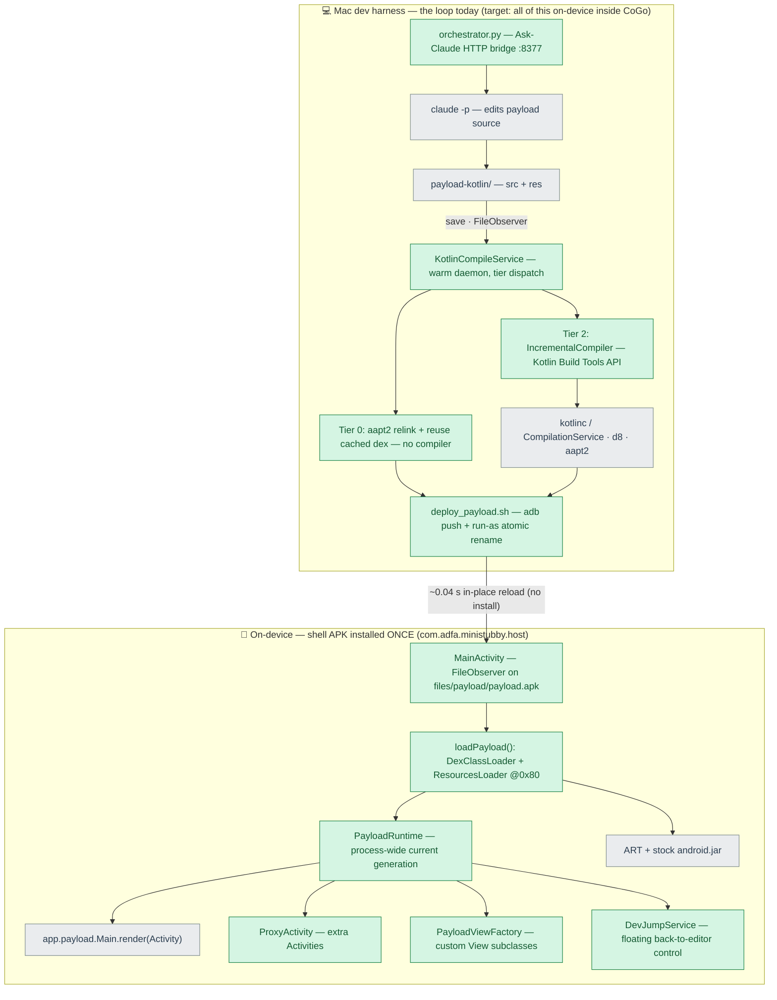

# Mini-Stubby spike (ADFA-4128)

Throwaway prototype proving the "shell app + dynamically loaded user app" direction:
install a **shell APK once**, then hot-swap the user app's **code + resources +
assets** from an **unsigned, never-installed** payload apk — no PackageInstaller,
no signing, no zipalign, no Play Protect / install-confirmation prompts. The design
write-up for the team lives in [`demo/confluence-draft.md`](demo/confluence-draft.md)
(also published under the SD-space "Improving User Productivity" page).

## Architecture

The loop today runs as a **Mac-side dev harness driving an on-device shell over adb**.
That split is a scaffolding convenience, not the target: every Mac-side box is meant to
move *inside CoGo on the phone* (the compile/dex/aapt2 steps were separately benchmarked
running on-device — see [`demo/DEX-RESULTS.md`](demo/DEX-RESULTS.md) /
[`demo/ONDEVICE-BENCHMARK.md`](demo/ONDEVICE-BENCHMARK.md)).

Green = new prototype code (this spike). Grey = leveraged platform / tooling / Claude.

*Not shown: a JVMTI hot-swap agent (`hotswap-agent/` → `libhotswap.so`, Tier 1) is
bundled but off by default — method-body-only, and the normal incremental path already
hits ~1 s, so it was measured out (see [`TIERED-IMPLEMENTATION.md`](TIERED-IMPLEMENTATION.md)).
An earlier phase-2 Java daemon (`devloop/`) is superseded by `compile-service/`.*

### Where to build / run

| Step | Command | Builds / runs |
|---|---|---|
| 1. Shell (once) | `tools/build_host.sh` | aapt2 → javac → d8 → zip → `adb install` the `host/` shell |
| 2. Warm loop | `compile-service/run_service.sh` | starts `KotlinCompileService`; watches `payload-kotlin/`, compiles + deploys on save. Env flags: `DEPLOY=1`, `INC=false` (whole-app fallback), `TIER1=true` (enable JVMTI) |
| 3. Ask-Claude (optional) | `orchestrator/orchestrator.py` | HTTP bridge so the on-device app can prompt Claude; `--mock-claude` for plumbing tests |
| — One-shot payload | `tools/build_payload.sh` | simple non-service build + hot-deploy of `payload/` (no warm service) |
| — Watch latency | `adb logcat -s MiniStubby` | reload timing + generation logs |

Toolchain is pinned in [`tools/env.sh`](tools/env.sh): flox `jdk17`, SDK build-tools
35.0.0, `android-36` platform. Kotlin 2.0.21 (Build Tools API + compiler-embeddable)
under `compile-service/incremental/lib`.

## Components

- **`host/`** — the shell app (`com.adfa.ministubby.host`), pure framework APIs, no
  androidx. Installed once. Five classes (~1,350 lines total; it grew well past the
  phase-1 "~180-line" shell as it took on multi-Activity, custom views, and the dev
  overlay):
  - `MainActivity` (868) — `FileObserver` on `filesDir/payload/payload.apk`; on each
    change `loadPayload()` copies it read-only into `codeCacheDir` (API 34+ blocks
    writable dex), swaps resources via `ResourcesLoader` (API 30+), loads code via
    `DexClassLoader`, and reflectively calls `app.payload.Main.render(Activity)`.
  - `PayloadRuntime` (123) — process-wide singleton holding the current loader /
    resources / theme / generation so every host component sees one payload version.
  - `ProxyActivity` (133) — hosts additional payload Activities (multi-Activity).
  - `PayloadViewFactory` (94) — `Factory2` that inflates payload-declared custom Views.
  - `DevJumpService` (133) — floating dev control to jump back to the editor.
- **`compile-service/`** — the persistent warm compile service (Mac-side JVM today):
  - `KotlinCompileService` (590) — watches `payload-kotlin/{src,res}` and dispatches
    the cheapest tier: **Tier 0** resource-only (aapt2 relink, reuse cached dex, no
    compiler), **Tier 2** code (warm Kotlin compile → d8 → package → deploy), **Tier 1**
    JVMTI redefine (off by default).
  - `IncrementalCompiler` (107) — drives Kotlin's Build Tools API `CompilationService`
    so a save recompiles the changed file + ABI-affected dependents, not the whole app.
  - `incremental/` — the `IncBench` / `OnDeviceDexBench` harnesses behind the benchmark docs.
- **`orchestrator/orchestrator.py`** (415) — Mac-side Ask-Claude HTTP bridge (the demo's
  prompt-to-build loop).
- **`hotswap-agent/hotswap.c`** (216) — the Tier 1 JVMTI `RedefineClasses` agent (built to
  `libhotswap.so`, bundled but off).
- **`devloop/DevLoopDaemon.java`** (542) — the earlier phase-2 Java-payload daemon,
  superseded by `compile-service/`.
- **`payload*/`** — test "user apps": `payload/` (Java stand-in), `payload-kotlin/` (what
  the service watches), `payload-gradle/` (a real androidx 18 MB app for the dependency
  story), plus `payload-native/` `payload-multiscreen/` `payload-manifest/` for the
  capability matrix.
- **`tools/`** — the build + deploy scripts above.

## Measured (Samsung A56, Android 16 — mid-range; no low-spec device yet)

Headline numbers; the full ladder is in the detail docs.

| Metric | Result |
|---|---|
| In-place reload, detect → payload view rendered | **~40 ms** (no install, ever) |
| Tier 0 resource edit (skips the compiler) | **~0.3–0.4 s** on-device projection |
| Tier 2 Kotlin code edit, warm + incremental | **~0.5–0.8 s** save → rendered |
| Incremental compile vs app size | **flat ~0.5–0.7 s** (0.53 s even at 30k LoC) |
| Incremental dex, changed classes only | **~36 ms**, independent of app size |
| Whole-app dex (the thing incremental dex replaces) | 266 ms (600 LoC) → 917 ms (30k) |
| Deployment cost vs app size | O(1) — ~40–60 ms on-device (48 KB–1.4 MB) |
| Cold Kotlin start (why the warm service is required) | ~6.6 s — paid once per session |
| Install / signing / Play-Protect prompts after the one-time shell install | **zero** |

The sub-1 s budget is dominated entirely by **compile**, not deployment — and only a
**persistent warm service + incremental compile** get Kotlin/Compose under 1 s. Detail:
[`CAPABILITY-MATRIX.md`](CAPABILITY-MATRIX.md) (what runs),
[`TIERED-IMPLEMENTATION.md`](TIERED-IMPLEMENTATION.md) (tiers + slow-device impact),
[`demo/INCREMENTAL-RESULTS.md`](demo/INCREMENTAL-RESULTS.md),
[`demo/DEX-RESULTS.md`](demo/DEX-RESULTS.md).

## App shapes verified on-device

Framework Java/Kotlin UI, custom Views, resources/assets/`values-night`, custom
`declare-styleable` attrs, `?attr/` theme lookup, state-preserving reload, multidex,
**androidx + Material3**, **Kotlin**, **interactive Jetpack Compose**, **native `.so`
(JNI)**, **androidx Fragments**, **multiple Activities** (via `ProxyActivity`), **runtime
permissions** (shell declares a superset). Full matrix + how each works:
[`CAPABILITY-MATRIX.md`](CAPABILITY-MATRIX.md).

## Scope deliberately left out (the real work items)

- **Fully-transparent Activity** — `startActivity` against a real payload `Activity`
  subclass needs an `Instrumentation` hook (Shadow/VirtualAPK) + result forwarding. The
  `ProxyActivity` contract covers multi-screen apps without it.
- **Manifest-bound features** — custom `Application`, exported components, providers, new
  permissions: read by the OS before payload code runs, so they belong to the shell and
  need a shell rebuild + one install (the one true architectural boundary, below).
- **Dependency changes** — a new/changed library re-provisions the classpath (~16 s),
  off the hot path; only source edits stay in the fast loop.
- **Low-spec hardware** — everything here is the A56 (mid-range); the slow-device
  timing ladder is unvalidated (risk D1 in the discussion doc).
- **Classloader recycling** — old generations are dropped and rely on GC.

## Prior art inside CoGo

`plugin-manager/` already dynamic-loads `.cgp` APKs with the exact same pair
(`DexClassLoader` in `loaders/PluginLoader.kt`, `ResourcesLoader` + `addAssetPath`
fallback in `loaders/PluginResourceContext.kt`, custom package-id handling included).
Mini-Stubby is "the plugin loader, applied to the user's app, in a separate shell process."

## The one true architectural boundary

Anything the OS reads from the **AndroidManifest before your code runs** belongs to the
shell, not the payload: additional Activities (→ proxy), permissions (→ superset), app
icon/label, exported components, custom `Application`. Everything the payload's *code*
touches at runtime — views, resources, themes, native libs, Compose, Fragments — is fully
hot-loadable.
