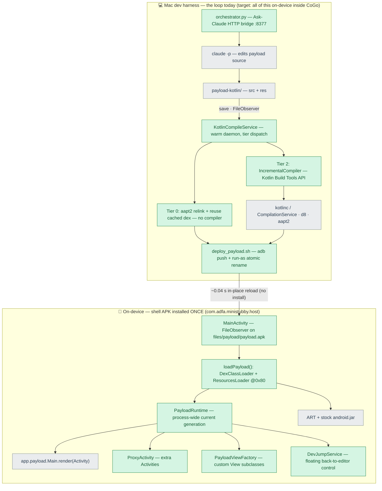

# Mini-Stubby spike (ADFA-4128)

Throwaway prototype proving the "shell app + dynamically loaded user app" direction:
install a **shell APK once**, then hot-swap the user app's **code + resources +
assets** from an **unsigned, never-installed** payload apk — no PackageInstaller,
no signing, no zipalign, no Play Protect / install-confirmation prompts. The design
write-up for the team lives in [`demo/confluence-draft.md`](demo/confluence-draft.md)
(also published under the SD-space "Improving User Productivity" page).

## Directory map

```
mini-stubby/
├── README.md                    ← you are here (architecture, bring-up, results)
├── DESIGN.md                    — design notes, alternatives, Compose-preview prior art
├── CAPABILITY-MATRIX.md         — which app shapes hot-load (all verified on-device)
├── TIERED-IMPLEMENTATION.md     — Tier 0/1/2 reload ladder + slow-device impact
├── CONTRACTS.md, CONTRACTS-v3.md — shell↔payload contract, v1 and current
├── FASTER-ON-SLOW-DEVICES.md    — how the loop stays <1 s on low-end hardware
├── MULTI-ACTIVITY-OPTIONS.md    — multi-screen: ProxyActivity vs Instrumentation hooks
├── RESULTS-phase3.md, RESULTS-phase4.md, REVIEW-RESPONSE.md — phase write-ups + review replies
│
├── host/            — the shell app (com.adfa.ministubby.host): installed once,
│                      long-polls /payload, digest-verifies, hot-reloads (~40 ms)
├── compile-service/ — the warm compile daemon (KotlinCompileService): incremental
│                      kotlinc via Build Tools API + d8 + aapt2, tier dispatch
│   └── incremental/ — Kotlin toolchain jars + IncBench/OnDeviceDexBench harnesses
├── hotswap-agent/   — Tier-1 JVMTI RedefineClasses agent (bundled, off by default)
├── orchestrator/    — Mac-side Ask-Claude HTTP bridge (Flow 1's Claude edits)
├── devloop/         — superseded phase-2 Java daemon (historical)
│
├── payload/           — Java stand-in user app (survey demo)
├── payload-kotlin/    — the Kotlin payload the Mac-harness daemon watches
├── payload-gradle/    — real androidx/Material3 app (the dependency story)
├── payload-native/    — JNI .so payload        ┐
├── payload-multiscreen/ — multi-Activity payload ├ capability-matrix probes
├── payload-manifest/  — manifest-boundary probe ┘
├── stress/          — synthetic N-classes/M-resources payload generator + results
├── bench/           — Java-vs-Kotlin compile-time benchmarks, plots, raw data
│
├── demo/            — demo projects, walkthrough docs, benchmark write-ups
│   ├── livereload-project/ — the on-device demo project (Lemonade Stand)
│   ├── recordings/  — demo videos (gitignored — shipped via Confluence)
│   ├── blank-start/, known-good/, rehearsal/ — demo reset states
│   └── *.md         — ONDEVICE-LOOP-BENCHMARK, DEX/INCREMENTAL results, flows review…
└── tools/           — build + deploy scripts (tools/env.sh pins the toolchain)
    ├── ondevice/    — stage_ondevice.sh (daemon bring-up) + on-device bench runners
    └── demo/        — Flow-1 demo drivers (record, reset, inject-ask)
```

## Architecture

**The loop now runs entirely on-device, inside CoGo** (ADFA-4128 on-device milestone).
CoGo's bundled JDK 21 + d8 + aapt2 do the incremental compile / dex / resource-link on the
phone; the shell hot-reloads with no install. Measured end-to-end on the A56 — see
[`demo/ONDEVICE-LOOP-BENCHMARK.md`](demo/ONDEVICE-LOOP-BENCHMARK.md) (**~2.4 s warm
save→render**, kotlinc-dominated; ~65 ms in-place reload).

How it fits together on the phone:
- **CoGo** (`app/.../livereload/LiveReloadManager.kt` + the Run action) spawns a warm
  compile daemon as its own process (its bundled JDK), watches the open project's source
  with a 0.1 s-debounced `FileObserver`, and POSTs `/build`. The **Run button** does a full
  Gradle build on first-run / manifest / Gradle change, else the fast loop
  (flush editors → `/build` → launch the shell). Opt-in per project via a `.livereload` marker.
- **The daemon** (`compile-service/KotlinCompileService`) runs incremental kotlinc + d8 (or
  aapt2-relink for resource-only edits) and **serves the payload over `/payload`** — the shell
  long-polls it and verifies an `X-Digest` **SHA-256 handshake** (the doc's Step-4 Option C:
  app-private dir + digest) before loading. No adb, no run-as, no shared-storage FUSE inotify.
- **The shell** pulls, verifies, writes its own private `payload.apk`, and hot-reloads.

Bring-up: [`tools/ondevice/stage_ondevice.sh`](tools/ondevice/stage_ondevice.sh) stages the
daemon into a debuggable CoGo (`files/mstc` + `run_daemon.sh`, auto-discovering the on-device
JDK / aapt2 / android.jar / d8.jar).

> The original **Mac-side harness** (below) still works and is retained for benchmarking /
> fast iteration — there the shell reaches the Mac daemon via `adb reverse tcp:8378`, and the
> Mac deploys via `adb push`. The on-device path is the product shape; the Mac path is the lab.

Green = new prototype code (this spike). Grey = leveraged platform / tooling / Claude.



*Not shown: a JVMTI hot-swap agent (`hotswap-agent/` → `libhotswap.so`, Tier 1) is
bundled but off by default — method-body-only, and the normal incremental path already
hits ~1 s, so it was measured out (see [`TIERED-IMPLEMENTATION.md`](TIERED-IMPLEMENTATION.md)).
An earlier phase-2 Java daemon (`devloop/`) is superseded by `compile-service/`.*

### Bring-up: on-device live reload (step-by-step)

Prereqs: a device with USB debugging, adb on the Mac, this branch checked out.
Everything below is one-time; after it, the loop itself needs **no Mac at all**
(works in airplane mode).

1. **Install a debuggable CoGo from THIS branch** — the live-reload wiring
   (`app/.../livereload/LiveReloadManager.kt`) is not in stock CoGo, and the daemon
   must run as CoGo's own process (SELinux: nothing else — not even `run-as` — may
   spawn it):
   ```sh
   flox activate -d flox/local -- ./gradlew :app:assembleV8Debug
   adb install -r app/build/outputs/apk/v8/debug/CodeOnTheGo-v8-debug-*.apk
   ```
2. **Launch CoGo once and let first-run setup finish** (it extracts the bundled
   JDK 21 to `files/usr` and the SDK to `files/home/android-sdk` — the daemon's
   toolchain).
3. **Stage the compile daemon** into CoGo's private dir (compiles it on the Mac,
   pushes classes + Kotlin jars, auto-discovers the on-device JDK/aapt2/d8, writes
   `files/mstc/run_daemon.sh`):
   ```sh
   spike/mini-stubby/tools/ondevice/stage_ondevice.sh
   ```
4. **Build + install the shell app** (the once-installed host that hot-reloads):
   ```sh
   spike/mini-stubby/tools/build_host.sh
   ```
5. **Opt a project in and run it.** Copy `demo/livereload-project/` into
   `/storage/emulated/0/CodeOnTheGoProjects/<Name>/` (or use any project whose payload
   keeps the contract `object Main { @JvmStatic fun render(host: Activity): View }`),
   then `touch <project>/.livereload`. Open it in CoGo and press **Run** — the first
   Run does a normal full Gradle build + install; it also launches the warm daemon.
   From then on **every editor save hot-reloads the shell in ~1–3 s** (green
   "Live-reloaded" banner shows build + reload ms).

**Two watch modes** (who notices the save):
- *Staged default* (`run_daemon.sh` has `-Dwatch=false`): CoGo's `LiveReloadManager`
  FileObserver watches the project and POSTs `/build` — the intended product shape.
- *Daemon self-watch* (`tools/ondevice/run_daemon_watch.sh`, `-Dwatch=true`): the
  daemon's own `WatchService` watches the project (FUSE inotify — verified working on
  the A56 / Android 16). This is the configuration the Flow-2 demo recording used, and
  works even when nothing in CoGo triggers builds. Swap it in with
  `adb push … /data/local/tmp/ && adb shell run-as com.itsaky.androidide cp /data/local/tmp/run_daemon_watch.sh files/mstc/run_daemon.sh`,
  then restart CoGo. (Running both modes double-builds each save — harmless but wasteful.)

**Verify / debug:**
```sh
adb logcat -s MiniStubby MiniStubbyLR MiniStubbyKCS   # shell reloads · CoGo trigger · daemon
adb forward tcp:18378 tcp:8378
curl localhost:18378/status                            # building=0 gen=N
curl -X POST --data <abs path to changed .kt> "localhost:18378/build?kind=code"
```
Known rough edge: the shell's "🔨 Compiling…" banner only clears on a *successful
render* — a compile error, or a payload that throws inside `render()` (e.g.
`Color.parseColor("#A00")` — 3-digit colors are invalid on Android), leaves the banner
stuck with stale content. Check `adb logcat -s MiniStubby` for `payload load failed`.

**Mac harness (the lab, below).**

| Step | Command | Builds / runs |
|---|---|---|
| 1. Shell (once) | `tools/build_host.sh` | aapt2 → javac → d8 → zip → `adb install` the `host/` shell |
| 2. Warm loop | `compile-service/run_service.sh` | starts `KotlinCompileService`; watches `payload-kotlin/`, compiles + deploys on save. Env flags: `DEPLOY=1`, `INC=false` (whole-app fallback), `TIER1=true` (enable JVMTI) |
| 3. Ask-Claude (optional) | `orchestrator/orchestrator.py` | HTTP bridge so the on-device app can prompt Claude; `--mock-claude` for plumbing tests |
| — One-shot payload | `tools/build_payload.sh` | simple non-service build + hot-deploy of `payload/` (no warm service) |
| — Watch latency | `adb logcat -s MiniStubby` | reload timing + generation logs |

Toolchain is pinned in [`tools/env.sh`](tools/env.sh): flox `jdk17`, SDK build-tools
35.0.0, `android-36` platform. Kotlin 2.0.21 (Build Tools API + compiler-embeddable)
under `compile-service/incremental/lib`.

## Components

- **`host/`** — the shell app (`com.adfa.ministubby.host`), pure framework APIs, no
  androidx. Installed once. Five classes (~1,350 lines total; it grew well past the
  phase-1 "~180-line" shell as it took on multi-Activity, custom views, and the dev
  overlay):
  - `MainActivity` (868) — `FileObserver` on `filesDir/payload/payload.apk`; on each
    change `loadPayload()` copies it read-only into `codeCacheDir` (API 34+ blocks
    writable dex), swaps resources via `ResourcesLoader` (API 30+), loads code via
    `DexClassLoader`, and reflectively calls `app.payload.Main.render(Activity)`.
  - `PayloadRuntime` (123) — process-wide singleton holding the current loader /
    resources / theme / generation so every host component sees one payload version.
  - `ProxyActivity` (133) — hosts additional payload Activities (multi-Activity).
  - `PayloadViewFactory` (94) — `Factory2` that inflates payload-declared custom Views.
  - `DevJumpService` (133) — floating dev control to jump back to the editor.
- **`compile-service/`** — the persistent warm compile service (runs on-device as CoGo's
  subprocess; the same classes also run Mac-side in the lab harness):
  - `KotlinCompileService` (590) — watches `payload-kotlin/{src,res}` and dispatches
    the cheapest tier: **Tier 0** resource-only (aapt2 relink, reuse cached dex, no
    compiler), **Tier 2** code (warm Kotlin compile → d8 → package → deploy), **Tier 1**
    JVMTI redefine (off by default).
  - `IncrementalCompiler` (107) — drives Kotlin's Build Tools API `CompilationService`
    so a save recompiles the changed file + ABI-affected dependents, not the whole app.
  - `incremental/` — the `IncBench` / `OnDeviceDexBench` harnesses behind the benchmark docs.
- **`orchestrator/orchestrator.py`** (415) — Mac-side Ask-Claude HTTP bridge (the demo's
  prompt-to-build loop).
- **`hotswap-agent/hotswap.c`** (216) — the Tier 1 JVMTI `RedefineClasses` agent (built to
  `libhotswap.so`, bundled but off).
- **`devloop/DevLoopDaemon.java`** (542) — the earlier phase-2 Java-payload daemon,
  superseded by `compile-service/`.
- **`payload*/`** — test "user apps": `payload/` (Java stand-in), `payload-kotlin/` (what
  the service watches), `payload-gradle/` (a real androidx 18 MB app for the dependency
  story), plus `payload-native/` `payload-multiscreen/` `payload-manifest/` for the
  capability matrix.
- **`tools/`** — the build + deploy scripts above.

## Measured (Samsung A56, Android 16 — mid-range; no low-spec device yet)

Headline numbers; the full ladder is in the detail docs.

| Metric | Result |
|---|---|
| In-place reload, detect → payload view rendered | **~40 ms** (no install, ever) |
| Tier 0 resource edit (skips the compiler) | **~0.3–0.4 s** on-device projection |
| Tier 2 Kotlin code edit, warm + incremental | **~0.5–0.8 s** save → rendered |
| Incremental compile vs app size | **flat ~0.5–0.7 s** (0.53 s even at 30k LoC) |
| Incremental dex, changed classes only | **~36 ms**, independent of app size |
| Whole-app dex (the thing incremental dex replaces) | 266 ms (600 LoC) → 917 ms (30k) |
| Deployment cost vs app size | O(1) — ~40–60 ms on-device (48 KB–1.4 MB) |
| Cold Kotlin start (why the warm service is required) | ~6.6 s — paid once per session |
| Install / signing / Play-Protect prompts after the one-time shell install | **zero** |

The sub-1 s budget is dominated entirely by **compile**, not deployment — and only a
**persistent warm service + incremental compile** get Kotlin/Compose under 1 s. Detail:
[`CAPABILITY-MATRIX.md`](CAPABILITY-MATRIX.md) (what runs),
[`TIERED-IMPLEMENTATION.md`](TIERED-IMPLEMENTATION.md) (tiers + slow-device impact),
[`demo/INCREMENTAL-RESULTS.md`](demo/INCREMENTAL-RESULTS.md),
[`demo/DEX-RESULTS.md`](demo/DEX-RESULTS.md).

## App shapes verified on-device

Framework Java/Kotlin UI, custom Views, resources/assets/`values-night`, custom
`declare-styleable` attrs, `?attr/` theme lookup, state-preserving reload, multidex,
**androidx + Material3**, **Kotlin**, **interactive Jetpack Compose**, **native `.so`
(JNI)**, **androidx Fragments**, **multiple Activities** (via `ProxyActivity`), **runtime
permissions** (shell declares a superset). Full matrix + how each works:
[`CAPABILITY-MATRIX.md`](CAPABILITY-MATRIX.md).

## Scope deliberately left out (the real work items)

- **Fully-transparent Activity** — `startActivity` against a real payload `Activity`
  subclass needs an `Instrumentation` hook (Shadow/VirtualAPK) + result forwarding. The
  `ProxyActivity` contract covers multi-screen apps without it.
- **Manifest-bound features** — custom `Application`, exported components, providers, new
  permissions: read by the OS before payload code runs, so they belong to the shell and
  need a shell rebuild + one install (the one true architectural boundary, below).
- **Dependency changes** — a new/changed library re-provisions the classpath (~16 s),
  off the hot path; only source edits stay in the fast loop.
- **Low-spec hardware** — everything here is the A56 (mid-range); the slow-device
  timing ladder is unvalidated (risk D1 in the discussion doc).
- **Classloader recycling** — old generations are dropped and rely on GC.

## Prior art inside CoGo

`plugin-manager/` already dynamic-loads `.cgp` APKs with the exact same pair
(`DexClassLoader` in `loaders/PluginLoader.kt`, `ResourcesLoader` + `addAssetPath`
fallback in `loaders/PluginResourceContext.kt`, custom package-id handling included).
Mini-Stubby is "the plugin loader, applied to the user's app, in a separate shell process."

## The one true architectural boundary

Anything the OS reads from the **AndroidManifest before your code runs** belongs to the
shell, not the payload: additional Activities (→ proxy), permissions (→ superset), app
icon/label, exported components, custom `Application`. Everything the payload's *code*
touches at runtime — views, resources, themes, native libs, Compose, Fragments — is fully
hot-loadable.
