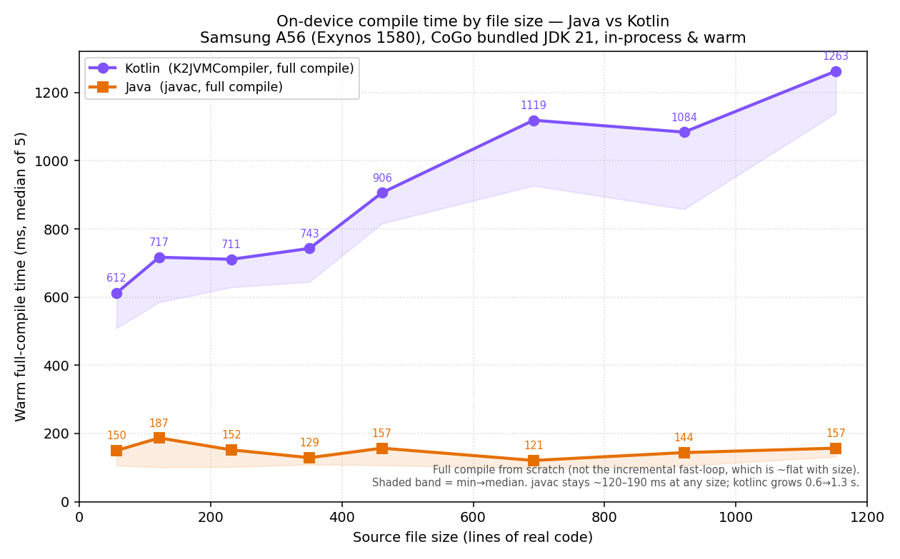

# Java vs Kotlin — full-compile time by file size (on-device A56, 2026-07-14)

Answers "benchmark compile by file size, Java vs Kotlin, 50–1000 LoC, plot the curves."
Harness: `compile-service/incremental/LangBench.java` · runner: `tools/ondevice/run_langbench.sh`
· plot: `bench/plot_langbench.py` → `bench/langbench-ondevice.png` · data: `bench/langbench-ondevice.csv`.

## Setup (fair, warm, in-process)

- **Device:** Samsung A56 (`SM-A566B`, Exynos 1580 / `s5e8855`), **CoGo's bundled JDK 21**, run as
  CoGo's uid — the exact JVM the live-reload daemon uses.
- **Both compilers in-process:** Kotlin via `K2JVMCompiler.exec` (kotlin-compiler-embeddable 2.0.21),
  Java via `javax.tools` system `javac`. Same warm JVM.
- **Matched code:** one self-contained source file of *real* code (arithmetic, string building, loops,
  branches) — identical method count per language, so LoC matches at each point.
- **Method:** global warmup per language, then per size **1 warmup + 5 timed**, median + min. The output
  dir is wiped *outside* the timed region — only compile time is measured. **Full compile from scratch.**

## Results

| File size (LoC) | Kotlin median (ms) | Java median (ms) | Kotlin / Java |
|---:|---:|---:|---:|
| 57   | 612  | 150 | 4.1× |
| 122  | 717  | 187 | 3.8× |
| 232  | 711  | 152 | 4.7× |
| 351  | 743  | 129 | 5.8× |
| 461  | 906  | 157 | 5.8× |
| 692  | 1119 | 121 | 9.2× |
| 921  | 1084 | 144 | 7.5× |
| 1152 | 1263 | 157 | 8.0× |

## Takeaways

1. **javac is ~flat and cheap:** ~120–190 ms for *any* file 50→1150 LoC on-device. javac's cost is almost
   all fixed overhead; the source-size term is negligible in this range.
2. **kotlinc grows with size and has a much higher floor:** ~0.6 s at 57 LoC → ~1.3 s at 1150 LoC, on a
   ~500 ms fixed floor (K2 frontend + backend init per invocation). Full Kotlin compile is **4–8× slower
   than Java**, and the gap widens with file size.
3. **Design implication for the live-reload loop:** per-*file* full recompile is the daemon's granularity,
   so a big Kotlin file (our 617-line demo `Main.kt`) sits in the ~0.9–1.3 s band — matching this session's
   observed 0.7–2.2 s kotlinc times. Keeping edited files small, or splitting hot files, directly cuts the
   loop time. Java payloads would reload markedly faster, but the plugin/app ecosystem is Kotlin.

## Why the real Main.kt takes ~1.7–2.2 s (not ~1.1 s) — probe attribution

`compile-service/incremental/MainProbe.java` — 3-way controlled full compile on the A56, warm:

| Condition (~617–692 LoC, warm) | median | min |
|---|---:|---:|
| **A** synthetic 692 LoC, stdlib-only (= benchmark) | 1282 ms | 943 ms |
| **B** same synthetic file **+ android.jar on classpath** | 885 ms | 798 ms |
| **C** the **real Main.kt** (Android framework + org.json) + android.jar | 1742 ms | 1439 ms |

- **A ≈ B → the big android.jar (27.7 MB) on the classpath is essentially free.** K2 resolves lazily;
  a file that references no Android types pays ~nothing for it. So it's *not* "the classpath is huge."
- **B → C = +857 ms → it's the CODE, not the size.** Real Android UI code (Activity/View/LinearLayout/
  Button member resolution, overload resolution on framework methods, `SharedPreferences`, `org.json`,
  string templates, lambdas, `when`) type-checks ~2× harder than an equal-length file of synthetic
  arithmetic. Same LoC, double the frontend work.
- **Plus a ~0.5–0.9 s fixed K2 init floor** baked into every *full* `K2JVMCompiler.exec` invocation.

So the 617-line Main.kt sits at ~1.4–1.7 s **warm full compile**; a cold first-compile or thermal spike
pushes it to the 2.2 s we saw this session. Note the daemon's real fast loop uses the **incremental** BTA
path (persistent compiler, amortizes the init floor) — the same Main.kt landed at **~0.66 s** warm-incremental
in the daemon log. Levers to cut it: keep the daemon warm on the incremental path, and **split Main.kt into
smaller files** so a per-file incremental recompile only touches the edited one.

## Which "compile" number is which (reconciling the figures)

There are **four different compile numbers** in this spike; they are not interchangeable:

| Path | What it measures | On-device (A56) |
|---|---|---|
| **Full compile, Java** (this doc) | javac a whole file from scratch | ~0.12–0.19 s, flat |
| **Full compile, Kotlin — synthetic** (this doc) | K2JVMCompiler, arithmetic, stdlib-only | ~0.6–1.3 s, grows w/ size |
| **Full compile, Kotlin — real Main.kt** (probe) | K2JVMCompiler, Android framework code | ~1.4–1.7 s warm (2.2 s cold) |
| **Incremental, Kotlin** (`INCREMENTAL-RESULTS.md`) | BTA `CompilationService`, 1-file edit, caches warm | ~0.4–0.7 s, **~flat** 600→30k LoC |

The **0.53 s** figure Bryan flagged as "not representative" was the *incremental* edit on a **30k-LoC** app
(the flat-incremental curve's endpoint) — a best case of a different mechanism, not full compile. The daemon's
real fast loop uses the **incremental** path; the curves here are **full compile**, which shows how a
from-scratch per-file build scales and how the two languages compare head-to-head.
