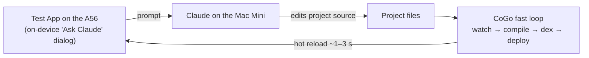
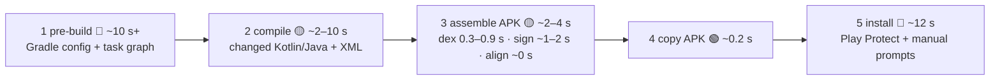
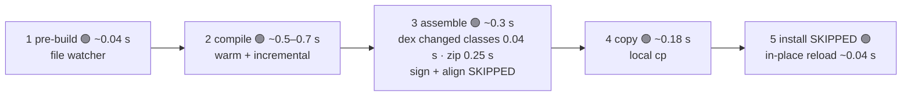

# ADFA-4128 Faster edit→build→run Loop Discussion Doc

The ticket description was heavy on technical solutions, and light on product requirements.  Given how good & cheap LLMs are, I figured the best way to ask the right questions was to dive in and do some prototyping.  Then go ask the right questions based on data gathered :)

This doc is based on a spike where we asked Claude Fable 5 to try and get to a 1s live reload on a variety of different types of edits (resource changes, styling changes, code changes) on a Samsung A56 (a mid-range phone; see Question 3 for the low-spec target discussion).

Below, we outline open questions, and technical discussions.  Note that none of this testing happened on a low-spec phone, so the solutions we use will likely evolve as we profile more.

> INFO BOX Please feel free to edit this doc!  Or write your notes in the "**Discussion**" sections. (Add your initials if you want, or remain anonymous...either way!)

# A. Proposed Product Goals - Please Edit!!

## Context

Today's edit→build→run loop takes tens of seconds or more, with manual prompts.  It builds an APK using a full Gradle incremental build, installs the APK, and fights Google Play Protect with manual prompts along the way.  And every reload loses app state.

CoGo's existing Jetpack Compose preview pipeline works well for rapidly iterating on an individual component, but not on the full application. 

This means that users cannot run quick, live-reload style iteration loops.

## Proposed Goal

Based on details below for "low spec phone" and "edit types", here are the first two proposed targets to go after:

1. On a low spec phone, all high priority edit types (see below) MUST live reload in less than 5s.  This way, users don't need to stall or switch tasks while they wait
2. Ideally, live reload SHOULD be 1s or less so user can maintain flow

This includes both the technical time to live reload, and user interaction time to switch from editing to running the test app -- we still need to define the workflow and when the timer starts.

From prototyping so far, 1s looks possible already on a Samsung A56, but that’s a moderately high spec phone.

## Not a Goal

- Optimizing initial build time for an app is not a goal.  We're focusing only on the edit loop.

## Question 1: What Types of Edits Are Important To Support?

Proposed Priority for types of changes to handle quickly:

### High Priority

These happen frequently and user likely to want to see immediate feedback

- Resource changes
- Styling changes
- Change method code, no signature change
- Change code that does affect class signature

### Low Priority

These operations happen less frequently during normal development (and for learners) and it's okay if they're slower:

- Edit to Gradle build file that changes external or compile dependencies
- Manifest changes

### Discussion: 

Agree or disagree with priority? Any other types of operations we should support and test?

### Question 1A: How Important Is It to Keep State Through Reload?

It's possible to handle all the high priority items and also try to preserve app state when changes happen. But from initial research (see below in tech decisions section), this will probably be very hard to do in general -- only shown to be reliably possible on [Flutter](https://flutter.dev/), where you're limited to working within their framework.  Not yet on arbitrary Android apps.  

Android Studio tried to support hot reload with signature changes (Instant Run), but found it introduced too many issues — stale program state after a swap, changes silently not applying (training users into a “when in doubt, rebuild” habit), and broken debugging — and [removed it in favor of the more conservative Apply Changes](https://android-developers.googleblog.com/2019/05/android-studio-35-beta.html).  Now they only support hot swap via JVMTI on changes that don't affect the class signature.

## Question 2: How Fast?

Can we make the loop a lot faster.  From HCI guidelines, these might be good targets to aim for (from [Nielsen, 1993](https://www.nngroup.com/articles/response-times-3-important-limits/))

- < 1s means the user can mentally stay in the flow
- < 10s means user can wait, get a bit distracted, but likely stay on task

If you go much higher than that, the user goes off to do another task (or makes a coffee) - added by Bryan :)

### Discussion: 

Does this seem like a good way to define how fast?

## Question 3: What Phone Spec?

### Discussion:

Do we have an analysis of what the spec distribution looks like for our current active users? Or what we want to target?

Agent research (Confluence sweep, 2026-07-11) — no formal minimum spec exists yet; what we do have:

- **David's onboarding guidance** to Bryan: test on a *"low end Samsung phone that supports DeX"* (or a DeX tablet) — device-class guidance, not numbers ([2026-05-03 Update & Questions](https://appdevforall.atlassian.net/wiki/spaces/~712020bc73e8795be84d799f3a4beedc8b2648/pages/758546451), archived).
- **The team's target-device reference** ([The most common Android phones worldwide](https://appdevforall.atlassian.net/wiki/spaces/SD/pages/100696067)): the active fleet is dominated by budget Samsung A-series and legacy devices — Galaxy J7 (2015), S7 Edge, J5/J5 Prime, A12/A14/A51/A54, plus Redmi/Oppo — i.e. 1–4 GB-RAM-era hardware still matters.
- A **min-config question was raised in Aug 2024** (Galaxy S5-class: 2 GB RAM / 16 GB storage; cheap Alcatel: 1 GB / Android 8) and explicitly deferred ([doc](https://appdevforall.atlassian.net/wiki/spaces/Documentat/pages/38273026)).
- CoGo still ships **32-bit ARM builds** for exactly this audience ([why 32/64-bit](https://appdevforall.atlassian.net/wiki/spaces/Marketing/pages/527532033)).

⚠️ Tension to resolve: this design's **Android 11 (API 30) floor** for `ResourcesLoader` (risk D4) excludes several fleet-common devices (J7-class, S5-class never got Android 11). Proposal: pick a **named reference device** from the fleet list (e.g. a 2–4 GB A-series) and validate both the API floor and the timing ladder on it (decision E1).

### Decision: TBD

## Question 4: What Types of Apps?

TBD?

### Discussion:

- Do we have a sense for what types of apps people want to build?
- Do we have a corpus of such test apps (open source) that we can point an LLM at to test against?

### Decision: TBD

## Question 5: What's the Priority of Supporting Debugging?

### Discussion: 

How important is it to support debugging?

### Decision: TBD

## Workflow Options?

What workflows do we want to support?

1. Starting from IDE
  1. Editing interface + live reload trigger
    1. Option A: Live reload after every keystroke, debounced to 1s
    2. Option B: Live reload when user saves a file
    3. Option C: Live reload when focus leaves the editor
    4. Option D: Live reload when user triggers using a live reload button
    5. Option E: ??
  2. How does a user switch between IDE and Test App to see changes quickly?
    1. Option A: User triggers live reload (somehow -- see above) and then manually switches to Test App
    2. Option B: Have a button in IDE that triggers the live reload and also switches to Test App
    3. Option C: Split screen?
    4. Option D: ??
2. Starting while in the Test App
  1. User can make edits from the test app and live reload
    1. Option 1: Can edit style or code snippets directly from the app being tested
    2. Option 2: Can ask an LLM to make edits in the background

### Discussion

What seems worth going after first? (Assume all of these are probably not that hard with LLM support)

**What other environments support (market scan, 2026-07-11):**

| Environment                                                  | Mechanism                       | Latency                 | Keeps in-memory state?    | Key limits                                                   |
| ------------------------------------------------------------ | ------------------------------- | ----------------------- | ------------------------- | ------------------------------------------------------------ |
| [Flutter hot reload](https://docs.flutter.dev/tools/hot-reload) | inject Dart into running VM     | < 1 s                   | Yes                       | Dart only; native/structural changes need restart            |
| [React Native Fast Refresh](https://reactnative.dev/docs/fast-refresh) (Expo) | re-render changed JS modules    | 1–2 s                   | Partially (hooks survive) | JS only; native changes = full rebuild                       |
| [Android Studio Live Edit](https://developer.android.com/develop/ui/compose/tooling/iterative-development) (Compose) | JVMTI body swap + recomposition | near-instant            | Yes                       | composable bodies only; API 30+                              |
| [Android Studio Apply Changes](https://developer.android.com/studio/run) | JVMTI class redefinition        | seconds                 | Mostly                    | method bodies only; manifest/native ⇒ reinstall              |
| Xcode Previews / [Inject](https://github.com/krzysztofzablocki/Inject) | canvas render / dylib swap      | seconds / ~1–2 s        | No / Yes                  | preview-only; Inject is third-party                          |
| Vite HMR (web baseline)                                      | swap changed ES module          | ~10–50 ms               | Yes                       | web only                                                     |
| On-device IDEs (AIDE, Replit mobile)                         | full rebuild / cloud + Expo     | many s / 1–2 s (online) | No / Partially            | **no offline on-device IDE ships any sub-second loop today** |

Takeaway: the industry "feels instant" bar is sub-2 s, and every incumbent hits it by restricting *what* can change (function/method bodies only) with a slow full restart for everything else. A < 1 s **full-reload** loop (state persisted + restored) avoids that "which edits are hot?" complexity entirely — and since no offline on-device IDE offers any sub-second loop, it would be unique in category.

### Decision: TBD

# B. Summary of Investigation Spike So Far to Prototype "Son of Stubby"

We tried to get a sub-1s edit→build→run loop going on a Samsung A56 (mid-range) for a variety of app types and change types.  To see what product questions came up.  And what technical blockers we might need to deal with.

This has taken just under 2 hr of hands-on time and about 12.5 hr of agent time, over ~2.5 wall-clock days (July 7–10, 2026).  Fable 5 orchestrator, and various model levels doing the tasks.

## Spike Results

**▶ Demo video (2 min):** *[attach **`2026-07-09_lemonade-live-reload.mp4`** on publish]* 

How the demo's build loop was wired:

1. Starting from a blank app connected to the live-reload loop, four natural-language prompts (typed into an on-device "Ask Claude" dialog inside the blank app) build a playable Lemonade Stand game, restyle it mid-play, and add a dashboard and a leaderboard. Each change compiles and hot-reloads in ~1–3 s with **no build dialog, no install, no Play Protect prompt — and game state (day, cash) survives every reload — though to be clear that's the demo app persisting its state to storage and restoring it on load, not the reload preserving in-memory state (a full class/DEX reload can't; see Step 5's state contract).**

### More Details

What the spike tested out:

- **Faster Edit Loop**
  - **Step 0: Initial Setup ("Son of Stubby")**
    - Install skeleton app once, so we can skip install in the future
  - **Step 1: Pre-Build **
    - File watcher instead of full Gradle processing
  - **Step 2: Build**
    - Different fast-paths
      - Resource-only edits skip compiler
      - Incremental compilation
        - Integrated Kotlin's own incremental engine into the warm loop (skipping Gradle); 
        - Verified correctness against clean builds; measured under memory pressure.
    - Tested warm, preloaded build tools (otherwise we wouldn't hit time budget)
  - **Step 3: Assemble**
    - DEX and send DEX to load into the skeleton test app
    - No full APK build -- no need
  - **Step 4:** **Copy**
    - No APK copying any more -- just copy over updated files
  - **Step 5: Install**
    - Skeleton app reloads updated resources
      - Also tested out JVMTI hot reloads
    - No install step! 
- **App Types Tested**
  - Benchmarked apps from 600 to 30,000 LoC:
    - 600 LoC [Lemonade Stand game](https://en.wikipedia.org/wiki/Lemonade_Stand) that we built from scratch and hot reloaded along the way
    - A synthetic ladder at 600 / 3,000 / 15,000 / 30,000 LoC (one class per file, ~25 methods/class) for compile + dex scaling
    - A real androidx app with a 267-dependency resolved classpath (18 MB debug APK) for the dependency story
  - Features tested (the stage-2 capability matrix, all on-device)
    - Multiple Views
    - Kotlin vs. Java apps
    - androidx
    - Material3
    - Compose, Fragments
    - Multi-Activity
    - Native libs
    - Runtime permissions
- **Also researched**
  - JVMTI method-body hot-swap
  - JRebel/Instant-Run-style instrumentation (evidence in Step 2.1).
- **Workflows Prototyped**
  - Save file →auto-reload; 
  - Floating dev controls in the test app for switching back to editor that survive the app owning its own UI
  - On-device Claude prompt-to-build dialog that builds and hot reloads in the Test App (used for building the Lemonade app)

# C. Technical Decision Discussion

One section per pipeline step (Step 1–5), then the cross-cutting decisions (C1–C6). Each keeps the same shape:

- **Context** — what the step costs today, and why
- **Alternatives** — the options; Option 0 is always what CoGo does today
- **Data** — measured numbers (A56, warm)
- **Decision** — the proposal

## C.0 Overview: the Five Steps & What They Cost

David's [Improving User Productivity](https://appdevforall.atlassian.net/wiki/spaces/SD/pages/591495169/Improving+User+Productivity) analysis splits today's loop into five steps: (1) pre-build → (2) compile → (3) assemble (dex · sign · align) → (4) copy → (5) install. We re-benchmarked each on the Samsung A56 (his numbers hold up — claim-by-claim in C6), then measured a proposed fast loop against the same five.

*Bottom line: on the A56, a typical edit reloads in ~1 s — the goal is reachable, but only because compile (Step 2) and dex (Step 3) are made incremental. Those two are the make-or-break steps; every other step is already well under budget. The open question is low-spec hardware (D1), where the A56 headroom may not hold.*

**Why today's loop is slow**

- Every change, even a one-liner, pays the whole pipeline: ~10 s+ Gradle pre-build, APK assembly, and a ~12 s install fighting Play Protect — ~20–30 s + prompts.
- Of that ~12 s install, only ~0.4–0.8 s is the mechanical install (even for an 18 MB APK). The rest is Play Protect, confirmation prompts, and relaunch — skippable, not optimizable.

**What the fast loop changes**

- Skip signing, alignment, and install (David's insight — no APK, no install, no Play Protect).
- Make compile and dex incremental, so they scale with the change, not the app.

**Legend (Nielsen bands from Question 2)**

- 🟢 < 1 s — stay in flow
- 🟡 < 10 s — wait, stay on task
- 🔴 ≥ 10 s — user leaves
- Same convention in both diagrams; times per change on the A56.

**Current CoGo — Gradle → APK → install (~20–30 s + prompts per change, warm Gradle daemon):**

**Proposed fast loop — same five steps, each made fast or skipped (A56, warm, ~1 s total):**

*Resource-only edits skip step 2 (aapt2 re-link ~0.3 s → ~0.75 s total 🟢). A cold cache falls step 2 back to a full compile (~2–9.6 s 🟡). Two numbers = small app → 30k LoC where the step scales with app size; one number = flat.*

**What that adds up to per change** — the strategies we tried on the way to the 1 s target:

| Strategy                                                  | Small app      | 30k LoC        | On ~20th-pctile device (×2–3) |
| --------------------------------------------------------- | -------------- | -------------- | ----------------------------- |
| Current CoGo (Gradle → APK → install), warm Gradle daemon | ~20–30 s 🔴    | ~30 s+ 🔴      | worse + prompts 🔴            |
| Fast loop, naive: full compile + whole-app dex            | ~2.9 s 🟡      | ~11 s 🔴       | 20–30 s 🔴                    |
| Fast loop: incremental compile + whole-app dex            | ~1.5 s 🟡      | ~1.9 s 🟡      | 4–6 s 🟡                      |
| **Fast loop: incremental compile + incremental dex**      | **~1.25 s 🟡** | **~1.05 s 🟡** | ~2–3 s 🟡                     |
| Resource-only edit (tier 0)                               | ~0.75 s 🟢     | ~0.75 s 🟢     | ~1.5–2 s 🟡                   |

**Warm vs cold toolchain**

- The numbers above assume the warm build service is already running.
- The first change of a session adds one-time warm-up: toolchain start ~16 s, first compile ~7 s (small) → ~24 s (30k LoC), ~1.4 s JVM/D8. Paid once per session, or again if the OS evicts the service (C1).
- A real androidx classpath (267 entries) snapshots in ~16 s, re-run only on dependency changes.

**Takeaways**

1. Killing sign/align/install (David's insight) removes the ~15 s tail, but leaves a ~3–11 s compile wall that grows with app size.
2. Compile and dex both have to be incremental; each then scales with the change, not the app — that's what holds the loop near ~1 s at every size.
3. Remaining hot-path targets, in order: incremental kotlinc ~0.5–0.7 s (the floor here) → package+deploy ~0.43 s fixed tax (~40% of the warm loop; Step 3) → aapt2 re-link ~0.3 s (recheck on low-spec).
4. Not worth optimizing: watcher, reload, repaint (~40 ms each).

*Raw data: spike branch **`spike/mini-stubby/`** — **`DESIGN.md`**, **`demo/INCREMENTAL-RESULTS.md`**, **`demo/DEX-RESULTS.md`**, **`demo/ONDEVICE-BENCHMARK.md`**.*

## Step 1 — Pre-Build: Detect What Changed

*Decision: how to detect a change. Goal (<1 s): easily met — the watcher is ~0.04 s. Not a bottleneck; the real design question is catching unsaved edits.*

**Context**

- Today every run pays Gradle's config + task-graph pass before any real work.
- The fast loop replaces it with a file watcher that already knows which file changed.

| Approach (per change)                      | Small app (~600 LoC) | 30k LoC    |
| ------------------------------------------ | -------------------- | ---------- |
| Current: Gradle configuration + task graph | ~10 s+ 🔴            | ~10 s+ 🔴  |
| Fast loop: file watcher (FileObserver)     | ~0.04 s 🟢           | ~0.04 s 🟢 |

**Alternatives**

- **Option 0 (Current):** Gradle config + task graph, triggered by a "Quick Run" button.
- **Option 1:** file watcher on save *(in spike)* — feeds the changed-file set that makes Step 2's incremental compile reliable.
- **Option 2:** also trigger when focus leaves the editor — David's idea; hides the ~0.5 s compile behind the app-switch. Revert if the user exits without saving.

**Data — save-path audit (CoGo source, 2026-07-11)**

- Everything that reaches disk is a plain file write in the project tree, so a recursive watcher sees it all: editor Save, plugin `IdeFileService`, template emitters, file-tree actions, agent commands, JGit, the layout editor, and Termux shell edits. (Android's `FileObserver` is per-directory — register every subdirectory.)
- The gap is unsaved state: editor tabs and LSP edits stay in memory until Save, and CoGo does not autosave on tab-switch or focus-leave (`EditorHandlerActivity.onPause` saves only the tab list). So the watcher needs a companion editor-buffer flush on the reload trigger.

**Decision**

- **Proposed:** Option 1 at MVP, watcher registered recursively, plus an editor-buffer flush on the reload trigger (unsaved tabs are invisible to any watcher). Option 2 doubles as that flush trigger (E4).

## Step 2 — Compile: Kotlin/Java + Resources

*Decision: how to compile fast enough. Goal (<1 s): make-or-break — met only with incremental compile (T2+T4); a full recompile is the wall that grows with app size.*

**Context**

- A Gradle incremental build carries ~10 s+ of overhead (config + task graph) before compiling anything, so the fast loop drives the tools directly.
- The techniques below aim to get compile from ~10 s toward ~1 s. Several combine, so this is a technique list, not exclusive options.

**Alternatives**

- **Option 0 (Current):** full Gradle incremental build — the whole pipeline as-is (~10 s+ per change).
- **Technique 1 — separate resource/styling path:** value edits skip the compiler (aapt2 re-link → package → deploy). R-id inlining sets the boundary: changing a resource's value = fast tier; adding/removing resources = code tier.
- **Technique 2 — incremental compile without Gradle:** drive Kotlin's Build Tools API (`CompilationService`) with the changed-file set. It recompiles the changed file plus ABI-affected dependents on its own (tracked from prior compiles). CoGo's Tooling API supplies the resolved classpath, re-fetched only on dependency changes.
- **Technique 3 — dependencies without Gradle?** Don't reimplement resolution (tar pit); consume the classpath Gradle already resolved (T2), re-provisioning only on dependency changes (~16 s).
- **Technique 4 — keep tools warm:** resident kotlinc (BTA JVM), in-process d8, preloaded aapt2. Without it we miss the 1 s goal — startup (~1.4 s JVM/D8, ~5–11 s first kotlinc, ~16 s staging) is paid once per session instead of per edit. Memory: the service is its own small JVM, unaffected at a 512 MB heap cap, with the whole loop under ~460 MB free RAM (C1).

**Data**

| Approach (A56, warm, per change)                           | Small app (~600 LoC) | 30k LoC                                          |
| ---------------------------------------------------------- | -------------------- | ------------------------------------------------ |
| Current: full Gradle incremental build                     | ~10 s+ 🔴            | ~10 s+ 🔴                                        |
| T4 only: full kotlinc, warm                                | ~2.1 s 🟡            | ~9.6 s 🟡                                        |
| **T2+T4: incremental (Build Tools API), warm**             | **~0.72 s 🟢**       | **~0.53 s 🟢** (real androidx classpath ~0.65 s) |
| T1: resource-only edit (skips the compiler; aapt2 re-link) | ~0.3 s 🟢            | ~0.3 s 🟢                                        |

- Incremental output verified byte-identical to clean builds at every size.
- Under a 160 MB heap squeeze, full compile ~2×-balloons; incremental holds ~1 s.
- T3 re-provision ~16 s, only on dependency changes.

**Discussion**

- BC: Seems like 1 + 2 + 4 are all necessary to try to get under 1s on high priority edits. #3 is lower priority -- would defer?
- Agent: agree on 1+2+4. On #3: reimplementing resolution should never happen, but *consuming* the resolved classpath is cheap (a PoC proved it) and is what makes T2 work on any app with dependencies — most templates. So it's part of T2's plumbing, not a deferrable feature; only the auto-re-provision UX polish can defer.

**Decision**

- **Proposed:** T1 + T2 + T4 on the hot path at MVP; dependencies via the consumed Tooling-API classpath, with Gradle only on dependency changes — never on the hot path.

### Step 2.1 — Method-Body Changes (No Signature Change)

*Decision: add a special hot-swap tier for body edits? The normal pipeline already hits ~1 s, so the extra tier isn't worth its cost.*

**Alternatives**

- **Option 0 (Current):** any code edit = full rebuild + reinstall (~20–30 s).
- **Option 1:** same incremental pipeline — recompile the file (~0.5–0.7 s), dex the class (~0.04 s), reload (~1–1.25 s total).
- **Option 2:** JVMTI method-body hot-swap — swap bytecode in the running VM, no reload.
- **Option 3:** Compose-Live-Edit-style recomposition (Compose only) — recompile the composable body and let the runtime re-run invalidated groups. This is how Android Studio's Live Edit gets sub-second Compose updates with repaint.

**Data**

- JVMTI ran on-device but swaps method bodies only and doesn't repaint a drawn screen — the same wall as Android Studio "Apply Code Changes". JRebel-style instrumentation is Google's abandoned Instant Run (dropped for fragility + debugging pain).
- Option 1 measured ~1–1.25 s total.

**Discussion**

- A body-only tier saves ~0.5–1 s on a subset of edits, but adds an Instant-Run-class mechanism with a known repaint wall. Option 3 is the only credible sub-0.5 s path, and only for Compose.

**Decision**

- **Proposed:** no body-only tier at MVP — Option 1 for everything. Revisit Option 3 as a Compose-only fast tier if sub-0.5 s code edits become a requirement (C3).

### Step 2.2 — Changes that Affect Method Signatures

*Decision: special-case signature changes? No — the same incremental pipeline stays bounded and under budget.*

**Alternatives**

- **Option 0 (Current):** signature changes = full rebuild + reinstall (~20–30 s).
- **Option 1:** same incremental pipeline — the engine recompiles the changed file plus ABI-affected dependents (symbol-level tracking), then incremental-dexes them.
- **Option 2:** full recompile on signature change — simple, but brings back 🔴 app-size scaling on exactly the edits that touch many files.

**Data**

- The recompile set is bounded by the change's blast radius (dependents of the changed symbol), not app size; the ~0.5 s flat holds for local signature changes. Worst case (a signature everyone calls) approaches full compile — rare, and unavoidable by any strategy.

**Decision**

- **Proposed:** Option 1 — same pipeline, no special casing. Signature changes are just code edits with a bigger, still-bounded recompile set.

## Step 3 — Assemble: DEX · Sign · Align · Package

*Decision: how to get the changed class to the app. Goal (<1 s): make-or-break — met with incremental dex (2B); whole-app dex is a second wall next to compile.*

**Context**

- When a class changes, that change has to reach the running test app.

**Alternatives**

- **Option 0 (Current):** build a new app + install it — slow, and triggers Play Protect prompts.
- **Option 1:** skeleton app, don't DEX ("Stubby") — ship a JVM running Java bytecode, send class files. Likely needs replacing `android.jar`; hard.
- **Option 2:** skeleton app, do DEX ("Son of Stubby") — dex and deploy into the installed shell.
  - **Option 2A:** full DEX each change (d8 over all classes).
  - **Option 2B:** incremental DEX each change (d8 only changed classes, splice into the existing dex set).

**Data**

| Sub-step (per change) | Current pipeline                                | Fast loop                                       |
| --------------------- | ----------------------------------------------- | ----------------------------------------------- |
| 3.1 DEX               | whole app: ~0.27 s (600 LoC) → ~0.92 s (30k) 🟡 | changed classes only: ~0.04 s 🟢 (any app size) |
| 3.2 Sign              | apksigner ~0.5 s (Mac; ~1–2 s device-scaled)    | SKIPPED 🟢                                      |
| 3.3 Align             | zipalign ~0 s                                   | SKIPPED 🟢                                      |
| 3.4 Package           | full APK assemble                               | minimal zip container ~0.25 s 🟢 (fixed tax)    |

DEX detail (A56, warm in-process D8, best-of-3 — `demo/DEX-RESULTS.md`):

| Axis                             | Result                                                       |
| -------------------------------- | ------------------------------------------------------------ |
| Whole-app dex vs app size (2A)   | 266 ms (600 LoC) → 358 → 857 → 917 ms (30k LoC) — grows with size; higher on method-dense real apps |
| Changed-classes dex (2B)         | ~36 ms for a 1-file edit, growing with methods changed (5 cls = 81 ms · 50 cls = 293 ms · all 200 = 567 ms) |
| Does app size matter for 2B?     | No — 5 classes dex in 44 ms (3k-LoC app) vs 48 ms (30k-LoC app) |
| Startup                          | cold first dex 1.44 s → warm 36 ms; paid once per session    |
| Dropping dex entirely (Option 1) | saves ~0.3 s of a ~3 s naive loop, for the cost of a JVM + `android.jar` interception. Real DEX in ART also keeps the standard debugger |

**Discussion**

- BC: Guessing at performance on target devices, seems like 2B (Son of Stubby + Incremental DEX) might be the best bet initially. And that would be enough on moderate spec devices to have a class change happen in under 1s. Stubby seems way too hard for the benefit it gives us (marginal speedup)
- Agent: the ladder confirms it — 2B tracks change size only, while 2A becomes a second scaling wall next to full compile. After 2B the remaining deploy cost is the ~0.43 s fixed package+deploy tax; collapsing the container or deploying the changed `.dex` directly is the cheapest next win (packaging ~0.25 s; sign + align already gone).

**Decision**

- **Proposed:** Option 2B — Son of Stubby + incremental DEX. Keep the minimal unsigned container at MVP; eliminating it is an optimization, not a requirement.

## Step 4 — Copy the Payload to the Test App

*Decision: how to transport the payload. Goal (<1 s): easily met — ~0.18 s. Not a bottleneck.*

**Context**

- The changed dex/resources have to reach the running test app.

| Approach (per change)                                       | Time                          |
| ----------------------------------------------------------- | ----------------------------- |
| Current: copy full APK toward install                       | (folded into install, step 5) |
| Fast loop: local `cp` of changed payload into a watched dir | ~0.18 s 🟢 (fixed tax)        |

**Alternatives**

- **Option 0 (Current):** the payload only travels inside an APK headed for the installer; no direct copy path.
- **Option A:** shared storage (the ticket's suggestion) — scoped-storage friction, widens the write surface (D7).
- **Option B:** content-URI + broadcast.
- **Option C:** app-private watched dir + handoff — FileObserver fires reliably (~40 ms detect→render, demonstrated).

**Data**

- Copy is never the wall (A56, 2026-07-10): `adb push` of an 18 MB APK ≈ 0.14 s; local `cp` of the payload ≈ 0.18 s.

**Decision**

- **Proposed:** Option C — app-private payload dir + a CoGo↔shell digest handshake (needs the D7 threat-model doc).

## Step 5 — Install → In-Place Reload

*Decision: how to apply the change in place. Goal met — install is eliminated; the open questions here are state survival and UI ownership, not speed.*

**Context**

- Today every change pays a full install plus Play Protect prompts.
- The fast loop swaps install for an in-place reload — which raises the state, dev-controls, and multi-Activity questions below, since the payload owns the UI.

| Approach (per change)                | Time                                                      |
| ------------------------------------ | --------------------------------------------------------- |
| Current: `pm install` + Play Protect | ~12 s + manual prompts 🔴                                 |
| …of which the mechanical install     | ~0.4–0.8 s 🟢 (rest is Play Protect + prompts + relaunch) |
| Fast loop: in-place reload + repaint | ~0.04 s 🟢 (install SKIPPED; one shell install ever — C2) |

**Alternatives**

- **Option 0 (Current):** no reload — every change is a full `pm install` + cold relaunch (~12 s + prompts).
- **State across reload:**
  - Option A: persist + rebuild.
  - Option B: component-tree diff/transplant — no tree to diff in an imperative app; in-memory state can't survive a class/DEX reload.
- **Dev controls:**
  - Option A: overlay window (`SYSTEM_ALERT_WINDOW`).
  - Option B: activity sub-windows — survive the payload's `setContentView`, no special permissions (demonstrated).
- **Multi-Activity:**
  - Option A: explicit proxy-Activity contract (demonstrated; multi-screen apps run).
  - Option B: Instrumentation Intent-rewriting (VirtualAPK/Shadow) — fully transparent but invasive and OS-version-fragile.

**Data**

- Demo state survived 4 reloads via persist+restore (`SharedPreferences`); reload detect→rendered ~40 ms; sub-windows and proxy-Activity both demonstrated.
- Install floor (A56, 2026-07-10): `adb install -r` of an 18 MB debug APK = 0.76–0.83 s over 4 runs (tiny APKs 0.35–0.55 s). So the file-install part of David's ~12 s is < 1 s; the rest is the interactive path (prompts + Play Protect + relaunch), which the fast loop skips.

**Decision**

- **Proposed:** persist + rebuild (1-A); dev controls in activity sub-windows (2-B); proxy-Activity at MVP (3-A, Instrumentation only if transparency becomes a product requirement).

## C1. Warm Build Service — Where It Lives (cross-cutting)

*Decision: where the warm service lives. Not a speed question — the constraint is memory on low-end devices.*

**Context**

- Warm tools mean resident memory on devices that don't have much, and CoGo's process is already large.

**Alternatives**

- **Option 0 (Current):** no warm service — every build pays cold startup (the Gradle daemon mitigates some, at ≈2.7 GB RSS).
- **Option 1:** inside CoGo's process — no extra process, but adds the compiler's working set to an already-big process, and one OOM kills everything.
- **Option 2:** separate small service process — its own restartable JVM; lmkd can kill it and it re-warms.
- **Option 3:** separate service + resident Gradle daemon — keeps dependency re-provision instant too.

**Data**

- The service ran as its own small JVM at ≤1.5 GB heap, unaffected at 512 MB, with the whole loop under ~460 MB free RAM.
- A resident Gradle daemon (≈2.7 GB RSS) is an eviction magnet; cold re-provision is ~16 s and only fires on dependency changes.

**Decision**

- **Proposed:** separate small restartable service; Gradle non-resident (provision-then-exit). Validate residency on the low-spec reference device (D1).

## C2. Shell Provisioning at Create Project

*Decision: how to provision the shell. Off the hot path — a one-time, UX-only choice.*

**Context**

- The shell install is the one remaining install prompt in the flow, so its UX matters.

**Alternatives**

- **Option 0 (Current):** no shell — every change installs the real APK (the ~12 s + prompts flow we're eliminating).
- **Option 1:** pre-built generic shell, renamed per project.
- **Option 2:** aapt2-built shell per project (same toolchain the spike staged).

**Data**

- The shell is small (~180-line core) and builds in seconds on-device; both paths work.

**Open trade (from David's page)**

- Adopt the user's `applicationId` for full fidelity (to Android it *is* the user's app), but it conflicts with installing the real APK while the shell is present — the conflict David describes.
- Or use a shell-own id: no conflict, weaker fidelity for anything keyed to the package name.
- Resolve during the UX pass.

**Decision**

- **Open** — needs a small UX pass either way; not architecture-blocking.

## C3. Language Tooling: KSP, Compose payloads & the existing compose-preview pipeline

*Decision: which processors we support, Compose payloads, and whether to converge with compose-preview. A scope + architecture call, not a speed one.*

**Context**

- Real apps use annotation processors and, increasingly, Compose. CoGo already ships an on-device warm-compile pipeline in `compose-preview`, so we should decide deliberately whether it and Mini-Stubby's service stay separate.
- What `compose-preview` does today (from source): a persistent compiler daemon (child JVM running `K2JVMCompiler` via a generated `CompilerWrapper`, COMPILE/DEX over stdin) → d8 (`--release --min-api 21`) → a source-hash DexCache → `ComposeClassLoader` → a reflective `ComposableRenderer` that runs the `@Preview` in CoGo's own process. Narrow scope: regex-parsed single file, isolated composable, no resources/aapt2, whole-file recompile (no incremental engine).

**Alternatives**

- **Option 0 (Current):** kapt/KSP/Compose all run inside the Gradle build (works; pays the full ~10 s+ loop).
- **Processors:** kapt is blocked (host-native processors like Room's glibc verifier can't run on-device — measured failure); KSP works.
- **Compose payloads:** the shell already ran a Compose app (stage-2 matrix); the service just needs the Compose compiler plugin (one `-Xplugin` jar, same as compose-preview uses). Android Studio's Live Edit gets sub-second Compose updates by recompiling a composable body and re-running invalidated groups — solves the repaint wall, but is body-only. Our full reload is more general, at the cost of in-memory state (`rememberSaveable` survives, plain `remember` doesn't — one line for dev docs).
- **Convergence:** (A) keep the two separate; (B) Mini-Stubby adopts compose-preview's daemon with the BTA engine; (C) one shared warm-compile service, two frontends — preview renders in-process, run deploys to the shell. C gives preview incremental compile and puts one resident JVM on low-RAM devices instead of two.

**Data**

- Compose plugin: small (one `-Xplugin`). KSP: moderate (codegen round-trip). kapt-with-native: hard wall. compose-preview recompiles the whole file with a raw `K2JVMCompiler` (no incremental) and would be a second resident JVM beside ours.

**Decision**

- **Proposed:** KSP-only at MVP (templates steer away from kapt); Compose payloads as a fast-follow, ordered by Q4. Keep the pipelines separate for the MVP spike but file a convergence ticket toward Option C — the overlap (warm compiler, d8, dex cache, classloading) is too large to maintain twice forever.
- *Settles it:* benchmark compose-preview's whole-file recompile vs the BTA path on a preview-sized file, plus a two-JVM memory profile on the low-spec reference device.

## C4. Debugger Integration

*Decision: keep debugging working. The mechanism is free; the open part is IDE-side source mapping.*

**Context**

- Q5 rates debugging; losing it would be a hidden regression vs normal APK development.

**Alternatives**

- **Option 0 (Current):** debugger attaches to the installed debug APK over ADB/JDWP.
- **Option 1:** same JDWP attach against the shell process — demonstrated (real DEX in ART); the open part is IDE-side source mapping.

**Data**

- The mechanism is free: a debuggable shell + real DEX in ART, attach already demonstrated. Unexercised: the IDE-side source-mapping UX (breakpoints resolving against payload sources).

**Decision**

- **Open** — spike the CoGo debugger attach flow early in MVP to confirm the IDE side; no architectural risk identified.

## C5. Scorecard: the Original Ticket's 7 Steps vs What the Spike Showed

The ticket proposed 7 steps to become child tickets. How many survived contact with a working prototype:

| #   | Ticket step                                                  | Verdict                                                      |
| --- | ------------------------------------------------------------ | ------------------------------------------------------------ |
| 1   | Replace `android.jar` with our own                           | Not needed. Payloads compile against stock `android.jar`; loading uses standard platform APIs. (This was a requirement of the dex-free JVM direction.) |
| 2   | Replace APK-asset access with a real `assets/` dir           | Achieved via platform API, no call rewriting. The shell loads assets dynamically; app code is untouched. |
| 3   | Modify the resource compiler to map `R.xxx` ints to `res/` pathnames | Not needed. Standard aapt2 output + `ResourcesLoader` (package-id 0x80, API 30+); `R` ints untouched. The real resource insight was the tier boundary (Step 2 T1), not compiler surgery. |
| 4   | Copy `.so` files at startup; remove zipalign                 | Partially as proposed. Native libs load; zipalign + signing eliminated. |
| 5   | Replace DEX loading; eliminate signing                       | Yes — the core of the whole approach. `DexClassLoader` hot-load of unsigned payloads. |
| 6   | Address anything remaining in an APK                         | Reframed. A minimal unsigned container stays (~0.25 s); eliminating it is now an option (Step 3), not a requirement. |
| 7   | Eliminate the APK build step                                 | Achieved in effect. No APK build/install on the hot path — the point; the container itself wasn't the cost. |

**Score: ~2 of 7 necessary as written**

- #5 fully, #4 partially; #2 and #3 fell out of standard platform APIs with no engineering; #6 and #7 became optional optimizations; #1 unnecessary.
- The work that actually decides whether we hit < 1 s — warm compile service, incremental compile, incremental dex, tiered dispatch — appears nowhere in the ticket. The steps target the load/package half (~0.5 s of the problem); the compile half (2–10 s) was the real wall. That's the argument for spiking before child-ticketing.

## C6. Review: David's Original "Improving User Productivity" Page vs Spike Evidence

David's late-May page ([Improving User Productivity](https://appdevforall.atlassian.net/wiki/spaces/SD/pages/591495169/Improving+User+Productivity), the original Stubby) framed the problem and proposed the dex-free variant; his May-25 update already points to ADFA-4128 as the less challenging idea. Evidence on each claim:

| David's claim                                                | Spike verdict                                                |
| ------------------------------------------------------------ | ------------------------------------------------------------ |
| Phases 3–5 (assemble/sign/align, copy, install ~12 s) dominate; eliminate them | Confirmed and quantified — install/Play-Protect elimination is the win the approach rests on (the mechanical install is ~0.8 s even at 18 MB; his ~12 s is nearly all Play Protect + prompts + relaunch, skippable not optimizable). But the model stops one step short: once 3–5 are gone, compile (2.1) becomes the wall and grows with app size (2–10 s). Incremental compile (Step 2 T2) is the piece the page didn't anticipate. |
| "Cycle time is nearly zero" after recompile + restart        | Half-confirmed. Reload itself is ~40 ms, but only warm tools + incremental compile get the loop to ~1 s (C.0); and an in-process reload beats a restart (a restart adds ~1 s+ and drops warm state). |
| Projects dir is publicly readable → "why bother with the APK?!" — load from shared storage | Inverted by the spike. Public readability is a reason not to load code from there: the shell runs whatever lands in its payload dir (D7). Lean: app-private dir + digest handshake (Step 4). |
| Ship a JVM, no DEX; replace `android.jar`; intercept platform calls via JNI | Measured and rejected (Step 3 Option 1): dex is ~0.3 s naive, ~36 ms incremental — the JVM + interception surface buys back almost nothing. Real DEX in ART keeps the standard debugger for free. Consistent with his own May-25 update. |
| Stubby carries the user app's manifest — "to Android, Stubby *is* the user's app"; installing a real APK requires uninstalling Stubby | Confirmed shape (the shell), and it surfaces the open trade now recorded in C2: the user's `applicationId` (full fidelity, install conflict) vs a shell-own id (no conflict, weaker fidelity). Manifest changes still need a shell rebuild + one install (D5), as he noted. |
| Asset changes: "no work to do; the asset is instantly available" | Mostly confirmed — raw assets are near-free; resources still need the aapt2 re-link tier (~0.3 s) because binary XML/R-ids can't be read raw (Step 2 T1). |
| Preemptively compile when focus leaves the editor            | Good idea, adopt. Pairs with the watcher + incremental compile (E4). |
| Gradle tasks unchanged; normal debug/production APK still available | Confirmed — the fast loop is additive (D8's differential harness keeps both paths honest). |

**Net**

- Diagnosis (kill packaging/install): right, now quantified. Prescription (dex-free JVM): measured-out.
- What it didn't anticipate — incremental compile as the real lever, and the payload-dir security inversion — is where the spike moved the design. Two of its ideas carry forward: focus-leave precompile, and the applicationId trade.

## Draft Follow-Up Work

Candidates for child tickets once the E-rows lock:

1. Re-run the timing ladder on a named low-spec reference device (settles E1; D1, D10).
2. Threat-model doc for the payload dir + digest handshake (Step 4; D7).
3. compose-preview vs BTA benchmark + two-JVM memory profile (settles C3).
4. Differential build harness — fast-loop vs Gradle output (D8).
5. Shell-provisioning UX design + the `applicationId` trade (C2).
6. CoGo debugger attach spike (C4).
7. Package+deploy fixed-tax reduction — container collapse / direct dex deploy (Step 3).

# D. Known Risks to Address

**Scope — how limited the spike was:**

- One mid-range device — a Samsung A56; nothing low-spec yet.
- Apps 600–30,000 LoC: the Lemonade Stand game built from scratch in the demo, a synthetic 600/3k/15k/30k ladder for scaling, and one real androidx app with a 267-dependency classpath.
- A sampler of features — multiple Views, Kotlin & Java, androidx, Material3, Compose, Fragments, multi-Activity, native libs, runtime permissions — but likely missing common cases.
- Four edit types — resource-only, method body, class/signature, dependency.
- A made-up target — < 1 s for all edit types, to give the models a concrete bar.

**The risks:**

1. **D1 — Low-spec CPU unvalidated.** All timing is A56 (mid-range); memory was proxied (robust to a 160 MB heap squeeze), slow-SoC wasn't. *Mitigation:* name the Q3 reference device; rerun the ladder before locking E1.
2. **D2 — kapt host-native processors** (e.g. Room's glibc verifier) can't run on-device. *Mitigation:* KSP-only MVP + template defaults.
3. **D3 — Cold-session cost** (~16 s provision + ~11 s first compile on the A56; worse on low-end). *Mitigation:* warm on project open; honest progress UI.
4. **D4 — Android 11 (API 30) floor** (the `ResourcesLoader` requirement) may exclude part of the fleet. *Mitigation:* measure audience devices before weighing the grayer pre-30 path.
5. **D5 — Manifest features don't hot-load** (services, receivers, permissions ⇒ shell rebuild + one install). *Mitigation:* explicit UX framing (E3) so it reads as designed.
6. **D6 — OS policy drift** on dynamic code loading (targetSdk W^X tightening). *Mitigation:* the read-only-codeCache pattern is API-34-safe; track releases.
7. **D7 — Security: the shell runs whatever lands in its payload dir.** *Mitigation:* app-private dir + a CoGo↔shell digest handshake; short threat-model doc before MVP.
8. **D8 — Fast-loop vs Gradle divergence** ("works in dev, breaks in the real APK"). *Mitigation:* differential harness — build both ways, diff against Gradle as oracle; keep in CI.
9. **D9 — Incremental-compile staleness** (silently wrong output). *Mitigation:* Kotlin's IC engine + our verify-vs-clean harness (already caught two silent-fallback bugs); keep as a regression test.
10. **D10 — OEM variance** — one Samsung device. *Mitigation:* add a non-Samsung device after E1 lands.

---

# E. Decision Register — Where A × C × D Become Decisions

*Each row combines a product priority (A), evidence and options (C), and risks (D). Approving a row locks it and spawns its child tickets. Strawman resolutions are proposals.*

| #      | Decision                            | Product inputs (A)             | Evidence & risks (C, D)            | Strawman resolution                                          | Status |
| ------ | ----------------------------------- | ------------------------------ | ---------------------------------- | ------------------------------------------------------------ | ------ |
| **E1** | **Hardware floor + speed bar**      | Q2 (how fast), Q3 (phone spec) | C.0; Step 2 (T2); risks D1, D3, D4 | Android 11+; code ≤3 s & resources ≤1 s on a named low-end reference device (🟢 on A56-class); incremental compile is MVP-blocking; validate on the reference device before lock | Open   |
| **E2** | **MVP app-type scope**              | Q4 (app types)                 | C3; risk D2                        | Views + Kotlin + Java + androidx at MVP; Compose fast-follow; Room via KSP only; games & manifest-component apps out | Open   |
| **E3** | **Change-type handling + UX**       | Q1 (edit types)                | Step 2 (T1); C1; risk D5           | Resource + code edits on the fast path; dependency changes may take ~10–20 s (rare, honest progress UI); manifest changes get an explicit "needs re-install" flow | Open   |
| **E4** | **MVP workflow**                    | Workflow Options (§A)          | Steps 4–5; C1, C2; risk D7         | Save → auto-reload; shell launched from CoGo Run; floating back-to-editor control; "kept last good build" indicator; state-reset in dev chrome; Ask-Claude deferred | Open   |
| **E5** | **Build-loop architecture in CoGo** | Q3 (device memory)             | Step 4; C1; risks D6, D7           | Separate small warm-service process; app-private payload dir + digest handshake; non-resident Gradle provisioning | Open   |
| **E6** | **Debug story at MVP**              | Q5 (debugging)                 | Step 3 (2B); C4                    | Debugger attach supported at MVP (mechanism is free); IDE source-mapping spiked early to confirm | Open   |

**Proposed process:** async comments on A/C/D (~a week) → facilitator updates strawmen → lock E rows one by one → each locked row spawns child tickets → this doc becomes the decision record.
